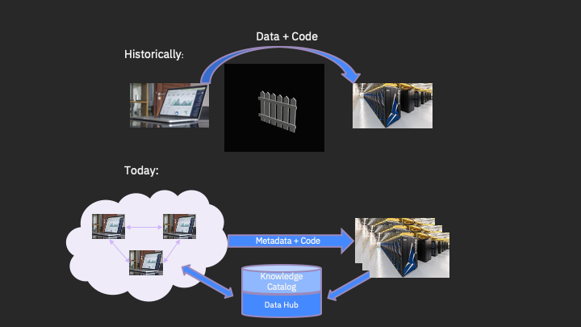
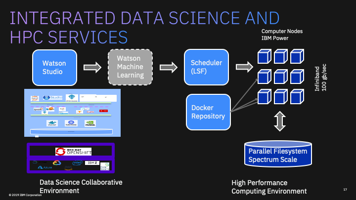

#  Bioinformatics - End2End AI

[ProjectPage](https://fjgreco.github.io/himss2020/)

## Context

[Jump to Additional Resources](#Additional-Resources)

## Researcher: Upload and Catalog Assay Data (Collect & Organize)

## Data Scientist: Neural Network Design (Organize & Analyze)

## Developer/Data Scientist: Train, Evaluate, and Deploy using Watson Machine Learning (Organize, Analyze, Infuse)

## Evaluate

## Practitioner/Researcher/Data Scientist: Use

## Additional Resources

#### Links

- [IBM Cloud Pak for Data](https://developer.ibm.com/clouddataservices/docs/ibm-cloud-pak-for-data/)

- [IBM Cloud Catalog](https://console.bluemix.net/catalog/)

#### Videos

- [IBM Watson Data and AI](https://www.youtube.com/watch?v=EdceqGUuEQM)

- [IBM Watson Knowledge Catalog Concepts Overview](https://www.youtube.com/watch?v=OMBNKk8LNck&list=PLzpeuWUENMK1z9oXhTlbNXRiRaBjSpUKJ&index=4)

- [IBM Create Folder Asset Connections in IBM Watson Knowledge Catalog](https://www.youtube.com/watch?v=WVUPHRsXwSQ&list=PLzpeuWUENMK1z9oXhTlbNXRiRaBjSpUKJ&index=8)

