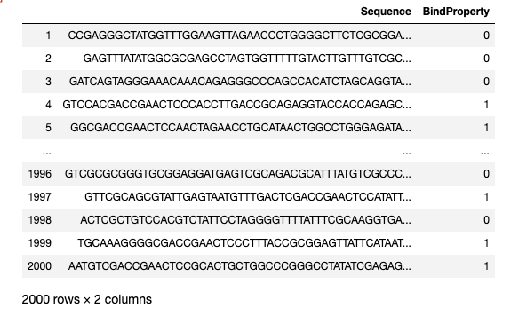

## Data Collection and Organization

We use a synthetic data generator to create a set of base sequences.
A  motif  pattern is inserted into a subset of these sequences.
Sequences with the motif are labled as having a binding property.
Sequences without the motif are labeled as not having a binding probperty.

Assay data is uploaded to ICOS. 

The file is cataloged and added to the project as connected data.

