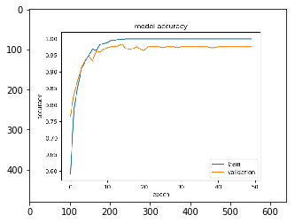
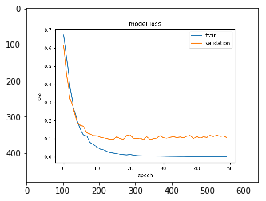
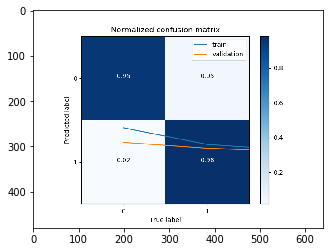
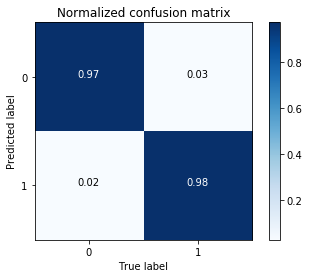
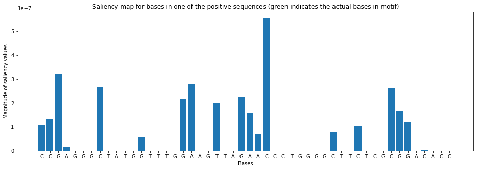
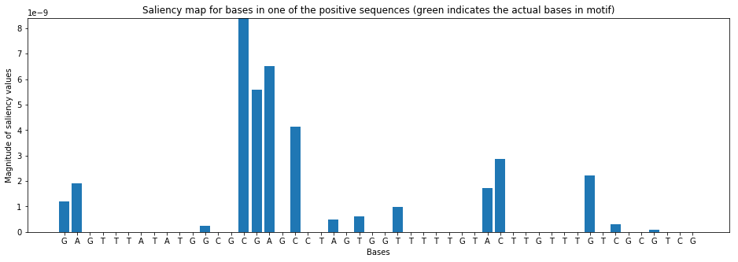
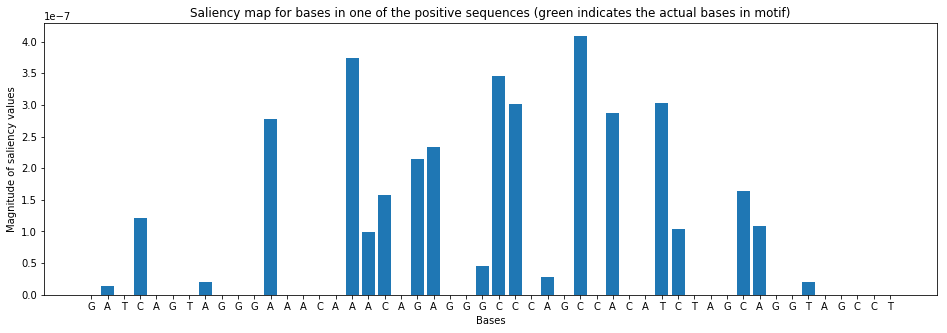
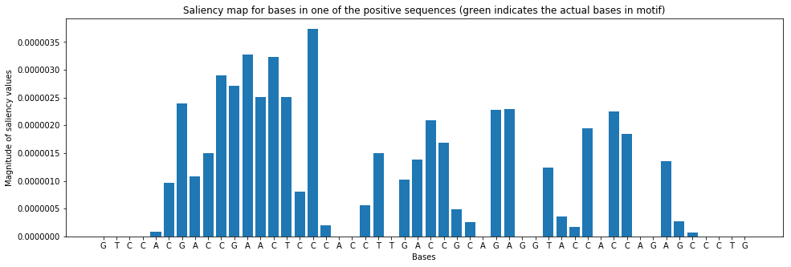
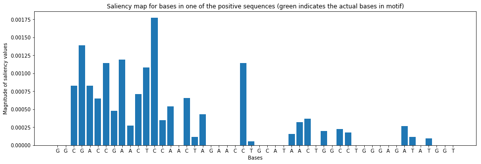
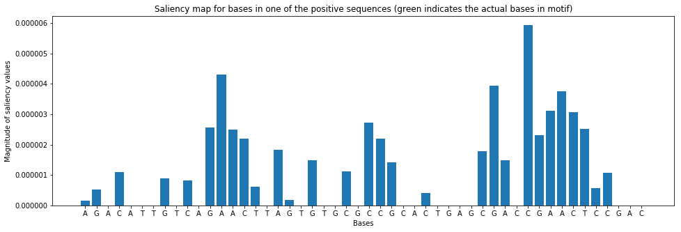

## Evaluation

### Download training results from shared object storage to CP4D/WS working storage. 


```python
  dl2=get_download_list(results_bucket,model_location)
```

    Retrieving relevant bucket contents from: hmss2020-results Model_location: training-WyAzx1lWg
    
    training-WyAzx1lWg/bioinformatics_model.h5
    training-WyAzx1lWg/bioinformatics_model.json
    training-WyAzx1lWg/bioinformatics_model.tgz
    training-WyAzx1lWg/bioinformatics_model_accuracy.pdf
    training-WyAzx1lWg/bioinformatics_model_accuracy.png
    training-WyAzx1lWg/bioinformatics_model_confusion_matrix.png
    training-WyAzx1lWg/bioinformatics_model_loss.pdf
    training-WyAzx1lWg/bioinformatics_model_loss.png
    training-WyAzx1lWg/bioinformatics_model_scoring.txt
    training-WyAzx1lWg/bioinformatics_model_weights.h5


```python
image = mpimg.imread("bioinformatics_model_accuracy.png")
plt.imshow(image)
plt.show()
```





```python
image = mpimg.imread("bioinformatics_model_loss.png")
plt.imshow(image)
plt.show()
```





```python
image = mpimg.imread("bioinformatics_model_confusion_matrix.png")
plt.imshow(image)
plt.show()
```





```python
!cat bioinformatics_model_scoring.txt
```

    Model: "sequential"
    _________________________________________________________________
    Layer (type)                 Output Shape              Param #   
    =================================================================
    conv1d (Conv1D)              (None, 39, 32)            1568      
    _________________________________________________________________
    max_pooling1d (MaxPooling1D) (None, 9, 32)             0         
    _________________________________________________________________
    flatten (Flatten)            (None, 288)               0         
    _________________________________________________________________
    dense (Dense)                (None, 16)                4624      
    _________________________________________________________________
    dense_1 (Dense)              (None, 2)                 34        
    =================================================================
    Total params: 6,226
    Trainable params: 6,226
    Non-trainable params: 0
    _________________________________________________________________
    binary_accuracy: 97.40%


### Store results in project_asset storage

```bash
%%bash -s "$ts"
(if [ ! -d "/project_data/data_asset/tf_model_v5_"$1 ] 
 then mkdir /project_data/data_asset/tf_model_v5_$1 
 fi
 cp bioinformatics* /project_data/data_asset/tf_model_v5_$1/.)
```

## SOME TIME LATER...

### Using  the stored model definition and trained weights, we can recompile the model and resume work.


```python
client.repository.list()
```

    ------------------------------------  ------------------------------------------------  ------------------------  ---------------  -----------------
    GUID                                  NAME                                              CREATED                   FRAMEWORK        TYPE
    f205f565-21bb-444a-a4a1-abb03f847d24  zen-bioinformatics-training_v3nn5_20200302233424  2020-03-02T23:37:12.867Z  tensorflow       definition
    7fe962f4-3cc5-4d5d-8e72-8654971ae9e9  zen-bioinformatics-training-definition_v3nn5      2020-03-01T02:00:45.065Z  tensorflow       definition
    7c43ab5d-b52a-490a-9750-a49d92a8ebb7  ws-bioinformatics-training-definition-v5          2020-02-26T00:26:13.427Z  tensorflow       definition
    18479c6b-1688-41da-996b-9cff9d3ecbb9  DL3                                               2020-02-26T04:01:57.495Z  -                experiment
    91af05a1-b7ed-4825-b39c-2e5bb3218c09  zen_bioinformatics_model_v3nn5_r                  2020-03-01T02:07:45.559Z  tensorflow-1.14  model
    7c26209f-7cf0-4103-90ab-6c4c518e032d  DL3-Model-V1.1                                    2020-02-26T04:28:48.160Z  tensorflow-1.14  model
    dbceee12-7835-4aa8-90ec-3fdfa485654a  DL3-model-Version1                                2020-02-26T04:05:29.891Z  tensorflow-1.14  model
    2917fae8-ebdd-435e-af94-281c5ea9015a  ws-bioinformatics_model-v5                        2020-02-26T00:34:08.045Z  tensorflow-1.14  model
    c042c672-5111-4322-a7eb-cf0c4d3177d3  zen_bioinformatics_deployment_v3nn5(r)            2020-03-01T02:07:53.584Z  tensorflow-1.14  online deployment
    eab67438-b5d0-42f4-ad0f-b46cc887f936  ws_bioinformatic_deployment_v5                    2020-02-26T00:34:13.106Z  tensorflow-1.14  online deployment
    ------------------------------------  ------------------------------------------------  ------------------------  ---------------  -----------------

<details>

```python
!ls /project_data/data_asset
```

    DATADIR
    DATADIR.zip
    Rnorvegicus.fasta
    __pycache__
    apikey.json
    default_commit_hash
    icoskeys.txt
    labels_txt_54t5ig9cxtblv9s5lvrpc3c1g
    male.hg19.fasta
    male.hg19.fasta copy.fai
    male.hg19.fasta.fai
    neural_network_v5.py
    new_neural_network2.py
    new_neural_network4.py
    object_subfolder
    rbr.out
    results.csv
    sra_repository
    swab_Illumina_fastq_7zts604faspjjdibpea5dk5pm
    tf-model3.zip
    tf-model4
    tf-model4.zip
    tf_model_v5
    tf_model_v5.zip
    tf_model_v5_20200302233424


```python
print ('Effective timestamp: ',ts)
```

    Effective timestamp:  20200302233424

</details>


### Retrieve the model artifacts to working storage...


```python
!cp /project_data/data_asset/tf_model_v5_{ts}/* .
```


```python
mh5="bioinformatics_model.h5"
mjson="bioinformatics_model.json"
mtgz="bioinformatics_model.tgz"
mweights="bioinformatics_model_weights.h5"
mconfusion="bioinformatics_model_confusion_matrix.png"

!ls -al bioinformatics*
```

    -rw-r-----. 1 wsuser watsonstudio 108728 Mar  3 01:24 bioinformatics_model.h5
    -rw-r-----. 1 wsuser watsonstudio   1988 Mar  3 01:24 bioinformatics_model.json
    -rw-r-----. 1 wsuser watsonstudio  70339 Mar  3 01:24 bioinformatics_model.tgz
    -rw-r-----. 1 wsuser watsonstudio  12782 Mar  3 01:24 bioinformatics_model_accuracy.pdf
    -rw-r-----. 1 wsuser watsonstudio  25694 Mar  3 01:24 bioinformatics_model_accuracy.png
    -rw-r-----. 1 wsuser watsonstudio  24261 Mar  3 01:24 bioinformatics_model_confusion_matrix.png
    -rw-r-----. 1 wsuser watsonstudio  11819 Mar  3 01:24 bioinformatics_model_loss.pdf
    -rw-r-----. 1 wsuser watsonstudio  25737 Mar  3 01:24 bioinformatics_model_loss.png
    -rw-r-----. 1 wsuser watsonstudio   1036 Mar  3 01:24 bioinformatics_model_scoring.txt
    -rw-r-----. 1 wsuser watsonstudio    143 Mar  3 01:24 bioinformatics_model_v3nn5_20200302233424.url
    -rw-r-----. 1 wsuser watsonstudio  42168 Mar  3 01:24 bioinformatics_model_weights.h5


### Re-compile neural model
This step does not involve training data.


```python
from tensorflow.keras.models import model_from_json
# load json and create model
with open(mjson, 'r') as json_file:
    loaded_model_json = json_file.read()
    
loaded_model = model_from_json(loaded_model_json)

# load weights into new model
loaded_model.load_weights(mweights)
print("Loaded model from project assets")
 
# evaluate loaded model on test data
loaded_model.compile(loss='binary_crossentropy', optimizer='rmsprop', metrics=['accuracy'])
```

    Loaded model from project assets


## Select data for analysis 

<details>

```python
from sklearn.preprocessing import LabelEncoder, OneHotEncoder
from sklearn.model_selection import train_test_split
import numpy as np

def ohe_Xy(sequences,labels):
    sequences_file=sequences

    labels_file=labels
    
    with open(sequences_file,'r') as file: 
        raw_sequences=file.read()

    sequences=raw_sequences.split('\n')

    sequences = list(filter(None, sequences))  # This removes empty sequences.


    # The LabelEncoder encodes a sequence of bases as a sequence of integers.
    integer_encoder = LabelEncoder()  
    # The OneHotEncoder converts an array of integers to a sparse matrix where 
    # each row corresponds to one possible value of each feature.
    one_hot_encoder = OneHotEncoder(categories='auto')   
    input_features = []

    for sequence in sequences:
        integer_encoded = integer_encoder.fit_transform(list(sequence))
        integer_encoded = np.array(integer_encoded).reshape(-1, 1)
        one_hot_encoded = one_hot_encoder.fit_transform(integer_encoded)
        input_features.append(one_hot_encoded.toarray())

    np.set_printoptions(threshold=40)
    input_features = np.stack(input_features)
    #print("One hot encoding of features and labels\n-----------------------")
    #print('\nDNA Sequence #1:\n',sequences[0][:10],'...',sequences[0][-10:])
    #print('\nOne hot encoding of Sequence #1:\n',input_features[0].T)


    with open(labels_file,'r') as file: 
            raw_labels=file.read()

    labels=raw_labels.split('\n')

    labels = list(filter(None, labels))  # This removes empty sequences.

    one_hot_encoder = OneHotEncoder(categories='auto')
    labels = np.array(labels).reshape(-1, 1)
    input_labels = one_hot_encoder.fit_transform(labels).toarray()

    #print('\nLabels:\n',labels.T)
    #print('\nOne-hot encoded labels:\n',input_labels.T)
    
    return input_features, input_labels, sequences

    
def split_input_data(input_features,sequences):
    print("\nSplitting input data into train and test segments...")
    train_features, test_features, train_labels, test_labels = train_test_split(
        input_features, input_labels, test_size=0.25, random_state=42)
    return test_features, test_labels, train_features, train_labels
```


```python
input_features, input_labels, sequences = ohe_Xy('/project_data/data_asset/DATADIR/sequences.txt','/project_data/data_asset/DATADIR/labels.txt')

X,Y,_,_= split_input_data(input_features,input_labels)

print('Done')
```

    
    Splitting input data into train and test segments...
    Done
</details>

### Score model using this data


```python
score = loaded_model.evaluate(X, Y, verbose=0)
print("%s: %.2f%%" % (loaded_model.metrics_names[1], score[1]*100))
```

    acc: 97.40%


### Produce a confusion matrix


```python
import matplotlib.pyplot as plt
from sklearn.metrics import confusion_matrix
import itertools

predicted_labels = loaded_model.predict(np.stack(X))
cm = confusion_matrix(np.argmax(Y, axis=1), 
                      np.argmax(predicted_labels, axis=1))
print('Confusion matrix:\n',cm)

cm = cm.astype('float') / cm.sum(axis = 1)[:, np.newaxis]

plt.imshow(cm, cmap=plt.cm.Blues)
plt.title('Normalized confusion matrix')
plt.colorbar()
plt.xlabel('True label')
plt.ylabel('Predicted label')
plt.xticks([0, 1]); plt.yticks([0, 1])
plt.grid('off')
for i, j in itertools.product(range(cm.shape[0]), range(cm.shape[1])):
    plt.text(j, i, format(cm[i, j], '.2f'),
             horizontalalignment='center',
             color='white' if cm[i, j] > 0.5 else 'black')
```

    Confusion matrix:
     [[252   7]
     [  6 235]]





### Produce predictions and salience charts


```python
import tensorflow.keras.backend as K

def compute_salient_bases(model, x):
  input_tensors = [loaded_model.input]
  gradients = model.optimizer.get_gradients(model.output[0][1], model.input)
  compute_gradients = K.function(inputs = input_tensors, outputs = gradients)
  
  x_value = np.expand_dims(x, axis=0)
  gradients = compute_gradients([x_value])[0][0]
  sal = np.clip(np.sum(np.multiply(gradients,x), axis=1),a_min=0, a_max=None)
  return sal
```


```python
sequences2=[
'CCGAGGGCTATGGTTTGGAAGTTAGAACCCTGGGGCTTCTCGCGGACACC',
'GAGTTTATATGGCGCGAGCCTAGTGGTTTTTGTACTTGTTTGTCGCGTCG',
'GATCAGTAGGGAAACAAACAGAGGGCCCAGCCACATCTAGCAGGTAGCCT',
'GTCCACGACCGAACTCCCACCTTGACCGCAGAGGTACCACCAGAGCCCTG',
'GGCGACCGAACTCCAACTAGAACCTGCATAACTGGCCTGGGAGATATGGT',
'AGACATTGTCAGAACTTAGTGTGCGCCGCACTGAGCGACCGAACTCCGAC']
```

### One hot encode the new target sequence data

<details>

```python
from sklearn.preprocessing import LabelEncoder, OneHotEncoder
# The LabelEncoder encodes a sequence of bases as a sequence of integers.
integer_encoder = LabelEncoder()  
# The OneHotEncoder converts an array of integers to a sparse matrix where 
# each row corresponds to one possible value of each feature.
one_hot_encoder = OneHotEncoder(categories='auto')  

input_features2 = []
for sequence2 in sequences2:
    #print(sequence2)
    integer_encoded2 = integer_encoder.fit_transform(list(sequence2))
    integer_encoded2 = np.array(integer_encoded2).reshape(-1, 1)
    one_hot_encoded2 = one_hot_encoder.fit_transform(integer_encoded2)
    input_features2.append(one_hot_encoded2.toarray())

np.set_printoptions(threshold=40)
input_features2 = np.stack(input_features2)
#print("Example nucleotide sequence\n-----------------------")
#print('DNA Sequence2 #1:\n',sequences2[0][:10],'...',sequences2[0][-10:])
#print('One hot encoding of Sequence2 #1:\n',input_features2[0].T)
print("Done")
```

    Done
    
</details>

### Make predictions


```python
prediction2=loaded_model.predict(input_features2)
```


```python
def saliency2(model,sequence_index,motif_start):
    sal = compute_salient_bases(model, input_features2[sequence_index])

    plt.figure(figsize=[16,5])
    barlist = plt.bar(np.arange(len(sal)), sal)
    #[barlist[i].set_color('C3') for i in range(motif_start,motif_start+12)]  # Change the coloring here if you change the sequence index.
    plt.xlabel('Bases')
    plt.ylabel('Magnitude of saliency values')
    plt.xticks(np.arange(len(sal)), list(sequences2[sequence_index]));
    plt.title('Saliency map for bases in one of the positive sequences'
              ' (green indicates the actual bases in motif)');
    plt.show()
```


```python
for i in range(len(sequences2)):
    print('\nKnown motif: CGACCGAACTCC')
    print("Sequence:",sequences2[i])
    saliency2(loaded_model,i,37)
    print("Nobind probability: {} Bind probability: {}".format(prediction2[i][0],prediction2[i][1]))
    print("\n-----------------------")
    
```

    
    Known motif: CGACCGAACTCC
    Sequence: CCGAGGGCTATGGTTTGGAAGTTAGAACCCTGGGGCTTCTCGCGGACACC





    Nobind probability: 0.9999997615814209 Bind probability: 2.558667233643064e-07
    
    -----------------------
    
    Known motif: CGACCGAACTCC
    Sequence: GAGTTTATATGGCGCGAGCCTAGTGGTTTTTGTACTTGTTTGTCGCGTCG





    Nobind probability: 1.0 Bind probability: 3.5872671499959097e-09
    
    -----------------------
    
    Known motif: CGACCGAACTCC
    Sequence: GATCAGTAGGGAAACAAACAGAGGGCCCAGCCACATCTAGCAGGTAGCCT





    Nobind probability: 0.9999997615814209 Bind probability: 2.0125524713421328e-07
    
    -----------------------
    
    Known motif: CGACCGAACTCC
    Sequence: GTCCACGACCGAACTCCCACCTTGACCGCAGAGGTACCACCAGAGCCCTG





    Nobind probability: 3.4863812743424205e-06 Bind probability: 0.999996542930603
    
    -----------------------
    
    Known motif: CGACCGAACTCC
    Sequence: GGCGACCGAACTCCAACTAGAACCTGCATAACTGGCCTGGGAGATATGGT





    Nobind probability: 0.0008279726607725024 Bind probability: 0.9991720914840698
    
    -----------------------
    
    Known motif: CGACCGAACTCC
    Sequence: AGACATTGTCAGAACTTAGTGTGCGCCGCACTGAGCGACCGAACTCCGAC





    Nobind probability: 1.6434263443443342e-06 Bind probability: 0.9999983310699463
    
    -----------------------


[](../README.md#Evaluation)

