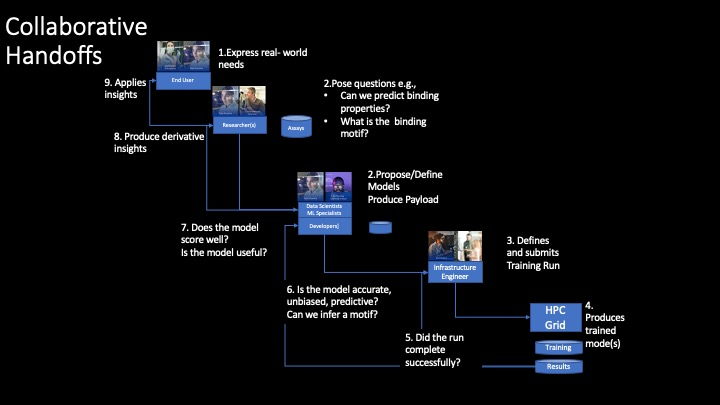
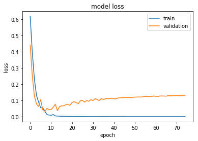
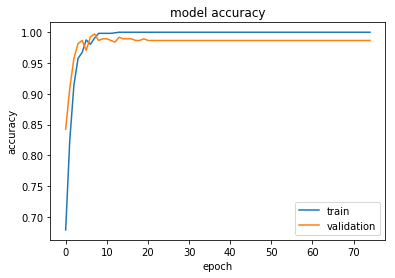
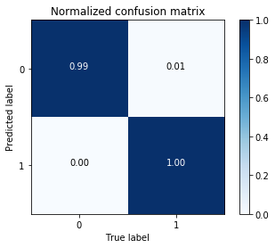
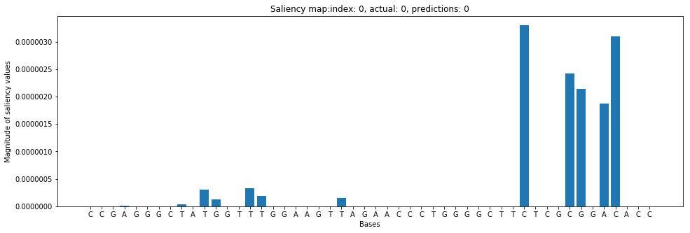
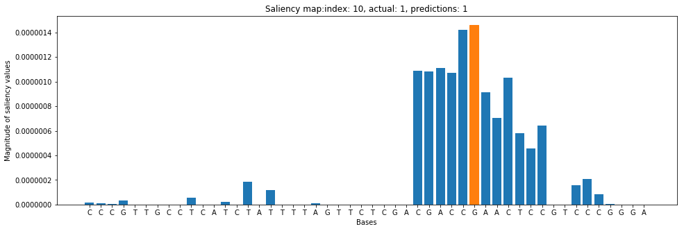
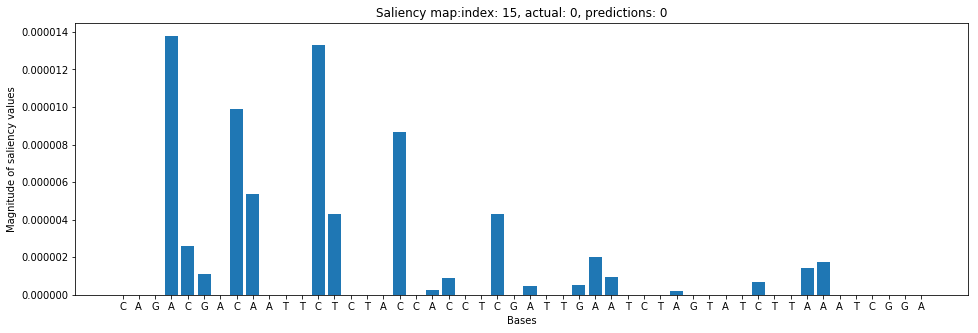
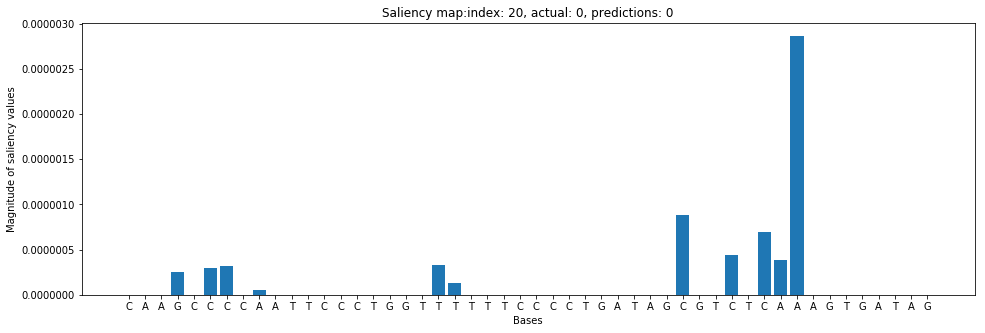
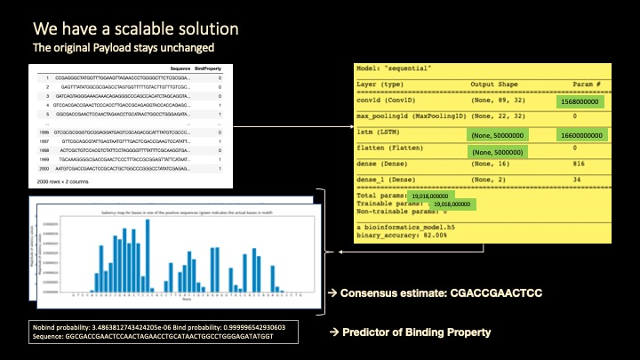

# Bioinformatics Modeling 

## Post-training Salience Analysis



### Run the following when in CP4D


```python
from project_lib import Project
project = Project.access()
storage_credentials = project.get_storage_metadata()
```

### import packages

```python
import sys
sys.path.append('.')
import json
```


```python
with open("e2eai_credentials.json") as json_file:
    credentials = json.load(json_file)

NIRVANA=credentials["NIRVANA"] # /v2
NIRVANA_AUTH=credentials["NIRVANA_AUTH"]
nirvana_apikey=credentials['nirvana_apikey'] # APIKey obtained from CP4D dashboard
nirvana_credentials=credentials['nirvana_credentials']

cp4d_template=credentials['cp4d_template']

IBMCLOUD=credentials['IBMCLOUD_DATA']  #/v2/catalogs/

IBMCLOUD_AUTH=credentials["IBMCLOUD_AUTH"]
        
ibmcloud_apikey=credentials['ibmcloud_apikey']

ibmcloud_template=credentials['ibmcloud_template']

wml_credentials=credentials['wml_credentials_e2eai']

icos_credentials=credentials['icos_credentials_e2eai']

apikey=icos_credentials['apikey'] #ICOS-E2EAI-credentials 

ri=icos_credentials['resource_instance_id']

#display(cp4d_template)
#display(ibmcloud_template)
#print(ri)
#print(apikey,nirvana_apikey,nirvana_credentials)
```

## Access Watson Knowledge Catalog


```python
import WKC as WKC
```


```python
wkc=WKC.WKC(ibmcloud_template,catalog_name='Catalog-010721')
```

    Platfom type is cloud.Calling gen_BearerToken_ibmcloud
     Desired catalog_name is set to 'Catalog-010721'.
    guid is set to 'c28ff3ef-3fa0-4c6c-a7f8-c2be92976a75'.


### The following line can be used to renew the bearer token
wkc.reset_BearerToken()
## Read manifest file


```python
with open("manifest.json") as json_file:
    manifest = json.load(json_file)
    zip_file = manifest['manifest']['zip_file']
    git_url =  manifest['manifest']['git_url']
    neural_network_pgm =  manifest['manifest']['neural_network_pgm']
    training_definition_name =  manifest['manifest']['training_definition_name']
    training_run_name =  manifest['manifest']['training_run_name']
    trained_model_name =  manifest['manifest']['trained_model_name']
    compressed_recompiled_model =  manifest['manifest']['compressed_recompiled_model'] 
    recompiled_model_h5 =  manifest['manifest']['recompiled_model_h5']
    deployment_name  =  manifest['manifest']['deployment_name'] 
    training_bucket =  manifest['manifest']['training_bucket'] 
    results_bucket  =  manifest['manifest']['results_bucket'] 
    model_location =  manifest['manifest']['model_location'] 
        
```


```python
model_location
```


    'training-MdlNodeMR'


## Access ICOS

## Retrieve training artifacts from ICOS
### model.h5, model.tgz, model.json, and model_weights.h5 were placed in ICOS by the keras python program


```python
from ICOS import ICOS as ICOS
```


```python
icos=ICOS(icos_credentials=icos_credentials)
```


```python
icos.list_objects(results_bucket)
```

    Retrieving bucket contents from: e2eai-results
        
<details>

    training-MdlNodeMR/_submitted_code/model.zip
    training-MdlNodeMR/bioinformatics_model.h5
    training-MdlNodeMR/bioinformatics_model.json
    training-MdlNodeMR/bioinformatics_model.tgz
    training-MdlNodeMR/bioinformatics_model_cm.p
    training-MdlNodeMR/bioinformatics_model_history.p
    training-MdlNodeMR/bioinformatics_model_weights.h5
    training-MdlNodeMR/learner-1/
    training-MdlNodeMR/learner-1/.log-copy-complete
    training-MdlNodeMR/learner-1/training-log.txt
    training-MdlNodeMR/training-log.txt
    training-Tk5HSysMg/_submitted_code/model.zip
    training-Tk5HSysMg/learner-1/
    training-Tk5HSysMg/learner-1/.log-copy-complete
    training-Tk5HSysMg/learner-1/training-log.txt
    training-Tk5HSysMg/model/
    training-Tk5HSysMg/model/bioinformatics_model9.h5
    training-Tk5HSysMg/model/bioinformatics_model9.json
    training-Tk5HSysMg/model/bioinformatics_model9.tgz
    training-Tk5HSysMg/model/bioinformatics_model9_cm.p
    training-Tk5HSysMg/model/bioinformatics_model9_history.p
    training-Tk5HSysMg/model/bioinformatics_model9_weights.h5
    training-Tk5HSysMg/model/std.err
    training-Tk5HSysMg/model/std.out
    training-Tk5HSysMg/training-log.txt
    training-mgWwFd6Gg/_submitted_code/model.zip
    training-mgWwFd6Gg/bioinformatics_model.h5
    training-mgWwFd6Gg/bioinformatics_model.json
    training-mgWwFd6Gg/bioinformatics_model.tgz
    training-mgWwFd6Gg/bioinformatics_model_cm.p
    training-mgWwFd6Gg/bioinformatics_model_history.p
    training-mgWwFd6Gg/bioinformatics_model_weights.h5
    training-mgWwFd6Gg/learner-1/
    training-mgWwFd6Gg/learner-1/.log-copy-complete
    training-mgWwFd6Gg/learner-1/training-log.txt
    training-mgWwFd6Gg/training-log.txt
    training-zj8LDEsGg/_submitted_code/model.zip
    training-zj8LDEsGg/learner-1/
    training-zj8LDEsGg/learner-1/.log-copy-complete
    training-zj8LDEsGg/learner-1/training-log.txt
    training-zj8LDEsGg/model/
    training-zj8LDEsGg/model/bioinformatics_model9.h5
    training-zj8LDEsGg/model/bioinformatics_model9.json
    training-zj8LDEsGg/model/bioinformatics_model9.tgz
    training-zj8LDEsGg/model/bioinformatics_model9_cm.p
    training-zj8LDEsGg/model/bioinformatics_model9_history.p
    training-zj8LDEsGg/model/bioinformatics_model9_weights.h5
    training-zj8LDEsGg/model/std.err
    training-zj8LDEsGg/model/std.out
    training-zj8LDEsGg/training-log.txt

</details>


```python
print('Saving results to pwd...')
dl2=icos.get_download_list_loc(results_bucket, model_location)
```

    Saving results to pwd...
    Retrieving relevant bucket contents from: e2eai-results Model_location: training-MdlNodeMR
    
    training-MdlNodeMR/bioinformatics_model.h5
    training-MdlNodeMR/bioinformatics_model.json
    training-MdlNodeMR/bioinformatics_model.tgz
    training-MdlNodeMR/bioinformatics_model_cm.p
    training-MdlNodeMR/bioinformatics_model_history.p
    training-MdlNodeMR/bioinformatics_model_weights.h5
    training-MdlNodeMR/training-log.txt


## Review results produced during training

### Extract and view accuracy and loss graphs


```python
import pickle
with open('bioinformatics_model_history.p', 'rb') as p_file:
    history = pickle.load(p_file)

import matplotlib.pyplot as plt
%matplotlib inline

plt.figure()
plt.plot(history['loss'])
plt.plot(history['val_loss'])
plt.title('model loss')
plt.ylabel('loss')
plt.xlabel('epoch')
plt.legend(['train', 'validation'])

plt.savefig('bioinformatics_model_loss.png')
plt.savefig('bioinformatics_model_loss.pdf')
plt.show()


plt.figure()
plt.plot(history['binary_accuracy'])
plt.plot(history['val_binary_accuracy'])
plt.title('model accuracy')
plt.ylabel('accuracy')
plt.xlabel('epoch')
plt.legend(['train', 'validation'])
plt.savefig('bioinformatics_model_accuracy.png')
plt.savefig('bioinformatics_model_accuracy.pdf')
plt.show()
```


    

    


    

    


### Extract and view a confusion matrix


```python
import itertools

with open('bioinformatics_model_cm.p', 'rb') as p_file:
    cm = pickle.load(p_file)

plt.imshow(cm, cmap=plt.cm.Blues)
plt.title('Normalized confusion matrix')
plt.colorbar()
plt.xlabel('True label')
plt.ylabel('Predicted label')
plt.xticks([0, 1]); plt.yticks([0, 1])
plt.grid('off')
for i, j in itertools.product(range(cm.shape[0]), range(cm.shape[1])):
    plt.text(j, i, format(cm[i, j], '.2f'),
             horizontalalignment='center',
             color='white' if cm[i, j] > 0.5 else 'black')

plt.savefig('bioinformatics_model_confusion_matrix.png')

plt.show()
```

    

    

    


## Compile model locally


```python
from tensorflow.keras.models import model_from_json,load_model
```

### Approach 1 - Compile model locally using full .h5 file


```python
loaded_model = load_model("bioinformatics_model.h5", compile=False)
#sgd = SGD(lr=1e-3, decay=1e-6, momentum=0.9, nesterov=True)
loaded_model.compile(loss='categorical_crossentropy',optimizer='adam',metrics=['accuracy'])
```

    WARNING:tensorflow:From /Library/Frameworks/Python.framework/Versions/3.6/lib/python3.6/site-packages/tensorflow_core/python/ops/resource_variable_ops.py:1630: calling BaseResourceVariable.__init__ (from tensorflow.python.ops.resource_variable_ops) with constraint is deprecated and will be removed in a future version.
    Instructions for updating:
    If using Keras pass *_constraint arguments to layers.


## Approach 2: Compile model locally using weights and json
### load json and create model

```python
with open('bioinformatics_model.json', 'r') as json_file:
    loaded_model_json = json_file.read()
    
loaded_model = model_from_json(loaded_model_json)
```

### load weights into new model and compile

```python
loaded_model.load_weights("bioinformatics_model_weights.h5")
print("Loaded model from disk")

# Complile loaded model
loaded_model.compile(loss='binary_crossentropy', optimizer='adam', metrics=['accuracy'])
print("Compiled loaded model")
```

### Generate/Access test data

```python
from sklearn.preprocessing import LabelEncoder, OneHotEncoder
from sklearn.model_selection import train_test_split
import numpy as np

sequences_file='Assay1/sequences.txt'
labels_file='Assay1/labels.txt'

#sequences_file='assay/assay_data_full.seq'
#labels_file='assay/assay_data_full.lbl'

with open(sequences_file,'r') as file: 
    raw_sequences=file.read()

sequences=raw_sequences.split('\n')

sequences = list(filter(None, sequences))  # This removes empty sequences.


# The LabelEncoder encodes a sequence of bases as a sequence of integers.
integer_encoder = LabelEncoder()  
# The OneHotEncoder converts an array of integers to a sparse matrix where 
# each row corresponds to one possible value of each feature.
one_hot_encoder = OneHotEncoder(categories='auto')   
input_features = []

for sequence in sequences:
    integer_encoded = integer_encoder.fit_transform(list(sequence))
    integer_encoded = np.array(integer_encoded).reshape(-1, 1)
    one_hot_encoded = one_hot_encoder.fit_transform(integer_encoded)
    input_features.append(one_hot_encoded.toarray())

np.set_printoptions(threshold=40)
input_features = np.stack(input_features)
print("Example sequence\n-----------------------")
print('DNA Sequence #1:\n',sequences[0][:10],'...',sequences[0][-10:])
print('One hot encoding of Sequence #1:\n',input_features[0].T)


with open(labels_file,'r') as file: 
        raw_labels=file.read()

labels=raw_labels.split('\n')

labels = list(filter(None, labels))  # This removes empty sequences.

one_hot_encoder_labels = OneHotEncoder(categories='auto')
labels = np.array(labels).reshape(-1, 1)
input_labels = one_hot_encoder_labels.fit_transform(labels).toarray()

print('Labels:\n',labels.T)
print('One-hot encoded labels:\n',input_labels.T)

#Split into train & test files
#train_features, test_features, train_labels, test_labels = train_test_split(
#    input_features, input_labels, test_size=0.25, random_state=42)

X=input_features
Y=input_labels
```

    Example sequence
    -----------------------
    DNA Sequence #1:
     CCGAGGGCTA ... CGCGGACACC
    One hot encoding of Sequence #1:
     [[0. 0. 0. ... 1. 0. 0.]
     [1. 1. 0. ... 0. 1. 1.]
     [0. 0. 1. ... 0. 0. 0.]
     [0. 0. 0. ... 0. 0. 0.]]
    Labels:
     [['0' '0' '0' ... '0' '1' '1']]
    One-hot encoded labels:
     [[1. 1. 1. ... 1. 0. 0.]
     [0. 0. 0. ... 0. 1. 1.]]


### Score loaded model


```python
score = loaded_model.evaluate(X, Y, verbose=1)
print("%s: %.2f%%" % (loaded_model.metrics_names[1], score[1]*100))
```

    2000/2000 [==============================] - 0s 210us/sample - loss: 0.0264 - acc: 0.9970
    acc: 99.70%


### Produce a confusion matrix


```python
import matplotlib.pyplot as plt
from sklearn.metrics import confusion_matrix
import itertools

predicted_labels = loaded_model.predict(np.stack(input_features))
cm = confusion_matrix(np.argmax(input_labels, axis=1), 
                      np.argmax(predicted_labels, axis=1))
print('Confusion matrix:\n',cm)

cm = cm.astype('float') / cm.sum(axis = 1)[:, np.newaxis]

plt.imshow(cm, cmap=plt.cm.Blues)
plt.title('Normalized confusion matrix')
plt.colorbar()
plt.xlabel('True label')
plt.ylabel('Predicted label')
plt.xticks([0, 1]); plt.yticks([0, 1])
plt.grid('off')
for i, j in itertools.product(range(cm.shape[0]), range(cm.shape[1])):
    plt.text(j, i, format(cm[i, j], '.2f'),
             horizontalalignment='center',
             color='white' if cm[i, j] > 0.5 else 'black')
```

    Confusion matrix:
     [[1007    6]
     [   0  987]]


    /Library/Frameworks/Python.framework/Versions/3.6/lib/python3.6/site-packages/matplotlib/cbook/__init__.py:424: MatplotlibDeprecationWarning: 
    Passing one of 'on', 'true', 'off', 'false' as a boolean is deprecated; use an actual boolean (True/False) instead.
      warn_deprecated("2.2", "Passing one of 'on', 'true', 'off', 'false' as a "


    

    


### Make predictions


```python
#print(one_hot_encoder.get_feature_names())
feature_class_list=list(integer_encoder.classes_)

def decode_base(encoded_base,fcl=feature_class_list):
    return fcl[encoded_base.index(1)]       

def make_predictions(model,X,Y):
    y_predictions = model.predict_classes(X)
    y_probabilities = model.predict_proba(X)
    # show the inputs and predicted outputs
    for i in range(len(X)):
        decoded_bases=[]
        for  encoded_base in X[i].tolist():
            decoded_bases.append(decode_base(encoded_base))
        decoded_bases=''.join(decoded_bases)
        print("X={}, Predicted={} Probability={} Y={}".format(decoded_bases, y_predictions[i],y_probabilities[i],Y[i][1]))
    return y_predictions,y_probabilities
```


```python
y_predictions,y_probabilities=make_predictions(loaded_model,input_features,input_labels)
```
<details>

    X=CCGAGGGCTATGGTTTGGAAGTTAGAACCCTGGGGCTTCTCGCGGACACC, Predicted=0 Probability=[9.9999499e-01 4.9788855e-06] Y=0.0
    X=GAGTTTATATGGCGCGAGCCTAGTGGTTTTTGTACTTGTTTGTCGCGTCG, Predicted=0 Probability=[9.9999964e-01 4.1512297e-07] Y=0.0
    X=GATCAGTAGGGAAACAAACAGAGGGCCCAGCCACATCTAGCAGGTAGCCT, Predicted=0 Probability=[9.9999964e-01 3.1563667e-07] Y=0.0
    X=GTCCACGACCGAACTCCCACCTTGACCGCAGAGGTACCACCAGAGCCCTG, Predicted=1 Probability=[9.460392e-08 9.999999e-01] Y=1.0
    X=GGCGACCGAACTCCAACTAGAACCTGCATAACTGGCCTGGGAGATATGGT, Predicted=1 
    
    ...
  
    X=GTCGCGCGGGTGCGGAGGATGAGTCGCAGACGCATTTATGTCGCCCCGAG, Predicted=0 Probability=[9.9999917e-01 8.8380233e-07] Y=0.0
    X=GTTCGCAGCGTATTGAGTAATGTTTGACTCGACCGAACTCCATATTGTCT, Predicted=1 Probability=[5.023739e-06 9.999950e-01] Y=1.0
    X=ACTCGCTGTCCACGTCTATTCCTAGGGGTTTTATTTCGCAAGGTGATACT, Predicted=0 Probability=[9.999993e-01 6.608538e-07] Y=0.0
    X=TGCAAAGGGGCGACCGAACTCCCTTTACCGCGGAGTTATTCATAATTGAA, Predicted=1 Probability=[2.1664779e-07 9.9999976e-01] Y=1.0
    X=AATGTCGACCGAACTCCGCACTGCTGGCCCGGGCCTATATCGAGAGTGAC, Predicted=1 Probability=[1.4860309e-07 9.9999988e-01] Y=1.0

</details>


## Saliency analysis


```python
import SALIENCE 
from SALIENCE import SALIENCE
 
sal=SALIENCE(loaded_model,sequences,labels,input_features,y_predictions)

```


```python
startx1=0
endx1=199
stepx1=5 
```

### Visualize nieghborhood of high saliency for positive predictions 


```python
for i in range(startx1,endx1,stepx1):
    sal.gen_salience_graph(i)
```

<details> 
    

    
    

    
    

    
    

    
    

    
</details>  


### Estimage consensus motif


```python
consensus = sal.get_consensus(startx=startx1,endx=endx1,stepx=stepx1)
```

    
     5
    6 21 36 41 61 81 86 106 111 121 131 151 156 181 186 196 
     10
    21 36 41 61 81 86 106 111 121 131 151 156 181 186 196 
     25
    36 41 61 81 86 106 111 121 131 151 156 181 186 196 
     30
    36 41 61 81 86 106 111 121 131 151 156 181 186 196 
     35
    36 41 61 81 86 106 111 121 131 151 156 181 186 196 
     50
    61 81 86 106 111 121 131 151 156 181 186 196 
     55
    61 81 86 106 111 121 131 151 156 181 186 196 
     60
    61 81 86 106 111 121 131 151 156 181 186 196 
     65
    81 86 106 111 121 131 151 156 181 186 196 
     70
    81 86 106 111 121 131 151 156 181 186 196 
     75
    81 86 106 111 121 131 151 156 181 186 196 
     85
    86 106 111 121 131 151 156 181 186 196 
     90
    106 111 121 131 151 156 181 186 196 
     95
    106 111 121 131 151 156 181 186 196 
     105
    106 111 121 131 151 156 181 186 196 
     110
    111 121 131 151 156 181 186 196 
     115
    121 131 151 156 181 186 196 
     120
    121 131 151 156 181 186 196 
     130
    131 151 156 181 186 196 
     160
    181 186 196 
     165
    181 186 196 
     170
    181 186 196 
     175
    181 186 196 


```python
consensus
```


    {'ACGACCGAACTCC': 5,
     'ACGACCGAACTCCG': 1,
     'ACT': 3,
     'AGC': 1,
     'AGCA': 1,
     'AGCGACCGAACTCC': 5,
     'ATGT': 1,
     'ATTT': 1,
     'CACGACCGAACTCC': 1,
     'CCGA': 11,
     'CCGACCGAACTCC': 2,
     'CCGACCGAACTCCAG': 1,
     'CCGAT': 1,
     'CGACC': 12,
     'CGACCGAACTCC': 89,
     'CGACCGAACTCCA': 1,
     'CGACCGAACTCCAGC': 1,
     'CGACCGAACTCCC': 6,
     'CGACCGAACTCCCTG': 1,
     'CGACCGAACTCCG': 12,
     'CGACCGAACTCCT': 2,
     'CGCGACCGAACTCC': 1,
     'CTCT': 1,
     'CTGG': 1,
     'CTTGG': 1,
     'GAA': 2,
     'GCAG': 1,
     'GCCGA': 1,
     'GCG': 2,
     'GCGACC': 5,
     'GCGACCGAACTCC': 14,
     'GCGACCGAACTCCG': 6,
     'GCGACCGAACTCCT': 1,
     'GCGT': 2,
     'GCTC': 2,
     'GGC': 1,
     'GGCG': 1,
     'GGCGACCGAACTCC': 1,
     'GTCGACCGAACTCC': 1,
     'GTGA': 1,
     'TCACT': 1,
     'TCGACCGAACTCC': 4,
     'TCGCGACC': 1,
     'TGAGC': 2,
     'TGGGC': 1,
     'TGT': 1,
     'TGTC': 1,
     'TGTCA': 1,
     'TTG': 2,
     'TTGT': 2}


### Consensus estimate of motif pattern: 


```python
max=0
for key in consensus.keys():
    if consensus[key]>max:
        max=consensus[key]
        motif=key
        print(key,consensus[key])
print("Consensus Motif: {}".format(motif))
```

    CGACCGAACTCC 89
    Consensus Motif: CGACCGAACTCC




[](../README.md#Evaluation)
[](./deployment.md)

