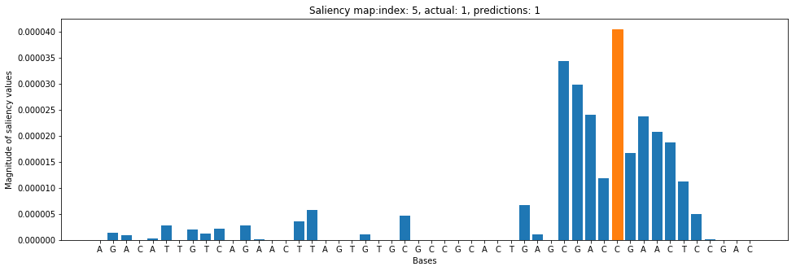

# Bioinformatics Modeling 

## Post-training Salience Analysis


### Run the following when in CP4D


```python
from project_lib import Project
project = Project.access()
storage_credentials = project.get_storage_metadata()
```

### import packages

```python
import sys
sys.path.append('.')
import json
```


```python
with open("e2eai_credentials.json") as json_file:
    credentials = json.load(json_file)

NIRVANA=credentials["NIRVANA"] # /v2
NIRVANA_AUTH=credentials["NIRVANA_AUTH"]
nirvana_apikey=credentials['nirvana_apikey'] # APIKey obtained from CP4D dashboard
nirvana_credentials=credentials['nirvana_credentials']

cp4d_template=credentials['cp4d_template']

IBMCLOUD=credentials['IBMCLOUD_DATA']  #/v2/catalogs/

IBMCLOUD_AUTH=credentials["IBMCLOUD_AUTH"]
        
ibmcloud_apikey=credentials['ibmcloud_apikey']

ibmcloud_template=credentials['ibmcloud_template']

wml_credentials=credentials['wml_credentials_e2eai']

icos_credentials=credentials['icos_credentials_e2eai']

apikey=icos_credentials['apikey'] #ICOS-E2EAI-credentials 

ri=icos_credentials['resource_instance_id']

#display(cp4d_template)
#display(ibmcloud_template)
#print(ri)
#print(apikey,nirvana_apikey,nirvana_credentials)
```

## Access Watson Knowledge Catalog


```python
import WKC as WKC
```


```python
wkc=WKC.WKC(ibmcloud_template,catalog_name='Catalog-010721')
```

    Platfom type is cloud.Calling gen_BearerToken_ibmcloud
     Desired catalog_name is set to 'Catalog-010721'.
    guid is set to 'c28ff3ef-3fa0-4c6c-a7f8-c2be92976a75'.


### The following line can be used to renew the bearer token
wkc.reset_BearerToken()
## Read manifest file


```python
with open("manifest.json") as json_file:
    manifest = json.load(json_file)
    zip_file = manifest['manifest']['zip_file']
    git_url =  manifest['manifest']['git_url']
    neural_network_pgm =  manifest['manifest']['neural_network_pgm']
    training_definition_name =  manifest['manifest']['training_definition_name']
    training_run_name =  manifest['manifest']['training_run_name']
    trained_model_name =  manifest['manifest']['trained_model_name']
    compressed_recompiled_model =  manifest['manifest']['compressed_recompiled_model'] 
    recompiled_model_h5 =  manifest['manifest']['recompiled_model_h5']
    deployment_name  =  manifest['manifest']['deployment_name'] 
    training_bucket =  manifest['manifest']['training_bucket'] 
    results_bucket  =  manifest['manifest']['results_bucket'] 
    model_location =  manifest['manifest']['model_location'] 
        
```


```python
model_location
```


    'training-MdlNodeMR'


## Access ICOS

## Retrieve training artifacts from ICOS
### model.h5, model.tgz, model.json, and model_weights.h5 were placed in ICOS by the keras python program


```python
from ICOS import ICOS as ICOS
```


```python
icos=ICOS(icos_credentials=icos_credentials)
```


```python
icos.list_objects(results_bucket)
```

    Retrieving bucket contents from: e2eai-results
        
<details>

    training-MdlNodeMR/_submitted_code/model.zip
    training-MdlNodeMR/bioinformatics_model.h5
    training-MdlNodeMR/bioinformatics_model.json
    training-MdlNodeMR/bioinformatics_model.tgz
    training-MdlNodeMR/bioinformatics_model_cm.p
    training-MdlNodeMR/bioinformatics_model_history.p
    training-MdlNodeMR/bioinformatics_model_weights.h5
    training-MdlNodeMR/learner-1/
    training-MdlNodeMR/learner-1/.log-copy-complete
    training-MdlNodeMR/learner-1/training-log.txt
    training-MdlNodeMR/training-log.txt
    training-Tk5HSysMg/_submitted_code/model.zip
    training-Tk5HSysMg/learner-1/
    training-Tk5HSysMg/learner-1/.log-copy-complete
    training-Tk5HSysMg/learner-1/training-log.txt
    training-Tk5HSysMg/model/
    training-Tk5HSysMg/model/bioinformatics_model9.h5
    training-Tk5HSysMg/model/bioinformatics_model9.json
    training-Tk5HSysMg/model/bioinformatics_model9.tgz
    training-Tk5HSysMg/model/bioinformatics_model9_cm.p
    training-Tk5HSysMg/model/bioinformatics_model9_history.p
    training-Tk5HSysMg/model/bioinformatics_model9_weights.h5
    training-Tk5HSysMg/model/std.err
    training-Tk5HSysMg/model/std.out
    training-Tk5HSysMg/training-log.txt
    training-mgWwFd6Gg/_submitted_code/model.zip
    training-mgWwFd6Gg/bioinformatics_model.h5
    training-mgWwFd6Gg/bioinformatics_model.json
    training-mgWwFd6Gg/bioinformatics_model.tgz
    training-mgWwFd6Gg/bioinformatics_model_cm.p
    training-mgWwFd6Gg/bioinformatics_model_history.p
    training-mgWwFd6Gg/bioinformatics_model_weights.h5
    training-mgWwFd6Gg/learner-1/
    training-mgWwFd6Gg/learner-1/.log-copy-complete
    training-mgWwFd6Gg/learner-1/training-log.txt
    training-mgWwFd6Gg/training-log.txt
    training-zj8LDEsGg/_submitted_code/model.zip
    training-zj8LDEsGg/learner-1/
    training-zj8LDEsGg/learner-1/.log-copy-complete
    training-zj8LDEsGg/learner-1/training-log.txt
    training-zj8LDEsGg/model/
    training-zj8LDEsGg/model/bioinformatics_model9.h5
    training-zj8LDEsGg/model/bioinformatics_model9.json
    training-zj8LDEsGg/model/bioinformatics_model9.tgz
    training-zj8LDEsGg/model/bioinformatics_model9_cm.p
    training-zj8LDEsGg/model/bioinformatics_model9_history.p
    training-zj8LDEsGg/model/bioinformatics_model9_weights.h5
    training-zj8LDEsGg/model/std.err
    training-zj8LDEsGg/model/std.out
    training-zj8LDEsGg/training-log.txt

</details>


```python
print('Saving results to pwd...')
dl2=icos.get_download_list_loc(results_bucket, model_location)
```

    Saving results to pwd...
    Retrieving relevant bucket contents from: e2eai-results Model_location: training-MdlNodeMR
    
    training-MdlNodeMR/bioinformatics_model.h5
    training-MdlNodeMR/bioinformatics_model.json
    training-MdlNodeMR/bioinformatics_model.tgz
    training-MdlNodeMR/bioinformatics_model_cm.p
    training-MdlNodeMR/bioinformatics_model_history.p
    training-MdlNodeMR/bioinformatics_model_weights.h5
    training-MdlNodeMR/training-log.txt


## Review results

### Produce accuracy and loss graphs


```python
import pickle
with open('bioinformatics_model_history.p', 'rb') as p_file:
    history = pickle.load(p_file)

import matplotlib.pyplot as plt
%matplotlib inline

plt.figure()
plt.plot(history['loss'])
plt.plot(history['val_loss'])
plt.title('model loss')
plt.ylabel('loss')
plt.xlabel('epoch')
plt.legend(['train', 'validation'])

plt.savefig('bioinformatics_model_loss.png')
plt.savefig('bioinformatics_model_loss.pdf')
plt.show()


plt.figure()
plt.plot(history['binary_accuracy'])
plt.plot(history['val_binary_accuracy'])
plt.title('model accuracy')
plt.ylabel('accuracy')
plt.xlabel('epoch')
plt.legend(['train', 'validation'])
plt.savefig('bioinformatics_model_accuracy.png')
plt.savefig('bioinformatics_model_accuracy.pdf')
plt.show()
```


    

    


    

    


### Produce and save a confusion matrix


```python
import itertools

with open('bioinformatics_model_cm.p', 'rb') as p_file:
    cm = pickle.load(p_file)

plt.imshow(cm, cmap=plt.cm.Blues)
plt.title('Normalized confusion matrix')
plt.colorbar()
plt.xlabel('True label')
plt.ylabel('Predicted label')
plt.xticks([0, 1]); plt.yticks([0, 1])
plt.grid('off')
for i, j in itertools.product(range(cm.shape[0]), range(cm.shape[1])):
    plt.text(j, i, format(cm[i, j], '.2f'),
             horizontalalignment='center',
             color='white' if cm[i, j] > 0.5 else 'black')

plt.savefig('bioinformatics_model_confusion_matrix.png')

plt.show()
```

    

    

    


### Produce and save a confusion matrix


```python
import itertools

with open('bioinformatics_model_cm.p', 'rb') as p_file:
    cm = pickle.load(p_file)

plt.imshow(cm, cmap=plt.cm.Blues)
plt.title('Normalized confusion matrix')
plt.colorbar()
plt.xlabel('True label')
plt.ylabel('Predicted label')
plt.xticks([0, 1]); plt.yticks([0, 1])
plt.grid('off')
for i, j in itertools.product(range(cm.shape[0]), range(cm.shape[1])):
    plt.text(j, i, format(cm[i, j], '.2f'),
             horizontalalignment='center',
             color='white' if cm[i, j] > 0.5 else 'black')

plt.savefig('bioinformatics_model_confusion_matrix.png')

plt.show()
```

    /Library/Frameworks/Python.framework/Versions/3.6/lib/python3.6/site-packages/matplotlib/cbook/__init__.py:424: MatplotlibDeprecationWarning: 
    Passing one of 'on', 'true', 'off', 'false' as a boolean is deprecated; use an actual boolean (True/False) instead.
      warn_deprecated("2.2", "Passing one of 'on', 'true', 'off', 'false' as a "


    

    


## Compile model locally


```python
from tensorflow.keras.models import model_from_json,load_model
```

### Approach 1 - Compile model locally using full .h5 file


```python
loaded_model = load_model("bioinformatics_model.h5", compile=False)
#sgd = SGD(lr=1e-3, decay=1e-6, momentum=0.9, nesterov=True)
loaded_model.compile(loss='categorical_crossentropy',optimizer='adam',metrics=['accuracy'])
```

    WARNING:tensorflow:From /Library/Frameworks/Python.framework/Versions/3.6/lib/python3.6/site-packages/tensorflow_core/python/ops/resource_variable_ops.py:1630: calling BaseResourceVariable.__init__ (from tensorflow.python.ops.resource_variable_ops) with constraint is deprecated and will be removed in a future version.
    Instructions for updating:
    If using Keras pass *_constraint arguments to layers.


### Approach 2: Compile model locally using weights and json
# load json and create model
with open('bioinformatics_model.json', 'r') as json_file:
    loaded_model_json = json_file.read()
    
loaded_model = model_from_json(loaded_model_json)

# load weights into new model
loaded_model.load_weights("bioinformatics_model_weights.h5")
print("Loaded model from disk")

# Complile loaded model
loaded_model.compile(loss='binary_crossentropy', optimizer='adam', metrics=['accuracy'])
print("Compiled loaded model")
## Generate/Access test data


```python
from sklearn.preprocessing import LabelEncoder, OneHotEncoder
from sklearn.model_selection import train_test_split
import numpy as np

sequences_file='Assay1/sequences.txt'
labels_file='Assay1/labels.txt'

#sequences_file='assay/assay_data_full.seq'
#labels_file='assay/assay_data_full.lbl'

with open(sequences_file,'r') as file: 
    raw_sequences=file.read()

sequences=raw_sequences.split('\n')

sequences = list(filter(None, sequences))  # This removes empty sequences.


# The LabelEncoder encodes a sequence of bases as a sequence of integers.
integer_encoder = LabelEncoder()  
# The OneHotEncoder converts an array of integers to a sparse matrix where 
# each row corresponds to one possible value of each feature.
one_hot_encoder = OneHotEncoder(categories='auto')   
input_features = []

for sequence in sequences:
    integer_encoded = integer_encoder.fit_transform(list(sequence))
    integer_encoded = np.array(integer_encoded).reshape(-1, 1)
    one_hot_encoded = one_hot_encoder.fit_transform(integer_encoded)
    input_features.append(one_hot_encoded.toarray())

np.set_printoptions(threshold=40)
input_features = np.stack(input_features)
print("Example sequence\n-----------------------")
print('DNA Sequence #1:\n',sequences[0][:10],'...',sequences[0][-10:])
print('One hot encoding of Sequence #1:\n',input_features[0].T)


with open(labels_file,'r') as file: 
        raw_labels=file.read()

labels=raw_labels.split('\n')

labels = list(filter(None, labels))  # This removes empty sequences.

one_hot_encoder_labels = OneHotEncoder(categories='auto')
labels = np.array(labels).reshape(-1, 1)
input_labels = one_hot_encoder_labels.fit_transform(labels).toarray()

print('Labels:\n',labels.T)
print('One-hot encoded labels:\n',input_labels.T)

#Split into train & test files
#train_features, test_features, train_labels, test_labels = train_test_split(
#    input_features, input_labels, test_size=0.25, random_state=42)

X=input_features
Y=input_labels
```

    Example sequence
    -----------------------
    DNA Sequence #1:
     CCGAGGGCTA ... CGCGGACACC
    One hot encoding of Sequence #1:
     [[0. 0. 0. ... 1. 0. 0.]
     [1. 1. 0. ... 0. 1. 1.]
     [0. 0. 1. ... 0. 0. 0.]
     [0. 0. 0. ... 0. 0. 0.]]
    Labels:
     [['0' '0' '0' ... '0' '1' '1']]
    One-hot encoded labels:
     [[1. 1. 1. ... 1. 0. 0.]
     [0. 0. 0. ... 0. 1. 1.]]


### Score loaded model


```python
score = loaded_model.evaluate(X, Y, verbose=1)
print("%s: %.2f%%" % (loaded_model.metrics_names[1], score[1]*100))
```

    2000/2000 [==============================] - 0s 210us/sample - loss: 0.0264 - acc: 0.9970
    acc: 99.70%


### Produce a confusion matrix


```python
import matplotlib.pyplot as plt
from sklearn.metrics import confusion_matrix
import itertools

predicted_labels = loaded_model.predict(np.stack(input_features))
cm = confusion_matrix(np.argmax(input_labels, axis=1), 
                      np.argmax(predicted_labels, axis=1))
print('Confusion matrix:\n',cm)

cm = cm.astype('float') / cm.sum(axis = 1)[:, np.newaxis]

plt.imshow(cm, cmap=plt.cm.Blues)
plt.title('Normalized confusion matrix')
plt.colorbar()
plt.xlabel('True label')
plt.ylabel('Predicted label')
plt.xticks([0, 1]); plt.yticks([0, 1])
plt.grid('off')
for i, j in itertools.product(range(cm.shape[0]), range(cm.shape[1])):
    plt.text(j, i, format(cm[i, j], '.2f'),
             horizontalalignment='center',
             color='white' if cm[i, j] > 0.5 else 'black')
```

    Confusion matrix:
     [[1007    6]
     [   0  987]]


    /Library/Frameworks/Python.framework/Versions/3.6/lib/python3.6/site-packages/matplotlib/cbook/__init__.py:424: MatplotlibDeprecationWarning: 
    Passing one of 'on', 'true', 'off', 'false' as a boolean is deprecated; use an actual boolean (True/False) instead.
      warn_deprecated("2.2", "Passing one of 'on', 'true', 'off', 'false' as a "


    

    


### Make predictions


```python
#print(one_hot_encoder.get_feature_names())
feature_class_list=list(integer_encoder.classes_)

def decode_base(encoded_base,fcl=feature_class_list):
    return fcl[encoded_base.index(1)]       

def make_predictions(model,X,Y):
    y_predictions = model.predict_classes(X)
    y_probabilities = model.predict_proba(X)
    # show the inputs and predicted outputs
    for i in range(len(X)):
        decoded_bases=[]
        for  encoded_base in X[i].tolist():
            decoded_bases.append(decode_base(encoded_base))
        decoded_bases=''.join(decoded_bases)
        print("X={}, Predicted={} Probability={} Y={}".format(decoded_bases, y_predictions[i],y_probabilities[i],Y[i][1]))
    return y_predictions,y_probabilities
```


```python
y_predictions,y_probabilities=make_predictions(loaded_model,input_features,input_labels)
```
<details>
    X=CCGAGGGCTATGGTTTGGAAGTTAGAACCCTGGGGCTTCTCGCGGACACC, Predicted=0 Probability=[9.9999499e-01 4.9788855e-06] Y=0.0
    X=GAGTTTATATGGCGCGAGCCTAGTGGTTTTTGTACTTGTTTGTCGCGTCG, Predicted=0 Probability=[9.9999964e-01 4.1512297e-07] Y=0.0
    X=GATCAGTAGGGAAACAAACAGAGGGCCCAGCCACATCTAGCAGGTAGCCT, Predicted=0 Probability=[9.9999964e-01 3.1563667e-07] Y=0.0
    X=GTCCACGACCGAACTCCCACCTTGACCGCAGAGGTACCACCAGAGCCCTG, Predicted=1 Probability=[9.460392e-08 9.999999e-01] Y=1.0
    X=GGCGACCGAACTCCAACTAGAACCTGCATAACTGGCCTGGGAGATATGGT, Predicted=1 Probability=[4.2733583e-07 9.9999952e-01] Y=1.0
    X=AGACATTGTCAGAACTTAGTGTGCGCCGCACTGAGCGACCGAACTCCGAC, Predicted=1 Probability=[2.0512502e-05 9.9997950e-01] Y=1.0
    X=CCCGGCGAAGGCTGACGAATCCTCGACCGAACTCCAGTGAAGCCAACCGG, Predicted=1 Probability=[7.8755198e-07 9.9999917e-01] Y=1.0
    X=AGGCAGGTGGTCGTACAATGTTTTCGAAGAGATAGGGGGCCAGAGGCCTC, Predicted=0 Probability=[9.9999666e-01 3.3121792e-06] Y=0.0
    X=TACTGCCTATAGCGAAGAGCGCGAGAGGTATATCGAAGAATACCGAGCAA, Predicted=0 Probability=[9.9999857e-01 1.3834912e-06] Y=0.0
    X=CGTATCTTCGTGTGCTCTCCTTTAGAACTGCATCTCTAGAGTCAGAGAGG, Predicted=0 Probability=[9.999993e-01 7.221018e-07] Y=0.0
    X=CCCGTTGCCTCATCTATTTTAGTTCTCGACGACCGAACTCCGTCCCGGGA, Predicted=1 Probability=[7.679707e-07 9.999993e-01] Y=1.0
    X=GCCGTCTATATCCAGAATTACTGTTGAGAAAGACGCATACCGTGCATAAT, Predicted=0 Probability=[9.9999583e-01 4.2081438e-06] Y=0.0
    X=TTTGAGGTTGACGATTACTTTAGTGCTTCTGACGACCGAACTCCGCGGGT, Predicted=1 Probability=[2.2820748e-06 9.9999774e-01] Y=1.0
    X=CCAGCAAGTCGAAGCTTACTCCATGATTTTTCACCGACCGAACTCCAGTA, Predicted=1 Probability=[2.5370705e-04 9.9974626e-01] Y=1.0
    X=GGTACGGCTGAGACACACATAATGGATACCAGGAACGACGTCGGCTCGAA, Predicted=0 Probability=[9.9998724e-01 1.2697621e-05] Y=0.0
    X=CAGACGACAATTCTCTACCACCTCGATTGAATCTAGTATCTTAAATCGGA, Predicted=0 Probability=[9.9999690e-01 3.0834485e-06] Y=0.0
    X=CCAAGGTGCCAGTCCTTCCTCAATGTTGGGACACACAGTACGAAGATATT, Predicted=0 Probability=[9.999944e-01 5.638645e-06] Y=0.0
    X=ACAGTACGAGCCGATCAATCCAATTCGCACGTGGGTGGGAGTGGTGTGTG, Predicted=0 Probability=[9.9999976e-01 2.6660183e-07] Y=0.0
    X=GCTCAAAAGAGGAATCATTCGACATTGTTCAACCGACCGAACTCCATCCA, Predicted=1 Probability=[4.199973e-06 9.999958e-01] Y=1.0
    X=CAAGCGACCGAACTCCAATTCAATATACAAGTAAGGTGCGCTTTTTCCTG, Predicted=1 Probability=[4.0817136e-07 9.9999964e-01] Y=1.0
    X=CAAGCCCCAATTCCCTGGTTTTTTCCCCTGATAGCGTCTCAAAGTGATAG, Predicted=0 Probability=[9.9999654e-01 3.4242937e-06] Y=0.0
    X=TATATCCGCCCACCGACCGAACTCCCGCCAGTATCCAATGTATATAAAGT, Predicted=1 Probability=[1.1120881e-07 9.9999988e-01] Y=1.0
    X=CATACATCGTCCGAATGAGACAGCCCGTTTGCTGTATCGACCGAACTCCA, Predicted=1 Probability=[1.1244938e-05 9.9998879e-01] Y=1.0
    X=CGACAGTCAACTTTGAAAGAGTCAATCGCTTCCGACCGAACTCCTCGCAT, Predicted=1 Probability=[8.9177101e-06 9.9999106e-01] Y=1.0
    X=ATTCGACCGAACTCCCCCCGAGGCTTGGCGCTTATGTCTATCCGTCAGAT, Predicted=1 Probability=[4.756295e-07 9.999995e-01] Y=1.0
    X=AGAGCATTGTATCCGACCGAACTCCTGTAGTGACAAAACCGTCCTCAATG, Predicted=1 Probability=[1.2343232e-07 9.9999988e-01] Y=1.0
    X=CATGCCAGGTGGAGCAATGTCAAACCTTTGAATATGGCGTGCATACCCAA, Predicted=0 Probability=[9.9999726e-01 2.7433689e-06] Y=0.0
    X=TTAGGCCCTTCCCGTGGCCAAGTCCGATAAAACCATGTTTACTATTACCG, Predicted=0 Probability=[9.9999952e-01 4.2957416e-07] Y=0.0
    X=CAGAACGGATCCCCGGTCCAGCTTGTTGCCTTCGTACGACCGAACTCCGG, Predicted=1 Probability=[2.2370252e-05 9.9997759e-01] Y=1.0
    X=TAGCTATCATGATCCATAATTGTCAACTCCGCACAAATGAATACCGATCT, Predicted=0 Probability=[9.999982e-01 1.792955e-06] Y=0.0
    X=TCAGCCGCCTGACGTAGAAACCTTGTAACAGCGACCGAACTCCGATCCCG, Predicted=1 Probability=[6.137967e-06 9.999939e-01] Y=1.0
    X=AAATGGCTATCCTTTGATTTCCGAGACCCGTTCTTGACCGGTCAGAACCG, Predicted=0 Probability=[9.9999845e-01 1.4931923e-06] Y=0.0
    X=GTACACCAGCGTCGGTGGTCGGGATATCCGTCTCACACGACGAGTTACAG, Predicted=0 Probability=[9.9999368e-01 6.2919603e-06] Y=0.0
    X=CCCGGAATGTATAGCGTTGGATTGCTCGGATCATAGCGACCGAACTCCAA, Predicted=1 Probability=[7.624070e-05 9.999237e-01] Y=1.0
    X=TGATGATTAAATTGCATTACACTCGTGAAACTAATAGTTTGTGTCACAGC, Predicted=0 Probability=[9.9999964e-01 3.2284456e-07] Y=0.0
    X=GCGGACCGCTTCCGTTAGATGCGCCGCATCACTATTCGACCGAACTCCCC, Predicted=1 Probability=[1.5568576e-04 9.9984431e-01] Y=1.0
    X=CTTTGCAGCCAAATACACGTGCGACCGAACTCCATAGCCTAATCGTGCAC, Predicted=1 Probability=[1.3047129e-06 9.9999869e-01] Y=1.0
    X=TCGACCGAACTCCCTGCCTCTCATCGCGGATCACGTCCGCCGAGATAATA, Predicted=1 Probability=[1.9328373e-07 9.9999976e-01] Y=1.0
    X=TTTCCAATGGCCCTGATAATAGAGGGCATTACCGAATACATGTTGTTAAG, Predicted=0 Probability=[9.999994e-01 6.550011e-07] Y=0.0
    X=ACAAGGGCTAAACGTCGCTGCTATACGGCGGACTACATTCTATAATCGTA, Predicted=0 Probability=[9.9999905e-01 1.0035424e-06] Y=0.0
    X=AACGTAACTCTTTAGCGCTAGACAAGTATCAGCCGAACATGTACGAACCT, Predicted=0 Probability=[9.999975e-01 2.448883e-06] Y=0.0
    X=GCAGTTTAGGAGAAATGAGTACTCGGTGCAAATGCGGCGACCGAACTCCG, Predicted=1 Probability=[0.00169355 0.9983064 ] Y=1.0
    X=ACATACCCTTGCATCCTGTTAAGCTGATCAAAGCTGGGACGTCTCTAGTC, Predicted=0 Probability=[9.9999881e-01 1.2321315e-06] Y=0.0
    X=AATGGGGTGCGAGTATTATTGCTTTGCAGGCCGAGCACATCCGCCTCTTT, Predicted=0 Probability=[9.9998665e-01 1.3313091e-05] Y=0.0
    X=CAACCCAACGGTCTGCGACCGAACTCCGACGTCAACCATGTCTACGAAGG, Predicted=1 Probability=[9.658967e-08 9.999999e-01] Y=1.0
    X=GTAAAAGCCTTGCCAGGAGGTCGTCATTCATGGGATGAGCTTAATGGCGA, Predicted=0 Probability=[9.9999833e-01 1.6889967e-06] Y=0.0
    X=TGTTCCTGCAAAGTAGCTCGAAGATGCGTTGGATGGTGATAAAATAAGTT, Predicted=0 Probability=[9.9999893e-01 1.0542458e-06] Y=0.0
    X=TTTTCTTCGAGCACCTATACCGATGGGTGTGTCCCCCGGGTTTTCCCAGT, Predicted=0 Probability=[9.9999928e-01 6.7890136e-07] Y=0.0
    X=GCGAAACTCCTGAGACACGCGTTTCTAGGACCGTCCCGACCGAACTCCTA, Predicted=1 Probability=[2.5668754e-05 9.9997437e-01] Y=1.0
    X=GTGGGTACGAGTACGACCGAACTCCTTAGCATGACACTGGGTCTGTTTCA, Predicted=1 Probability=[3.2900306e-07 9.9999964e-01] Y=1.0
    X=AGTCTACAAGTCAACAGGGGACCCCTCTTGTATGTACGACCGAACTCCAC, Predicted=1 Probability=[2.3081484e-04 9.9976915e-01] Y=1.0
    X=AAGGGGCCTGCAGTTTACAGTAACCTAACAAACTGTGATGCCTTATAACC, Predicted=0 Probability=[9.999995e-01 4.960124e-07] Y=0.0
    X=CGTGCGTAGGTTGCGTAACGAGTACTCTACCGACCGAACTCCAGCGATGA, Predicted=1 Probability=[4.589999e-07 9.999995e-01] Y=1.0
    X=AGAATTGTTGTCAAAAGAAAACACGTATTGTCTTTAACCACAGTTCAACA, Predicted=0 Probability=[9.9999535e-01 4.6372365e-06] Y=0.0
    X=ACGAAAAGACGTTCCGTTTTCGACCGAACTCCTAGATGACGGCCGCTTTG, Predicted=1 Probability=[1.9618038e-07 9.9999976e-01] Y=1.0
    X=CGCAGCAGCCCGAATCTTAGGAGTCACGCGGTGTTCGACCGAACTCCCAC, Predicted=1 Probability=[6.382026e-05 9.999362e-01] Y=1.0
    X=TCTAGGATCCACTTATGATACTGTAATGGGATCAGTGCGGCTATCGTACT, Predicted=0 Probability=[9.9999809e-01 1.9029271e-06] Y=0.0
    X=GTACAATGACCGCGCTATAAATATGCCATCTTACAACCGGTCGTTTGCAT, Predicted=0 Probability=[9.9999547e-01 4.5675556e-06] Y=0.0
    X=GCAGACTACGAAGTGCGACCGAACTCCATCTTTCGTTACTCTGGTGTGAA, Predicted=1 Probability=[1.674880e-07 9.999999e-01] Y=1.0
    X=TACGGAGGGGCGTACGCGTAGGGGAATAGTTTGCGAAGGTGTATGACTAT, Predicted=0 Probability=[9.9999964e-01 3.5193085e-07] Y=0.0
    X=AAACCGTCTGTCTCTCCCGACCGAACTCCCTGTTTTCGCGTACACTCTCT, Predicted=1 Probability=[2.1484685e-07 9.9999976e-01] Y=1.0
    X=ATAATAGCTATGTTAGCCATAACGACCGAACTCCGGGGACTGTAGCTGAC, Predicted=1 Probability=[4.906672e-07 9.999995e-01] Y=1.0
    X=CACTTATTCTACGCACCACAAGTTCCGGGAGGCGAACGGAGGGTCTCAGC, Predicted=0 Probability=[9.9999571e-01 4.3048726e-06] Y=0.0
    X=CCGTTCAATATCTTCATTCATCTGCAAAATTAAATAAGGACAGCCAGGCA, Predicted=0 Probability=[9.9999905e-01 9.5854523e-07] Y=0.0
    X=GGGTGCAAGATTATAAAGAGAAATGGAATTTGGGAGCCTGCTGACAGCGA, Predicted=0 Probability=[9.9997997e-01 2.0056208e-05] Y=0.0
    X=ACAGAGACCAACGCGAAGAGTCTGCGACCGAACTCCTTGGGTTCGGGACG, Predicted=1 Probability=[4.9760897e-06 9.9999499e-01] Y=1.0
    X=CTCAGTGTAAATCTCTTAGGCGTTAAGCGGGGTCTCAGTCAAGCTGTATT, Predicted=0 Probability=[9.999919e-01 8.046596e-06] Y=0.0
    X=GGCTAGACTGTCCAGACTAATATGTGTCCGGCGTTCATGAATTAACGCTC, Predicted=0 Probability=[9.9999881e-01 1.2131956e-06] Y=0.0
    X=GATCAAAGCCTCCATCGCAGACGTTGGAGACAGGCGGTTCATAGTCCCTA, Predicted=0 Probability=[9.9999869e-01 1.3231956e-06] Y=0.0
    X=GTTTTTGATTATAAGCGCCCTGCATGCAGGTGTCTATATGCATTTGGAAG, Predicted=0 Probability=[9.9999976e-01 2.9585595e-07] Y=0.0
    X=ATCGAGTCGGCGACCGAACTCCCTCTGAGTTTACGGCGAGTCACATCGAC, Predicted=1 Probability=[1.3346738e-07 9.9999988e-01] Y=1.0
    X=TAAATGGGCCCTCTGCCATGAAGATTCACATTTATACACACTCTTCAAGA, Predicted=0 Probability=[9.999994e-01 6.490639e-07] Y=0.0
    X=GAGTTGTCCTCAGAGTATTGGGACGGAGATGGTTTGCCCGTGTGGTCTAA, Predicted=0 Probability=[9.9999893e-01 1.1201644e-06] Y=0.0
    X=GGCGTTCAAGTACCTCCTGGCGGCGCATTGGGCGACCGAACTCCACCAAG, Predicted=1 Probability=[1.9087189e-05 9.9998093e-01] Y=1.0
    X=GCTACTCAAGAATGTCACTAATTTTTATAATTGATTTGGCACTGGCGTGC, Predicted=0 Probability=[9.9999881e-01 1.2053696e-06] Y=0.0
    X=CAGGCAGTCGCGACCGAACTCCCAAGTGTACTAGTCGGATGCTCGCACTC, Predicted=1 Probability=[1.9546886e-07 9.9999976e-01] Y=1.0
    X=TGGGGAGAAGCACCGTGTTGGTGTCGCACCTCGTAGACGGAGGGCAGTTT, Predicted=0 Probability=[9.999958e-01 4.159050e-06] Y=0.0
    X=GCTCGACACGACCGAACTCCCGCAACAGAGTTTTACAGAAGTTTCGGACT, Predicted=1 Probability=[1.8290906e-07 9.9999976e-01] Y=1.0
    X=CGACCGAACTCCTAACGTACCTTCACGGTAAGCTCCCAGAGTTCGGGCCT, Predicted=1 Probability=[3.1328133e-07 9.9999964e-01] Y=1.0
    X=CGCCGTACTCCACAAATGTGGACACGACTCATCCCCCTGTTTGAGTCCTC, Predicted=0 Probability=[9.9999905e-01 9.3857830e-07] Y=0.0
    X=AGGTTTCTGACTCCTCAGGACTCACGCAGCCGTGTAAGGATAGAGGATCA, Predicted=0 Probability=[9.9999940e-01 5.4549076e-07] Y=0.0
    X=TAGCGGGTAATTAGCCCGATAGCGACCGAACTCCGACGAAAAAAGCATGG, Predicted=1 Probability=[3.2119604e-07 9.9999964e-01] Y=1.0
    X=GTGTCCACTGATGACTGAACGCCGGGTGACTGTGTCCAAGCTTTATAAGT, Predicted=0 Probability=[9.9999976e-01 2.8261832e-07] Y=0.0
    X=GTAAAAACGTCGCGACCGAACTCCCGGATCAAAGTTCTTAAGAAAAGACC, Predicted=1 Probability=[1.8276835e-07 9.9999976e-01] Y=1.0
    X=TCCACTAAGGCGGGAAAGACGACCGAACTCCCTACCACGTTTGTACGTAC, Predicted=1 Probability=[5.261215e-08 1.000000e+00] Y=1.0
    X=GTCCACTCAATTCCATTTCTAACGCGTCATCGACCGAACTCCCACACTAA, Predicted=1 Probability=[5.440669e-06 9.999945e-01] Y=1.0
    X=GATGATCTGCACAATTTGGCGACCGAACTCCGGTCATGGAGCTGGACGAG, Predicted=1 Probability=[4.0025548e-06 9.9999595e-01] Y=1.0
    X=TGTGCCCCCTCAATGAGTGGGGTACGAATATGGCCCAGTCTTCGCTCTTC, Predicted=0 Probability=[9.999993e-01 7.026143e-07] Y=0.0
    X=TATAATGACCTGTGAAAACCCGACCGAACTCCATATACCCCTTGACTAAT, Predicted=1 Probability=[2.1451517e-07 9.9999976e-01] Y=1.0
    X=CGCAGCGACACTCGCAACGTGTAGTCACGACCGAACTCCCATCTACGTAT, Predicted=1 Probability=[3.1984819e-06 9.9999678e-01] Y=1.0
    X=GGATTGTCGACCGAACTCCTGTCATGCCCCGACTACATCTGCCCCGCACG, Predicted=1 Probability=[1.3824436e-07 9.9999988e-01] Y=1.0
    X=AAAAGGCCTCCAACTACCGTGTATCCTTTGTAGGTAGCGTATCCCTGTAG, Predicted=0 Probability=[9.9991035e-01 8.9686269e-05] Y=0.0
    X=AGAAACAAGGAGGACCGACCGAACTCCGTCTCCGCTGAAGTAACCTGTGA, Predicted=1 Probability=[4.902252e-08 1.000000e+00] Y=1.0
    X=TTTAGCCGTCCGCTGTCCTACACAAATCGACCGAACTCCCGTTTGGTGGG, Predicted=1 Probability=[1.2274589e-06 9.9999881e-01] Y=1.0
    X=AGCTTCGACCGTGCCTTTCGACCGAACTCCATTGTTACGTGATAGAGAGC, Predicted=1 Probability=[4.1201778e-07 9.9999964e-01] Y=1.0
    X=TGGGTCCACATGGGCACGACCGAACTCCCCAACAAAGGCAGCATAAGCCG, Predicted=1 Probability=[2.3018926e-07 9.9999976e-01] Y=1.0
    X=GCGGACCGTGTCGAGCAATAAGCTGAATCTGTAGACAATAGGCGTCGTGG, Predicted=0 Probability=[9.9999905e-01 9.5281155e-07] Y=0.0
    X=TAGAGCCAAATTTAGCCGACCGAACTCCTCACCTAGTGGACAGTGTTAGC, Predicted=1 Probability=[1.7160185e-07 9.9999988e-01] Y=1.0
    X=TGCTATCCTATATCGGAAACTCGATGGGCAGACGCCAGCGACAGGATCGG, Predicted=0 Probability=[9.9999547e-01 4.5815987e-06] Y=0.0
    X=TTGACGCGTGTGACAGGGTCCGGTAACTGCTATATCACCAAGGGCCGCCA, Predicted=0 Probability=[9.9999845e-01 1.5155136e-06] Y=0.0
    X=GTGACCATTTATAGGACGTATTCTCGATATATTTTTTTTTACTCTTAGGA, Predicted=0 Probability=[9.9999964e-01 3.4472421e-07] Y=0.0
    X=GCATCCGGTAGGCGGGGCTTAGCAATCCCTTTTTGGCACATACCAGTTCG, Predicted=0 Probability=[9.9999845e-01 1.6056873e-06] Y=0.0
    X=GGCTACCACGGTTATGAATGAGGGTCCAGTGGTCGGCTACAACGAATGAT, Predicted=0 Probability=[9.9998677e-01 1.3182369e-05] Y=0.0
    X=CAGAACACGGATCCACCTTATAGAGACTGATATTAGGCTCCAAATAATTG, Predicted=0 Probability=[9.9997866e-01 2.1390393e-05] Y=0.0
    X=AGCGCACGTCCAGCCCCTGAATGCTGCTGAAGAGCCGACCGAACTCCACC, Predicted=1 Probability=[1.3216895e-04 9.9986780e-01] Y=1.0
    X=GGTGCTAACAGGCAACTATAAACGACCGAACTCCAGCGCTCGGGTCCGCA, Predicted=1 Probability=[7.389412e-07 9.999993e-01] Y=1.0
    X=CGACCGAACTCCCTGCGGTATAGAGCCCTTGCTCTAACGTTAAGGGCACA, Predicted=1 Probability=[7.511815e-07 9.999993e-01] Y=1.0
    X=CGAACGTGCGCCTACCTCATAATCAAAATTGGACACAGGCACGAACTCGG, Predicted=0 Probability=[9.9997425e-01 2.5779196e-05] Y=0.0
    X=ACCGCGTTATTACGGCACTAAAGCAAACGTGAGGTCCGACCGAACTCCTG, Predicted=1 Probability=[1.14138486e-04 9.99885798e-01] Y=1.0
    X=TGCCTGCGACCGAACTCCACACGATAAAGTATGCATTGACTACTTCCGAA, Predicted=1 Probability=[3.2957212e-07 9.9999964e-01] Y=1.0
    X=TCCGTAGGAGTCTAAGTTATATTTAGCGACCGAACTCCCCTTACGTGGTT, Predicted=1 Probability=[3.2867547e-06 9.9999666e-01] Y=1.0
    X=TGCATGGCGCCTTATTCTCCTAAGCGACCGAACTCCTATACCTCGACGTG, Predicted=1 Probability=[1.3344858e-06 9.9999869e-01] Y=1.0
    X=AAAGCAAGCATGAATTGGTGTACGACCGAACTCCCCGACACTCGGACAAT, Predicted=1 Probability=[3.1181989e-07 9.9999964e-01] Y=1.0
    X=GCGCAATACGTGCATCTTACGTTGCTTTCCGCCAGTCTTACGCTGCTTAA, Predicted=0 Probability=[9.9999881e-01 1.2104566e-06] Y=0.0
    X=CAGGATAATGCATATCCGTTGGTGCACGTTCTGCTAACGACCGAACTCCC, Predicted=1 Probability=[6.6542496e-05 9.9993348e-01] Y=1.0
    X=ATTAGAAATGATCCACGCCGAAGGGCGTCAAACGACCGAACTCCGTTATT, Predicted=1 Probability=[4.7919902e-06 9.9999523e-01] Y=1.0
    X=AATCACCTATATCAGCGCTACTAACACAGTGCGCAACGATATGTTTTATA, Predicted=0 Probability=[9.999993e-01 7.660308e-07] Y=0.0
    X=CTTTCGCGTATGCTCCCTCCTCTGGGCACGACCGAACTCCATTCATATAG, Predicted=1 Probability=[1.0238028e-05 9.9998975e-01] Y=1.0
    X=GTACAATACCTACAAATACGACCGAACTCCGATGAGGAAATGACGCTACT, Predicted=1 Probability=[4.7115824e-07 9.9999952e-01] Y=1.0
    X=ACCCATTAGTCGGTGGTTGCAGGCGGAAATTAATCGGACTACCCTTGGCC, Predicted=0 Probability=[9.9976557e-01 2.3440743e-04] Y=0.0
    X=GCTCCGCTCTTGAAGCCGACCGAACTCCAGATCGTGACACGGACCGACGT, Predicted=1 Probability=[1.5572506e-07 9.9999988e-01] Y=1.0
    X=CCCGACCGAACTCCAACTGGGCAGACTTTGTGCCGATTTGCTCTTGAGTT, Predicted=1 Probability=[6.582818e-07 9.999993e-01] Y=1.0
    X=TAATAGGATTACGCTTCACCGGCCTGGTAGGAGGAACTTAAGCCAGGTTG, Predicted=0 Probability=[9.9999905e-01 9.0765616e-07] Y=0.0
    X=CGGCACGATTTGCATAGTGCGGCACCGATCACCCCGACCGAACTCCCTCG, Predicted=1 Probability=[6.1635670e-05 9.9993837e-01] Y=1.0
    X=CTGTAGGGCCGCTCCGAAATCAGAACCCTTACAGGCCGCTTCGACCACAG, Predicted=0 Probability=[9.9999774e-01 2.2903798e-06] Y=0.0
    X=TGTATCGCATCCTTGCCAGACACCAATTTCAGCGACGGTTTCAATTTGTG, Predicted=0 Probability=[9.9999845e-01 1.5553894e-06] Y=0.0
    X=CGGTGTTCGGTTAATAATTGTTCGGGCTGGAGTTAGGGCGTTCCGACCGG, Predicted=0 Probability=[9.999937e-01 6.365509e-06] Y=0.0
    X=GCACCGATACCCAGCCATTGGCACGAAGTTACTCTTCGACCGAACTCCCA, Predicted=1 Probability=[1.5083312e-04 9.9984920e-01] Y=1.0
    X=GGGGGCGCTGGATGGTCGAGAAGCGACCGAACTCCGCTTCCCGTGTAGTT, Predicted=1 Probability=[2.8823692e-06 9.9999714e-01] Y=1.0
    X=GGTCAACGACCGAACTCCAAGTCGGACTCCCCCAAGAGGTCATAGACGGT, Predicted=1 Probability=[1.3943205e-07 9.9999988e-01] Y=1.0
    X=GTGCCGCCGACCGAACTCCAGTTCTGGCGAAGCTCTGGATCGCATTGTGA, Predicted=1 Probability=[1.1657774e-07 9.9999988e-01] Y=1.0
    X=TTGCTCGCGACCACATGACACTCGACCGAACTCCAGGAATGAACAAGTGT, Predicted=1 Probability=[1.9664868e-07 9.9999976e-01] Y=1.0
    X=GCTCCACACGACCGAACTCCCAGTATTTACATAGCAGCGCAGTGCACGGT, Predicted=1 Probability=[1.2836264e-07 9.9999988e-01] Y=1.0
    X=AGCCTGAGCGAATAAGGCTGACGTTCCCCCAAGTCGACCGAACTCCGCTG, Predicted=1 Probability=[2.529988e-04 9.997470e-01] Y=1.0
    X=GAACTCGCCGCATCGTGTTCACGGTTACGTAGTGAAGCGTCTGCTGGCGA, Predicted=0 Probability=[9.999987e-01 1.276601e-06] Y=0.0
    X=ACGGGGTGTGCACGGGCGCTAACTCTGTTTATGGGTCCGACTCGACCGAA, Predicted=0 Probability=[9.9975902e-01 2.4099762e-04] Y=0.0
    X=CCTGGCGCGCGATATTCTAAGAGTATAAGTACTTTGCTAAGATATACGGC, Predicted=0 Probability=[9.9999952e-01 4.9498504e-07] Y=0.0
    X=AGCTGCGCGTTAGAGCCAGATAACAGCCGACCGAACTCCTCGGGCTACGC, Predicted=1 Probability=[9.147383e-06 9.999908e-01] Y=1.0
    X=ACCTAGCTCCGAGACTGACAAACTTTACATTCAGGTCAATTAATAGTATC, Predicted=0 Probability=[9.9999952e-01 4.7797124e-07] Y=0.0
    X=ACTACAACAGCGTATTACATTCATGTTCGTTGAATTACGGCCCCCCGCAC, Predicted=0 Probability=[9.9997294e-01 2.7085958e-05] Y=0.0
    X=GTGGGGAAACCTACGGATTGTAGCCTGGCGGGTGATGGATCCTGGCCCAC, Predicted=0 Probability=[9.9999750e-01 2.5118457e-06] Y=0.0
    X=GGCCTAAGCTTTTTAAACGTCTACATTGTATGGACTGTTCGTGAATGTGG, Predicted=0 Probability=[9.9999869e-01 1.3145698e-06] Y=0.0
    X=CCAGGCGAACAGTGTCTAGTGCCACTCAGGCTATACAACTCACACGGCTA, Predicted=0 Probability=[9.999682e-01 3.176951e-05] Y=0.0
    X=GCATTTATTTCCAATCGGTTCCCAATACCAGTGTGATTTCCGACTCACTG, Predicted=0 Probability=[9.999864e-01 1.353102e-05] Y=0.0
    X=CCGTGGAGCTTTCCCCCGCCCCTCGGGATCACAAGGAGATGGGTACGATC, Predicted=0 Probability=[9.9999964e-01 3.4140896e-07] Y=0.0
    X=AGGAAACCGCTGCATAGACCGAGATCGTTGGTATGTACCTACTTAGTGGC, Predicted=0 Probability=[9.9999857e-01 1.3979821e-06] Y=0.0
    X=CTTGCCAGAGGTTAGCTCATTGAGTATATCCGCTTCGCAAACCCAGTCGT, Predicted=0 Probability=[9.9997115e-01 2.8789580e-05] Y=0.0
    X=ACGACCGAACTCCAGCTCTGCAACGGACGATCTTGGGCTCGTCCACGCTC, Predicted=1 Probability=[2.3150335e-07 9.9999976e-01] Y=1.0
    X=TGTTGTGAGATGTGAAGATTCATGATAGTCCAGTGTATGGAGTATGATGG, Predicted=0 Probability=[9.9999964e-01 3.6829871e-07] Y=0.0
    X=CGGGTCTCATTACGAGGACGATTTATGTTGTGTGTGACGACCGAACTCCG, Predicted=1 Probability=[8.2178984e-04 9.9917823e-01] Y=1.0
    X=GACGCAGAGCTCCTTGGAACTACTGCGAATCGTAACGCGGCTCCAACCAG, Predicted=0 Probability=[9.999933e-01 6.669352e-06] Y=0.0
    X=CGGACCGACCGAACTCCAGCAGCAGGCGCCCTGCATTGCGTCACTACAAT, Predicted=1 Probability=[2.3518847e-07 9.9999976e-01] Y=1.0
    X=GCACGCACGGGCGACCGAACTCCAAGATGGCAATCCGGGTTGCTCCAGAG, Predicted=1 Probability=[1.5149705e-07 9.9999988e-01] Y=1.0
    X=CTCCGACCGAACTCCTATGACGGCGTCGCCCAGAGTTTGCCAATAGGAAA, Predicted=1 Probability=[5.2648596e-07 9.9999952e-01] Y=1.0
    X=ACTTCGTACACTGCCATATACAGTTCTGACGTTGAACTGACTTCCAGTGT, Predicted=0 Probability=[9.9997914e-01 2.0829180e-05] Y=0.0
    X=TCTATAATTACGATTCGAAGAGTGAGCTTGACTTAACGAGCGTGCCCGTA, Predicted=0 Probability=[9.9976462e-01 2.3534104e-04] Y=0.0
    X=GCCCCCGAACGTTGCAGTTTCTGGTGTTACCACGACCGAACTCCTCATCT, Predicted=1 Probability=[6.892585e-06 9.999931e-01] Y=1.0
    X=GTTCCATAGCAACTACTGCAGTTCCCTGTATAGCCTCGCTGATAGTTGCT, Predicted=0 Probability=[9.9999905e-01 9.2900154e-07] Y=0.0
    X=ACCGCTCGGGCCAATATGACATAGCTCCTCCACCCCTGACCTGCTAACCG, Predicted=0 Probability=[9.9999404e-01 5.9772501e-06] Y=0.0
    X=CGCACAGCGACGAGTAAACCCTTATGAAGATCGTGGAATGAAGTTGTAGA, Predicted=0 Probability=[9.9999905e-01 1.0097401e-06] Y=0.0
    X=ACATTACTGTCCGACCGAACTCCGGAGTATGCTGTGGGCTAAAAGTTCTT, Predicted=1 Probability=[2.4016589e-07 9.9999976e-01] Y=1.0
    X=TCACCCCCATTTTAGGAACCCTCGTCTGCGGGCACGCGATAATCTCCGGT, Predicted=0 Probability=[9.9999893e-01 1.0954427e-06] Y=0.0
    X=TTGGGCGATGGCCTATGAAAATCCGCCCCGTACTCCAAACCCAGTGCCGC, Predicted=0 Probability=[9.9996555e-01 3.4426008e-05] Y=0.0
    X=GCTCAAAACATGGAAACGATAGACGACCGAACTCCTACTTGCCACAGCTG, Predicted=1 Probability=[2.2796334e-07 9.9999976e-01] Y=1.0
    X=TAGAAAGTCTAGTACCCAGTCAATCATGGGCTTAAATATTGAGCCCTTTA, Predicted=0 Probability=[9.9999738e-01 2.6753096e-06] Y=0.0
    X=GAACCGCGAAATCGACCGAACTCCTCTAAGTATACAGCGCTGATACCAAT, Predicted=1 Probability=[1.4049614e-07 9.9999988e-01] Y=1.0
    X=TGGAGCTTGGCCGGCACATTCACCACTGGCAATAATCGTCTCTCTCTGGA, Predicted=0 Probability=[9.9999940e-01 5.5783164e-07] Y=0.0
    X=CTCTGGGAGCAGCCCTACTGCTCAAGCTCGACCGAACTCCACCTTGATGT, Predicted=1 Probability=[4.162530e-06 9.999958e-01] Y=1.0
    X=CATGCTCCTTGCCTACGACCGAACTCCGGGTCCAAAACGGTGCCCTAGCC, Predicted=1 Probability=[1.5303351e-07 9.9999988e-01] Y=1.0
    X=GCACCTACGACCGAACTCCGGCGCTCGTCGAACCAGGGCTTTTTCCTCCT, Predicted=1 Probability=[1.1733452e-07 9.9999988e-01] Y=1.0
    X=TCAATGGGAGGTGAAATTCGTAATTTCACCGAATTGCGACCGAACTCCAA, Predicted=1 Probability=[3.9441231e-05 9.9996054e-01] Y=1.0
    X=TGACAGTCTGACTTTACAAAGGGCAAGAATATACGTGTTTCATCTATCAC, Predicted=0 Probability=[9.9999809e-01 1.8861999e-06] Y=0.0
    X=GATCCCGACCGAACTCCTCTTGGAAGTTAAACCATACTCTCTTTTGCCGT, Predicted=1 Probability=[4.880649e-07 9.999995e-01] Y=1.0
    X=AGTAGTCAATTACCGTCGCTGGGCTGATAAGGCCCTCACGCTTATCGTAC, Predicted=0 Probability=[9.9999559e-01 4.4566627e-06] Y=0.0
    X=CTGTCTATTCACTGTCGCCAGTCGACCGAACTCCCAAGGCATGTGGAGTG, Predicted=1 Probability=[8.0280711e-07 9.9999917e-01] Y=1.0
    X=ACGCTTAGTTGCGCTTTAAAGTTGAGCGACCGAACTCCCTACCGCTACGA, Predicted=1 Probability=[2.3535495e-07 9.9999976e-01] Y=1.0
    X=ATCTAGCTCGTATCCCCATAAACCCTGCTCCAAATGGTCTCTTTGATGAA, Predicted=0 Probability=[9.9999976e-01 1.8297501e-07] Y=0.0
    X=TCGACCGAACTCCGTCTTTCGTCACACGTGCTACTAAGCATAAGGTGAAG, Predicted=1 Probability=[6.171631e-07 9.999994e-01] Y=1.0
    X=GTGAGAAATGTGTCAATCAGTAATTGGAATAATAACGTCGGGCCGAACCC, Predicted=0 Probability=[9.9998999e-01 1.0020018e-05] Y=0.0
    X=TGTATTTGATGACTATCAGAGAGCCCACTCGGGATCTTGGGATTAAATTG, Predicted=0 Probability=[9.999994e-01 6.045194e-07] Y=0.0
    X=CGTGGGCATCTTTCATAAGCCGGATCTTGTAGTGAATGTTGTAGGGGTTA, Predicted=0 Probability=[9.999994e-01 6.250612e-07] Y=0.0
    X=ATGGTGGCTCCGGTCGACCGAACTCCGTTGGCTTACGCGGCTGCACAGCC, Predicted=1 Probability=[8.9544244e-08 9.9999988e-01] Y=1.0
    X=TACAAACCATATAGAACTGTGACCTCTTGTGCTTATTAACTCCAGCGTAT, Predicted=0 Probability=[9.999840e-01 1.602746e-05] Y=0.0
    X=CGACCGAACTCCCCCACGATGTCGAGTAGGGGATGATGTTATAGTTCGGC, Predicted=1 Probability=[3.0054616e-06 9.9999702e-01] Y=1.0
    X=TTAGTGTCTTTACTTGCTGGAGCGACCGAACTCCGGGGTCTTAGTGTTAC, Predicted=1 Probability=[8.4460981e-07 9.9999917e-01] Y=1.0
    X=GCGAATTCAATGCCTATTTTGGATGATCGACTTTGACAGAGTCTATCTCC, Predicted=0 Probability=[9.9999905e-01 1.0027378e-06] Y=0.0
    X=GTAAGTAGACGACCGAACTCCCGTCGGTAATGTCACTTGGGCGTGAGCAA, Predicted=1 Probability=[2.3967783e-07 9.9999976e-01] Y=1.0
    X=AATTCTGCCGGGCCCGGATAGCGTAACAAGAAACCGACCGTACGGGCATA, Predicted=0 Probability=[0.89465815 0.10534192] Y=0.0
    X=GGAGAGATGTGGCATTTACTAGTTCTTGAACGACCGAACTCCCAACTCTG, Predicted=1 Probability=[8.4537862e-07 9.9999917e-01] Y=1.0
    X=GGACGTGACAAATCCTCACTATGAACATCGTGGGATTACGTAGCCGCTTT, Predicted=0 Probability=[9.9999976e-01 2.8564884e-07] Y=0.0
    X=TCTGACAGCCTAGGCTCCCCGGCCTCGAGTGACACCGGGTGTGCTATTAT, Predicted=0 Probability=[9.9999857e-01 1.3772354e-06] Y=0.0
    X=CAGGCGCTCTAGCCGGAACATAACTATTTGGGGCAGCAGAGCTTACTGTA, Predicted=0 Probability=[9.9998224e-01 1.7753055e-05] Y=0.0
    X=TTTCGGCAGAGACTATAAAAATATCGCGACCGAACTCCATACAGTGTCTA, Predicted=1 Probability=[7.4126233e-06 9.9999261e-01] Y=1.0
    X=CGGTCGGTTAGAGATCTAACGACGACCGAACTCCTACGGGATAGCGCTCA, Predicted=1 Probability=[4.8765504e-08 1.0000000e+00] Y=1.0
    X=ATCCGCTCTTCGAACCTCTGCAACTATCCACGGAGTAATGGGAAGCGTAT, Predicted=0 Probability=[9.999993e-01 7.692446e-07] Y=0.0
    X=TATGCCCAACGGACGGGACTCCAGGAAAAATCCCGTCGTTGTGCGTCCAA, Predicted=0 Probability=[9.999988e-01 1.155429e-06] Y=0.0
    X=CTTCGTGTCCACATGCCCTATGTGCGGAGGTCTTCCGCGACCGAACTCCG, Predicted=1 Probability=[8.0483645e-04 9.9919516e-01] Y=1.0
    X=CTTTCTGTAGCTACCGCCCCTTTTATCTTGCTTTATGCCTTTCCAGAGAC, Predicted=0 Probability=[9.999989e-01 1.036459e-06] Y=0.0
    X=TCGACCGAACTCCCAGTGGCCCGAAGGTCCGGAGAGTTACTAGGACAATA, Predicted=1 Probability=[3.3762910e-07 9.9999964e-01] Y=1.0
    X=CCTTCCCCCGTGGAGCCAAAAAGAGTAAGTGGACCGATCTCAGTTGTCGC, Predicted=0 Probability=[9.9975234e-01 2.4768754e-04] Y=0.0
    X=TTACGGATTGAGCCAACTACCTTTTGTGACGAAGAAGATTCACTTTAATC, Predicted=0 Probability=[9.9983966e-01 1.6025169e-04] Y=0.0
    X=TCGGTCAGTTCTGTTAAGCACGACAGGACTTACTGCTCACTACGTACGTG, Predicted=0 Probability=[9.9995780e-01 4.2217853e-05] Y=0.0
    X=ATATCCGTCCGACCGAACTCCCCTTTCGCCTCACCCCGCAACTGCCCTTT, Predicted=1 Probability=[5.913899e-08 1.000000e+00] Y=1.0
    X=TTGTACTTGGTAACTGACTATTAAATTCGTGATCCGACGACCGAACTCCT, Predicted=1 Probability=[4.209295e-05 9.999579e-01] Y=1.0
    X=TCTTACGGAACGTAGCTCAGGGGTTCTAAGACTTTATCGACCGAACTCCG, Predicted=1 Probability=[2.2444848e-04 9.9977559e-01] Y=1.0
    X=ACGACCGAACTCCCGGGCAATCTGACTTTAAACACTTGATACTATTATTT, Predicted=1 Probability=[5.2885514e-07 9.9999952e-01] Y=1.0
    X=AGCCGACCGAACTCCACCTCCGTGGATAAGCTCGGGGGGCACTCGCATCA, Predicted=1 Probability=[4.402270e-07 9.999995e-01] Y=1.0
    X=CATCTTCATTCCCCCGCATAACGACCGAACTCCGGAAGGCGTTGACAGTC, Predicted=1 Probability=[6.102778e-07 9.999994e-01] Y=1.0
    X=ACGACCGAACTCCATTTAGGGCCCATTAAGGCCACTAATGGTTCACTCTC, Predicted=1 Probability=[1.3463831e-06 9.9999869e-01] Y=1.0
    X=CCATGGGACTCGCAACGACCGAACTCCGGTATAAATTACTGTACAGTTAA, Predicted=1 Probability=[2.4282778e-07 9.9999976e-01] Y=1.0
    X=CCTTTGTATTTCGTGAATAGCTAGGAGGTGATACAATGATCTTGACTAAT, Predicted=0 Probability=[9.9999738e-01 2.6585765e-06] Y=0.0
    X=CTGACCGACCGAACTCCGCGCTGTATATTGTGGCCATATCCTTCCACTAT, Predicted=1 Probability=[3.5358329e-07 9.9999964e-01] Y=1.0
    X=TATGAGTCCTTTAGGGTGTACTTCCAGTGTACACGGACACCGGCCCGGTC, Predicted=0 Probability=[9.9999309e-01 6.8903632e-06] Y=0.0
    X=TACGAACACACGCCTGGGATGAAATATCAGACCACTTCGACCGAACTCCT, Predicted=1 Probability=[2.3917505e-04 9.9976081e-01] Y=1.0
    X=TCAGGTACTATTTTTTTCGCTTCCGCGTAAAATACCACGTAATCTTCTCC, Predicted=0 Probability=[9.9999785e-01 2.0930597e-06] Y=0.0
    X=CGGACCTCAGGACCATGAACGCATGAATAAGGGCTGCCTTACGTCGCTAC, Predicted=0 Probability=[9.9999857e-01 1.4140201e-06] Y=0.0
    X=GCGACCGAACTCCCTTGAGAACTTTATCAAAACTCTCGGGGAACCGTGCG, Predicted=1 Probability=[5.5026004e-07 9.9999940e-01] Y=1.0
    X=TCTAACGACCGAACTCCTACGGCCCATGACCTCAATAGAAAGCATGTATA, Predicted=1 Probability=[1.3064894e-07 9.9999988e-01] Y=1.0
    X=CAACAACGCGACCGAACTCCACTCGAGCAGGTAGGTGGGTGGAATCATGG, Predicted=1 Probability=[3.4821903e-07 9.9999964e-01] Y=1.0
    X=CGTAGCGTCGACCGACCGAACTCCAGCGCGTTACATCAAAAACACATTAG, Predicted=1 Probability=[9.463622e-08 9.999999e-01] Y=1.0
    X=TTACGTAAGATACCTCGATGAGTTGACCGTAATCAGCGCTGGTGCAATCG, Predicted=0 Probability=[9.9999595e-01 4.0214559e-06] Y=0.0
    X=TGCGATAGAATCGTCACAATATCCATCGACCGAACTCCATGATGGGTGGA, Predicted=1 Probability=[7.205919e-05 9.999279e-01] Y=1.0
    X=GGTTTATAGCGGGTTTCTAGCCCGACCGAACTCCCCAACATCTGTGCGGT, Predicted=1 Probability=[2.5108491e-07 9.9999976e-01] Y=1.0
    X=CCGGTCGACATCTTTTTCACCCGGCACTGGCCAATCCCGTAGGGGTCAAG, Predicted=0 Probability=[9.999995e-01 4.576868e-07] Y=0.0
    X=ACCAATTAGCAGACCTTTTCGGGATTCCAAGCTGTGTAGTTCGTCTGAGG, Predicted=0 Probability=[9.9999821e-01 1.8323606e-06] Y=0.0
    X=CCTTGATGGACGGGCCATCTTCGATGCTTTGGGTTAAGGCGAAATTGCCC, Predicted=0 Probability=[9.9999619e-01 3.7988286e-06] Y=0.0
    X=CCGGCTCGCTATTGTTGGACTGACGCCTTGCGGCGCCCCACTTTCTAGCT, Predicted=0 Probability=[9.9999547e-01 4.5120951e-06] Y=0.0
    X=AGTGACCCCGCGTCGCCCGACCTAGTCTTCAATCGTGTTCCGGACTTACT, Predicted=0 Probability=[9.9997747e-01 2.2576449e-05] Y=0.0
    X=GCGATGACTGCGACGCACGATGGAATGATTAGCCTCCATGTACGTCTGTT, Predicted=0 Probability=[9.999987e-01 1.290903e-06] Y=0.0
    X=CCCATTGTACGGTGCGCAACTGTGAAAGAAAATAATTGCAAAGACTGTAA, Predicted=0 Probability=[9.9999857e-01 1.4152342e-06] Y=0.0
    X=TAAAACTTGCATTCGGAGTGATGGCCGACCGAACTCCCGATAGCCGCGCC, Predicted=1 Probability=[2.0225308e-07 9.9999976e-01] Y=1.0
    X=ATAACCGAGGATACATGGCCCGCAGTGAACGGGTCAACAACAGTCTAAGC, Predicted=0 Probability=[9.9999893e-01 1.0790952e-06] Y=0.0
    X=CCTGCTACACTTTGAGCATATGGTTCGACCGAACTCCTGGAGCGGGTTAA, Predicted=1 Probability=[5.7474335e-06 9.9999428e-01] Y=1.0
    X=GGCACACTGGGACTCGTTGCGCTTGTATATGGAGTTGTCCTGAGAGTCGA, Predicted=0 Probability=[9.9999714e-01 2.8512295e-06] Y=0.0
    X=AGTTTGGCGCTCATTCTGACCTGTTCTATTCTGCTAACCTGTAGGGTACT, Predicted=0 Probability=[9.999995e-01 4.293227e-07] Y=0.0
    X=AGCCTCAGCCGTCTTCATCTGAAGGTGAGCCTACGCCTGGGTGGCCGAAG, Predicted=0 Probability=[9.9999964e-01 3.0562433e-07] Y=0.0
    X=CAAGAAGGCACCTAATCACTGCAGCCGGGAACCTACGGAGTCCCAGTACT, Predicted=0 Probability=[9.9998689e-01 1.3123867e-05] Y=0.0
    X=TCGCATAGCAAAAGGCCTGAATATCGTATCACCGACCGAACTCCAAAGTC, Predicted=1 Probability=[1.937065e-05 9.999807e-01] Y=1.0
    X=CTTTGCAAAAGAGCTATCCACTAGATAATAATCTAGGTGAATACATCCGA, Predicted=0 Probability=[9.9999917e-01 8.1751915e-07] Y=0.0
    X=ATGTGGGAGGGCACATCTGTCGACCGAACTCCGTGCCCCATCGCTGGGAC, Predicted=1 Probability=[7.808237e-08 9.999999e-01] Y=1.0
    X=GGCAATCGACCGAACTCCTAAATATTTAGAACTGCGGTATTCTAGTGTGT, Predicted=1 Probability=[2.8330862e-07 9.9999976e-01] Y=1.0
    X=GCAATATGGAGCCAATGTTCCCCTCGCCCAGGTTCATTCCTTGAGTGGTC, Predicted=0 Probability=[9.9999988e-01 1.6572152e-07] Y=0.0
    X=TACATGACTAGACAGGCGTGTATTAGTGACGGCCAGGAGTTTGTTAACCC, Predicted=0 Probability=[9.999994e-01 6.199935e-07] Y=0.0
    X=TTCTGACCGTCTTGCTTGGTGTCAGATTTATGCCGCATTTAAAGACGGGA, Predicted=0 Probability=[9.9999845e-01 1.5452263e-06] Y=0.0
    X=TTGTCCATCGTCCGAGACACCTAAAGTTTGAAATTCGGTCATGGGAGAAA, Predicted=0 Probability=[9.9999297e-01 7.0482288e-06] Y=0.0
    X=TGATCAGCACATATAAGCCCAAATTGACCGACCGAACTCCGAAACGTACT, Predicted=1 Probability=[5.6695455e-07 9.9999940e-01] Y=1.0
    X=GGACGTGGAGGTGTGGCGTTAACTTTCTACAACGGAGTCATGTGATCATT, Predicted=0 Probability=[9.9999774e-01 2.2573990e-06] Y=0.0
    X=AGCAGCCGACAATATCGTGCACGACCGAACTCCATTCACGGATAAGGTTA, Predicted=1 Probability=[4.216926e-06 9.999958e-01] Y=1.0
    X=TTCTTTTTTTTGTGGAAGGTACAGGTTATCCTCCACGGATATTTTTATCC, Predicted=0 Probability=[9.9999881e-01 1.1474197e-06] Y=0.0
    X=ATTGTCGCACACATCACGTAGCGCTGTACCTTAGCCAATTGAGACAACAG, Predicted=0 Probability=[9.9999821e-01 1.8067365e-06] Y=0.0
    X=AGTTGTGTGAAAATCGCTTCCTTGAAGCTCAACATGCTTATCTGTTGTTA, Predicted=0 Probability=[9.9999976e-01 2.7562322e-07] Y=0.0
    X=GGCCCGCTAGATCGACCGAACTCCCTCGGGCGGTCTGGGCAGGGGCAAAG, Predicted=1 Probability=[1.2041156e-07 9.9999988e-01] Y=1.0
    X=TTTACGTCGCAAACGACCGAACTCCAGGCGAAGTTATCCGGTAGCGGCAG, Predicted=1 Probability=[2.9562301e-07 9.9999976e-01] Y=1.0
    X=AACTCACTCGACCGAACTCCAATCCCGTTGTTGATGCACTAGTGACTTGA, Predicted=1 Probability=[2.0625318e-07 9.9999976e-01] Y=1.0
    X=CACAAGGTGAGACATCTTTGTCATCTACCACACCAACCAGACCCACGTGA, Predicted=0 Probability=[9.997261e-01 2.738391e-04] Y=0.0
    X=CTTCCCAGAAGCCGGATGATCCAAGCACCGTGAGGCGATGGTAAGCGTTT, Predicted=0 Probability=[9.9999869e-01 1.2625876e-06] Y=0.0
    X=GAGAACGATTTCACGGATAAACGAAACCCATTTGATTTATTAGCTCGGTA, Predicted=0 Probability=[9.999995e-01 4.387701e-07] Y=0.0
    X=CGTTCTCCAGGCGTCATAAGGCGAATACGACCGAACTCCAGCCTCTACGA, Predicted=1 Probability=[1.3014598e-05 9.9998701e-01] Y=1.0
    X=CGTCATATCTCATGGATGCTTGCGACCGAACTCCACCTCCAGAGGGCACT, Predicted=1 Probability=[2.7567316e-07 9.9999976e-01] Y=1.0
    X=AGGTGCGACCGAACTCCTCTTGTTCCGTTCAAACCAATCCAAGCGTGACC, Predicted=1 Probability=[1.6292678e-07 9.9999988e-01] Y=1.0
    X=AAGGCAGCATTGCTCCTCTGAAGTTTTGACCAGCAGCTTGTGAACGCCAC, Predicted=0 Probability=[9.9999094e-01 9.0618323e-06] Y=0.0
    X=AGTGTGGTACGACCGAACTCCCTAAATTGCCATTAAGCCCGAACCGTTCG, Predicted=1 Probability=[7.709868e-08 9.999999e-01] Y=1.0
    X=AACTACCCCCGTCGTACGAGTTAGCCAAAGCCCACTACGATTGGAATGAT, Predicted=1 Probability=[8.9551413e-06 9.9999106e-01] Y=0.0
    X=AACGTACCGGACTCTTACTGTGGCGTGCATTCCCCTAGGAAACTTTCTCT, Predicted=0 Probability=[9.999988e-01 1.183161e-06] Y=0.0
    X=TGAAACCTATTATGCTACCTGTGCTATGGTGCTGTTCGACCGAACTCCAC, Predicted=1 Probability=[7.5783326e-05 9.9992418e-01] Y=1.0
    X=TAAGGACGAGAGGTCGACCGAACTCCATTAGAGTGAAAGGGTCCATGATA, Predicted=1 Probability=[1.5586367e-07 9.9999988e-01] Y=1.0
    X=CCGTGAGTGTTAGGATGATAGACTCCTTATCCGTCGGACACAATATGCGC, Predicted=0 Probability=[9.9998605e-01 1.3967354e-05] Y=0.0
    X=CGGGTTCCAACTCATTACGCCGACCGAACTCCCTAATTCTCGGAGGCATA, Predicted=1 Probability=[1.0724732e-07 9.9999988e-01] Y=1.0
    X=ACAGGCTTGGCTTCGACCGAACTCCCATGTTACTTTCCATGCATGCGCAG, Predicted=1 Probability=[3.8270937e-07 9.9999964e-01] Y=1.0
    X=CGCACTTCAATACGCTTTACGCGCTGCAACTGCAGAACAGTCGCAAGGTG, Predicted=0 Probability=[9.9999845e-01 1.5891537e-06] Y=0.0
    X=TGAGCAGCAGCTCTGCTACGATCCGACCACAAAGAATTGATTCATGCCAA, Predicted=0 Probability=[9.9999964e-01 3.7493365e-07] Y=0.0
    X=CCATATCTGCAACCGCAGATCTATTAACTGGAATAGCCTCAAAATCGCAG, Predicted=0 Probability=[9.9999857e-01 1.4262444e-06] Y=0.0
    X=TGTACACCTGTAGCCAGAATAGAGCAGCGCTACGACCGAACTCCGAGCGG, Predicted=1 Probability=[1.0851957e-05 9.9998915e-01] Y=1.0
    X=TTTTAGCTGTAAGGGAACGCTCTTCGTGATACGCTATCGGTTACTATGAA, Predicted=0 Probability=[9.9999964e-01 3.5950987e-07] Y=0.0
    X=ACACTCAGGGACGGGTAAAAATCTGTCGACCGAACTCCCCTTGGGGACAA, Predicted=1 Probability=[2.6103396e-06 9.9999738e-01] Y=1.0
    X=TGTGGTCAGCACCAGCGGGATGTTCGGGTATGGGTGCGACGCGAGCATAA, Predicted=0 Probability=[9.9998486e-01 1.5137231e-05] Y=0.0
    X=AAGGTACAAGTACACGTATACTAGCTATACGCTTACACTAACGCGCTACT, Predicted=0 Probability=[9.9999213e-01 7.9216807e-06] Y=0.0
    X=AGTTCGGAGGAAGCAAGGAGACCGACCGAACTCCCCGAAGTTCATCCCTT, Predicted=1 Probability=[1.2629643e-07 9.9999988e-01] Y=1.0
    X=TAAGATCGAATGACTGAACGACCGAACTCCAAGGAACAACTCCGCAAATA, Predicted=1 Probability=[4.2553175e-08 1.0000000e+00] Y=1.0
    X=TTGACAAGACTGCTGGTTCAAAAACGCCCGCCGCATCTCCAGTGAATGAC, Predicted=0 Probability=[9.999913e-01 8.675741e-06] Y=0.0
    X=CAACCATGGAGAAAATCCCGACCGAACTCCCAAATCGTTTGCACCTTTAA, Predicted=1 Probability=[3.3151014e-07 9.9999964e-01] Y=1.0
    X=GTGATGTGCCACCCGGTGCGATTGCTAATCCGGTGGGAGTCGCGTATAGG, Predicted=0 Probability=[9.9999917e-01 8.0169769e-07] Y=0.0
    X=GAGAGACGTATATTAATTTGGCGGACCGAACATGTCCAACCTTATAAGAT, Predicted=0 Probability=[9.9994886e-01 5.1182040e-05] Y=0.0
    X=ACTCAATTTGGAGGCGCTCCTTAAAACCAGAGTCCGACGTTCAGCTAGCG, Predicted=0 Probability=[9.9998558e-01 1.4483078e-05] Y=0.0
    X=CGAACGGTTGCCTACACGTAAGCACGTACACCCGTATCCTTACTGCCAGA, Predicted=0 Probability=[9.9999833e-01 1.6572134e-06] Y=0.0
    X=GTCGTTACCACACGACCGAACTCCCTGCAGGCTGTCAGATTACCGGCCAT, Predicted=1 Probability=[9.251665e-08 9.999999e-01] Y=1.0
    X=CCCTCGTAGGATCGACCGAACTCCGCCAGCATCTATGGTGAGTTTCTAGG, Predicted=1 Probability=[2.3770382e-07 9.9999976e-01] Y=1.0
    X=GCCTCAGTGAACCCGATCGCATAGCAGCTACCCCACGACAGGACCGCGCG, Predicted=0 Probability=[9.9968660e-01 3.1343353e-04] Y=0.0
    X=ACAAGAATCACAGTACGCGTGCCAGCATCACGAGTGACAGGCTACCCAAA, Predicted=0 Probability=[9.9999857e-01 1.4069553e-06] Y=0.0
    X=CGTTAAAAAGGATGTTCCATGCCTCCGTCTCGTCGCTCTTCGAGGCGGAG, Predicted=0 Probability=[9.9999845e-01 1.5207476e-06] Y=0.0
    X=TATCTACTCATCCTCCAAAAAATACTCAACCCGGGGTACACATGACATTA, Predicted=0 Probability=[9.9999905e-01 1.0042901e-06] Y=0.0
    X=ATTCGCGCACGACCGAACTCCCGGGGATGCCTATGAAGCGTGCGTTCTTG, Predicted=1 Probability=[1.8722430e-07 9.9999976e-01] Y=1.0
    X=GGTAAGCTTAGAAGCTCGGTCTAAACATCTGCTTCGCAAGTTTCCGATAC, Predicted=0 Probability=[9.9999857e-01 1.3977608e-06] Y=0.0
    X=GCTACAAGCGCAGACTGGAATGCCGGGTCCAAGATCCAGAGTCTCTATTA, Predicted=0 Probability=[9.9999940e-01 6.0536695e-07] Y=0.0
    X=TTGCTCTAACCCGACCGAACTCCCTTGGTTAGGTATTCGACGTAGTCAGC, Predicted=1 Probability=[3.3219658e-07 9.9999964e-01] Y=1.0
    X=GCGGCTCATGTTATTTGTCTATTGCTCAGCGTACGACCGAACTCCTACTA, Predicted=1 Probability=[6.4700062e-06 9.9999356e-01] Y=1.0
    X=TTATAGGTACGAAATCTGTATACTTTAATTCCGCCCGACCGAACTCCCGC, Predicted=1 Probability=[2.5721404e-06 9.9999738e-01] Y=1.0
    X=TGCACTACAAACTCTCCCTCACAGGTTGCCCGATAGACCAGACCGACCAA, Predicted=0 Probability=[9.9993646e-01 6.3538610e-05] Y=0.0
    X=GCAAATGTCGTATATCGACCGAACTCCCGTCCATAATATTAGACATCTGG, Predicted=1 Probability=[1.6401198e-07 9.9999988e-01] Y=1.0
    X=GGAGGTGCTCGATATATCGACCGAACTCCCTCTGCGACAAAGTGGACTAT, Predicted=1 Probability=[1.0617328e-07 9.9999988e-01] Y=1.0
    X=TTGGTATTCACCGACCGAACTCCTTGGAGTGGAGCAGGAGTCCTGGCGCC, Predicted=1 Probability=[2.6766162e-07 9.9999976e-01] Y=1.0
    X=GACGTTTCCATAAGGTCGCAAAATAGACGCCTTCCAGATTAGCATGTGGG, Predicted=0 Probability=[9.9999964e-01 3.7438909e-07] Y=0.0
    X=GTCAGTTTAACTATGTCAGAGTTCCGCCCCTCTTATTCTGCCCACTGCCG, Predicted=0 Probability=[9.9999368e-01 6.3384305e-06] Y=0.0
    X=GATATACAGGGAGGCCTTTATAATTACGGGCATAATCGGACGCTAACGCT, Predicted=0 Probability=[9.9998963e-01 1.0387012e-05] Y=0.0
    X=GATGCGATGAGGTCCAAATCAAGGAGGGTCGACCGAACTCCCAAGCTACT, Predicted=1 Probability=[2.3019395e-06 9.9999774e-01] Y=1.0
    X=CCGCCGCTAAGCCGATCGTGGGAAGCGACCGAACTCCCGTGCAGGCAATT, Predicted=1 Probability=[1.3304536e-05 9.9998665e-01] Y=1.0
    X=AGTCAATCGTCAGCGCCCCGTGCGGGCGACGAGTGGTCTCTGGCCAAGGA, Predicted=0 Probability=[9.999994e-01 5.827000e-07] Y=0.0
    X=AGAGGGGTACGGCCGCCTCAAAGATAGTATTGGTAGTCCGACCCAAGGCA, Predicted=0 Probability=[9.998572e-01 1.427624e-04] Y=0.0
    X=GGACACGATCTCATACCCCGCTCAGTGGGAGGCATTTATACCATAAGAGC, Predicted=0 Probability=[9.999995e-01 4.849383e-07] Y=0.0
    X=ACGAATTGGGCGACCGAACTCCGAACAACGCCCTGTTACCTAAAGTGAAA, Predicted=1 Probability=[5.9131096e-08 1.0000000e+00] Y=1.0
    X=TCAGGAAATCGCAACGTCAATCTTGGACGACAGACCACACAAATCGATGA, Predicted=0 Probability=[0.9954485  0.00455142] Y=0.0
    X=GGACGACCGAACTCCCGAGGCAACTAACTTGGCTCGCCAAAGCAAAGGCC, Predicted=1 Probability=[1.195625e-07 9.999999e-01] Y=1.0
    X=CCAGGATTGCCGACCGAACTCCGGTTCCAGGCAACCCTAAACCCCGCTGG, Predicted=1 Probability=[1.2988987e-07 9.9999988e-01] Y=1.0
    X=AATACCTACTCTTGGAGCGACCGAACTCCAATTCTTGTGTCACTAAAGCG, Predicted=1 Probability=[4.6566373e-07 9.9999952e-01] Y=1.0
    X=TGAAGTCGCTCTTAATGATCCGCCTCCCCTCGAGAGAAAATGAGCAGTGA, Predicted=0 Probability=[9.999982e-01 1.763926e-06] Y=0.0
    X=GGTTTAAGGGCTGTATCCTCCAGCGTTCGACCGAACTCCCGCTCCCGCTC, Predicted=1 Probability=[1.4642345e-07 9.9999988e-01] Y=1.0
    X=CGAACCGCATTGCGACCGAACTCCAGTCGTTATCCGGGGCAGATTGTAAT, Predicted=1 Probability=[2.8281301e-07 9.9999976e-01] Y=1.0
    X=CTTCGATGGTTGACTCGCAGAGAGAGAGATCGATGGGCAAGGGTGCACGT, Predicted=0 Probability=[9.9999917e-01 8.4395924e-07] Y=0.0
    X=GACTGTACGAACGCCTTCTACGGAGGCACACCTGAGTATGCTTCGTGCAT, Predicted=0 Probability=[9.9993539e-01 6.4574466e-05] Y=0.0
    X=ATGCAGTCTAAAAATAACACCCTTGGCTAGTAATGTGCTTGGTAAACCGC, Predicted=0 Probability=[9.999995e-01 4.892995e-07] Y=0.0
    X=ACGTAGAGTTGGGGGGTGCTATAACGGTGCTTTGGGTTAAGTGGACGCCT, Predicted=0 Probability=[9.999982e-01 1.804331e-06] Y=0.0
    X=GGACGCGGCCAGTTGGGCTTTGCGAATGAAGCGCGACCGAACTCCGTAAA, Predicted=1 Probability=[2.3660454e-05 9.9997640e-01] Y=1.0
    X=AATGGTACTTTAGATAATACAAGGTTGCACCGTATCCTTGTTGTCTACGC, Predicted=0 Probability=[9.9999964e-01 3.4942462e-07] Y=0.0
    X=TCCAGCTCGACCGAACTCCATAATAAATCGGTGTTGACGGGGTTCCGGGC, Predicted=1 Probability=[3.1995785e-07 9.9999964e-01] Y=1.0
    X=CACGATATCGGTCGCTTAGGATTTTCGGTTTGGTCAACGACCGAACTCCA, Predicted=1 Probability=[0.0019917 0.9980083] Y=1.0
    X=TCTTACTGCGAGCTTCTGTTGGGAGGATGCGGACTTCGACCTACAGTGAG, Predicted=0 Probability=[0.99866486 0.00133515] Y=0.0
    X=TCTAAGTCGACCGAACTCCACTAAAAAAACGTTCCAGACATTAGAAGGGT, Predicted=1 Probability=[2.3418131e-07 9.9999976e-01] Y=1.0
    X=CAAGGTCCGGGCTCGGTAACAACGAGCGGCGAAAAGAGTGATCGAAACTT, Predicted=0 Probability=[9.9999464e-01 5.3469189e-06] Y=0.0
    X=GACACATGTAACAAATCTCTATTCCTCCCGCGGCTCATGGTTCGACTGTT, Predicted=0 Probability=[9.9999881e-01 1.1671173e-06] Y=0.0
    X=GTATGTATAGTAGTGATTTGGACTTATGGTTGTGCCTTTGCCAATGTCTT, Predicted=0 Probability=[9.9999917e-01 8.6158366e-07] Y=0.0
    X=AGGCGGGGCTTTAGCCACTACAACTCGGCTGGCCCAAACTGATCACTAAA, Predicted=0 Probability=[9.9998045e-01 1.9573446e-05] Y=0.0
    X=GCAGGGTATTGGCAAGGACGCTGTGTGCCCTCTGTGAAATAAAGCTAGCC, Predicted=0 Probability=[9.999975e-01 2.467699e-06] Y=0.0
    X=GGTGCCGCGCTATTACAGATACTGCTGCGAAGAGCTGTTGACTCTGACTG, Predicted=0 Probability=[9.999994e-01 6.286589e-07] Y=0.0
    X=ATTAGTCGCTAAATTCATGTTGAGAGCATCAAAGATATTTCTGAGCATAC, Predicted=0 Probability=[9.9999666e-01 3.3831154e-06] Y=0.0
    X=AGCTAGGTCAAGCATCCGGAGCAACACGACCGAACTCCAAAGCGGCGTGA, Predicted=1 Probability=[8.6055697e-05 9.9991393e-01] Y=1.0
    X=TGGCTATCCCGTGGTCAATTCTTCCGTATAAAGCCGCGTGCCTGTAGTTC, Predicted=0 Probability=[9.9999797e-01 2.0285588e-06] Y=0.0
    X=GTCCCGCTGGCAATCCGGCGCTGCGTCGACCGAACTCCCTGATTCGATAA, Predicted=1 Probability=[6.8609006e-05 9.9993134e-01] Y=1.0
    X=GCCCGACTCTGTCCAGTGCACCCTCGGAGCCGAAGTTTTGACCGCTAGAG, Predicted=0 Probability=[9.9999917e-01 8.4514807e-07] Y=0.0
    X=CGTGAGTAGTAGTAGATGGGTCGTAATCTAAGCTAACGACCGAACTCCCC, Predicted=1 Probability=[1.6151253e-05 9.9998391e-01] Y=1.0
    X=GTTGTACCGGATGCAATGGACGCAGCACGTCTGTATCCTAGTCCTTTGCC, Predicted=0 Probability=[9.9999952e-01 4.3545603e-07] Y=0.0
    X=CAGAAAAGGATTTTCGGACAAGCTGCCGGAAATGCGCTGCCATGATAGCG, Predicted=0 Probability=[9.9999917e-01 7.8281954e-07] Y=0.0
    X=TCCCATAGGGGCTCTTAGTGGGCGTCGAGGCTGCCTCTAGCACCACCACT, Predicted=0 Probability=[9.9999452e-01 5.5425244e-06] Y=0.0
    X=GCATTCAATACCACGTCATCTAGGCGCTCCCGCACTATTTAAGACTGATA, Predicted=0 Probability=[9.9999583e-01 4.2047336e-06] Y=0.0
    X=CAGAACTGTTTACAGCTCGAATAAGCAGGTGTATGCCAACTAGATAGGGT, Predicted=0 Probability=[9.9999678e-01 3.2508433e-06] Y=0.0
    X=TTCCGACCGAACTCCATGAGGGTTGCGGAGTACACAACTTTAGAGGTGAA, Predicted=1 Probability=[8.4269817e-07 9.9999917e-01] Y=1.0
    X=ACGTCGACCGAACTCCCCAATATCCGGTAAGCTCCATCGGAGGCGGCAAT, Predicted=1 Probability=[2.2666546e-07 9.9999976e-01] Y=1.0
    X=TTCCTAGACTTGTGAATTCCTTATCACGACCGAACTCCGTAGTATTGTAG, Predicted=1 Probability=[1.6125958e-06 9.9999833e-01] Y=1.0
    X=TGAGGGTAAATCTTGAACCGACCATCACGCACGGCCGGTTGCACCTTTGG, Predicted=0 Probability=[9.9999774e-01 2.3036525e-06] Y=0.0
    X=CTTTTTAAATGTTATATCGGACGATTCGTATTGGACCTACCTACGGTTTT, Predicted=0 Probability=[9.9916196e-01 8.3810958e-04] Y=0.0
    X=CTTAGTCACAATTTGGCTGTGGATTGTGTATACTTTATTGCAGAGCGATT, Predicted=0 Probability=[9.9999893e-01 1.0905915e-06] Y=0.0
    X=CCGACCGAACTCCGCCCATAATTTTAGCGATCCGAAACGCCTGTACGAGC, Predicted=1 Probability=[3.2114366e-07 9.9999964e-01] Y=1.0
    X=CCGACCGAACTCCCGGAGTTGCTTACGCAACAAACAGGTGTCAGTCTAGC, Predicted=1 Probability=[7.547187e-07 9.999993e-01] Y=1.0
    X=ATGCCAGTATTAGCAGTACCTACACTTAGGTCGTCCGTCCAAGATGGACT, Predicted=0 Probability=[9.9987781e-01 1.2213287e-04] Y=0.0
    X=CCATGACTCACTTATCCGGGCCAGCACAGGGCCATTGTGATTGATTTAAT, Predicted=0 Probability=[9.9999952e-01 4.3557523e-07] Y=0.0
    X=TATACGCGACGTAATTGAGTATGGGATTGGGGCCCGGCGACCGAACTCCT, Predicted=1 Probability=[1.9360046e-04 9.9980646e-01] Y=1.0
    X=GCAAGCTGTTCCAACGATGCGACCGAACTCCAGAAAACCAGCACTCCGCG, Predicted=1 Probability=[4.3559558e-07 9.9999952e-01] Y=1.0
    X=CGACCGAACTCCTGTCGAGCGAAGATGAAGTGAGACGGAAAAGAGTGAAT, Predicted=1 Probability=[2.7273990e-07 9.9999976e-01] Y=1.0
    X=ACCGATATGGTTAGATCCCTAGTCAGGTTGGCGTACCGACTGTGCGATAT, Predicted=0 Probability=[9.9962556e-01 3.7440241e-04] Y=0.0
    X=AGCTTGAGAGTGCCGAATTAGTAAGCATGGGCCTTGTACGGAAAAGCCAT, Predicted=0 Probability=[9.9999702e-01 3.0363913e-06] Y=0.0
    X=TAGCTCCTATTGCACTAAAAGATGTTCAATAGCAAGCGTTACTGTTGACA, Predicted=0 Probability=[9.9999893e-01 1.0981822e-06] Y=0.0
    X=GTTAGTTCTAGGCGATCGCCGCGAGTGTCGTCGACCGAACTCCGACTCGA, Predicted=1 Probability=[6.280504e-06 9.999937e-01] Y=1.0
    X=TATGGTGGGCAGTGCTATTTTGAGCCTGGAAAGAAATCCGGTCAAGCGGA, Predicted=0 Probability=[9.999945e-01 5.471744e-06] Y=0.0
    X=CGCCCTTAAGCGATAGAGCGACCGAACTCCGTTACTTCCTGTGGGCTTAC, Predicted=1 Probability=[1.5150528e-07 9.9999988e-01] Y=1.0
    X=ACTTTGTGGAATCTATATCTCCTCCAACGTCTATCCCCGGGCGTCACTGC, Predicted=0 Probability=[9.9999797e-01 2.0705463e-06] Y=0.0
    X=GGTCACTATCATGAATGATAAAGCCGGTAGTCCCCTATACGGGACTGAGT, Predicted=0 Probability=[9.9999380e-01 6.2396634e-06] Y=0.0
    X=CGACCGAACTCCGCGGGCTCCGAACGCCTGAAACGTAGATGCCAAGTAGT, Predicted=1 Probability=[2.4424008e-07 9.9999976e-01] Y=1.0
    X=TCGCCTGACCGCGAGAGCCGACCGAACTCCTCAAATGCATGCCAAGTGAG, Predicted=1 Probability=[2.2440128e-07 9.9999976e-01] Y=1.0
    X=TTTTGTCCCGTCCCCATTGAGCGCCTTTTTATGCTAGGCGGGGACTGACT, Predicted=0 Probability=[9.9999893e-01 1.0810636e-06] Y=0.0
    X=GATGCTGACATTGTCGCACCTATAACTCCCATTCATGTCGAGGCTAGCTG, Predicted=0 Probability=[9.9999976e-01 2.7179036e-07] Y=0.0
    X=TGTTGTAGGCTGGACGAGGGATGGTGCGCTATGCAGAAGTGGTCGAGGAT, Predicted=0 Probability=[9.999995e-01 5.309463e-07] Y=0.0
    X=GGGGGAGGTGCAAACGACTGCGTCGCAGCATGGTATGCAAATTCCACTCT, Predicted=0 Probability=[9.9999952e-01 4.9224815e-07] Y=0.0
    X=TCGCTGACGACCGAACTCCAATAGAGTGGGACGAAACCCCTCCCGGCTGA, Predicted=1 Probability=[1.119947e-07 9.999999e-01] Y=1.0
    X=CCGAAGCATCGCTTATCATAAGAATCCTCAGAAGCGACCGAACTCCGAAG, Predicted=1 Probability=[9.546852e-05 9.999045e-01] Y=1.0
    X=AGCATGCGACCGAACTCCTACAGTACAAGTTAAGAGTTGATCGTTTCCCA, Predicted=1 Probability=[2.5067075e-07 9.9999976e-01] Y=1.0
    X=AACTGCGCAATTGCGACCGAACTCCTCGATAATGGTTCCATGAAAAGATC, Predicted=1 Probability=[4.988996e-07 9.999995e-01] Y=1.0
    X=CCTCACGTTACCGAGGTTCCGCGCCTTTTATATCGACCGAACTCCGAAGG, Predicted=1 Probability=[2.5721216e-05 9.9997425e-01] Y=1.0
    X=ACACATAATTGATTGCTTAGACGATTGTAGTTCCGCATTTGGCTTTTTAT, Predicted=0 Probability=[9.9999928e-01 7.1995163e-07] Y=0.0
    X=ATGGTTGTCTGGACGCTGAGACATTTGTTGCTTGCCCGAATTTAGTGTGG, Predicted=0 Probability=[9.9997413e-01 2.5846963e-05] Y=0.0
    X=TACCGCCCCTTAGTCGTACGTGTACACCGTAAAGGGCACAATAGGGTTCA, Predicted=0 Probability=[9.999994e-01 5.840999e-07] Y=0.0
    X=GGGATGAGCCATCCTCGTCTGCACCGAAAGGGGGATGTCCGCTCCTCGTT, Predicted=0 Probability=[9.9999797e-01 2.0843431e-06] Y=0.0
    X=AGCCCTGAGGCAGATCATTTGGCCCGACCGAACTCCGGTCCCAGTACATT, Predicted=1 Probability=[1.438655e-07 9.999999e-01] Y=1.0
    X=TTTATATAAACAATAAGCGTCCGCGAGCCTTTCGACCGAACTCCTGCCGG, Predicted=1 Probability=[2.0831088e-05 9.9997914e-01] Y=1.0
    X=ACCATACGTGTGTATCGACCGAACTCCTGTATGCCTAGCTAACCGAGAAT, Predicted=1 Probability=[1.4516819e-07 9.9999988e-01] Y=1.0
    X=CCATACAACCAAAGAGTGATCGACCGAACTCCCCTGCATATAGTGCTGAG, Predicted=1 Probability=[1.6142579e-07 9.9999988e-01] Y=1.0
    X=CTACAGTGCGGAGAATCCCACATCACCTGCTCCCCGGCCTTAGCGTGGCC, Predicted=0 Probability=[9.999993e-01 7.357481e-07] Y=0.0
    X=AAAGACCAGTGGTTTCTTGGAGTCGGTGGTGCAGCGATAGAATGAATCGC, Predicted=0 Probability=[9.9995625e-01 4.3764747e-05] Y=0.0
    X=CACTAATACTGTGGTTGGATTATAATCGTCACTTCCGACCGAACTCCGGA, Predicted=1 Probability=[1.2220357e-05 9.9998772e-01] Y=1.0
    X=TACGTCTGGGGCCTAGTTTGGCGACCGAACTCCGAATCCAGCCATAAGAG, Predicted=1 Probability=[5.1252727e-07 9.9999952e-01] Y=1.0
    X=AGCATCACTCCTCACGACGGGCTGTATTTTTAATTGACACGTGTATCCGA, Predicted=0 Probability=[9.9999917e-01 8.5238520e-07] Y=0.0
    X=GCCGCGCCGGCGCTAACACGTAAGCGACCGAACTCCTTTCTGCAAGGGGC, Predicted=1 Probability=[1.3861286e-04 9.9986136e-01] Y=1.0
    X=GTCAACTGTACCTTCAGGTCCCATTTATGTTTAGGCCGTTTATAGTTCGT, Predicted=0 Probability=[9.9999905e-01 8.9756253e-07] Y=0.0
    X=ACAGCAGATGCCTAACGACCGAACTCCGATGGGAGCTGGCGAAAGTTGTT, Predicted=1 Probability=[6.3208915e-08 9.9999988e-01] Y=1.0
    X=TTAATCAAATGAAAGGAACGCAAAATTTCGACCGAACTCCTCCAGGAGTT, Predicted=1 Probability=[1.2120611e-05 9.9998784e-01] Y=1.0
    X=CCGACCGAACTCCACAAGAGCAATATTTCGTAATTATGGCTCCCTCGCGG, Predicted=1 Probability=[2.1076639e-06 9.9999785e-01] Y=1.0
    X=CTACCTATCCGCCAAGGGTTGTCGGTAGTTAGACAATACTCACCAATTGT, Predicted=0 Probability=[9.9998868e-01 1.1321692e-05] Y=0.0
    X=TACGGTGAGCGACCGAACTCCTCTCTAATACGAGACAATGGCCGTTGAGA, Predicted=1 Probability=[1.512408e-07 9.999999e-01] Y=1.0
    X=ATCTAGTGGTTTGCACGTTAACCAGCTTGCGACCGAACTCCCCGGATATT, Predicted=1 Probability=[7.323135e-06 9.999927e-01] Y=1.0
    X=CTGGGAAATGTCCACGCATCGGGTGAAGCGAAACCCATGGACTTCGGTTC, Predicted=0 Probability=[9.9999774e-01 2.3115708e-06] Y=0.0
    X=CGTTTTCGGACGACCGAACTCCGCCGGCGGACTATGGTGGATATACCTCA, Predicted=1 Probability=[1.0239175e-07 9.9999988e-01] Y=1.0
    X=CTCCCCGTGGAGGACCGACATTTTGTTACAGTCCTTGGTTTTCGTTCATC, Predicted=0 Probability=[9.999994e-01 5.938143e-07] Y=0.0
    X=GTGTTCGGGTTGTTAAGGCGACCGAACTCCATACCGACGAACGGCCCACC, Predicted=1 Probability=[2.5869541e-08 1.0000000e+00] Y=1.0
    X=ATCCCCCCTCCCTCTACGTATTACCTACTGAGGTACCTCCGGAGCAATGA, Predicted=1 Probability=[0.01434165 0.98565835] Y=0.0
    X=CCGCACCATGGTAGTTTGGGGCTCTGGCAGATCAAGAATCGGATAAGAAT, Predicted=0 Probability=[9.9999630e-01 3.6795223e-06] Y=0.0
    X=TGACGATGACCAGTATCACTTAAACTTCAGAGGCTTTTCGTGCACTACCG, Predicted=0 Probability=[9.9999917e-01 8.6096685e-07] Y=0.0
    X=GAACTGAGCTCGCGAACAGATTCCCCGGTGATCCGTGGGTCACTCCACCC, Predicted=0 Probability=[9.9999905e-01 9.1350478e-07] Y=0.0
    X=GGCTAGCAGAGAGGAGGGAAGGACGCAGCACTATAAGTTTATTGCCTTTT, Predicted=0 Probability=[9.9999952e-01 4.4410308e-07] Y=0.0
    X=TCCGACCGAACTCCTACGATAGCTCCAAGGCGCTCGGCACCATAGAGGCC, Predicted=1 Probability=[2.8346724e-07 9.9999976e-01] Y=1.0
    X=GTTCGACCGAACTCCCCGTTTTGACCTGAACTCCAGACTTGGGCCGTTTC, Predicted=1 Probability=[1.7736325e-07 9.9999988e-01] Y=1.0
    X=AGTCGACATGCTGGAATATTTACTCGAACGGTAGGTTCAGCACAAGATGT, Predicted=0 Probability=[9.9999845e-01 1.5064829e-06] Y=0.0
    X=TTTCTGGCTTAGCTACCGTCAACACACCCACGCTTGCTCTAAGGCGCAAT, Predicted=0 Probability=[9.9999857e-01 1.3763321e-06] Y=0.0
    X=TTTTACCAAAGCCCTAAAGCAGATCGACGCCTCGCGCATATGTCCATGGC, Predicted=0 Probability=[9.999994e-01 6.031575e-07] Y=0.0
    X=AACCCGCCTTTTCTGGTAGGTTCGTTCGTCTAATGACTCAGCAAACATAT, Predicted=0 Probability=[9.9999404e-01 5.9788349e-06] Y=0.0
    X=TGTCGTGATAGGCTACGGCAGGTCGATCAGCCACAGTATCAGAAATTCCC, Predicted=0 Probability=[9.9999905e-01 9.0042266e-07] Y=0.0
    X=TTCATGAGAAAGTTGTCTCCCGCGACCGAACTCCCGTAAATAATAGGCCC, Predicted=1 Probability=[7.545604e-07 9.999993e-01] Y=1.0
    X=CCCGTTCTTGCCTCCCCTCGACCGAACTCCTATGGGATTCAGGTGTTCAT, Predicted=1 Probability=[7.636311e-07 9.999993e-01] Y=1.0
    X=AGAGAGTCCCTCAGTCAATTCGCCTCCGAAGACGGTATCGCATACTACAG, Predicted=0 Probability=[9.9999917e-01 8.8119498e-07] Y=0.0
    X=TGTAAAAGCCACCTGACCATATCGTTACGAAGCGAATGGGACATAAATGC, Predicted=0 Probability=[9.9999905e-01 1.0010876e-06] Y=0.0
    X=TAGCTCATCCATGGCACAGCCATATGCCAAGGTGGGGTGTACAGCGGAGA, Predicted=0 Probability=[9.9999917e-01 8.0434438e-07] Y=0.0
    X=ACACTGTGCTGCGAACGATGCGACCGAACTCCCTACGCGCTGCTTAGATA, Predicted=1 Probability=[1.0427611e-07 9.9999988e-01] Y=1.0
    X=TAGTACATTTGAAACGGCGCTTGTTTATACCCCCTCGACCGAACTCCACA, Predicted=1 Probability=[2.245087e-05 9.999776e-01] Y=1.0
    X=GGCTTATTTGCGGCGAAGTGTGATAGCTTGGTCGGGCTAGCTTCGAGTAG, Predicted=0 Probability=[9.9999833e-01 1.6369834e-06] Y=0.0
    X=TACGCCAAGTGCACATCAGGGCAAACATCTTGCATCAGCCCATTCCAGCC, Predicted=0 Probability=[9.9999821e-01 1.7306897e-06] Y=0.0
    X=TAATTGTTCGTTTCCCACTCCGTCAGCGGAAATGCAAGGGCTTATCTCAG, Predicted=0 Probability=[9.9999928e-01 6.7196913e-07] Y=0.0
    X=CTCAGCAACTCCTACTGGTATAGCTGCGTTCTGCCGACAGGCTCTATCTG, Predicted=0 Probability=[9.999975e-01 2.465128e-06] Y=0.0
    X=GTGTGCGCTATAAGATGATAAGGTGGCCTGTCCCTGAGTCATCTACGTAG, Predicted=0 Probability=[9.9999797e-01 1.9775462e-06] Y=0.0
    X=ATCAACGGCAGCTATAGTTCGGACCATAAACAAAGTTTTCCACTGAATTT, Predicted=0 Probability=[9.9999940e-01 5.5609684e-07] Y=0.0
    X=AACATTGAACTGTAAGAGGTGACCACCGCCCTAGCACTTCCCTTAGGTGC, Predicted=0 Probability=[9.9998736e-01 1.2681818e-05] Y=0.0
    X=CAGTTGCAAAACTTAAAGGTTAGCGTGTACAACCCTATCTCGCAAATACG, Predicted=0 Probability=[9.9999535e-01 4.6509572e-06] Y=0.0
    X=AGATCCGCGACCGAACTCCTCGCGAGGAGGAAACAAGTTCCTTAGACTCA, Predicted=1 Probability=[3.1272106e-07 9.9999964e-01] Y=1.0
    X=GCATGCCGACAGCTTTCGACCGAACTCCGCTAAAGGGGAAGGAGGGGTGA, Predicted=1 Probability=[2.5773386e-07 9.9999976e-01] Y=1.0
    X=CCCCAGGCCTTTAGAAGTGCTGAGTCACCAGGCGTCGACCGAACTCCGAA, Predicted=1 Probability=[6.774338e-05 9.999323e-01] Y=1.0
    X=GTCGGCCAAACTGCCGACCGAACTCCTCTTCCAATTAAGGTGATCCAGCG, Predicted=1 Probability=[1.2440337e-07 9.9999988e-01] Y=1.0
    X=TACGCGGCGATGCTAGGTGCTTGACGACCGAACTCCGGCATATTGGCAAT, Predicted=1 Probability=[2.9717174e-07 9.9999976e-01] Y=1.0
    X=CAACGATAGTAGGAGCTCACAAGGATTTCAGCCGACCGACCGAACTCCCG, Predicted=1 Probability=[5.5638066e-07 9.9999940e-01] Y=1.0
    X=GTCCCCGGTCAGTTGAACGAGTTTGCCAGCGCTTATCAATGTTATCATGC, Predicted=0 Probability=[9.9999940e-01 5.6258864e-07] Y=0.0
    X=CAAGCGACCGAACTCCCTTTTGGCAAATGGCAGCATGGATTGACGTCATC, Predicted=1 Probability=[3.2959849e-07 9.9999964e-01] Y=1.0
    X=AGCTGCAACCAGCGAGGCGGCGACCGAACTCCCCAGTTAAGAAAGACGCG, Predicted=1 Probability=[9.5817234e-07 9.9999905e-01] Y=1.0
    X=CTCAACGGCACACGCGACCGAACTCCTAGTGCCAACTCGAACTTGACCAC, Predicted=1 Probability=[8.6956625e-08 9.9999988e-01] Y=1.0
    X=GAACAGCCATTTTGCTGCAAGCTCTGTGCCTCTCATGAGCACTGCGGCTG, Predicted=0 Probability=[9.9999440e-01 5.5541595e-06] Y=0.0
    X=GACGACCGAACTCCCATACCGTCCTTGATCTCGAGTCTTTTACTCACCAT, Predicted=1 Probability=[4.636537e-07 9.999995e-01] Y=1.0
    X=TCATTACTCCCACCGGGCGACCGAACTCCTTGTCAGCAAATATAATTCAT, Predicted=1 Probability=[1.3397161e-07 9.9999988e-01] Y=1.0
    X=AACTAGTCGATGTATGTCCGTGTACATAGGTCGCTCTATATGGCTTTCGT, Predicted=0 Probability=[9.9999917e-01 8.2311271e-07] Y=0.0
    X=ACCGTCGTCGACCGAACTCCTGACTCCTGTAATCAATTGTTAAACAATGA, Predicted=1 Probability=[2.4440087e-07 9.9999976e-01] Y=1.0
    X=AGACCCCTCGAGCTCCTTTTTTACCCGACCGAACTCCTTTTCGCTGGATC, Predicted=1 Probability=[3.0434950e-07 9.9999964e-01] Y=1.0
    X=CAGCGATTCATAACCACGACCGAACTCCATAAGGTGGACAGATCGGAAAA, Predicted=1 Probability=[1.673301e-07 9.999999e-01] Y=1.0
    X=AATCGCGACCTTCCCGATATTTCTATATTCATTATCGACCGAACTCCAGA, Predicted=1 Probability=[4.4263634e-05 9.9995577e-01] Y=1.0
    X=AACGGTTTAATGGTCGGTGAAGACGTACCACGCACAACAATGAGTTTTGC, Predicted=0 Probability=[9.9999905e-01 9.7742566e-07] Y=0.0
    X=AACTCCGACCGAACTCCGTTTTAACGCCTGTACGACGCGCTCCGGTGCGG, Predicted=1 Probability=[1.327594e-07 9.999999e-01] Y=1.0
    X=TTCACTTAAGTTCGTCACTCCGGAGCGTCCCTCGTCGGAGGAATGTTCTT, Predicted=0 Probability=[9.9999726e-01 2.7243339e-06] Y=0.0
    X=CACCCGACCGAACTCCGCGGGGTCGCTTAACAGCTTGACCGACGCTCCCA, Predicted=1 Probability=[1.3992944e-07 9.9999988e-01] Y=1.0
    X=AACCTGAGCGAAGATCCACTATTCCGTCTGTAGGTTCAGGGCAGGCTGAA, Predicted=0 Probability=[9.9999976e-01 2.8429704e-07] Y=0.0
    X=CAAACAGAGGACTTGCTAAGCCTTAGCTTGGAGAAGGGGGATCCAATGAC, Predicted=0 Probability=[9.9999845e-01 1.5963400e-06] Y=0.0
    X=GAACTTGAACCACTTGCGCCTACCGACCGAACTCCTACGCTGAATAAAAA, Predicted=1 Probability=[1.07230136e-07 9.99999881e-01] Y=1.0
    X=CTATAGACTTCGGCTAGATACGGCCGGGTTTATGTGCAACGATGACGACG, Predicted=0 Probability=[9.9999726e-01 2.7911879e-06] Y=0.0
    X=CTTGATGCGGTACTTTCACCACGCTCTCTTTACCGGGCATCAACTACTGA, Predicted=0 Probability=[9.9999726e-01 2.8003678e-06] Y=0.0
    X=GGCCTCTTGTGGGCGCGACCGAACTCCTTTTGCGTAGAATGCGCCTCGGA, Predicted=1 Probability=[4.3159778e-07 9.9999952e-01] Y=1.0
    X=CCATATCTGCGACCGAACTCCGTACCGATACTCCAGCATGCCTACTCAGA, Predicted=1 Probability=[5.7747005e-08 1.0000000e+00] Y=1.0
    X=TAGAAAGCACGGACCATTGGTTTAAAAAAGCGCGGAACCAGCTTTCAAAC, Predicted=0 Probability=[9.999937e-01 6.308008e-06] Y=0.0
    X=TACAACCGTGTTTCGACCGAACTCCCGCAACAACGCTACAGACGGGTCCG, Predicted=1 Probability=[8.336132e-08 9.999999e-01] Y=1.0
    X=GACAGCTCACTTTTACGTGGCGGAGCGCTGGGTAGCAAAGTTGCCCGTGT, Predicted=0 Probability=[9.9999881e-01 1.1500905e-06] Y=0.0
    X=AGTAGACGAGGTTAGGCGTGTCATAAAATCGTCGAGGCGATTCAAGCAAA, Predicted=0 Probability=[9.9998641e-01 1.3559037e-05] Y=0.0
    X=GGATAACAGTTAGGGTCGACCGAACTCCCAACTCGTCCTCGAGCATGTAC, Predicted=1 Probability=[4.4850058e-08 1.0000000e+00] Y=1.0
    X=TGCTAAGTTGCTGTGAATTACGCCCATCAGTGCTCTCGGCTGTTGAATGA, Predicted=0 Probability=[9.9999845e-01 1.5347109e-06] Y=0.0
    X=GTGCCAGCTGATTTCTCTCGCCGTGTCTCTCCATTACCAAGCGTGAAAAG, Predicted=0 Probability=[9.9999905e-01 9.6829808e-07] Y=0.0
    X=CCACTTAGTTGCGCCGCTACTGCTCGACACCGCTTAATAATTTGGTCTGA, Predicted=0 Probability=[9.9999976e-01 2.7716681e-07] Y=0.0
    X=AGCCAAGAAGTTAGTGAAGCAAAAGGGGCCGACCGAACTCCATTTCATTT, Predicted=1 Probability=[2.0390307e-06 9.9999797e-01] Y=1.0
    X=AGTTCAGCGAAACACCTCCTGTCGACCGAACTCCAACCCGCTAAGAATAT, Predicted=1 Probability=[8.841313e-08 9.999999e-01] Y=1.0
    X=ATCTCTAGATCCGAAACGCATCGATCTTGCGATGGACGTTTTGTGCTCGA, Predicted=0 Probability=[9.9999976e-01 2.8460713e-07] Y=0.0
    X=GGGCGCTTCCAGTTACCCGACCGAACTCCTGGTACCCGACCCTCTCCCTC, Predicted=1 Probability=[4.4709898e-07 9.9999952e-01] Y=1.0
    X=GAATCCGGGGAACACCCCTCAAAATGGCCAAGGACTTGGGTTACGATATC, Predicted=0 Probability=[9.9999976e-01 2.0258800e-07] Y=0.0
    X=GTCACATTCGTGGCTGTAGCCGTAACCTCTGAGCAAGTATGGTGAGGATG, Predicted=0 Probability=[9.9999976e-01 2.5915972e-07] Y=0.0
    X=CCGCCCTTCACATATATTCGGTCGGCCGGAATGCCGTCGGTGCATGTGAT, Predicted=0 Probability=[9.9999845e-01 1.6040435e-06] Y=0.0
    X=CGACCGAACTCCAGCAGTTGAGGACCTCGATCGTACGAGGGATGTTCCTC, Predicted=1 Probability=[1.2945172e-07 9.9999988e-01] Y=1.0
    X=ATGGAAGTTAAAGCATCTCGCTCGTACTCGTAACGGCTTCTTTCAGATCG, Predicted=0 Probability=[9.999995e-01 4.601135e-07] Y=0.0
    X=TGACGTCGGTCGACCGAACTCCACGACGTAGAAATCCGTCGGATCTTCCT, Predicted=1 Probability=[4.93537e-08 1.00000e+00] Y=1.0
    X=GTGTTCACTAAGTCAACCACGAGTGCAGCCGAGTGGAGCACATTTGTATA, Predicted=0 Probability=[9.9999964e-01 3.8619982e-07] Y=0.0
    X=TTTCGGCGACCGAACTCCGGGATATCCTCCGGAAAGAAGTGTGACCTTTC, Predicted=1 Probability=[1.5842691e-07 9.9999988e-01] Y=1.0
    X=CTGTCTGACTCTAGTTACGTTGACGCAAGTAAGGGACAGTTGTACAGATA, Predicted=0 Probability=[9.999968e-01 3.213209e-06] Y=0.0
    X=CAAAATATCTGAGTAGATGTGCCCCCTCTCACATCGTCTGCGCATGTGTT, Predicted=0 Probability=[9.9999869e-01 1.2976448e-06] Y=0.0
    X=TGTCACCGACCGAACTCCCGTTGTAGCGAGCCGGAACTTTTCTTGTGCGA, Predicted=1 Probability=[2.8147892e-07 9.9999976e-01] Y=1.0
    X=AAGACTTCTGTATCGACCGAACTCCACCCAAGTTTTAAGTAAAATTACGT, Predicted=1 Probability=[2.4925666e-07 9.9999976e-01] Y=1.0
    X=ATGCGATAAGGCTACCAACAAGTCACTCCCGTTCCTAGTCAAAGGTTTTC, Predicted=0 Probability=[9.9999940e-01 6.4951286e-07] Y=0.0
    X=TCAGCGACCGAACTCCGGCTGTCGTATTTTACTTGGAAAGTGCAAACTTT, Predicted=1 Probability=[2.2654942e-07 9.9999976e-01] Y=1.0
    X=TAGGATCCGGGCGCCTTTGCGCTTGCGAGTCCGTAGCTCCCCATGTTTGT, Predicted=0 Probability=[9.999982e-01 1.778768e-06] Y=0.0
    X=GCTCCCTTGGATATCAAATGAGTATGGAGCCATTTCGCGCTTTAAGACCG, Predicted=0 Probability=[9.999964e-01 3.588526e-06] Y=0.0
    X=AAGTTAAGCTTGGTTACTGAAGGAGAGATTGCTACAATGGATACATATGT, Predicted=0 Probability=[9.999994e-01 5.776292e-07] Y=0.0
    X=ACTGTGCACCGTAAAACGACCGAACTCCTGAAGGTGCACTGAGGTTTTAC, Predicted=1 Probability=[8.839020e-08 9.999999e-01] Y=1.0
    X=ATGACTGCGTCTAAGTTGGGAGAGTTGGACATGTCATAGTCAACTTACAA, Predicted=0 Probability=[9.9999726e-01 2.7049225e-06] Y=0.0
    X=TTTCGACAGGGTCGATTCCCTGAGAGCATATGCGACCGAACTCCTGATCA, Predicted=1 Probability=[4.158091e-05 9.999584e-01] Y=1.0
    X=TTGAAAATATAACCATACACAGATCGCCTATAGTTCTATTGACAGAATTA, Predicted=0 Probability=[9.9999785e-01 2.1075616e-06] Y=0.0
    X=TTTAACTTACATTGGGCATTCGACCGAACTCCACTCTCCGGGAGGCCATC, Predicted=1 Probability=[2.6047741e-07 9.9999976e-01] Y=1.0
    X=ATTGGGATGGTCACGACTGAAAAGGTTTCTGCGCTTCGACCGAACTCCCA, Predicted=1 Probability=[8.427798e-05 9.999157e-01] Y=1.0
    X=AACAGAAGTTGACGCTGCAGCGGTTATCGACCGAACTCCAGACTACCTGC, Predicted=1 Probability=[1.4219349e-06 9.9999857e-01] Y=1.0
    X=CGCTTGTAACGCTGCGGCGTAAGAGCTACTAATCCACGACCGAACTCCTT, Predicted=1 Probability=[5.2900796e-05 9.9994707e-01] Y=1.0
    X=ACTCTGAAGTACTACCAGGACGGGTGAATTATGCCCATCGGGTCGTGCCC, Predicted=0 Probability=[9.9999940e-01 5.7460784e-07] Y=0.0
    X=CGACCGAACTCCACTTGTTTTAGTAAGCCCTGCTGTCCAAGTTCCGACTC, Predicted=1 Probability=[8.9113001e-07 9.9999917e-01] Y=1.0
    X=ATACCACACACTTCACGGACCTAGGAGAGGAAGGTCAACTGGTTCCGTTG, Predicted=0 Probability=[9.999993e-01 6.620700e-07] Y=0.0
    X=CGTACTACGCGGGACGTCTAACAACTGCCGTGGTTCGACCGAACTCCAAG, Predicted=1 Probability=[4.4761844e-05 9.9995518e-01] Y=1.0
    X=GATGCCCCCATAGTTTTCGTTCAAAGATCCACTATGTTTTGATACTTCAG, Predicted=0 Probability=[9.9999964e-01 3.5497396e-07] Y=0.0
    X=AATCTGGAGCGTCAAGATCTTTTCCTTAACACCGCAGACCTCGCTCCCTA, Predicted=0 Probability=[9.9972838e-01 2.7163382e-04] Y=0.0
    X=CTCGTAAACTGGCCGTCTGTAGAGATGGATGCAGTTTTAGAATCTCATTA, Predicted=0 Probability=[9.9999964e-01 4.0893192e-07] Y=0.0
    X=CTGTCTCACAAACGCTTGGGAGGGCTTGTCTACTTCTTGACGTCCAACAA, Predicted=0 Probability=[9.9999833e-01 1.6937551e-06] Y=0.0
    X=TTCAGGTAGCAAAGTTCGACCTAAGGGCATCCTTGTTTTGCAACAACAAC, Predicted=0 Probability=[9.9999893e-01 1.0442415e-06] Y=0.0
    X=AGATCGCGATGGTTTTTCAAGTCCGTATCTAAGCTTGGGCTGCTAGCTTG, Predicted=0 Probability=[9.9999881e-01 1.1875278e-06] Y=0.0
    X=TCGTGAGAGGAGCGTGCTCTGCGTCACGAATAATCGCAGCGACGGCCATG, Predicted=0 Probability=[9.9999571e-01 4.3434884e-06] Y=0.0
    X=ATGAGGCACCACCGACCGAACTCCTTGCCCACAGTGCCGAAATTCGGCAT, Predicted=1 Probability=[6.587748e-08 9.999999e-01] Y=1.0
    X=TCCAAGACTCGGTCGCGTGCCGATTGGACGACCGAACTCCGGTGACCCGT, Predicted=1 Probability=[5.063996e-07 9.999995e-01] Y=1.0
    X=AGAAGTGCTAGCGTCATCTACGGACAATGATAAAGCGTCTACTATTGAGC, Predicted=0 Probability=[9.9999905e-01 9.4049932e-07] Y=0.0
    X=TTTCGACTTACTCGCGAGGATACACTCAATATCGACCGAACTCCCCGAAC, Predicted=1 Probability=[1.5249013e-05 9.9998474e-01] Y=1.0
    X=CAAAATGCCAGATGGGGATGCCTCAATGCCTTCGTACTTTCAACTCCTCG, Predicted=0 Probability=[9.999926e-01 7.341245e-06] Y=0.0
    X=CTCACCCCGTAAACAGTCGACCGAACTCCTGGGTTCCCTCGTATCTCCAA, Predicted=1 Probability=[5.187122e-07 9.999995e-01] Y=1.0
    X=CTAATATCACTCCCGTTTTTAAACCTGTATCTATCGATCAACTTTAGATA, Predicted=0 Probability=[9.9998200e-01 1.8011084e-05] Y=0.0
    X=TTAAATATATCATCCGATGACATCGAAGAAACCTATCATAAGTCTTTGAC, Predicted=0 Probability=[9.9999964e-01 3.5290515e-07] Y=0.0
    X=CTGCACGATGGAGCTCAGTACGGCGACCGAACTCCCTTTGGTAAGAATAA, Predicted=1 Probability=[1.6349928e-07 9.9999988e-01] Y=1.0
    X=CGGGTCCGAGGAAGTTAGTGGGTCGTCATCTCCTAGCGAGGTTATCATTA, Predicted=0 Probability=[9.9999774e-01 2.2914437e-06] Y=0.0
    X=ACCGCACCGCGGCTACGACCGAACTCCGTTATTGTGTTGGCTGTTTACAC, Predicted=1 Probability=[8.4977660e-07 9.9999917e-01] Y=1.0
    X=ACTGAGCCCGACCGAACTCCCTTCCACGGATCATATCACATAGGAGCGGC, Predicted=1 Probability=[1.3724103e-07 9.9999988e-01] Y=1.0
    X=CGAATAGCACGGCGTATTTCCGCGCGAGAGCCATTGCTCCCGAGTATAAG, Predicted=0 Probability=[9.9999714e-01 2.8584823e-06] Y=0.0
    X=TTCCTTGTGCTCAAATCTCGTAGCTCCTTCCGACAGAAGCACCTCCACCT, Predicted=0 Probability=[9.9993384e-01 6.6110748e-05] Y=0.0
    X=TGCAACCATTCCGACCGAACTCCGCGGTGACGCGTACTCTAGTCCTAAGG, Predicted=1 Probability=[2.4465038e-07 9.9999976e-01] Y=1.0
    X=GTTGAACGCGCTGAGCCCCCCACCGACCGAACTCCGCTCCGCGTAAGGCC, Predicted=1 Probability=[1.8127410e-07 9.9999976e-01] Y=1.0
    X=GCTCAACAGCCCTCCCTATGCGTAACATTACCTATTGTCAAGGCGTTCAC, Predicted=0 Probability=[9.9999964e-01 3.4921072e-07] Y=0.0
    X=GTTGGCCTGCGGTTGAAGTATAGCCTTAGAGGTCCTCCGACCGAACTCCT, Predicted=1 Probability=[2.5708610e-05 9.9997425e-01] Y=1.0
    X=CTGGCGCCGAGGTGTTGCAGGCTCCTGCCGGACATGGACTCCACAGGGTT, Predicted=0 Probability=[9.999956e-01 4.446444e-06] Y=0.0
    X=CCCGACCGACCGAACTCCATCCCGAATACCGCACTGGACCAATACTGCGG, Predicted=1 Probability=[4.849281e-08 1.000000e+00] Y=1.0
    X=ACGGGAGGCGAGAATATTGTCACTCGACCGAACTCCACAGACGAATATCT, Predicted=1 Probability=[1.6643536e-07 9.9999988e-01] Y=1.0
    X=ATTTACAGGACTGGAGGTTCGCCTTATCGCCCTCAGTCAGCGTTATACGT, Predicted=0 Probability=[9.9999762e-01 2.3724594e-06] Y=0.0
    X=TCGAAATCCCCGAGTAAGTTACTGTACTATCGAACACACTTTACCGTGTG, Predicted=0 Probability=[9.9981803e-01 1.8194801e-04] Y=0.0
    X=TTCACGGAGATGTCGCCACAAAAATAGATGCGACCGAACTCCTGGGGGCT, Predicted=1 Probability=[0.00112657 0.9988734 ] Y=1.0
    X=CAAGATCCGCACCAACTATTCGACCGAACTCCATTAGCGTAAATGACAGT, Predicted=1 Probability=[4.0782157e-07 9.9999964e-01] Y=1.0
    X=CAGTCGACAATAAGATAAACTCTTGCTTGCAGTCTGGCGGATAACGTTTG, Predicted=0 Probability=[9.9999809e-01 1.9204656e-06] Y=0.0
    X=TGAGAGTCCTAGTGTTGCCAGATATGGGGATCGGTCGCGAACTTATTTCC, Predicted=0 Probability=[9.9984682e-01 1.5316666e-04] Y=0.0
    X=ACGTTAATTAGCAGTCGCCCGGTCAAAGTGCAGAGACACCGGGCTTCCGG, Predicted=0 Probability=[9.9999404e-01 5.9564686e-06] Y=0.0
    X=TGGGGGACCTGAGGTAACGACAGCATAGTAACGAAAGTGCCGAATGGACC, Predicted=0 Probability=[9.999913e-01 8.750100e-06] Y=0.0
    X=TAGATCTCGTTTGAACTAGTCAGGCATGCGGAATGCGCGCGGTAACGGAC, Predicted=0 Probability=[9.999902e-01 9.758975e-06] Y=0.0
    X=CAGGTCCTTTGGGAACTTGATCTGGACCTCTTACGTTTCCCTGGCGTCCT, Predicted=0 Probability=[9.9999964e-01 4.0226351e-07] Y=0.0
    X=CCCAGTAGCCTTGGTGTCTATTAAAATGACTGCTTCAACGATTGTAGAGC, Predicted=0 Probability=[9.9999309e-01 6.8719496e-06] Y=0.0
    X=CAGGTTGAAGAGTATCTCTTATGAAATACCTAGGCTTTTTAAAGATTGGC, Predicted=0 Probability=[9.9999869e-01 1.3227818e-06] Y=0.0
    X=CCCGGGCATGAGGCCGTGTAGTAACACAATTCGTACCCATGCATTGCATA, Predicted=0 Probability=[9.999993e-01 7.236012e-07] Y=0.0
    X=TATACGACCGAACTCCAAGGCTAGTATATCAACAAGCGCTCCGACACGCT, Predicted=1 Probability=[1.5570768e-07 9.9999988e-01] Y=1.0
    X=ACGGTGAACGACCGAACTCCCCTGGACGGGGTCGGGGAGGGATAGTGTGG, Predicted=1 Probability=[2.1099757e-07 9.9999976e-01] Y=1.0
    X=ATTACCCGAGTTCCTCCGACCGAACTCCTATAAGACCCCGCACGTAAGTC, Predicted=1 Probability=[5.607803e-08 1.000000e+00] Y=1.0
    X=CAGCACGTAGAATTCGGTACTCCGCGAATAGCCAGCAGGCTTGGAGAAAG, Predicted=0 Probability=[9.999994e-01 5.497471e-07] Y=0.0
    X=TCTGCGGCGCGATAGGGAGCTGGTTTAAGTGGGATGACCGGTTGAGTTAG, Predicted=0 Probability=[9.999981e-01 1.890203e-06] Y=0.0
    X=CCTACTGCAAAGGAAAGGCGACCGAACTCCTTTTGGCTAATTTTTACTTT, Predicted=1 Probability=[2.7303857e-05 9.9997270e-01] Y=1.0
    X=GCCCGAGCGTGGAAATATCAGGTAGCACGATGCACCTTGTTGGGGCCGGA, Predicted=0 Probability=[9.9999905e-01 9.3774440e-07] Y=0.0
    X=CAACTAGACCAAGGTTGTTAGAATACTCTATCCGACCGAACTCCGAAACG, Predicted=1 Probability=[1.0383822e-05 9.9998963e-01] Y=1.0
    X=TACTCTGTTTGCGTAGAGGTCCTGCCCTCGACCGAACTCCGGAGCACACA, Predicted=1 Probability=[4.0301035e-07 9.9999964e-01] Y=1.0
    X=TTTTGCGACCGAACTCCACCCGTCACTGAGCAACCTCCCATACTCAACTA, Predicted=1 Probability=[1.1805737e-07 9.9999988e-01] Y=1.0
    X=CGACTCGGTGCGCCGTATATCCGAAGTGTGAATAAAACGGCAGGGTCTTC, Predicted=0 Probability=[9.9999905e-01 9.0304212e-07] Y=0.0
    X=GAAACATGGGGTCGACCGAACTCCGCCTTTTAAGCCGGGAGCGTCCCAAC, Predicted=1 Probability=[1.5870063e-07 9.9999988e-01] Y=1.0
    X=ATGGCGATCTTTACGTTTAGTAATTAATAATTCGTTTGCAGTTCCCAGGC, Predicted=0 Probability=[9.9999845e-01 1.5840093e-06] Y=0.0
    X=TGCTCATACGCTTCTTAGCATAGCGGAAGTCTTCATACTAATCGACTAAA, Predicted=0 Probability=[9.9998820e-01 1.1811692e-05] Y=0.0
    X=ACTGTAGTATCACACGCTATCACGGGCCGCTCTGCGACCGGGAAGCCGTA, Predicted=0 Probability=[9.9999607e-01 3.8787398e-06] Y=0.0
    X=CATCACCCATGTCTCAAACTGGAGCTGGTGTCCCACGAAACACCAAGACG, Predicted=0 Probability=[9.9971646e-01 2.8354849e-04] Y=0.0
    X=TATGGGTCCGTTGAGTACACTGGGGGTTGAGCCCGACCGAACTCCTAATC, Predicted=1 Probability=[1.0117671e-05 9.9998987e-01] Y=1.0
    X=ACCTCCAGATGACCGGCTACAAAATTTCCCGACCGAACTCCTGCAGATTT, Predicted=1 Probability=[3.6144862e-05 9.9996388e-01] Y=1.0
    X=TGCTCCTTAGTAGTCGCATATTCACCCACGACCGAACTCCAATTGACTCC, Predicted=1 Probability=[3.8637666e-07 9.9999964e-01] Y=1.0
    X=AACCCAGGGAAAAAGAGAGTTGTTGAAGCCTCTAGAGCAATGCAGCAGTA, Predicted=0 Probability=[9.9999285e-01 7.2106668e-06] Y=0.0
    X=ATGCTAGATCCTAAAACATTTTACGAGCAGCGTTCCGCTTAGCCCGTCCT, Predicted=0 Probability=[9.9999774e-01 2.2999295e-06] Y=0.0
    X=TATGGGTTTAGCCTATCGCGGACTAGCTATCTATCAGACTGGTCACGAAT, Predicted=0 Probability=[9.9999762e-01 2.3267362e-06] Y=0.0
    X=GGCAAGGACGACTCACAGTGGAAAAGAAGTTCCGACCGAACTCCCATCTT, Predicted=1 Probability=[6.0990005e-06 9.9999392e-01] Y=1.0
    X=CTCGTCTCCATACGACCGAACTCCTTGTTCATTACGGTCGGGGGTGTAAC, Predicted=1 Probability=[3.4306046e-07 9.9999964e-01] Y=1.0
    X=AGAGGCGCGGATGTTTGTGAGCATTCACGACCGAACTCCATCCTAGACTA, Predicted=1 Probability=[8.9014304e-07 9.9999917e-01] Y=1.0
    X=GCGCACAGTCCTAAGCAGATTTGCTTATCGTGGCAAGTGATACATTGTCA, Predicted=0 Probability=[9.999994e-01 6.477783e-07] Y=0.0
    X=GCCAAACAGGTCAGCCACAAACCACATCCTTTAAGTGACTCATGGACACA, Predicted=0 Probability=[9.9999893e-01 1.1109015e-06] Y=0.0
    X=GGTACGATCAAGGCATTCACGACCGAACTCCGGAGACTGTGGAGCTGTTT, Predicted=1 Probability=[6.222189e-07 9.999994e-01] Y=1.0
    X=CAAAATGCTGGTTCAACCATAGGCAAGACCGAAGTTACTATGTTGCACCT, Predicted=0 Probability=[9.9999857e-01 1.4731806e-06] Y=0.0
    X=CGACCATGAGGCAGTGCTTATAATAATCGAATGGATCGCTCTACAATCGC, Predicted=0 Probability=[9.999201e-01 7.984718e-05] Y=0.0
    X=GCTTTCTCTGAGGTGGGTCAACCGACGATTAATTAGCGACCGAACTCCTC, Predicted=1 Probability=[1.3186545e-04 9.9986815e-01] Y=1.0
    X=ACTACGTGAGGATACAATCGGGGTCTACCGGGGAGTCAACCCATTCAGAC, Predicted=0 Probability=[9.9998331e-01 1.6670376e-05] Y=0.0
    X=CCCTTCAACGGAATGAACTGGTAGGGCTGTATCCTCGCATTAAAAGCCGA, Predicted=0 Probability=[9.9999845e-01 1.5271131e-06] Y=0.0
    X=GGGCCCCTTGCGACCGGAGCTAACGACCGAACTCCCTCGAACCTGATCGT, Predicted=1 Probability=[3.6338076e-08 1.0000000e+00] Y=1.0
    X=CTCCCGAGACAGTGGGGGAATGGTTCCGACCGAACTCCCGACCTGGTTTT, Predicted=1 Probability=[3.2070784e-07 9.9999964e-01] Y=1.0
    X=TCATATGCTACTTTTGCGACCGAACTCCCGAAGGCAGCCTACGAGGCCTG, Predicted=1 Probability=[7.840188e-08 9.999999e-01] Y=1.0
    X=GAGGTTCTCGTAAGGTCTCTAACTGCACTGGCTTGATGGTTCACCGGACC, Predicted=0 Probability=[9.9999845e-01 1.5570382e-06] Y=0.0
    X=ACGTCAGTCAGACGCTCTCAAGAATATTTCTCTCGGCGATCGGATACGGG, Predicted=0 Probability=[9.998672e-01 1.328006e-04] Y=0.0
    X=TTGACTCGTATGTGTCAGCGTGGCGACCGAACTCCCACCCCAACACCCGT, Predicted=1 Probability=[6.888038e-08 9.999999e-01] Y=1.0
    X=ACCTCCGACCGAACTCCGCGTCTAAGAGTCATCTGTGGAGGTGGTCATGT, Predicted=1 Probability=[6.571709e-07 9.999993e-01] Y=1.0
    X=GTCTTGGTCGACCGAACTCCGACGATAAATCCTAAACCTGTCAAAAGTTC, Predicted=1 Probability=[1.3033235e-07 9.9999988e-01] Y=1.0
    X=TTTGGTGTAGAAGTCAGATGCGAGGACTGCTACCGAGATGAACGGTACAA, Predicted=0 Probability=[9.999945e-01 5.517558e-06] Y=0.0
    X=CCACAGCGGTTCAAAATAAGAATCGGCGAACTTGTTTTTTTGATACACGA, Predicted=0 Probability=[9.9999964e-01 3.7396231e-07] Y=0.0
    X=CTTTGTGTGGATACTTCGACCGAACTCCGCTTGGTGTAGCTAGTAGTTTG, Predicted=1 Probability=[4.0618167e-07 9.9999964e-01] Y=1.0
    X=AAAAAGCTCCTATATGCACATTTGTTGCCACAACCGACCGCTTAGCACTC, Predicted=0 Probability=[0.9957302  0.00426981] Y=0.0
    X=GTACTATCATTAGAAAATAACTCTGGTGGTACTCGACCGAACTCCGCGGG, Predicted=1 Probability=[1.6654818e-05 9.9998331e-01] Y=1.0
    X=CTTTGCTCAACGTAACGCCCCCGCGTTTTAGTAGAACAAGACTTGGAGAG, Predicted=0 Probability=[9.9999964e-01 3.9403858e-07] Y=0.0
    X=AAATCTTCCGTCGCCGTGTCGACGCGTACACGACCGAACTCCAAATATAT, Predicted=1 Probability=[3.2514999e-05 9.9996746e-01] Y=1.0
    X=TCTGCCAACCTGCGCGACTGCAAAACTGTGTCCGCGTCCGGGGAGATGAA, Predicted=0 Probability=[9.9999869e-01 1.3252858e-06] Y=0.0
    X=GGAACTCGGGCGGGATAATTCTCCAGAATTCCCTCCTGATCATAAGCTCG, Predicted=0 Probability=[9.9998713e-01 1.2839149e-05] Y=0.0
    X=TAAGCTTATCTTATGGCCCCATACTGATGGCGGCTTCACTACTTTGGAAA, Predicted=0 Probability=[9.9999845e-01 1.5191487e-06] Y=0.0
    X=AAGTCCGGGTAAGTCGTGTTGAGAACTGTCAGTCAATACAGGTCAAAGCA, Predicted=0 Probability=[9.9999905e-01 9.6026258e-07] Y=0.0
    X=GCTCGTGACTGATCCGTAAAGATGCCGACCGAACTCCCAAGTAAAGGTAA, Predicted=1 Probability=[5.7292427e-06 9.9999428e-01] Y=1.0
    X=GCTGTTCGATCGTAGGCTTGTGACTTCAAAAAGTTTGCACAACTGCTATA, Predicted=0 Probability=[9.9999452e-01 5.4509264e-06] Y=0.0
    X=TCAAGGCACCACCGGCAGCTTCTGACGATTTTGGACACTTTTGACCGTAT, Predicted=0 Probability=[9.9999774e-01 2.2282543e-06] Y=0.0
    X=ACATTGATATTCGCATGTTCAGGGAGAGTACGCATCCTTAGCCAGACCTT, Predicted=0 Probability=[9.999993e-01 6.800794e-07] Y=0.0
    X=AACCGGTCAGTTAGATCATCCCGACCGAACTCCTCCGTTATATCATAGGA, Predicted=1 Probability=[3.9565584e-06 9.9999607e-01] Y=1.0
    X=TGGAGGGTCACGGGCTTACTAGGATCATATGACAGGTGTGTCTTCTTCGA, Predicted=0 Probability=[9.999993e-01 6.677274e-07] Y=0.0
    X=TTCTACGACCGAACTCCTATATATCACAAATACTTAGTACGTGTGGCGCA, Predicted=1 Probability=[5.3712284e-07 9.9999940e-01] Y=1.0
    X=CTATAAAGTGGTAGGCTGTTGTAGGGCGACCGAACTCCGCATTTCAATAT, Predicted=1 Probability=[2.1371118e-06 9.9999785e-01] Y=1.0
    X=GACCCTAAGTTCGATCACACAGAAACTAAGAGACTTTCGTCCAGCGTTTA, Predicted=0 Probability=[9.9999535e-01 4.6894338e-06] Y=0.0
    X=CGGTGGCGCTATCCGGACCTATGGTGTCCGACGAGTGTCCGAGGCCGCTG, Predicted=0 Probability=[9.9998498e-01 1.4995046e-05] Y=0.0
    X=TGTTCGCCATCCCTTTGCTCGAGTTGCTTGCGGCCAGCTAGCAATAGCAA, Predicted=0 Probability=[9.999974e-01 2.564660e-06] Y=0.0
    X=GTCCTGATAAGGCGCCGACCGAACTCCCGCCTCCTGGTATACGAACGCGG, Predicted=1 Probability=[1.0248397e-07 9.9999988e-01] Y=1.0
    X=CGCTCGACCGAACTCCGCCTCCCGTACTAGTGTGTGATACATATGCACAT, Predicted=1 Probability=[2.7690101e-07 9.9999976e-01] Y=1.0
    X=TGGACTGTTCGACCGAACTCCGCGTCTTAGGTATTTACATCTAACATCGT, Predicted=1 Probability=[1.8581746e-07 9.9999976e-01] Y=1.0
    X=AATCTGCACTCAACGAGACAGGCGGCACAAATACCCTGTCCGTCAACAGC, Predicted=0 Probability=[9.9999893e-01 1.1114728e-06] Y=0.0
    X=CGACCGAACTCCGAGTCGACAACCCGCGTTAAGATGGCGATATCTCACGG, Predicted=1 Probability=[6.6516543e-07 9.9999928e-01] Y=1.0
    X=CTCCAGCGATTAACATGGGGAAGCGACCGAACTCCCTAGCAGCCCCTTTC, Predicted=1 Probability=[6.203697e-07 9.999994e-01] Y=1.0
    X=CTTTCCTGGCATTACGCGGCTTTGTGTCAGCGGCTGAACACCGCCTGATT, Predicted=0 Probability=[9.9988985e-01 1.1016980e-04] Y=0.0
    X=GCGCTTAGTCTGAATAGGACAATCATTTGTTGGTACGCGTGTCATCCGTC, Predicted=0 Probability=[9.9999821e-01 1.8076757e-06] Y=0.0
    X=TGTCCTAGCAACGACCGAACTCCGAACTCAAGAAATCCTTTCCACGCTCA, Predicted=1 Probability=[9.3834046e-08 9.9999988e-01] Y=1.0
    X=CAATTCCCCTCCACGATGCGACCGAACTCCTCAGTGATTAATCTCGCCAT, Predicted=1 Probability=[1.3647974e-06 9.9999869e-01] Y=1.0
    X=GTGACCCACGACCGAACTCCCAGGCGGGAGTTGTACTGCCGTATTACAAG, Predicted=1 Probability=[1.1016295e-07 9.9999988e-01] Y=1.0
    X=GGACCGTTCGATTAAGAAACATGGGCTATGAGGGTTGGAGGGGTGCGTCC, Predicted=0 Probability=[9.999994e-01 6.431401e-07] Y=0.0
    X=CTGAACCGACGACCGAACTCCCTTCAGTGGTATACAATGGAATATCACAA, Predicted=1 Probability=[1.7197341e-07 9.9999988e-01] Y=1.0
    X=ATAGTTTGCAGCTCCCACCCCGGCCCTCCGGGATCGACCGCCCGACACGA, Predicted=0 Probability=[0.99688345 0.00311649] Y=0.0
    X=TTCGTACGGTCTAGGCGCTACTAGAAAGCCATTAATAACCAAGCAGGGGC, Predicted=0 Probability=[9.999980e-01 2.062002e-06] Y=0.0
    X=TCTTGCAGCTCGCTCCTGATTGGCTCCGGCTTCAAGTCCTGGATTCTATC, Predicted=0 Probability=[9.9999917e-01 8.8206434e-07] Y=0.0
    X=TTCGTAACCGCGTAAACCTCGATGGCCATGCCTTCCATGCCCCATCTGGG, Predicted=0 Probability=[9.999949e-01 5.090170e-06] Y=0.0
    X=CCCACGTGTGACGCAACCTCCTGTGGGTTAGTAGTTTCATCAACACGTCA, Predicted=0 Probability=[9.9999893e-01 1.1027643e-06] Y=0.0
    X=GGTCGGTCGCCTTGATCCGGGCTATATGCATCACGACCGAACTCCGCGCT, Predicted=1 Probability=[6.3689906e-05 9.9993634e-01] Y=1.0
    X=TTAGTAAGAACTGTCGTAGCACATTTCGTCATATACTCCATGGCAAATTA, Predicted=0 Probability=[9.9999917e-01 8.4037720e-07] Y=0.0
    X=GGTTGAGGATAAAATGCTAGGATAGGTCACGCAAGTTGATCGCATACAAG, Predicted=0 Probability=[9.9999475e-01 5.2997975e-06] Y=0.0
    X=CGAGAGTATATAGTGAGAGTAGAAACAGCGCATTACGTAACTATGAAGAC, Predicted=0 Probability=[9.9999785e-01 2.1792914e-06] Y=0.0
    X=CGTCCGACCGAACTCCTGCACGATTCTCCCCGGAATGAGGTTCGCCCGGC, Predicted=1 Probability=[1.6540179e-07 9.9999988e-01] Y=1.0
    X=TCAGCAAGTTATACGACCGAACTCCGGCACAATTTTTCCGCCTGCCGATC, Predicted=1 Probability=[1.8600220e-07 9.9999976e-01] Y=1.0
    X=TAGTCTTTAGTCTTGCCACCCTACCCTTAGATCCACTAGTTCTTGCTCTG, Predicted=0 Probability=[9.9999881e-01 1.1382396e-06] Y=0.0
    X=TTACCGCGACCGAACTCCTTTGTACTTAGTAAGGCTCATAAAGGTAATCA, Predicted=1 Probability=[5.8083526e-07 9.9999940e-01] Y=1.0
    X=CCTTCGTTCGCGGATCTTGTACTCTCCCTCGACCGAACTCCCACTCGCTT, Predicted=1 Probability=[2.9605974e-07 9.9999976e-01] Y=1.0
    X=ATTCTCTTCCAGCATCCTTTTGCTTGCGACCGAACTCCGGGTCTCACCCC, Predicted=1 Probability=[1.6071279e-05 9.9998391e-01] Y=1.0
    X=GGCGCATTCCTGCGCCAATCGACCGAACTCCTCGCCGGTGTTTTTTGGAG, Predicted=1 Probability=[7.4868404e-07 9.9999928e-01] Y=1.0
    X=TATAATAAGCTGGTATCCTGTCTATGACTGGCTGATCATGCCTCATACCC, Predicted=0 Probability=[9.9999893e-01 1.0308894e-06] Y=0.0
    X=TGCTAGAGCTGTGGCGAGGGCTTCAACTACTAACTCGACCGAACTCCATC, Predicted=1 Probability=[3.6361842e-05 9.9996364e-01] Y=1.0
    X=GGCAAGTTAGGGCAATTAATATACCGATAAGTATAGTACTGCTTTTAATG, Predicted=0 Probability=[9.9999774e-01 2.2559227e-06] Y=0.0
    X=GGCTGTATTCAACGGTCGACGACTTAGGCAGTATACGGGTGATCTCTGCG, Predicted=0 Probability=[9.9999344e-01 6.5896097e-06] Y=0.0
    X=TCAGGTGGGACTCCCAGTCGACGAGTGGTTGTGCGATCTTTAAGATCCCT, Predicted=0 Probability=[9.9999905e-01 9.5902521e-07] Y=0.0
    X=CCGGTGGCGTCGGGAGGTGACGGTGGGGCTCAGACAGACGTCGTAAAGAA, Predicted=0 Probability=[9.999902e-01 9.729720e-06] Y=0.0
    X=CAAGAGGGCGCCATCCTCTAGTGTGACACGGCTATGAATCCACGTTTAAC, Predicted=0 Probability=[9.9999821e-01 1.8035121e-06] Y=0.0
    X=AAAGTGTGGCGTGCCTCCATCCCTAGATTTGTACCTTGCGGGGATTGGAG, Predicted=0 Probability=[9.9999964e-01 4.0140586e-07] Y=0.0
    X=ATTACACAATTGTTTTGTCCGTCACTCACTAGACGAAATGGAGCCACACA, Predicted=0 Probability=[9.9999523e-01 4.7308258e-06] Y=0.0
    X=GGTCGATTGAAAAACAACGTCTTCATAGCTATGGTCGAGATATGCGGGGC, Predicted=0 Probability=[9.999988e-01 1.221649e-06] Y=0.0
    X=ATGCGGAAAGCCTGTTTTTGATCGTCTAGACTCGACCGAACTCCAAGATA, Predicted=1 Probability=[1.8315728e-05 9.9998164e-01] Y=1.0
    X=TGGATGTTCCGACCGAACTCCACCGCACCAGCAAATACCATTTCTGGTGA, Predicted=1 Probability=[2.1320193e-07 9.9999976e-01] Y=1.0
    X=TCCGAGGTCGTAGCATAGAAACGTCGTTTGTTCTACCGTAATTGACGGCG, Predicted=0 Probability=[9.9998891e-01 1.1106272e-05] Y=0.0
    X=CGCGACCGAACTCCGGTTTCCGTCAATCAGAGAACAAGGATAACAAGGGG, Predicted=1 Probability=[9.8222495e-07 9.9999905e-01] Y=1.0
    X=CACTACAATGCTCGGGGCAAGGATGACGACCGAACTCCAAGCGGTAGTTC, Predicted=1 Probability=[5.8762598e-06 9.9999416e-01] Y=1.0
    X=GCCGACCGAACTCCTTTGGGCAACCGTTGGAGTTCACACAGTGAACAGAA, Predicted=1 Probability=[3.5134263e-07 9.9999964e-01] Y=1.0
    X=ATACGTGGTGGGGTAGTTTTCAAGTCTGAGGGGGGGAATTCCAACACTAA, Predicted=0 Probability=[9.9986792e-01 1.3203807e-04] Y=0.0
    X=AACGGTGGGCGTGTCCTCACGACCGAACTCCCTACTAAAGCAATCTCAGT, Predicted=1 Probability=[3.9104666e-08 1.0000000e+00] Y=1.0
    X=GTTCTAGTGTCACGAACTCGTCCTTTCTTTAGTGTTAATTTGTGAGTACA, Predicted=0 Probability=[9.9999976e-01 2.6032842e-07] Y=0.0
    X=ACGACCGAACTCCTCCAACTGACTGAGGCCGGATTGCTGCATACGAGTAT, Predicted=1 Probability=[2.9275429e-07 9.9999976e-01] Y=1.0
    X=GGCGGGCGACCGAACTCCAGGGGTTTATTGTCCGTCCAGCCGTGAAACTA, Predicted=1 Probability=[2.4943785e-07 9.9999976e-01] Y=1.0
    X=ATTGTCCTTCGACCGAACTCCCAGCTGGTGGCTCTAGGCGGCCTACTCTA, Predicted=1 Probability=[1.5383758e-07 9.9999988e-01] Y=1.0
    X=GGATGCTTACATATTAATAATCAAGCATGGGATGCGGCGGCACAAACCAC, Predicted=0 Probability=[9.9998689e-01 1.3158155e-05] Y=0.0
    X=CCACGACCGAACTCCAGAGCGGTACGAATACTGCCCTACAACATTGAAGT, Predicted=1 Probability=[1.0296911e-07 9.9999988e-01] Y=1.0
    X=AACGGATCCTACCGGAAGGGTCAATGCGATCCCCTACCAGCCGAACAGTG, Predicted=0 Probability=[0.99898165 0.00101837] Y=0.0
    X=CAAGCCTACCGACCGAACTCCCTTGACCAAGACGTGGGACACAGCAGTAA, Predicted=1 Probability=[1.3804397e-07 9.9999988e-01] Y=1.0
    X=GTCTTCAAGGTAATCAGTCGACGTCCTAACCCGCATTTCCTGGGGATACG, Predicted=0 Probability=[9.9999833e-01 1.6342739e-06] Y=0.0
    X=CGGATTGAGTTGCGATTGCTGCGGGTCAATTGGCGCGGATCAGACTACGA, Predicted=0 Probability=[9.9998415e-01 1.5838199e-05] Y=0.0
    X=TGGAGTAGCCGAAATCGGCTACGTGACATCAAATAGCCATGGCCGCAGCA, Predicted=0 Probability=[9.999994e-01 5.747514e-07] Y=0.0
    X=AGGGGCGACCGAACTCCAACGCTCGCAGTGATGGACCTAACCTCTGTTTG, Predicted=1 Probability=[7.5909604e-08 9.9999988e-01] Y=1.0
    X=CAGTGTAAGTCTCGGACTAGATTGACCCTACAGCATGGGGTTCTTGTGAA, Predicted=0 Probability=[9.9999976e-01 2.0031965e-07] Y=0.0
    X=AGGGGTTCTGGAACTGTCAGAGAACTAGTTAAATCATTGACGAGAGCGGG, Predicted=0 Probability=[9.9999869e-01 1.3140472e-06] Y=0.0
    X=TGTTGTTGAGCTCTATGTCGCACCCGAAACGGGCACGCTAAGCGCTAACA, Predicted=0 Probability=[9.9999952e-01 4.2771623e-07] Y=0.0
    X=TGGGCTTACAACAAAGCGAAGACTGTTTGACACATTCGATCACGGAGAAG, Predicted=0 Probability=[9.9999917e-01 8.4357060e-07] Y=0.0
    X=ACACGAAGGTCGACCGAACTCCGATGCGAACCATTATCTCGCGCCTCAGG, Predicted=1 Probability=[1.2555138e-07 9.9999988e-01] Y=1.0
    X=CCTTATGGACGACCGAACTCCACGGGGTCTGTACATATTCCCGCACCCTT, Predicted=1 Probability=[2.1180622e-07 9.9999976e-01] Y=1.0
    X=TATCCGACCGAACTCCTAAAAGGCGAGTTCAGCCGCAGTTGCCTTACATT, Predicted=1 Probability=[2.0219984e-07 9.9999976e-01] Y=1.0
    X=CTCTACATGGGGGAGTAAGCTATCATGAAAAGCCTGGTGGAAAGGCATGA, Predicted=0 Probability=[9.9999905e-01 9.4293313e-07] Y=0.0
    X=GCCTCTTAAGGGCACACGACCGAACTCCCGTCACATTCTGCACATAAAAG, Predicted=1 Probability=[2.3860412e-07 9.9999976e-01] Y=1.0
    X=GAAATCACTTACGAGTTCGACCGAACTCCCACGGATTCTTATTTGGACAC, Predicted=1 Probability=[2.1300825e-07 9.9999976e-01] Y=1.0
    X=AGGGGGTCGACGGTTTGTGCCGAGCCGGGCAGCGCGCGTGCGAGGGAAAT, Predicted=0 Probability=[9.999771e-01 2.291649e-05] Y=0.0
    X=GTAATTAGGGCGACCGAACTCCATGTCCGAATCCGCAAAGTCGTGCATTG, Predicted=1 Probability=[1.4749939e-07 9.9999988e-01] Y=1.0
    X=CAAAGATTCGACCGAACTCCGCACTTTGGGGGAGCAGCATAGAATAATGC, Predicted=1 Probability=[3.9424344e-07 9.9999964e-01] Y=1.0
    X=TCCATCGCTGAGCCCACTAGCTTATAAAGGTGAAGTAGCTTTCATGTGTG, Predicted=0 Probability=[9.9999964e-01 3.3292000e-07] Y=0.0
    X=CAGACGACAACGTTAAAGAAACTTCGGGCTTATGGAATAACTGCGAAGCC, Predicted=0 Probability=[9.9999893e-01 1.0676174e-06] Y=0.0
    X=GCTCATTACCCAGGCTGCGCGGTTGCTATGGATGAACTTTGACTCCATCT, Predicted=0 Probability=[9.999957e-01 4.239013e-06] Y=0.0
    X=ACGTTACCGGAGGCCGAGAGCCAGGAGTCCAGATGTACTGAAACAACAAT, Predicted=0 Probability=[9.9999630e-01 3.6525598e-06] Y=0.0
    X=CGAGTCTGGGCGGCGAGCGCGACCCCGGAAGTCGACATCTTTGACGAGAC, Predicted=0 Probability=[9.9999952e-01 4.7252485e-07] Y=0.0
    X=GCCCTCCATAGTAAGGCCTTGTCGAGTCCAAGCAAGGCTTCTCCATCTTG, Predicted=0 Probability=[9.9999881e-01 1.2292207e-06] Y=0.0
    X=CGTATCTTGTATGCTTGGGCGACCGAACTCCAACACCATCGGAACCGCGC, Predicted=1 Probability=[7.508249e-08 9.999999e-01] Y=1.0
    X=ACAGAGTATCTCTAATGGCCTACTCACTCGCAAACGACCGAACTCCGACA, Predicted=1 Probability=[3.7003854e-05 9.9996305e-01] Y=1.0
    X=ATTCACAGGCGCTAATTTTGAATCCCCGAAACTCACTTCAGAGACGACAT, Predicted=0 Probability=[9.9999774e-01 2.3064840e-06] Y=0.0
    X=CGCGACCGAACTCCCAATTACTGCTTGATGGTCTGTCAATTGCGGAGGAA, Predicted=1 Probability=[8.0097630e-07 9.9999917e-01] Y=1.0
    X=TTCATGGATCTGGCGACCGAACTCCGAGAATTCATAAATAACACACTTGA, Predicted=1 Probability=[1.7162051e-07 9.9999988e-01] Y=1.0
    X=CGCGACGCTCCGACCGAACTCCGAGCTGGTGCGAGATTGGTATTATGGTG, Predicted=1 Probability=[2.4249823e-07 9.9999976e-01] Y=1.0
    X=CTGCTGCCGTTCATTGCGACCGAACTCCTAGATGGAGAGGCGTCATAATA, Predicted=1 Probability=[5.204112e-07 9.999995e-01] Y=1.0
    X=GATCAAAGTAGAATGCTCGGCGTACACAATACAGAAGGCGGCCATCGAGC, Predicted=0 Probability=[9.9999821e-01 1.7511022e-06] Y=0.0
    X=GTCGAGAGTGTTAGGGTCGGCAGCGTCTCATGCGACACTGTTTTCGCCCT, Predicted=0 Probability=[9.9999964e-01 3.0850967e-07] Y=0.0
    X=GGTTATTATTTTTCTATCAATGCGTCGCTCTGCATCAAAATCACCGCTTA, Predicted=0 Probability=[9.9999547e-01 4.5587390e-06] Y=0.0
    X=ATCTTACTCCTACGTCCCCGACCGAACTCCACTCCAAACGAGGGTCACCT, Predicted=1 Probability=[7.2906374e-08 9.9999988e-01] Y=1.0
    X=TCTTAGTAGTGGCAGCGCTTCTTTGCAACGTTGACCGTTTCACGCGCAGT, Predicted=0 Probability=[9.9999821e-01 1.7699654e-06] Y=0.0
    X=ATCGAGGACGCGCCCCAGCTGGCGTTTGGCGGCTCAGGAAACTCACGCAG, Predicted=0 Probability=[9.9999714e-01 2.9005164e-06] Y=0.0
    X=TGAACTACGAGGCTGATTCAACCTGGGGAACCGCAGGATGCTATTGTCGA, Predicted=0 Probability=[9.9999881e-01 1.1980463e-06] Y=0.0
    X=GGAGATGGTGGCAGGACAGTTCCGCGTCGACGGATAGAAGTAACCGGGCG, Predicted=0 Probability=[9.9998593e-01 1.4050732e-05] Y=0.0
    X=AATATTCACACTTTTAGACAACTCCGGTCCCAGGTGGTCATGTGCCCGTG, Predicted=0 Probability=[9.9999964e-01 3.4194207e-07] Y=0.0
    X=ACTCGTGAAGCTCGGCTTTCGACCGAACTCCAACCATATGAAGGGGGCCG, Predicted=1 Probability=[1.9944736e-07 9.9999976e-01] Y=1.0
    X=GGAGGCTGTTATTGCGGCCACGCCCTATTATCATGTGCGTTTAATTCAAA, Predicted=0 Probability=[9.9999964e-01 4.0295348e-07] Y=0.0
    X=TTCGCGGATAGCACCGACCGAACTCCCACTGTCAGTCCACGCATGTTCCA, Predicted=1 Probability=[2.1691345e-07 9.9999976e-01] Y=1.0
    X=ATGCATCCGACCGAACTCCAATATGTCTCGTACGACGGAGTGCCCTATTT, Predicted=1 Probability=[9.764961e-08 9.999999e-01] Y=1.0
    X=TACATAGCACCTTCACTACTCCCATTGCCGACCGAACTCCAGCCCGCCTT, Predicted=1 Probability=[2.9816525e-07 9.9999964e-01] Y=1.0
    X=TCCGAAGGTGATACATATCGACCGAACTCCGCGTATGTGTAGCCCCGGAT, Predicted=1 Probability=[5.6871613e-07 9.9999940e-01] Y=1.0
    X=GTCCTATTGGCGAAACAAGCTAGTATTCCAACAACTAGCAACGGCGAGAT, Predicted=0 Probability=[9.9999905e-01 9.8953024e-07] Y=0.0
    X=AGCCAGTCCAGTGGTACAAGTCGCGTCCAGGGAACGGCCCTTCAAGTTCC, Predicted=0 Probability=[9.9999404e-01 5.9987328e-06] Y=0.0
    X=ACCGACCGAACTCCTCCATGCCGTACATGATAACACTTCGATTGTCGTGG, Predicted=1 Probability=[2.6269970e-07 9.9999976e-01] Y=1.0
    X=TCAATACAACAAGAAGGGTTCACTAACGACCGAACTCCTCCACGTGGCTT, Predicted=1 Probability=[1.2247041e-06 9.9999881e-01] Y=1.0
    X=CAAACATGCTAGATACTCGCCAATGTGGCAGAGATACGCGCGAGCCGGTT, Predicted=0 Probability=[9.9993837e-01 6.1637904e-05] Y=0.0
    X=AGTGTTCCTGTAGGTATAGTACGGCAGACTGGAGTCGCATGCTCATTAAG, Predicted=0 Probability=[9.9999106e-01 8.9340965e-06] Y=0.0
    X=CAGCCTTTGGAATCTACAGTTCTAAGACAGGTCGACCGAACTCCCTGTCG, Predicted=1 Probability=[2.5421018e-06 9.9999750e-01] Y=1.0
    X=CCCGTACACATAACGGAGTTGGTGGCCGGCCGCTATCTACTTACGCAAAA, Predicted=0 Probability=[9.9999642e-01 3.5487278e-06] Y=0.0
    X=GGTTCCCGGTAAAAACTAAACATCCGGCAAAAGTCAGTCCCACATGGGCG, Predicted=0 Probability=[9.999958e-01 4.158499e-06] Y=0.0
    X=AGGGCGCTATGAGGATGATCTTATCCGCGCCGACCGAACTCCCTATGTCA, Predicted=1 Probability=[1.1586275e-05 9.9998844e-01] Y=1.0
    X=AGTGACAAGATCATCGCGCAGGGAACCAAGCCGGGTTACGGCTCATCCAC, Predicted=0 Probability=[9.9999774e-01 2.2500956e-06] Y=0.0
    X=TCCCCGTATCCTTGCTCTCTCAGAGGTAGCTTCCGCTCATCTGAGACTCG, Predicted=0 Probability=[9.999956e-01 4.385673e-06] Y=0.0
    X=TGAATAGATGTGCGACCGAACTCCGACTTAGCTCCGGGTCCTAGTGCTAG, Predicted=1 Probability=[7.858139e-08 9.999999e-01] Y=1.0
    X=ATATCGCCCCCGACCGAACTCCGGCCCGCAATTCTGGAATTGATGAGGAG, Predicted=1 Probability=[1.6265604e-07 9.9999988e-01] Y=1.0
    X=GCCGAGTGACGCTACGACCGAACTCCTACGGTTAGATCCCTACGGTGGTA, Predicted=1 Probability=[2.5211475e-07 9.9999976e-01] Y=1.0
    X=CAGTTCGCCTAGGGGATACTAGGTATGAGTTTTTCTTGTATCTGAATTTT, Predicted=0 Probability=[9.9999785e-01 2.0878883e-06] Y=0.0
    X=GGAACGAGGTTTTGCCCGCGACGATAACTTCAGCAGCCTTTGCTTCGTAG, Predicted=0 Probability=[9.9999976e-01 2.6309232e-07] Y=0.0
    X=CCGTGATGCGTGCAGGAGCACCCTATTGAGTGCTCAGTACGGTGGCCCAA, Predicted=0 Probability=[9.9999726e-01 2.7596932e-06] Y=0.0
    X=AGCACAGAAACAAACGGGACGGGTCTAGACAAGCATGTGAGATAGGGTCT, Predicted=0 Probability=[9.9999964e-01 3.6338531e-07] Y=0.0
    X=AAACCTTCGCTCGTATCCGCGTCTAAGCTTCTCCACTCAAGTCTTCATGT, Predicted=0 Probability=[9.9999881e-01 1.1617037e-06] Y=0.0
    X=GCCCGATGATGTCCCACACCCATAGGAATACTAAGTGATCAAGCAGGATA, Predicted=0 Probability=[9.9999774e-01 2.2128293e-06] Y=0.0
    X=CCCCTTTTGATACGGAACGACCGAACTCCCTCATGCGCATCGCCCCCCGC, Predicted=1 Probability=[1.0855665e-07 9.9999988e-01] Y=1.0
    X=AGGGCACTATTCATATTCACCCCCTAACATCGGTTGCTGCTAAACTGTAA, Predicted=0 Probability=[9.9999785e-01 2.1489143e-06] Y=0.0
    X=TCCCAAGTCACCGACCGAACTCCCTTCATTCCTATCTCTCCACTCGTATA, Predicted=1 Probability=[1.2526722e-07 9.9999988e-01] Y=1.0
    X=TAAGCTACCTCAGCGTTCGAGCGGTCGCACACCGGAATGAGCTGGGGAAT, Predicted=0 Probability=[9.9999738e-01 2.5705513e-06] Y=0.0
    X=AGCGGAGCATACACCACTCTTCGTTATTTTGTCGTCCGGCGGAGAGGCAG, Predicted=0 Probability=[9.9999523e-01 4.7499307e-06] Y=0.0
    X=CAACGACCGAACTCCACATTCCTTGATCCTCAGAGGTCGTCCGCACACGG, Predicted=1 Probability=[7.4900264e-08 9.9999988e-01] Y=1.0
    X=TAGTCCGTGAATGGCTCGACCGAACTCCAATACCCTGCTGTTGAACGCTA, Predicted=1 Probability=[1.3128343e-07 9.9999988e-01] Y=1.0
    X=CGGAATTCGTCCAGCACGCGACCGAACTCCATCCGTTGAGTACCGCTGTT, Predicted=1 Probability=[1.5003179e-06 9.9999845e-01] Y=1.0
    X=GGTCGTTTGGAATTTCGACCGAACTCCGCACGGTCCAGCATCCAAGGGCA, Predicted=1 Probability=[1.1485577e-07 9.9999988e-01] Y=1.0
    X=GGTCGACCGAACTCCCTTGTCGACGTCTGGAACATTAAACCTCCGTTAGA, Predicted=1 Probability=[2.4282221e-07 9.9999976e-01] Y=1.0
    X=TGGGGTTCCCTACAAAGTTCCTGTATGTTTACGATTCCCAGCTGTTGAGC, Predicted=0 Probability=[9.9999845e-01 1.5337247e-06] Y=0.0
    X=GCTGACTGGTACGCGACCGAACTCCCATATTAAATGGAACCCAGGAATTG, Predicted=1 Probability=[6.5011454e-07 9.9999940e-01] Y=1.0
    X=TCCTACTAAGGCACTCAGCGCTACTTTGGTTCCACAAAGCTATACACTCT, Predicted=0 Probability=[9.9999821e-01 1.8161791e-06] Y=0.0
    X=TTTCCCCTTGCGCGTTGACGGATGTCCGACCGAACTCCGCTAGCCTTGTT, Predicted=1 Probability=[1.2680902e-06 9.9999869e-01] Y=1.0
    X=CGCTGCCGGCAACCGGCGACCGAACTCCGCCGTCTTGCAGGACTTTCGGG, Predicted=1 Probability=[1.9656355e-07 9.9999976e-01] Y=1.0
    X=CAGGGACACTCTCTTGCGTGAGCGAGTTTCGTGAACGACCTAGAAGGTCG, Predicted=0 Probability=[9.9907410e-01 9.2586374e-04] Y=0.0
    X=AAATCGAACTGTTTACCCTGTCATACTATCGCGGCATTTGGCACCAGCCG, Predicted=0 Probability=[9.9999964e-01 3.3422907e-07] Y=0.0
    X=ATCAACGGCAAATGAGGACCGTGGCAATCCGCGTCCGCATAGGGTCACGC, Predicted=0 Probability=[9.9999893e-01 1.1164071e-06] Y=0.0
    X=CGACCGAACTCCGTTACCCACTCAGGTTTGCAACGGATTAACCCCCCTAG, Predicted=1 Probability=[6.726411e-07 9.999993e-01] Y=1.0
    X=CCGCAATTCGACCGAACTCCCATTCCTTGGATATAGTTAACCGTTAGTGC, Predicted=1 Probability=[2.9639676e-07 9.9999976e-01] Y=1.0
    X=GCCTTTTTGTCCTCAGGTATTCGACGGTATCTTGGCGGGTACTCTCGCAC, Predicted=0 Probability=[9.999993e-01 7.228728e-07] Y=0.0
    X=TGGTGGTGGGGCGGGCACGACCGAACTCCGATGAGTCCTAGTAGGTGCCG, Predicted=1 Probability=[8.3492904e-07 9.9999917e-01] Y=1.0
    X=CTAGTGGCTGCAATGTGCAAAATGTCAGTGTGGATCGCACGGGTCTGGAA, Predicted=0 Probability=[9.9999404e-01 5.9281333e-06] Y=0.0
    X=CTGAGTGCCTGCCATAACGATTGTAGTTAAAAGGGCAAGTTAAGATTAGG, Predicted=0 Probability=[9.9999869e-01 1.2631067e-06] Y=0.0
    X=TAGCCCTCTGACTGGCGGGTGGGGGTGGAGGTGTCGATCATCAGAAATGG, Predicted=0 Probability=[9.9999619e-01 3.7873904e-06] Y=0.0
    X=GTCAGGGTTCTATGATAATAGGTTGTGATCGACCGAACTCCACCCTCCGC, Predicted=1 Probability=[4.995243e-07 9.999995e-01] Y=1.0
    X=TACAGTGTGTATCACGGTTGACGACTAAGCGTTCCCGCCGTTATCTGTTA, Predicted=0 Probability=[9.9999869e-01 1.2851493e-06] Y=0.0
    X=GGATTACTCGACCGAACTCCGAACGGGAGAATCGACACAGTTTACGGATA, Predicted=1 Probability=[8.124193e-08 9.999999e-01] Y=1.0
    X=GCGCTAAAACAACCTCGTTAAGACCAACTGGTGAAACGACCGAACTCCGT, Predicted=1 Probability=[1.4858365e-04 9.9985135e-01] Y=1.0
    X=TTCTGAGAAAGATTCCCTGCTAGGTTAAAGGCCCGACAAACCACTCAAGG, Predicted=0 Probability=[9.9979705e-01 2.0291981e-04] Y=0.0
    X=GGACTCAATAGTCTCACCCTGCTTGTAAAGTACTATACTAACCAAGGTTG, Predicted=0 Probability=[9.9998534e-01 1.4675250e-05] Y=0.0
    X=CCAATGAGTGGCTAGTCCGGATAACTACGAGTAGGTCCGACCGAACTCCG, Predicted=1 Probability=[1.8666986e-04 9.9981338e-01] Y=1.0
    X=GCGATGATTAACCGCACTAGTTTAAGCCCCTACTAAATCATAGGTCCACC, Predicted=0 Probability=[9.9999905e-01 9.7320105e-07] Y=0.0
    X=AGTCTCACTGTGTTACTGCACTGGCGTGCGACCGAACTCCATAGGCCATC, Predicted=1 Probability=[4.1124090e-07 9.9999964e-01] Y=1.0
    X=AAAGACACGACCGAACTCCGGAATGGTGTGCCTTAGCAGCGTCCAGTTGG, Predicted=1 Probability=[2.0496138e-07 9.9999976e-01] Y=1.0
    X=GCCAGAGGTCCTTTAAAAACCGCTCTCACGAAGCCGAGTTCATGCCATCG, Predicted=0 Probability=[9.9999475e-01 5.2139808e-06] Y=0.0
    X=TAGAAGGATGATCTAGTTTGGTTAGTGGGACCGACCGAACTCCGTTGACA, Predicted=1 Probability=[9.6448071e-07 9.9999905e-01] Y=1.0
    X=CGCCATCACTCTAATTATTGCAAGTTTAGCGACGACCGAACTCCATATCG, Predicted=1 Probability=[1.3594891e-05 9.9998641e-01] Y=1.0
    X=GTGGGGGATTGAACCACTACACAGTCGAGTCCATGACGAGGAGGTTCTAG, Predicted=0 Probability=[9.9999964e-01 3.1626007e-07] Y=0.0
    X=GAGCCTCGACCGAACTCCCGGTTCAAGTCGAACGCGATTATTGCGCCTCC, Predicted=1 Probability=[1.6973208e-07 9.9999988e-01] Y=1.0
    X=GGAACGACCGAACTCCCCGTGCACGGTGGAAATTCTATGTGCGACCCAGC, Predicted=1 Probability=[1.5863132e-07 9.9999988e-01] Y=1.0
    X=TCTGTTTTGATACATAGGTACGTGTAAAAATGCGAGGTCCATTTTTCCGC, Predicted=0 Probability=[9.999962e-01 3.853044e-06] Y=0.0
    X=CACGATGTTGTGGCATTAAAAACGACAATTTTGGTTAATTTATTGGAGAC, Predicted=0 Probability=[9.9999976e-01 2.7988034e-07] Y=0.0
    X=GACGCTTCGGGTAACGCAAGCGAAGCTGATGTGAGTCAATGGGAATGGTA, Predicted=0 Probability=[9.9999869e-01 1.3348894e-06] Y=0.0
    X=AGACTACCAGACATGACCGACGTGAACTACGGATCACGCGTTGAGCCCAT, Predicted=0 Probability=[9.999994e-01 5.410558e-07] Y=0.0
    X=TGCCCTAGGGCTGCACGGATAAGGTGAATGGAAGCAAATGGGAGGGTTAG, Predicted=0 Probability=[9.9999940e-01 6.3852957e-07] Y=0.0
    X=AATCTACCGAATCCAGACGGCAAATTGCGACCGAACTCCGTGTGACTGTT, Predicted=1 Probability=[1.5103877e-05 9.9998486e-01] Y=1.0
    X=CGGAGTCACTAGGTACAGAAGGCAGTGCCTCACTCTCGTCATTCGGCCAC, Predicted=0 Probability=[9.9999893e-01 1.0461483e-06] Y=0.0
    X=CGACCGAACTCCTTCTGTCCAATTCAAGGCCCCACCAGCGAGACGCTTGA, Predicted=1 Probability=[2.2803597e-07 9.9999976e-01] Y=1.0
    X=CCCACACAATTGTATTTAAGTTAGGATGGTGTGGCGACCGAACTCCTCGC, Predicted=1 Probability=[3.2301244e-04 9.9967694e-01] Y=1.0
    X=ACGCGGAACTAGCCGACCGAACTCCCATATAACACCACAGCGGCTTGGAG, Predicted=1 Probability=[7.9435985e-08 9.9999988e-01] Y=1.0
    X=ACCTCGCTTCGGTGGAAGGAAATTAAATTGCGCCCGTTTTGACTTGCTAT, Predicted=0 Probability=[9.99989033e-01 1.09878365e-05] Y=0.0
    X=CCATCACTTAGGTCGACCGAACTCCACATAATGGTGACTATCAACCGACC, Predicted=1 Probability=[1.3460118e-07 9.9999988e-01] Y=1.0
    X=TTGTCAAAGAAATTTCCCATCGTATACAAGTAGGGCCATCCAACAGAGCT, Predicted=0 Probability=[9.9917823e-01 8.2176708e-04] Y=0.0
    X=GGCCATGTGGAGGCACGAGCGACCGAACTCCTTCAGTGTGTATATGCTTA, Predicted=1 Probability=[1.8807560e-07 9.9999976e-01] Y=1.0
    X=GCACGACAACGGGGTAATAACTAATTCCGGCATCGTGAAGTGTCGGTCTT, Predicted=0 Probability=[9.999995e-01 4.484698e-07] Y=0.0
    X=AAGGCGCGAATTCCTCGATTGCTTGATTGTTATGAAACGCTACTCATAAC, Predicted=0 Probability=[9.9999762e-01 2.4090275e-06] Y=0.0
    X=CGACCGAACTCCTCATCAATCTATTAACCAAGGCTAATCGCTAGTACGAA, Predicted=1 Probability=[7.201226e-07 9.999993e-01] Y=1.0
    X=GCGATACCGAATTAGTAAACGAAATACCGAAACTTATGCATAACCTCGAC, Predicted=0 Probability=[9.999677e-01 3.228407e-05] Y=0.0
    X=CCGCCGACCGAACTCCAATAATTCTGATCTATATCGCTACGGATCCACAA, Predicted=1 Probability=[1.5977017e-07 9.9999988e-01] Y=1.0
    X=AAATGAGACTGCGACCGAACTCCCTACGTTTGAGGAAGATCACTAGGTAG, Predicted=1 Probability=[1.8478596e-07 9.9999976e-01] Y=1.0
    X=CCTGTAAGGCATTAACACGGAAAATTGTACGATCCTACCTCCCGAATACA, Predicted=0 Probability=[0.9989649  0.00103504] Y=0.0
    X=GACGACCGAACTCCCTTCTCACTAGGGTACGGAAATACCGCACGTCGGAG, Predicted=1 Probability=[1.3395653e-07 9.9999988e-01] Y=1.0
    X=GTCACAAGGATTGCTAGGACACGCAGTGAAGGGCTCAGCCACACTATCTT, Predicted=0 Probability=[9.9999344e-01 6.5885229e-06] Y=0.0
    X=CCAGCCAGGCGACCGAACTCCTCGTACGTGCGGAGTTATGGTCGTGGATG, Predicted=1 Probability=[2.5929717e-07 9.9999976e-01] Y=1.0
    X=TAATGTTGTTGGACCAACATAAAACGCCGCTGTCCGCATTAGGAATAAAC, Predicted=0 Probability=[9.999976e-01 2.404804e-06] Y=0.0
    X=GTGCATAGCTAGATACTGTGGTGTCCACGCGACCGAACTCCTTTGGGAGT, Predicted=1 Probability=[8.111099e-06 9.999919e-01] Y=1.0
    X=TCACGCGCTGAATCTTAAGGGTTGCGACCGAACTCCCAGAATGCGAGGTT, Predicted=1 Probability=[8.9230952e-07 9.9999917e-01] Y=1.0
    X=TGACAGACAAGAATGGGCGACCGAACTCCATTGCGCTAGAGGGAGGGAGA, Predicted=1 Probability=[4.1440742e-07 9.9999964e-01] Y=1.0
    X=TAAGTACGCCGACAAGCCGAAGACGACCGAACTCCTTCACGATACGGCAC, Predicted=1 Probability=[2.3281434e-06 9.9999762e-01] Y=1.0
    X=CGACCGAACTCCAGTTTCCGAGATACAATTCAAATCAAAACCCTAAAAGC, Predicted=1 Probability=[4.3251458e-07 9.9999952e-01] Y=1.0
    X=CGTGTATACAGTAAAAAACGACCGAACTCCCACGAGATGCCTTCTACGCT, Predicted=1 Probability=[1.2394106e-07 9.9999988e-01] Y=1.0
    X=ATTTTGAACCACAGGTAGACATTGCCACCGACCGAACTCCGTTGGGGGTA, Predicted=1 Probability=[7.743232e-07 9.999993e-01] Y=1.0
    X=ACGCGACCGAACTCCCTTTCTCCCGGTGCGCAGTAAGGTACGAACAGCGT, Predicted=1 Probability=[1.5553657e-07 9.9999988e-01] Y=1.0
    X=GCGGGGAGTGCCGGCGACCGAACTCCTGTTTAGGAAGCTGAGTGACACTA, Predicted=1 Probability=[3.9401942e-07 9.9999964e-01] Y=1.0
    X=ATCGCGCGCCAGGAACCCGACCGAACTCCGCAATGTGCCAAAGACTCCCT, Predicted=1 Probability=[1.6596016e-06 9.9999833e-01] Y=1.0
    X=GCGAAACACACCCGCGACCGAACTCCCAAGCCGAACCTTTCCCAGCACGC, Predicted=1 Probability=[4.5619907e-07 9.9999952e-01] Y=1.0
    X=CAAACGATGACTATGACTAGGAGTTTTGAGGAACTAGTTGATTTTTGAAT, Predicted=0 Probability=[9.9999893e-01 1.1164956e-06] Y=0.0
    X=CTCCCACTGTGAATAGACCATCGTATTTTAACCGGCCTCGCTGACAGCAC, Predicted=0 Probability=[9.9999607e-01 3.9387319e-06] Y=0.0
    X=ACCTGCCCGGCGTGTTTAGCTCTCATAAGCTACGCCGGGACGCCACAGGC, Predicted=0 Probability=[9.9997389e-01 2.6154277e-05] Y=0.0
    X=GCGACCGAACTCCTCCCCTTACTGAAAGGGTGACAATATTCACCAAGGTA, Predicted=1 Probability=[1.116552e-06 9.999989e-01] Y=1.0
    X=GGTGGGCTAATCGACCGAACTCCATGTAAATTGACCGGATTCACCAGCGT, Predicted=1 Probability=[6.7940924e-08 9.9999988e-01] Y=1.0
    X=CTACTAGGCATCCTATGCGCGACCGAACTCCCATAGCCTGATATCGCTAG, Predicted=1 Probability=[1.7668975e-06 9.9999821e-01] Y=1.0
    X=TAGCCCCCTATCCGGAAATGAGGGGGGTCGTATTTGATATGTTAAACATC, Predicted=0 Probability=[9.9999964e-01 3.8178419e-07] Y=0.0
    X=CGCGACTTTATCTCTGCTTTCCTGCCGAGTCCCCACCATTATTGGGACAA, Predicted=0 Probability=[9.999993e-01 7.456500e-07] Y=0.0
    X=GCTGACACTCCTTCAGAGTATCCATCGACCGAACTCCAACTGTTGACAAG, Predicted=1 Probability=[3.3235341e-07 9.9999964e-01] Y=1.0
    X=AACTAAGCGGGATGTAGAGGACCTTAAACCGGAATCACAGAGTTTATACG, Predicted=0 Probability=[9.9999893e-01 1.0300923e-06] Y=0.0
    X=TCAGGAAGCCTGAAAAGCTCTAAGAGGGAACTCATGTGATGCCGCCTCTA, Predicted=0 Probability=[9.9999857e-01 1.4695129e-06] Y=0.0
    X=GAAAGCGACCGAACTCCATAGGCTCAGACAAAAGAAGAACGTACGATACG, Predicted=1 Probability=[1.1478164e-07 9.9999988e-01] Y=1.0
    X=TTACAAGGAGCGTAACAGTAGTAAATAAGCGACCGAACTCCGACTTGTGT, Predicted=1 Probability=[1.4665868e-06 9.9999857e-01] Y=1.0
    X=GCTAACTGCCGCCGTAAGGTCCGACCGAACTCCAGGACAAAGGAAACCCG, Predicted=1 Probability=[1.5395734e-07 9.9999988e-01] Y=1.0
    X=CTCTCAGCTGAGTAACGCACCTCACAATAATATGGGACTGTGGATATTCG, Predicted=0 Probability=[9.9999964e-01 3.7227565e-07] Y=0.0
    X=ACTCTTGAGAATCAAAACGACCGAACTCCATACATCATGGCCCACATAAT, Predicted=1 Probability=[3.3289302e-07 9.9999964e-01] Y=1.0
    X=GCGAGCGACCGAACTCCCTCCAGTTTCACGATCACATGGCTCCAAATTCA, Predicted=1 Probability=[2.0823970e-07 9.9999976e-01] Y=1.0
    X=AGCCAACTACAAGGTACCAATCGACCGAACTCCGCAGCCTGAGATTAAAT, Predicted=1 Probability=[1.7005387e-07 9.9999988e-01] Y=1.0
    X=TTTGTATCGGCGGAAGTGAGTTAGACAAAGCGTCAAAGTCCGTCGTTCCT, Predicted=0 Probability=[9.9999547e-01 4.5194033e-06] Y=0.0
    X=CGCCCAGGAGCCCGGTAGTAACCTTCCAAGCATACACAGGTTCCCAAATC, Predicted=0 Probability=[9.9999976e-01 2.8092433e-07] Y=0.0
    X=GTCATGGGTTCCGTCTATGTGCCCACGACCGAACTCCCTAGGACAACGAG, Predicted=1 Probability=[4.2774397e-07 9.9999952e-01] Y=1.0
    X=TTAACGGCGGTTGCCGCCTCATAGCACATGATGAATGGTCTGTCTTACGC, Predicted=0 Probability=[9.9999821e-01 1.7645923e-06] Y=0.0
    X=ATCTCGTCCTACAAAAAGAGCGGACCCTGATATCTCCGACCGAACTCCTA, Predicted=1 Probability=[1.6309806e-04 9.9983692e-01] Y=1.0
    X=AGTGTGGCAGCGGCCCAAGACTACCCCGCCGATGGAACGACCGAACTCCT, Predicted=1 Probability=[2.3498028e-04 9.9976498e-01] Y=1.0
    X=CCCGGATGCTTTAGGTAAGGACACGAACGACCGAACTCCTACAGCATCTG, Predicted=1 Probability=[8.7582315e-08 9.9999988e-01] Y=1.0
    X=GAAGTGGTCCGAAAGAACGCTCGAGCGGCCGACCGAACTCCCCAAACCCA, Predicted=1 Probability=[2.3939748e-08 1.0000000e+00] Y=1.0
    X=TAACTATTCTGGCCGCTACGATAGAGCCGCTAGGGTTCGACCGAACTCCC, Predicted=1 Probability=[6.480955e-04 9.993519e-01] Y=1.0
    X=CGAATCAGGGAGCAACGACCTGGCATTATATACCTTCGAGTCTGCCCATG, Predicted=0 Probability=[9.9999857e-01 1.4021011e-06] Y=0.0
    X=ATTGCCGTTGCGGAGTGCCTCGCGACCGAACTCCTCATCGGACTGTTTAT, Predicted=1 Probability=[2.1160432e-07 9.9999976e-01] Y=1.0
    X=CCCCCTCGAAGTAGGCCGACCGAACTCCCTACAAAGGTACCCGGACCGGC, Predicted=1 Probability=[4.881259e-08 1.000000e+00] Y=1.0
    X=GAGCCCGATAGATATGCTGCTCAGGGGTACGGTTTACAGTGCCAATTGTT, Predicted=0 Probability=[9.9999523e-01 4.7439598e-06] Y=0.0
    X=GGGGGTAAATCTAAGGGTCCGCAAGGGCTGCGTGAGAACCAAGGACGGGC, Predicted=0 Probability=[9.9997985e-01 2.0164740e-05] Y=0.0
    X=CCGAACAGAATAACCTGTAAGGCAAAAAAAACTACAGATCGGATTAACCA, Predicted=0 Probability=[9.996420e-01 3.579422e-04] Y=0.0
    X=AACGGATTACTCCCGTGTACTTAGTTGGTGAACTAAACGCCCCTTACCAG, Predicted=0 Probability=[9.9999595e-01 4.0166497e-06] Y=0.0
    X=CCGTTCCAATAGGGGCGTATCAAAGCTGATTTCGCAATTTCGCATTCAGT, Predicted=0 Probability=[9.9999905e-01 9.4172623e-07] Y=0.0
    X=CATTGCGCGCTTTACACTAAGCGAATGGGCAGTATATGGTCTATTAGATA, Predicted=0 Probability=[9.9999976e-01 2.5786909e-07] Y=0.0
    X=GACCTTGACCCGACCGAACTCCTGAACCTCGCCTGCAGGTGGGGGGGAGT, Predicted=1 Probability=[3.5416917e-07 9.9999964e-01] Y=1.0
    X=TACTTAACGAAACGGCGTCAGTCCAACTACCAGTGGTTAAATGTAGAGAT, Predicted=0 Probability=[9.9999976e-01 2.7516623e-07] Y=0.0
    X=AGGAAATCGGCGTACTACTCCTGTCCTAAAATGACAGTGGGAAGTATATA, Predicted=0 Probability=[9.9999845e-01 1.5002793e-06] Y=0.0
    X=TGGTCGTGGAGTGTCGACCGAACTCCATCCACAGCCTTCTCACCGTTGAA, Predicted=1 Probability=[1.0824011e-07 9.9999988e-01] Y=1.0
    X=GTGTAACCTAAGAAGGACCACGCACACAACCGTAAAACCTATGTTGGTGT, Predicted=0 Probability=[9.9999952e-01 4.5124295e-07] Y=0.0
    X=GCCGCGACCGAACTCCTAACATGGGCCCTGTTAGACCTTAATGTGACCAA, Predicted=1 Probability=[1.7340754e-07 9.9999988e-01] Y=1.0
    X=CGCATTTTTTGGTAAGGTACTGGGCAGTCATTCCCGAGCCCGTCGCGAAG, Predicted=0 Probability=[9.9999666e-01 3.2848934e-06] Y=0.0
    X=AATCGCCAAGGGATGATCAGGTTATATCGGCGGGGCAGCGCCATAAGCTC, Predicted=0 Probability=[9.9999726e-01 2.6944772e-06] Y=0.0
    X=AGACTTCTCGTGGCTAAAACGTCATCGATTAGAGTAGGCGAAGATTAGTG, Predicted=0 Probability=[9.9999905e-01 8.9603679e-07] Y=0.0
    X=TGCCATCTGGACCTGCAACACCCCTCAGTGGGGGACATATCGCAACCACT, Predicted=0 Probability=[9.9999857e-01 1.4273437e-06] Y=0.0
    X=CGTAAAAGTGTATAGTCTACACCTTCCCATATGATCCTCCGGGAGGGTCT, Predicted=0 Probability=[9.9999726e-01 2.7879607e-06] Y=0.0
    X=AAACAGTTGCCAGAAGCCTGAGATTTTACATCGAGTGCCCAGGGTAAGAG, Predicted=0 Probability=[9.999981e-01 1.867542e-06] Y=0.0
    X=ATCAGTCAATTAACGGCATTACATAACGTTACGACCGAACTCCAGACTCG, Predicted=1 Probability=[1.2210352e-05 9.9998784e-01] Y=1.0
    X=TGAAGGCCACATCAAGACGGCTCCGCTTTGCACTCGCGAAGCTGCCCTTT, Predicted=0 Probability=[9.9999857e-01 1.4154286e-06] Y=0.0
    X=TGCTGCCGCATTCGAGTCACACGTCCAGGAGTCAGTTGGAGACTATCGAG, Predicted=0 Probability=[9.9999928e-01 6.7153223e-07] Y=0.0
    X=GCCGGAAGTTAAGTGACCCGTATTATCACGCGGACCCAGGGAATCGTTCA, Predicted=0 Probability=[9.9999726e-01 2.7198687e-06] Y=0.0
    X=TGTGGAGCTAAGACCAACGAGACAAACCCTTTTCACTGGCATAAATCTTC, Predicted=0 Probability=[9.9999917e-01 7.8946726e-07] Y=0.0
    X=CGACCGAACTCCTAGATGCGGCGTTTTCTGACCATTGTTGTATAAATTCG, Predicted=1 Probability=[3.5240041e-06 9.9999642e-01] Y=1.0
    X=ACTTAATGGTGTCCCGCAACACCTCAGCTATCCCCAGCTAAATGTTTCCT, Predicted=0 Probability=[9.9999845e-01 1.5719060e-06] Y=0.0
    X=TAGAGTACGAGTAAAGCCCTACCATGGGATAGCCCCGACCGAACTCCTTT, Predicted=1 Probability=[5.4203545e-05 9.9994576e-01] Y=1.0
    X=ACGAGCGAAAGCGTCTGCTGCAAATTGACGACCGAACTCCGAACGCCAGG, Predicted=1 Probability=[2.0452829e-07 9.9999976e-01] Y=1.0
    X=GACTGAGCTGACTAGATCCGGGGTGATTGTATTAATCTAAACAGGCAAGG, Predicted=0 Probability=[9.9999726e-01 2.6949424e-06] Y=0.0
    X=AACTGCCCACAGGTAGGTTTACATCGATTCAGGCCGCGACCGAACTCCGG, Predicted=1 Probability=[1.4640308e-04 9.9985361e-01] Y=1.0
    X=GTTGCATCTGTGGGACGGTCAATATCTTGACCGTCCTTCTACTCCGAAGG, Predicted=0 Probability=[9.9998486e-01 1.5080488e-05] Y=0.0
    X=CACCTTGTAGAAGTCTAAGAGGTATCTACACATAGGTTCTGTGTGCAAGT, Predicted=0 Probability=[9.9999940e-01 5.8445255e-07] Y=0.0
    X=AGCTTGAGCGACCGAACTCCGCCCCGTCGTAACACCTACATATTTCGCAC, Predicted=1 Probability=[6.648794e-08 9.999999e-01] Y=1.0
    X=ACGGAACGACCAGTCTCGTACAAGACAACAGCGACCGAACTCCTAGTCGC, Predicted=1 Probability=[1.8856583e-05 9.9998116e-01] Y=1.0
    X=AACACGACCGAACTCCTACCAGTCTCCACTTACTGAGTGAGTGGGCTGTG, Predicted=1 Probability=[1.7898238e-07 9.9999976e-01] Y=1.0
    X=ACAACAGGATTACGGGAGAATCCCGTTATATAGTCATTATCAAAAACACC, Predicted=0 Probability=[9.9999857e-01 1.4519009e-06] Y=0.0
    X=CATCGACCGAACTCCTAGTAGCCACAACGAGGAGACCCCCGGGTTATCCC, Predicted=1 Probability=[2.7266370e-07 9.9999976e-01] Y=1.0
    X=TCGACCGAACTCCGGATTATCGTCCCCCAGGAACTGTGCTGGCTCTTGAT, Predicted=1 Probability=[3.4541068e-07 9.9999964e-01] Y=1.0
    X=TTAGTCCTTTAGCAATGTCGTCACCCGAGATTCCGAAACCACAGTACGCC, Predicted=0 Probability=[9.9995613e-01 4.3827557e-05] Y=0.0
    X=TATGGAACCGACCGAACTCCTGATAAATCTCTGCGCTTCGACCGACAATG, Predicted=1 Probability=[7.734982e-08 9.999999e-01] Y=1.0
    X=CGCAACCATTCGCGCACGGCCTCCAGTACGCCCCGACCTTGCCCGGCCGC, Predicted=0 Probability=[9.999993e-01 7.013310e-07] Y=0.0
    X=TCTTTACCGTATTCGACTCTACCCCCAGACTTCGCAGGAGCCTAGGGCAC, Predicted=0 Probability=[9.9999940e-01 6.1839563e-07] Y=0.0
    X=CGCTCTTCAACCGGCAGGACATGGGAACGTCATCACGACCGAACTCCCAC, Predicted=1 Probability=[7.9894635e-05 9.9992013e-01] Y=1.0
    X=CGCTCGTTCAGTACCCCGTGTAATCCGACCGAACTCCGCCTTACTTCATA, Predicted=1 Probability=[1.0661263e-05 9.9998939e-01] Y=1.0
    X=AAGCTCTATGAGCTATGAGACCGACCGAACTCCAAGCACTCCGTTATGAC, Predicted=1 Probability=[1.4947153e-07 9.9999988e-01] Y=1.0
    X=TTAGTACCTTCAAAGTGGGGATTGTCATACACGTGTGCTGAAGCGATTGT, Predicted=0 Probability=[9.9999881e-01 1.1517457e-06] Y=0.0
    X=GACTGCGGAACGTTTCACATTATCATGTGTGTGCGACCGAACTCCAGCGG, Predicted=1 Probability=[3.3828655e-05 9.9996614e-01] Y=1.0
    X=ACGACCGAACTCCATGTGATGCGGAGAGGGAGACACAAGTTGCGTAGCGT, Predicted=1 Probability=[2.9243106e-06 9.9999702e-01] Y=1.0
    X=ATCCTCTAACCTGTTAGGTCGACCGAACTCCACGCCGAAGTCAACCCTGT, Predicted=1 Probability=[4.733651e-08 1.000000e+00] Y=1.0
    X=CGACCGAACTCCCTCTAGGTTTAACCGCAAAAGGATCGTCTACTGGGCAA, Predicted=1 Probability=[5.3527486e-07 9.9999952e-01] Y=1.0
    X=ATGCCGACCGAACTCCATTTCTGTCTTCTACTAGCTCACGTGACTTAACT, Predicted=1 Probability=[1.8182313e-07 9.9999976e-01] Y=1.0
    X=CACTATCATTTGTTCCCCGCCCTGCTAGCTAATTCGACCGAACTCCGTTG, Predicted=1 Probability=[6.7743752e-04 9.9932253e-01] Y=1.0
    X=ATGAACCTTTCGACCGAACTCCACTGCAAGGCAGCGAAAATTTCCGGCGC, Predicted=1 Probability=[1.6674214e-07 9.9999988e-01] Y=1.0
    X=CAGCGAGCCACACCGGAGTATCGACCGAACTCCCTTCGGCACCTGGGGCT, Predicted=1 Probability=[4.4201997e-07 9.9999952e-01] Y=1.0
    X=CGGGCGATAAGTACCCCTCTTTTGAGAGCTCCCGCTTAGTTGCTCTACTG, Predicted=0 Probability=[9.9999940e-01 6.0852847e-07] Y=0.0
    X=AATTTCGCCTACATCGGCGCGTGGTTGAACGCGACCGAACTCCAGCGCGA, Predicted=1 Probability=[8.780460e-06 9.999912e-01] Y=1.0
    X=CACGAATTTCACAGCATTCGACCGAACTCCGCCGAAGGGGGCTGTACTAA, Predicted=1 Probability=[1.1018501e-07 9.9999988e-01] Y=1.0
    X=TCTTGTCTGAGATAGGCCAACTCTAAGGTTCTAAAGTTGGGATCCTTGGA, Predicted=0 Probability=[9.999993e-01 7.204750e-07] Y=0.0
    X=TCTTAAGTTACGTATAGCGACCGAACTCCATGCCTAGGAGTGGAACTAAA, Predicted=1 Probability=[3.5758887e-07 9.9999964e-01] Y=1.0
    X=ACCTCAGTTGCTGGCCACCGTGAGACTTGTAACGCTCTAGGCTATCTACA, Predicted=0 Probability=[9.9999917e-01 8.8147232e-07] Y=0.0
    X=ATAAAGAGTGAAAGCCTTTACCTCTACAACGTCATATCGACCGAACTCCA, Predicted=1 Probability=[2.4983563e-04 9.9975020e-01] Y=1.0
    X=GCGTGCCGCGCATCCCGCGCAATGTCCATCGACCGAACTCCCGTGAGGTT, Predicted=1 Probability=[5.1099571e-05 9.9994886e-01] Y=1.0
    X=GATCAGACGGACGCTACTTCCAAGACGTTCGGCGACCGAACTCCGTCTTG, Predicted=1 Probability=[1.9469286e-05 9.9998057e-01] Y=1.0
    X=GCGGGCTTATTCCTTTACTGTGAGCAATAAGTCTCGAATTTAAGCTACTT, Predicted=0 Probability=[9.999932e-01 6.757344e-06] Y=0.0
    X=GTTCACAGTTACGACCGAACTCCGGTAACACTGACATCCCTCGTGGTAGT, Predicted=1 Probability=[1.4517096e-07 9.9999988e-01] Y=1.0
    X=TGGGAACTCTCCGGGGGCTAATACTTAACGTGATGCCCTTTTTGGCGGCC, Predicted=0 Probability=[9.9999940e-01 6.0123705e-07] Y=0.0
    X=CAGAAGAGATCTTACCCATGGGCCGACCGAACTCCAGCTGGTTGCGCTGA, Predicted=1 Probability=[1.2415962e-06 9.9999881e-01] Y=1.0
    X=TACTTGACCTGCGTTTGCAGTAAAAATCGACCGAACTCCTACGTTCCCGC, Predicted=1 Probability=[4.414622e-07 9.999995e-01] Y=1.0
    X=CGCAGGACAAAACGAATCATACTTCTTATGCCGACCGAACTCCTCTCACT, Predicted=1 Probability=[2.0432844e-05 9.9997962e-01] Y=1.0
    X=GGCCTGCTACTCAACATCCATCCAATTATGGACAAACGTGTTAATCCCCA, Predicted=0 Probability=[9.9999905e-01 9.3713646e-07] Y=0.0
    X=AAATATTTTAAGACCTTTGTGTCTATAAAAGGTTGTTGGTGCAACCTTAT, Predicted=0 Probability=[9.999956e-01 4.460634e-06] Y=0.0
    X=CCTCTGGGCCACTACACTGGTAGCCAATGAGGCGACCGAACTCCTCCTGT, Predicted=1 Probability=[4.1702588e-05 9.9995828e-01] Y=1.0
    X=CAGTGCGTACACTCAAGAGAGTGATCAGCGCTATACTACTTTTGCGCCCA, Predicted=0 Probability=[9.9999738e-01 2.5671707e-06] Y=0.0
    X=TGTATTGTGCCAGGGAATGACCCGACCGAACTCCGCTATCGTCGATAACC, Predicted=1 Probability=[7.0261558e-06 9.9999297e-01] Y=1.0
    X=GAGGCAACTTACGGACAACAGTGTCATCCCGGTTGTTATCATACTATAAC, Predicted=0 Probability=[9.9999738e-01 2.5908535e-06] Y=0.0
    X=ACCAGCGCATTGTATGAACCTGATTCTTCTTATCCACCCTAGAAAGGCTC, Predicted=0 Probability=[9.9999392e-01 6.0673487e-06] Y=0.0
    X=GAAGTCAGTCGGGCACCAGTTAAGTTGAAGACCGACCGAACTCCGTAGCT, Predicted=1 Probability=[1.4646803e-06 9.9999857e-01] Y=1.0
    X=AGAAATGGATAGGGGTCCTAGCGACCGAACTCCCTTAGATACCTCGTGTT, Predicted=1 Probability=[1.1969553e-07 9.9999988e-01] Y=1.0
    X=GTGATGCAAGTTCCTACCATGCACACCGACCGAACTCCAGGGCTAGGGCA, Predicted=1 Probability=[7.2923879e-04 9.9927074e-01] Y=1.0
    X=TATATGTGATTTGGTAGCAAAGTTCTCCTCAAAGCCAGTAGTGTCCGGTG, Predicted=0 Probability=[9.999981e-01 1.865052e-06] Y=0.0
    X=AGTCAGCAGCGATCAGAATCATTTGTTCGACCGAACTCCCGCCTCAACGG, Predicted=1 Probability=[1.7173379e-06 9.9999833e-01] Y=1.0
    X=ACAATGCCTTATCCCAGGACCAATAGACGACCGAACTCCAGTCTTGCATA, Predicted=1 Probability=[1.6959897e-05 9.9998307e-01] Y=1.0
    X=CAGTTTGATAAGAAGCTTACGAGTGTGGCGACAGGCTCTTGACCGGCCAG, Predicted=0 Probability=[9.9999416e-01 5.9001140e-06] Y=0.0
    X=TTTGATCTAGAGAACTTATCATTGTTGAACCGACCGAACTCCTTGTCCGT, Predicted=1 Probability=[9.750258e-06 9.999902e-01] Y=1.0
    X=CTACTCTTCCACTGATTGCTGGCGGGGCGACCGAACTCCCCTGGTCGCGA, Predicted=1 Probability=[3.2648245e-06 9.9999678e-01] Y=1.0
    X=GTCGACCGAACTCCGTATGATAGCGGAACCCGGCCCTTCGAGACTTACTC, Predicted=1 Probability=[1.7762122e-07 9.9999988e-01] Y=1.0
    X=TGCATCGTACAGGACATAGCCGGTGGGCGAACTTCACGCTATTAGAACAC, Predicted=0 Probability=[9.9999797e-01 2.0363527e-06] Y=0.0
    X=CGCCGTAAAAAACACGTCTGATTGGGCCTGTAGCGTCAATGATCCTGGGG, Predicted=0 Probability=[9.9999714e-01 2.8394825e-06] Y=0.0
    X=GAACCGACCGAACTCCCCGTGAAGCATCAGCCATAAAAAGATCGTATCTA, Predicted=1 Probability=[2.9888497e-07 9.9999964e-01] Y=1.0
    X=CATCTTCTCGCCCGTGTCCGGGGCCAGGTTCAGAACAGCACCTCATGGGG, Predicted=0 Probability=[9.9999750e-01 2.5395332e-06] Y=0.0
    X=CCAAATACTAAACACCGACCGAACTCCCCTGCTTAGGACTTTATCCACGG, Predicted=1 Probability=[1.1423029e-07 9.9999988e-01] Y=1.0
    X=TTGGATCCGAGACACAGCTTCTCGGATTTCGTATATCGACCGAACTCCGA, Predicted=1 Probability=[9.3360242e-05 9.9990666e-01] Y=1.0
    X=ACGGAGTGGCGAGGAACTGTCAAACGCAGAACCTAGAGTAGGTCTGTCAT, Predicted=0 Probability=[9.9999964e-01 3.3765903e-07] Y=0.0
    X=GTAATAGGATTAGGTGCGTGGACAGGACTAGGTGGTGGCACCGAAGCCCA, Predicted=0 Probability=[9.9998987e-01 1.0075094e-05] Y=0.0
    X=AGGATGTGCTCCCGACCGAACTCCACCATGCAGGGACACTGCTAGCGGGA, Predicted=1 Probability=[1.3942446e-07 9.9999988e-01] Y=1.0
    X=ACCTAGCCCCCACCCGACCGAACTCCAATCTGATAGCCCAGTCACGTCGA, Predicted=1 Probability=[1.2247924e-07 9.9999988e-01] Y=1.0
    X=AGGCCCGGTTGTGCACGCGACCGAACTCCCCATTTAACTGAGTTAACGCC, Predicted=1 Probability=[5.3596654e-07 9.9999952e-01] Y=1.0
    X=GTGCGACCGAACTCCCGGTATTTGGTTACTGCCACTTGTTACACAGAAGT, Predicted=1 Probability=[8.9135523e-07 9.9999917e-01] Y=1.0
    X=CTGATTCGACCGAACTCCTGTTGAAAATACCACCGGATTGGTATTCTGAT, Predicted=1 Probability=[1.9394439e-07 9.9999976e-01] Y=1.0
    X=GGGGCTGCCCTACCCTGTCACGAATTGTGAAAGTTTCAACAACATCATGA, Predicted=0 Probability=[9.9999893e-01 1.0789852e-06] Y=0.0
    X=AGCGAGAGTACCGTGGTACTGAGACCACGAGAGCTGACAGAAGCCGCTAG, Predicted=0 Probability=[9.9999404e-01 5.9929748e-06] Y=0.0
    X=GGAAATCGGCGAGCTTCGGTGTCCGAATCTCTTTGACTATTCGTCGGAAT, Predicted=0 Probability=[9.999993e-01 6.943352e-07] Y=0.0
    X=CCTTCACGGGTACAAAGCTAACGACCGAACTCCATACTTATGCTGATGAG, Predicted=1 Probability=[3.0350284e-07 9.9999964e-01] Y=1.0
    X=TCCGACGACCGAACTCCAGTAATGTCCACGTGACCTGGTCAATTTGCCTA, Predicted=1 Probability=[2.4825815e-07 9.9999976e-01] Y=1.0
    X=AAACCGTCTGTAACGCCCGACGACCGAACTCCTACCAGCGCCTCAAAGCG, Predicted=1 Probability=[4.7904273e-08 1.0000000e+00] Y=1.0
    X=CAGCATCTAGGTTTCATTTGTAGAGGCGGAATCGCTCGACGTGCGGCCTG, Predicted=0 Probability=[9.9992740e-01 7.2620795e-05] Y=0.0
    X=AGGGAGCACCGCGACGTGTGCGACCGAACTCCTATGGCCGTTACTTCGTA, Predicted=1 Probability=[2.4247649e-07 9.9999976e-01] Y=1.0
    X=ACTGTGACATCCTGCGGGCACACGACCGAACTCCTGCCGACTTCTGAACC, Predicted=1 Probability=[2.3336868e-07 9.9999976e-01] Y=1.0
    X=GCCCCCCTCACTGACCACTCGTCGATCCAATTTCCTCAGCTCATGTTTCG, Predicted=0 Probability=[9.9999774e-01 2.2802606e-06] Y=0.0
    X=CTGACGAAAACACAACTGGCACACGCGCGACCGAACTCCCACTTGCGAAA, Predicted=1 Probability=[1.2671352e-06 9.9999869e-01] Y=1.0
    X=TTTTGTTTTTCCTTGTACTCTATCCGACCGAACTCCTGATTAGAGTGGCC, Predicted=1 Probability=[1.3457284e-06 9.9999869e-01] Y=1.0
    X=TTAGACGTAACTAAGAGATCTCGACCGAACTCCAGCCTCTCCAAGTGATA, Predicted=1 Probability=[1.18205854e-07 9.99999881e-01] Y=1.0
    X=GTGGACAGGCCACATGCTTAACATTGTCGAGTCAATCTTCTCCTTGAACG, Predicted=0 Probability=[9.9999940e-01 5.9272975e-07] Y=0.0
    X=GTTAGTTTACTTCTGTCAAGTTCCGGTTGAAAAGCAGATAGTTAATCGGG, Predicted=0 Probability=[9.9999917e-01 7.7876513e-07] Y=0.0
    X=CCAAAATCTCTCACACTGCTGTGACTCAACTTTCTCGACCGAACTCCGGG, Predicted=1 Probability=[1.1782266e-04 9.9988222e-01] Y=1.0
    X=ACCGACCGAACTCCTTAAGCAATTTACGCAGCACATCTTGGCAGGTTAGG, Predicted=1 Probability=[8.7582794e-07 9.9999917e-01] Y=1.0
    X=ACGGTTCTACGGGTCTACTGGAAAGTGGGTGAAAAGGGATCCCTGCCGCG, Predicted=0 Probability=[9.9999678e-01 3.2233618e-06] Y=0.0
    X=CGAGCCCCCAGGCGACTACGACGGCACCCCCGCATCGACCGAACTCCGTC, Predicted=1 Probability=[0.00155799 0.998442  ] Y=1.0
    X=CAGACAATACGACGACCGAACTCCCGAGATAAACATGCTCGGGCCGGTGA, Predicted=1 Probability=[1.0950598e-07 9.9999988e-01] Y=1.0
    X=TCTAGGACAGTGCTCGGTCTTCTATGCGAATGTTGAAACCTCCGTTGAGA, Predicted=0 Probability=[9.9999845e-01 1.4970335e-06] Y=0.0
    X=GCTTACATCATACAATCGGATCTCTGGGTTAGATCGGGGGTGGACGATAG, Predicted=0 Probability=[9.9999666e-01 3.3716105e-06] Y=0.0
    X=TTAGCAAACCCGACCGAACTCCGCCTCGGGATTCATAACATCTAAGCCGT, Predicted=1 Probability=[2.2449996e-07 9.9999976e-01] Y=1.0
    X=ATTGTGCGGGTCACTCCGGTGTACAACGACAACGTCTCCTTGCCCGTCTG, Predicted=0 Probability=[9.9999940e-01 5.6209416e-07] Y=0.0
    X=CCTAGCCAGCCTGCACGTCACAGTGCCTAGACAGACGAAGCGCAGCGAGA, Predicted=0 Probability=[9.9999785e-01 2.1682506e-06] Y=0.0
    X=TCTGACATCCCCACTCTTACTCAACTGGATGTCACCCTGCATGCACGGCC, Predicted=0 Probability=[9.9999833e-01 1.7228020e-06] Y=0.0
    X=ACCGTCAACACGACCGAACTCCTTTCTTCGCTACCGTACCCACCACAGAG, Predicted=1 Probability=[5.791047e-08 1.000000e+00] Y=1.0
    X=CATACAGTCCGACCGAACTCCCCTTAGGGTCGATCGCAGGCTCACCGTTT, Predicted=1 Probability=[7.217143e-08 9.999999e-01] Y=1.0
    X=TGGTCTGGCTTATCGACCATACTGACTCTTAGTCTGCTTAGTGTCGCGCT, Predicted=0 Probability=[9.9999976e-01 2.7464137e-07] Y=0.0
    X=CAACCCGTAAGCCTTATAGCCACGTGCGCATTCCTGGGTACCTATGGCCC, Predicted=0 Probability=[9.9999821e-01 1.7330913e-06] Y=0.0
    X=CTAAGCACGAATGTCGACCGAACTCCGAGACTAGAACTAAGAATTGAAAC, Predicted=1 Probability=[7.984064e-08 9.999999e-01] Y=1.0
    X=CTCATGATCGCTTAGGTATTGCCGACCGAACTCCGCTGGCGATACAGCCA, Predicted=1 Probability=[2.4931567e-05 9.9997509e-01] Y=1.0
    X=AAAAAAATTGAATTAATTGGATGAGGGCAGAATACGACCGAACTCCCTCG, Predicted=1 Probability=[3.5022353e-05 9.9996495e-01] Y=1.0
    X=AAGGTGCTGGCACAGAAGTCGCCAGTCCTCGTGTCTGTCACCATCAGACG, Predicted=0 Probability=[9.9999952e-01 4.6740203e-07] Y=0.0
    X=AGCACCCTCGAATTTCCGAACACTCGCCCGACCGAACTCCTCCACGACAT, Predicted=1 Probability=[6.779141e-08 9.999999e-01] Y=1.0
    X=CCTTACGGTTCCGCATGGACCTAGAGACGTACGACCGAACTCCCCACGGA, Predicted=1 Probability=[2.3472132e-06 9.9999762e-01] Y=1.0
    X=CACATCCCTATAAAAATCTCCGCTGAACAAGTAATGGACTGAGATCTGGG, Predicted=0 Probability=[9.9999261e-01 7.3941883e-06] Y=0.0
    X=TCTGCGGTATACCCGCGACCGAACTCCATACTTAGGTTATTGTATTTCTA, Predicted=1 Probability=[4.669926e-07 9.999995e-01] Y=1.0
    X=TTCTACGGAAGAAATGAATGCGGGTGCAGTGGCCTTTTTAATTACATCTG, Predicted=0 Probability=[9.999993e-01 6.653373e-07] Y=0.0
    X=ACACTACCCGCTTTCTCCCGATGTGAAAACTTTCTATTGCAAATAAGTGC, Predicted=0 Probability=[9.9999845e-01 1.5428187e-06] Y=0.0
    X=CAATGGCTAGCAAACCACAAACTTCGCGAGATAGTTCGGCCTCTGCGTAA, Predicted=0 Probability=[9.9999666e-01 3.2987316e-06] Y=0.0
    X=TTGATGCAGCTTCGTTGGCTGACCCCACCGTCGGTGCGACCGAACTCCCG, Predicted=1 Probability=[1.1201342e-04 9.9988794e-01] Y=1.0
    X=GGGTCTCGACCGAACTCCCAATCGGTTGGGCATTCGCGTACGTACCTCTC, Predicted=1 Probability=[9.1855526e-08 9.9999988e-01] Y=1.0
    X=CGTGCATCGACCGAACTCCAGGCAATGCTCAGCTACCTCACGGTGGCAAC, Predicted=1 Probability=[1.3310613e-07 9.9999988e-01] Y=1.0
    X=ATAGCCGTAAGGTATATTTCCCATGGAAGTCAAAGCTTGAGGTCTGGAAG, Predicted=0 Probability=[9.9999893e-01 1.0535201e-06] Y=0.0
    X=GCCAATATAGTGTCTTTTTCTGTTGAACTCGACCGAACTCCCGCCCCGCA, Predicted=1 Probability=[1.6326618e-07 9.9999988e-01] Y=1.0
    X=CAATTCAATATTGGCTCGAGGGAGTTGCCAATTGCTCAAGGTCTTCTGCC, Predicted=0 Probability=[9.9999928e-01 7.6938693e-07] Y=0.0
    X=AAAATAAAATACGCTTTGATATGCCGATCGACGTGACTAGCCATACCCTC, Predicted=0 Probability=[9.9961507e-01 3.8484728e-04] Y=0.0
    X=ACAAGAATCTCACACACCCACATCGGAGAAGGTAGTTACGGGGGGTATGA, Predicted=0 Probability=[9.9999976e-01 2.1867415e-07] Y=0.0
    X=TGACCTTTTGCTAAGTATAGATTGCTCTGACAGGGTTTTCGCTACATCCC, Predicted=0 Probability=[9.999994e-01 6.357946e-07] Y=0.0
    X=TCGCTACAATTAAGGTCACATCTATCGTCTTGCCCATGCGAAGCGCCAGA, Predicted=0 Probability=[9.9999595e-01 4.0325667e-06] Y=0.0
    X=TTTTGCTCACTAAATCGCTTACTTGCAAACTTGGTTCGAAAATTCATTTA, Predicted=0 Probability=[9.9999869e-01 1.2669057e-06] Y=0.0
    X=GCCAAAGTGTTCGGACGACCGAACTCCGTTCACAAACGTGGAACCTGGTA, Predicted=1 Probability=[4.1451525e-08 1.0000000e+00] Y=1.0
    X=GGCCGCCCGAACACAATCAATATATTGCGCACGCCGACCGAACTCCGTCT, Predicted=1 Probability=[8.592486e-08 9.999999e-01] Y=1.0
    X=ACGTGGGAGCAAAGTGGTGCTCCAATGCGCAAATCGCGGGCATTATGTCA, Predicted=0 Probability=[9.9999857e-01 1.4768015e-06] Y=0.0
    X=GGGTGCGACCGAACTCCAGTGACTTGCTAGGAAATCTCGCATAGTTATAC, Predicted=1 Probability=[4.4407088e-07 9.9999952e-01] Y=1.0
    X=GTCCCAATCGCATCAAGCGCTCGGCGACCGAACTCCTTTGAAAGATAGGA, Predicted=1 Probability=[4.5612716e-05 9.9995434e-01] Y=1.0
    X=GCCAATCACCGGCTAATGGTTGCGCAACGACCGAACTCCCCACCAATATT, Predicted=1 Probability=[1.2106412e-06 9.9999881e-01] Y=1.0
    X=GCTGGATGCGCAGCAAAGAACAGTAGAGACTTGGTCCACTTCCTTTTTCC, Predicted=0 Probability=[9.9999833e-01 1.6916953e-06] Y=0.0
    X=CAACTCCGGGTAGCGCTGCATCAACGATAGTTTCAGCCTCACCTTCTGGG, Predicted=0 Probability=[9.9999762e-01 2.4067083e-06] Y=0.0
    X=AACTACGACCGAACTCCCTGCGCACGCAGGGTGTAGGGATCAAATTTTTG, Predicted=1 Probability=[1.7686547e-07 9.9999988e-01] Y=1.0
    X=TGGAATGTAAAAATTATAAATTGTTCCGACCGAACTCCCATCGTGGGAGA, Predicted=1 Probability=[1.6080120e-06 9.9999845e-01] Y=1.0
    X=CATTTGGAGCTACTCGCGCAGGTGTGGGGTACGGATCAAAAGCGACATAA, Predicted=0 Probability=[9.9998724e-01 1.2736296e-05] Y=0.0
    X=ATCTAGGCATATTCTCGCCCGCTTCTCGTCAGACTCCGACCGAACTCCTA, Predicted=1 Probability=[1.5485976e-04 9.9984515e-01] Y=1.0
    X=AGTTCGACCGAACTCCGTATGTACTCTGGCTGCCTGCAAGGACTCGGTCT, Predicted=1 Probability=[1.3460452e-07 9.9999988e-01] Y=1.0
    X=GGATGGTACTCCCTTCAAAGCGATAGGACTTACCATTTCACTCTATGGAC, Predicted=0 Probability=[9.9999595e-01 4.0317591e-06] Y=0.0
    X=ACCATCTTTCCGACCGAACTCCTCGCAGGCTAAGAGGAGTGTTTATACTG, Predicted=1 Probability=[5.3492585e-07 9.9999952e-01] Y=1.0
    X=CTGGGCAACCTACGACTTAGACGCGGCATGGTATAGGCATAAAATCGTTG, Predicted=0 Probability=[9.999993e-01 7.358414e-07] Y=0.0
    X=CATCTGTCGGAGCACCAATCTGGTAGATACGAACCGACCGAACTCCGAGC, Predicted=1 Probability=[5.9809678e-05 9.9994016e-01] Y=1.0
    X=CCATGGTGGGAAGTTAACAGACCTTGACCTTACTAAATTTGGGTTGCCCC, Predicted=0 Probability=[9.9999964e-01 3.7290567e-07] Y=0.0
    X=TCCATATGAGGCTACAGAACTAGGCGATACGAAGTTTGACAGGAGAATGG, Predicted=0 Probability=[9.9999869e-01 1.2906321e-06] Y=0.0
    X=GAAAGCGGGGGCTAGGGACACTGCACCTGGAATCCAGCTACGGTTAAGGC, Predicted=0 Probability=[9.9999857e-01 1.4025638e-06] Y=0.0
    X=CGACCGAACTCCTAGTTGAGTGAGTATTCTTAAAGGAGCGCAAGAATATA, Predicted=1 Probability=[2.5059787e-06 9.9999750e-01] Y=1.0
    X=CGCTGTTTGACCAATGTCACAGTCGCACGGTCACTAATAGGACACTGGTT, Predicted=0 Probability=[9.9999893e-01 1.1291642e-06] Y=0.0
    X=CGACCGAACTCCGACCGTCGGACTTCTGGCTGCGCAACAATATAAGCACC, Predicted=1 Probability=[1.3235777e-07 9.9999988e-01] Y=1.0
    X=GGTTTCAGACTTAAGCGACCGAACTCCATATAAGCCCGCGTGAATTACCC, Predicted=1 Probability=[2.0406868e-07 9.9999976e-01] Y=1.0
    X=CCCACATGCTTATAATAAATGACTTATCGTTTACGCCTGCGATAGTATAC, Predicted=0 Probability=[9.9999774e-01 2.2893009e-06] Y=0.0
    X=AAGATAGGCGACCGAACTCCGTTGAGTAGAGCATTTTGGACCATCCATGG, Predicted=1 Probability=[1.6827347e-07 9.9999988e-01] Y=1.0
    X=TGTCGTGCCCATTCTCTGTCTGGGCACGTGAAGCAGCTCACCTGCTAGAG, Predicted=0 Probability=[9.9999309e-01 6.8834147e-06] Y=0.0
    X=AACGGACGGAAGCTGGCCGACCGAACTCCGTTCCGAAGAAACTTCCCAGG, Predicted=1 Probability=[4.3674696e-08 1.0000000e+00] Y=1.0
    X=TCGAATGGCCACCTGGCCCAATAGAGAATCCCTGATGTTGCACTGTCCCA, Predicted=0 Probability=[9.9999917e-01 8.4794465e-07] Y=0.0
    X=GTTAAATAGGATCTCCAGACACAGGTCCATCGACCGAACTCCATAAAGCT, Predicted=1 Probability=[5.4393668e-06 9.9999452e-01] Y=1.0
    X=CTTATGCTCGACCGAACTCCTCGTTGATTTACACTCCCCTGACTTTTCAT, Predicted=1 Probability=[1.4669544e-07 9.9999988e-01] Y=1.0
    X=TTATTCGACCGAACTCCACTTGCCGTTCCGCCAGTCTCAGGTATACCACG, Predicted=1 Probability=[3.0176136e-07 9.9999964e-01] Y=1.0
    X=AGGGTTCTTGATCGACCGAACTCCCATCCATGTCCCCCAAACACTGTGAG, Predicted=1 Probability=[7.466634e-08 9.999999e-01] Y=1.0
    X=AGCCAATGCTCTTCTCAGTCCGGGTCTTAGAATTCAGACAAACATATATA, Predicted=0 Probability=[9.999976e-01 2.415340e-06] Y=0.0
    X=ACACGCCCCGCATTAGAACCGGTGATTCCTCCCTTTATCTACGTTGCTAC, Predicted=0 Probability=[9.999995e-01 5.185599e-07] Y=0.0
    X=TCTTCTTCGAAAAAACCCTGGACGACCGAACTCCATAAAGCAATTGCTGG, Predicted=1 Probability=[1.1812724e-06 9.9999881e-01] Y=1.0
    X=AATTTGCATGAGGGCAAGCGTAACAAACGAGCGTACCGACTGTTGTGGCC, Predicted=0 Probability=[0.99661607 0.00338397] Y=0.0
    X=TCTTAGGCGTGCGGAATGTGTTGACTCGTGTATTTGAGCATTTCCTTCGA, Predicted=0 Probability=[9.999994e-01 5.546361e-07] Y=0.0
    X=TCGCTCTGAGAGACGACCGAACTCCTGTTATCCAATAAGACTAGTTTGCG, Predicted=1 Probability=[3.5255971e-07 9.9999964e-01] Y=1.0
    X=GCTGGCTGCTACGATCAAGAGTGCATGGGTCGACCGAACTCCCCGATGTT, Predicted=1 Probability=[4.7982103e-05 9.9995196e-01] Y=1.0
    X=TTGAACCTGGGTCATGGTGATACGGCCCGCTCTTATTCGCAAGTAGCCCT, Predicted=0 Probability=[9.999988e-01 1.195760e-06] Y=0.0
    X=TTACCAGGACGACCGAACTCCCATGCTGGACGCTTCGGTGGTATCACAAT, Predicted=1 Probability=[1.5133531e-07 9.9999988e-01] Y=1.0
    X=CACGTACTTCACTCGTAGCAGCGTAGCGACCGAACTCCAGTGCCGTATGC, Predicted=1 Probability=[2.8112581e-05 9.9997187e-01] Y=1.0
    X=CGACCGAACTCCACATGGTACTTTTTGTGACGCCCGGGAGAGGCTCGTTA, Predicted=1 Probability=[5.4719944e-06 9.9999452e-01] Y=1.0
    X=GTTCACACCTCCACTCGGAAGCCATCGTTCTATACTGGAACTAACTTATT, Predicted=0 Probability=[9.9994946e-01 5.0525661e-05] Y=0.0
    X=TTTAAGTGTCCGACCGAACTCCTAAGAGATGGTGACGCATGCTTGCGATC, Predicted=1 Probability=[2.4938007e-07 9.9999976e-01] Y=1.0
    X=AGTAAAACCTCCCGCGGCGATCCTCCTCGACCGAACTCCTAGGGATCAAC, Predicted=1 Probability=[8.1339277e-07 9.9999917e-01] Y=1.0
    X=TGGCTACCCTTTCGACCGAACTCCGAACTACGCTTTACGTCAGGGATAGC, Predicted=1 Probability=[1.1193192e-07 9.9999988e-01] Y=1.0
    X=ATGTCAGAAGGTTTTTCCAATACCATCGGATATTGCCAATCTGGTTTTTG, Predicted=0 Probability=[9.9999869e-01 1.2845649e-06] Y=0.0
    X=CCTGTTCCTCTTTACCGCGTATTTGATGTATTCGCGACCGAACTCCATTT, Predicted=1 Probability=[5.4572796e-04 9.9945432e-01] Y=1.0
    X=GAAGGCTAGTCGACGACCGAACTCCTCGTATCTATCCGAATACTGTTGTA, Predicted=1 Probability=[1.194319e-07 9.999999e-01] Y=1.0
    X=AGCCAAGTTGGGATGGTTACCACGACCGAACTCCCGCACCTGTTCGAGTC, Predicted=1 Probability=[2.4856399e-07 9.9999976e-01] Y=1.0
    X=GGCGACCGAACTCCTCATCACTGCGTACAGGATGTATGATTCGCTGAAAT, Predicted=1 Probability=[8.8445154e-07 9.9999917e-01] Y=1.0
    X=GATTGAGCAAACAGCTGGGCGCATAGCCAGTCCGCGGTGATGGTCTCTTA, Predicted=0 Probability=[9.999994e-01 5.375615e-07] Y=0.0
    X=CACCTACGATGCCACACGCGACCGAACTCCATATTGACCCGGTTCTTGCA, Predicted=1 Probability=[1.1864116e-06 9.9999881e-01] Y=1.0
    X=CGGCTTGGATCGGGGTGTAACGCTCCGTTGTAGGGATAAACTTGGCAGTG, Predicted=0 Probability=[9.999993e-01 7.375008e-07] Y=0.0
    X=CCAGAGGTCGAATTTCTCTCGTCGTGTACACATATCTAGCGGGGGATTGA, Predicted=0 Probability=[9.9999809e-01 1.8706543e-06] Y=0.0
    X=GTCCGACCGAACTCCGAGTTGTGATAGACGTTCGGGGAGAATGAGCATGT, Predicted=1 Probability=[3.0301146e-07 9.9999964e-01] Y=1.0
    X=TAGAGGACGTGGCGACGAAGTTGGAGGAGGGAGTGTGATGGGGACTGACA, Predicted=0 Probability=[9.9999905e-01 9.7515567e-07] Y=0.0
    X=ATTCTCCCTAATCTGACTCGCGACTCCGGTAAGTCCGACCGAACTCCGGT, Predicted=1 Probability=[7.9113815e-05 9.9992085e-01] Y=1.0
    X=GCGTCAGGCTGCTGCTGGTTCGGCGGGATAATACACTGTTATTCGAGGGA, Predicted=0 Probability=[9.9999928e-01 6.6527645e-07] Y=0.0
    X=GCAGACATGAAGCCGGTAACTATGAGCCGCGGGCCCGTCTCAAATCGTCA, Predicted=0 Probability=[9.9998569e-01 1.4264444e-05] Y=0.0
    X=GTAAAGAGGGACGCGAAATACGCTCGGATTCAAAGTCCCATTGGGCCTGC, Predicted=0 Probability=[9.9999881e-01 1.1454746e-06] Y=0.0
    X=CTGTGGCCCGTCCTTCGGCTGTACGACCGAACTCCAAACAAGAAGGGTAA, Predicted=1 Probability=[8.8723795e-08 9.9999988e-01] Y=1.0
    X=GCTGCCAGGACGAACCGGTCTTAAGCCTTGACCCCAGGAGGTAGTAACTT, Predicted=0 Probability=[9.9999917e-01 8.5302520e-07] Y=0.0
    X=GGGCATGGATCGGGTGTGGCGACCGAACTCCTCCAAGCCTGGCCTTGTCG, Predicted=1 Probability=[2.6953023e-07 9.9999976e-01] Y=1.0
    X=CCTGAACTGTGCCATCTCGGACAACCGAGTTAACCAATGTTGAATTGCCA, Predicted=0 Probability=[9.9999940e-01 6.3212894e-07] Y=0.0
    X=GTCGCGCCTCGCCGACCGAACTCCCCAAACGGCTTCTTGCAGCCGTTGCA, Predicted=1 Probability=[2.5983533e-07 9.9999976e-01] Y=1.0
    X=CATAACGACCGAACTCCGGGCCTGCCCTACCCGGCTAGACGACGCGAAGT, Predicted=1 Probability=[1.517197e-07 9.999999e-01] Y=1.0
    X=ACTCGATCTGATGGACAATTCGTCAGAGTAAGCGACCGAACTCCACACAT, Predicted=1 Probability=[2.6925511e-05 9.9997306e-01] Y=1.0
    X=TCGACCGAACTCCTTTATAGCTAAGGCGCCGCTCAAAGAGACGACGCCCG, Predicted=1 Probability=[6.1166577e-07 9.9999940e-01] Y=1.0
    X=TATAACCCTGAGGTGGCCAACTTACTGAAGGAGTATATCTGCATACGGGA, Predicted=0 Probability=[9.9999917e-01 7.9481811e-07] Y=0.0
    X=CGCTTTTACCATCGAAGTTCGCTCGGGTACGACCGAACTCCCCGCCGGTC, Predicted=1 Probability=[7.261380e-06 9.999927e-01] Y=1.0
    X=TCGGCGACTATGCACAAACAACTGCCACCGCAGCAGCAGAGCTGCGTATT, Predicted=0 Probability=[9.9999797e-01 2.0507669e-06] Y=0.0
    X=TGGATAACGACCGAACTCCCCATTTAATGGTGGTTAGGTCTACCCAGTAA, Predicted=1 Probability=[2.9361462e-07 9.9999976e-01] Y=1.0
    X=CTTTCCGTGAATGCGAGAAGCAGATCTACGGCTTCGCTAGCATGCTCCGT, Predicted=0 Probability=[9.9999809e-01 1.9426218e-06] Y=0.0
    X=GAGTAGATAAATTAGGTCGACTGCTTAGCAGCTTGACCTGATTACCGTGC, Predicted=0 Probability=[9.999932e-01 6.811947e-06] Y=0.0
    X=CGATAGGCGCTACCTGCGCGCAAACGACCGAACTCCGCTGTGGATGTAGA, Predicted=1 Probability=[5.877285e-07 9.999994e-01] Y=1.0
    X=GGTCTGCACAGGACTCAATTTAGCTACTGCCAAAGCTGTTATTGATTTCC, Predicted=0 Probability=[9.999994e-01 5.461904e-07] Y=0.0
    X=AGATGGGAATGTGCATAACCGCGCCTCTCTAGCTCTTCGTACATTCGAGA, Predicted=0 Probability=[9.999989e-01 1.081210e-06] Y=0.0
    X=GGGCTCGACCGAACTCCACCTTGGGCCGGTGGAGAGAGTCACTGGTCCCC, Predicted=1 Probability=[4.2799246e-07 9.9999952e-01] Y=1.0
    X=CGAGTCTGTCATCGTATGGGTTTCGACCGAACTCCACCCCGTCATCCAGA, Predicted=1 Probability=[6.7149506e-07 9.9999928e-01] Y=1.0
    X=GGCGCGCAGGATGTAGTGGCTCCTTCGGACGACCGAACTCCGGCGACGTT, Predicted=1 Probability=[1.6297636e-07 9.9999988e-01] Y=1.0
    X=TGCCTTAGAAGTACAGAACGCTGACCGCGTGGTTACTTCCAAGATTCAGG, Predicted=0 Probability=[9.9999833e-01 1.7224422e-06] Y=0.0
    X=AAAGGCCGTACGAAGTTCGCTCCTAATAGATGCTTAGTGGATGGCATGAT, Predicted=1 Probability=[7.7802004e-05 9.9992216e-01] Y=0.0
    X=ACCCGCTATAATTGACGCGATTATAAAGTGCATCACGGTCCGGTATGTAG, Predicted=0 Probability=[9.9999833e-01 1.6150368e-06] Y=0.0
    X=GATTTTCCACCCACTTAAAGCAAACGACCGAACTCCAAAGCGCGGAGCTC, Predicted=1 Probability=[1.533792e-07 9.999999e-01] Y=1.0
    X=TTAACCGACTTTCTTAACAGCGGCAACGACCGAACTCCTAGTGTTGAACT, Predicted=1 Probability=[8.9663354e-06 9.9999106e-01] Y=1.0
    X=GGCTCAAATCGGTATGATGGTGCCACCTATTCCGGACGTCAATGTGCAGT, Predicted=0 Probability=[9.9999630e-01 3.6973493e-06] Y=0.0
    X=TTCCGTCGACCGAACTCCATAGGGGAGTTCTCTTGTGGTAGTATTATGCC, Predicted=1 Probability=[4.363344e-07 9.999995e-01] Y=1.0
    X=GCAAAGGGGCGCACAGAACATAGACGACCGAACTCCATCCAAGGAGAGTC, Predicted=1 Probability=[5.866024e-07 9.999994e-01] Y=1.0
    X=GGCGACTCACTTCCGGAGAACGTTCTTCTCAGTCGACCGAACTCCCGACG, Predicted=1 Probability=[1.4404081e-07 9.9999988e-01] Y=1.0
    X=CCGGCCGCAGATAGTCAAGCGCGCTGTGGGAGCACCCCCTACTTCGCTCT, Predicted=0 Probability=[9.9998903e-01 1.0984233e-05] Y=0.0
    X=GTGCGACCGAACTCCTCGGTAACGGAGGTCCCTCCAACTTTGGTAGTGGG, Predicted=1 Probability=[2.3005386e-07 9.9999976e-01] Y=1.0
    X=TTGTACACCGCCACTTCTGTGCGGCCGACCATATAGCACTGCAAGTGGCT, Predicted=0 Probability=[9.9999547e-01 4.5443799e-06] Y=0.0
    X=TCTCTTTATACGGGCTACGGGGAGAGCAACGGTTATCGACCGAACTCCAG, Predicted=1 Probability=[8.0494268e-05 9.9991953e-01] Y=1.0
    X=ACATTCAATACCGCAATTCGAGACCTGTCGATCACATAGACATCCCCGCC, Predicted=0 Probability=[9.9999905e-01 1.0099096e-06] Y=0.0
    X=GAGCCGACCGAACTCCCTGGATCCTCTACCTCGACCCTAACCTAGCGGAG, Predicted=1 Probability=[8.1987416e-08 9.9999988e-01] Y=1.0
    X=CCTGCATATAGCAGAGTGACCGACCGAACTCCCAATTGTAGTCTCTATCC, Predicted=1 Probability=[1.04475596e-07 9.99999881e-01] Y=1.0
    X=TTGTTTATATGGCGACCGAACTCCACAAAAGAGTTACCGGTGCTAGAGCG, Predicted=1 Probability=[2.0979547e-07 9.9999976e-01] Y=1.0
    X=CCCCTCGCTGTTGTCCGACCGAACTCCAGCCACGTTGCATCCTTAGCATG, Predicted=1 Probability=[1.1235372e-07 9.9999988e-01] Y=1.0
    X=TATATTGCTGGCGGCACCTTACCATCATGAACGTGCCTTTCTTTATCACG, Predicted=0 Probability=[9.9999988e-01 1.6522284e-07] Y=0.0
    X=AGTTGCACCCTATTTAGTTTAACTTAATGCCTCCTCCGACCGAACTCCAA, Predicted=1 Probability=[1.2483217e-05 9.9998748e-01] Y=1.0
    X=TTCAAGCACTAATATTCGGTCCGACCGAACTCCGTTGGGGCGGGATGGTT, Predicted=1 Probability=[2.0873845e-06 9.9999785e-01] Y=1.0
    X=ATGCTTGCGACCGAACTCCGCCAGAAAACTCGTACTACTCTGCCTGCGGC, Predicted=1 Probability=[1.2180759e-07 9.9999988e-01] Y=1.0
    X=TTGAATGGCTCGTAACTGCCGACCGAACTCCAAGGAGCTTGCCATTTGCA, Predicted=1 Probability=[1.2911427e-07 9.9999988e-01] Y=1.0
    X=CCGTGACCCCACGCATTCTACATTCTCCGGGCGACCGAACTCCTACAACC, Predicted=1 Probability=[2.7381438e-06 9.9999726e-01] Y=1.0
    X=AACTAGGGTTGCCAACGACCGAACTCCGACGCCTTACTGGAGCGAAGCTC, Predicted=1 Probability=[8.446036e-08 9.999999e-01] Y=1.0
    X=TATGAACTAATTAATGTGACTAACTAGCGTGCACAAGCCACTTGGCGCGT, Predicted=0 Probability=[9.9999702e-01 2.9908508e-06] Y=0.0
    X=CCTTTTAAACGCGTTAAGGATATTCCGTATGTTGTCGCGTCCACCTCCCT, Predicted=0 Probability=[9.9999499e-01 4.9967757e-06] Y=0.0
    X=TTGACACCAACGGAATGGCTCTGCTCTCGACCGAACTCCGAAATGTTCGC, Predicted=1 Probability=[3.9229019e-07 9.9999964e-01] Y=1.0
    X=TCATTTACGTAGTACTATACCAGCTCTCCTCTCGACCGAACTCCGCAGCG, Predicted=1 Probability=[2.9093953e-06 9.9999714e-01] Y=1.0
    X=TAATCGACCGAACTCCCTCAACATCCGACCCACCTTGCAGGGCGATTCAA, Predicted=1 Probability=[1.1726494e-07 9.9999988e-01] Y=1.0
    X=ACGGCCCCAAGCCACTATAAAGGAAAACCCGTACCCAATGTATCTCTCTG, Predicted=0 Probability=[9.9999762e-01 2.4082535e-06] Y=0.0
    X=ACGAACGGTCCGCAAACTTGCGCTACTTTATGTTCCCTTGATATACTGAC, Predicted=0 Probability=[9.9999964e-01 3.1829765e-07] Y=0.0
    X=AAGACGACACTCACAGGTCTGCCTTCCCCGACCGAACTCCCCGGCCCAGT, Predicted=1 Probability=[3.6043716e-06 9.9999642e-01] Y=1.0
    X=TCGAACATACGTATGATCCGGGAGATCTCGTTGTACGAAGTCATGGCGCG, Predicted=0 Probability=[9.9999547e-01 4.5756124e-06] Y=0.0
    X=CAGGTCGTTGGCTTTCTAATAACTCTGACCGGCGACCGAACTCCTGGGCG, Predicted=1 Probability=[2.1664068e-06 9.9999785e-01] Y=1.0
    X=ATAGACGACCGAACTCCACATGACAATAATCTAGTTAGCGTGCGGGTAAG, Predicted=1 Probability=[4.0823133e-07 9.9999964e-01] Y=1.0
    X=GATGATCGCATGGGCTTTCACACTTTCGCACACGGTGCGTCACTGGCAAA, Predicted=0 Probability=[9.9999952e-01 4.4858058e-07] Y=0.0
    X=CCCAACCCGGTTAGTCCAACGACCGAACTCCTTCGTGAGACCCATAGGAC, Predicted=1 Probability=[5.780188e-08 1.000000e+00] Y=1.0
    X=TGTGGATAATGGGTGACTCACACCGCAAATATATCCATGGGCCTACAGGA, Predicted=0 Probability=[9.999962e-01 3.778076e-06] Y=0.0
    X=CGTCGCCGAATTGCCAACCTCCGCAATTGTCCGACCGATCAGGAGTATGT, Predicted=0 Probability=[9.9997306e-01 2.6946960e-05] Y=0.0
    X=GGCTTCCTGCTGACCGAGCATCGGGGGCAGGTTACCAAAGCATGGGGAGT, Predicted=0 Probability=[9.9999964e-01 4.0391726e-07] Y=0.0
    X=CGACGCGGTCCAACTTGAAAGTAGCTCAGTATGGATGTTCAATCTAATTT, Predicted=0 Probability=[9.9999750e-01 2.4700041e-06] Y=0.0
    X=ATCATTGGAGGACTTGTGAAATGGTACGGTCAGTCTCTCGCAGAGCGTCT, Predicted=0 Probability=[9.9999857e-01 1.4204699e-06] Y=0.0
    X=CTAGTTAGCGACCGAACTCCTGTGGTCATGACTGGTGAGAATGAGACTTT, Predicted=1 Probability=[2.4666400e-07 9.9999976e-01] Y=1.0
    X=TGAGATGATAGAAGTAACCTGTCGACCGAACTCCTGAGTCACTACTCGGT, Predicted=1 Probability=[9.397698e-08 9.999999e-01] Y=1.0
    X=TCCGACCGAACTCCAAATAAGGGAGCGGACGACGACGCCATCCCCCTATA, Predicted=1 Probability=[1.1056142e-07 9.9999988e-01] Y=1.0
    X=CGCAACTCAAAGCGCGTAACAGTGGCAGCGGGCTGGCATCACCTTTTAGC, Predicted=0 Probability=[9.9999952e-01 5.1384376e-07] Y=0.0
    X=CGTCGCATTCGTCATCGTTACGCGACCGAACTCCTCTTCTCATGGACCTT, Predicted=1 Probability=[1.7644947e-04 9.9982363e-01] Y=1.0
    X=AAGTGGCGACCGAACTCCCTCTGAGGTGAGAATAGTAACTCACGGACCTG, Predicted=1 Probability=[2.1300724e-07 9.9999976e-01] Y=1.0
    X=AAAACACCAAAGGTCGACCGAACTCCTTCTGCTCAGCACATAGGTCGTGT, Predicted=1 Probability=[1.01940444e-07 9.99999881e-01] Y=1.0
    X=TCGCGACCGAACTCCTTGGTGAAGTTTTGCCTTTCACGCGTGTATTATTT, Predicted=1 Probability=[5.233212e-07 9.999995e-01] Y=1.0
    X=TAGTCTGTGCAACCTCGACCGAACTCCGCGAAGGGCGTGAGAACGATGGA, Predicted=1 Probability=[1.7893595e-07 9.9999976e-01] Y=1.0
    X=CTGGGCATCCCGACCGAACTCCGGCCGACTCCCCGCACCTCTTGTTAATG, Predicted=1 Probability=[8.527034e-08 9.999999e-01] Y=1.0
    X=TTCGACCGAACTCCGTACGACTTAGACAAGTGTGTGTTTTGCTTTTTAAT, Predicted=1 Probability=[9.0640617e-07 9.9999905e-01] Y=1.0
    X=CCTGATTAGATTCACCCCAAATGCTAATCACCGATGCTGGGCCAGTCGTC, Predicted=0 Probability=[9.9999952e-01 4.6749253e-07] Y=0.0
    X=CCCAAGCTATTTGGCACGGTCTGCCAGGAGTTTCTGATTCGAGTGATGAT, Predicted=0 Probability=[9.9999833e-01 1.6703384e-06] Y=0.0
    X=AGAGAAGCAGGGTGGTTCGATTCCCGGGTCTAGTATATTGTTCTGTGCGC, Predicted=0 Probability=[9.9999964e-01 3.2511426e-07] Y=0.0
    X=GCCCCCATTCCACATGTGGGCAGATGTAATATACGACCGAACTCCGCCTC, Predicted=1 Probability=[5.4099437e-05 9.9994588e-01] Y=1.0
    X=AATCCACCTGAGCCTGGTGTTCCCTCAACGACCGAACTCCAAGACGGAAT, Predicted=1 Probability=[6.8455247e-06 9.9999321e-01] Y=1.0
    X=GGACGGGTATCTATCAAAACACCTTAGGACGACCGAACTCCAGATCGCCA, Predicted=1 Probability=[1.5927664e-06 9.9999845e-01] Y=1.0
    X=AGCGTCATTACGACCGAACTCCTGCACGCGGCCACGTCCGTATGGGGTTT, Predicted=1 Probability=[9.134885e-08 9.999999e-01] Y=1.0
    X=ACGCGATGCGCTGCGTTTGGCCGACCGAACTCCGCGAGCCATATCGCAAG, Predicted=1 Probability=[3.9888076e-07 9.9999964e-01] Y=1.0
    X=GAGAAAGGCCCGACCGAACTCCGTAGTATTAACTACACCAATTCATCTCT, Predicted=1 Probability=[8.041927e-08 9.999999e-01] Y=1.0
    X=CGTTTATGGTATAATAGTGACTCCGACCGAACTCCAGGGCTAACGATAGA, Predicted=1 Probability=[2.4130208e-07 9.9999976e-01] Y=1.0
    X=CGATCACGATTAACACGAGTCCTGCTTTAGTGCATTTCAGGGGGGGAACT, Predicted=0 Probability=[9.9999976e-01 2.6364538e-07] Y=0.0
    X=CAAGTCGAACTCAGCGTTGTGGGTGTGGTGGTACTGCCGGAGCGCTTCTA, Predicted=0 Probability=[9.9998915e-01 1.0825846e-05] Y=0.0
    X=GAAACTTGGTTAGGGGTTCCTATCGACCGAACTCCGATTCAAGCCACACA, Predicted=1 Probability=[7.409404e-08 9.999999e-01] Y=1.0
    X=TTCAGCTAGAAGGTTAATTACCCGTCCTGCGGATACATGGCTGCTTAGTG, Predicted=0 Probability=[9.9999964e-01 3.4025118e-07] Y=0.0
    X=CCTACATATCCCCGAAATCCGACCGAACTCCGCTCATTGCGAGACCGGGA, Predicted=1 Probability=[1.8389466e-07 9.9999976e-01] Y=1.0
    X=CAAAAGGCGCACCGATGGTATCTAATGTCTTTCTGCGCAACCCACAACCC, Predicted=0 Probability=[9.999528e-01 4.716699e-05] Y=0.0
    X=TTGTTAGAATACTCTTTGTCTTATTTTTTGCGCGTGCAATTCATGGACTT, Predicted=0 Probability=[9.9999881e-01 1.1863403e-06] Y=0.0
    X=AATGCCTCGTTGCGCCCGGAGTCGACCGAACTCCAGCTCTCGGCATAACT, Predicted=1 Probability=[2.6964980e-07 9.9999976e-01] Y=1.0
    X=TGCCAGCCTGCTAATGCGTCCCGGTATCTATAACAGTTGGCTGCTTGAAG, Predicted=0 Probability=[9.9999964e-01 3.6642894e-07] Y=0.0
    X=GCCGACCGAACTCCTGTTATGTGCCCTAGCGAGGCGCACGATTAAGTATT, Predicted=1 Probability=[3.6297698e-07 9.9999964e-01] Y=1.0
    X=CCTCCATGCTAAACGAGTACACTGGGAATGTCAGAGGAATAAACCCTTGT, Predicted=0 Probability=[9.9999273e-01 7.2887988e-06] Y=0.0
    X=TCAGCAACTCTGTGGGGAGAAGTTCAATATCGGGCACAAGTTGACGGCAG, Predicted=0 Probability=[9.9999571e-01 4.3139225e-06] Y=0.0
    X=TTCTTAGTTACTGTGCTGGGCCGACCGAACTCCTGTGGCGAAGCCTGTCA, Predicted=1 Probability=[8.5185053e-07 9.9999917e-01] Y=1.0
    X=TCGCTCTACTTGAGGCTTTCCAGAACTCCCATCACGTCGACCGAACTCCT, Predicted=1 Probability=[0.00108872 0.99891126] Y=1.0
    X=CGACCGAACTCCCCGGTTGGCTCTTAGATCTAGCTTGTTGAAAACCGGGC, Predicted=1 Probability=[1.2386679e-06 9.9999881e-01] Y=1.0
    X=GCTTCTGCCTGGACAGGACAGGTTATGCCATATCTTACTCTCTGCGGGTC, Predicted=0 Probability=[9.9999821e-01 1.7662085e-06] Y=0.0
    X=TGTAGTCGATCGGCGACCGAACTCCCAGATTAGTTGCTAGTCTCTTAGGA, Predicted=1 Probability=[2.6218035e-07 9.9999976e-01] Y=1.0
    X=CGGGATGGTCGGGGTTTCGCCTGGCAAGGCCTCGACCGAACTCCTAGGAT, Predicted=1 Probability=[1.6381393e-05 9.9998367e-01] Y=1.0
    X=TAGAGGTCTACCAATAGGCTTCATCCGCAAAACTCTTTGAGCGTCATAGA, Predicted=0 Probability=[9.9999857e-01 1.4305763e-06] Y=0.0
    X=CTGTAGGAGGGAATAGAGGGAGTCCTCTACTTGATCGGGATATGCCAGTA, Predicted=0 Probability=[9.999975e-01 2.506660e-06] Y=0.0
    X=ATCTAGCTTGATAAAGACGTGTCAAAAGCTGAAATTGCTGTGATACACTC, Predicted=0 Probability=[9.9999821e-01 1.8154016e-06] Y=0.0
    X=GATGACGCTCGACCGAACTCCTTGGACCTCTGTATTAACGGAGTGAGACA, Predicted=1 Probability=[1.4280393e-07 9.9999988e-01] Y=1.0
    X=TGAGCCCCTACTCACCGGGGCCGATCGTGGAACGTCACCGTACCGCTGAC, Predicted=0 Probability=[9.9999678e-01 3.2554165e-06] Y=0.0
    X=TTGCGGGGGCTTTCCGTGTACGACCGAACTCCTGTTATAATGTTCACGTC, Predicted=1 Probability=[6.095804e-07 9.999994e-01] Y=1.0
    X=TAAGCCCTGAGAAGCTGCCTTCTCATATCCCCCCTTAGTTGGAACAAGTC, Predicted=0 Probability=[9.9999547e-01 4.5681259e-06] Y=0.0
    X=GAAAACTCCGCAGGGGGATTGTCTCAGCAAGTATTTCTTAGCTGTTAGAA, Predicted=0 Probability=[9.9999964e-01 3.5829819e-07] Y=0.0
    X=GGGTTATGCTGATCGTGCCACTCTTGTTAGTAGCTCGACCGAACTCCCCT, Predicted=1 Probability=[3.2896787e-05 9.9996710e-01] Y=1.0
    X=CGTTGTCGGGACTGGTCTTGACGACCGAACTCCGTCCCTGCTTATGGCTT, Predicted=1 Probability=[4.1380042e-07 9.9999964e-01] Y=1.0
    X=AAGCCCCGACCGAACTCCGTAGAAGACCCTGCACAGCGCAATTTCGCAGA, Predicted=1 Probability=[1.0530605e-07 9.9999988e-01] Y=1.0
    X=AGAATTCTATGCTCCCGAGCTTGTCCACTATGACACCTCCCTCGTGATGT, Predicted=0 Probability=[9.9999762e-01 2.4292628e-06] Y=0.0
    X=TCGGGACCGTGCAAGAATATGCCTCGCAGGCCTACCTCAAGGATGAAGAA, Predicted=0 Probability=[9.9999857e-01 1.4384727e-06] Y=0.0
    X=ACTCCAGCCCAAGATGAACACAAAAAGAACTTGATCCGCTTTACCATCTA, Predicted=0 Probability=[9.99989748e-01 1.02162585e-05] Y=0.0
    X=ACGATCTTAATATAGATCAGGGGTGCAGATATCGACCGAACTCCATCAGG, Predicted=1 Probability=[3.3376573e-06 9.9999666e-01] Y=1.0
    X=GGATATGCCATGCAAGGAAATGAGAAAGAAGACCATGAGTTGTTGTCACC, Predicted=0 Probability=[9.9999952e-01 4.7779446e-07] Y=0.0
    X=GAATTCAAGAGATTTCATGTATAATGCACTAATCGTTGGGGTGCGAAGTT, Predicted=0 Probability=[9.9999964e-01 3.3759397e-07] Y=0.0
    X=CGTACACGACCGAACTCCGGGGTTACCGGTCAGTGGTCCGCTCGGTGCTG, Predicted=1 Probability=[2.4405196e-07 9.9999976e-01] Y=1.0
    X=TCGAAGCTAGGGGATCGGTTCATAAGAGGCATTTCGGTGGCAACCGCGAC, Predicted=0 Probability=[9.9999833e-01 1.7123483e-06] Y=0.0
    X=ACCGCAGATGTGCAGCCCTCGTACGGTATCAAATGTGTGGAGCCGGGGAC, Predicted=0 Probability=[9.9999976e-01 2.6926921e-07] Y=0.0
    X=CTTGATGATCTGTTAACGCCTCACGCGGCCCGATCTCGGTAGTGCTTCTC, Predicted=0 Probability=[9.9998641e-01 1.3541037e-05] Y=0.0
    X=CTAGGGGGAGGTCCCCACTAGTTGGTAGCTTGGCCCCCGACCGAACTCCG, Predicted=1 Probability=[8.6968765e-05 9.9991298e-01] Y=1.0
    X=CACGTCTCGTGATCTAACGTGGCTACGAGTGATCGTTCCATTAGTTGCCC, Predicted=0 Probability=[9.9999964e-01 3.8420580e-07] Y=0.0
    X=GCTTCCATGCGCTCGTCTAGCCCGAGCGCGTGCCGGTAATAACCCGGAGC, Predicted=0 Probability=[9.9999928e-01 6.8651633e-07] Y=0.0
    X=GTTCATTCCATAACCGACCGAACTCCATGATATTGCGATGTGAAAGCAGC, Predicted=1 Probability=[8.5922954e-07 9.9999917e-01] Y=1.0
    X=GGAGCTCGGCTATTTCTAGCCTGGGCAGCTGTGTCTCTTTGAAGTTGCCG, Predicted=0 Probability=[9.9999940e-01 5.6052625e-07] Y=0.0
    X=GCCGAACCAGTCTCAGCTACGCGGACGACGACGAACACCGCACGAGTGTT, Predicted=0 Probability=[9.999459e-01 5.411657e-05] Y=0.0
    X=GTTTGGCCAATGGCCAACCGACCTCCGCATGATTCTTCGCGTAGGGGTAG, Predicted=0 Probability=[9.9999034e-01 9.5977221e-06] Y=0.0
    X=GGTGAATCCTTCCAAACTGAGTCACTATTCGACCGAACTCCCTACTTAAG, Predicted=1 Probability=[5.148801e-06 9.999949e-01] Y=1.0
    X=CTCTGTGAGTTAAGCCAGAATTTAGCCTGTGGGAGACCACCTAAATACGT, Predicted=0 Probability=[9.9980921e-01 1.9081609e-04] Y=0.0
    X=GCGACGACCGCTAGAATCTTCGACCGAACTCCCGAAGCCAAATACACCCA, Predicted=1 Probability=[6.211132e-08 9.999999e-01] Y=1.0
    X=TATCCCCTTCACCTCTGTCACGACCGAACTCCTGATGATGCAAGATAATT, Predicted=1 Probability=[3.6004923e-07 9.9999964e-01] Y=1.0
    X=CGCATCGACCGAACTCCGCTTGGCTGGGGTAGTGTCATTTGCGCAGTAGC, Predicted=1 Probability=[1.0025666e-06 9.9999905e-01] Y=1.0
    X=TGGCGAATCGTGAACGGACTCTTATGACCTGCTCGTGTGCCGCCTGTCCA, Predicted=0 Probability=[9.9999833e-01 1.6996045e-06] Y=0.0
    X=TCACTTACGAGCACCGGGCTCTCGACCGAACTCCGCTGTACCCGAGGTCG, Predicted=1 Probability=[1.286006e-07 9.999999e-01] Y=1.0
    X=AGAGAGTTGCTACATAGCTCGTACTTGTTGAATAGATGACCGATCAATTA, Predicted=0 Probability=[9.9962449e-01 3.7552862e-04] Y=0.0
    X=AATCTAAAAAAGGTGTTGCTATTCACCCTAACGAACTCGGCGTTTGTCTG, Predicted=0 Probability=[9.9960560e-01 3.9447637e-04] Y=0.0
    X=GTTATCTGGACGCTAATGCCCGTCGCGTCTAGATTTCCTTCCGTCCATTC, Predicted=0 Probability=[9.9999630e-01 3.6722656e-06] Y=0.0
    X=TCGTGCAAGGGTCGACCGAACTCCCCTTAGTTTCTAATGTAGCTACACAA, Predicted=1 Probability=[1.9462696e-07 9.9999976e-01] Y=1.0
    X=GACTCCGGTTTGGCCCTAGTGAGCGACCGAACTCCACACTACGTTCCACC, Predicted=1 Probability=[8.9858545e-08 9.9999988e-01] Y=1.0
    X=TTGGCGACCGAACTCCGGACTGCAGAAACATGGTGTCACTACAACGTCCG, Predicted=1 Probability=[1.8679913e-07 9.9999976e-01] Y=1.0
    X=CATCTAATAATTGCGGGGCTAATTTAGGGCGCACTTAGATGTAGATGTGC, Predicted=0 Probability=[9.9999881e-01 1.1974593e-06] Y=0.0
    X=CGGGTAAGTGATGGATATTGATCGATGAAGCGACCGAACTCCTAACTGTA, Predicted=1 Probability=[1.9692916e-06 9.9999797e-01] Y=1.0
    X=TTTCGTACGTGCGCGGCGATGGGTCTGCGCGGCATCTAACAAGGAGAGAA, Predicted=0 Probability=[9.9999869e-01 1.3276805e-06] Y=0.0
    X=CGACCGAACTCCTTGAGTCACACACGTGCAGCTAGTCACATTTGGGCGAT, Predicted=1 Probability=[6.792667e-06 9.999932e-01] Y=1.0
    X=TATGTCGGGGCAAGACGACCGAACTCCGACTCCCACCAGTGCGATGCTCG, Predicted=1 Probability=[7.892040e-08 9.999999e-01] Y=1.0
    X=CAAACTACGTAGTTGAAGGGCTAAGCGACCGAACTCCTATAGTTATCCTC, Predicted=1 Probability=[1.368478e-06 9.999987e-01] Y=1.0
    X=CAACGTTGCCAATTCACGTTCAAGGGCTCCAGTGGGTATTATTCTCCCGA, Predicted=0 Probability=[9.9999964e-01 3.4247665e-07] Y=0.0
    X=GTGTGTTGTCCCCAGCCCAGTACCAGGTCGACCGAACTCCGAAAACCCCA, Predicted=1 Probability=[1.7902008e-06 9.9999821e-01] Y=1.0
    X=CAAGAGAGTTTTAAATGGTATCGTTTTAGCATTTTGTCAGTCAAGATTCC, Predicted=0 Probability=[9.9999869e-01 1.2666858e-06] Y=0.0
    X=GAGCTCTGGAGGAATGATTCACTGAATATAAGTCGTATTGTACCACGTTC, Predicted=0 Probability=[9.9999833e-01 1.6143131e-06] Y=0.0
    X=TAAGTTAATGCGTCGGTAGGAGGATTTCTCCCACCCGACCGAACTCCCCA, Predicted=1 Probability=[4.340499e-06 9.999957e-01] Y=1.0
    X=TTCATAGTCCACAATTCATGCCGCGACCGAACTCCATCCCAGGAGAGTCG, Predicted=1 Probability=[2.0332131e-06 9.9999797e-01] Y=1.0
    X=TCAGCGATCAACTGCACCTTGCTTATCCAAACCGTATTGCTAACCCACGG, Predicted=0 Probability=[9.9999714e-01 2.8479358e-06] Y=0.0
    X=GCGCATCTCATGTCTATTTGTCCTTGACGCCTCAAAGAACGTGGTTTCCC, Predicted=0 Probability=[9.9999607e-01 3.9528472e-06] Y=0.0
    X=GCTTAAGATAACTGAAGGTGATTGTAAATGACGTATATCTTTAGTGATAG, Predicted=0 Probability=[9.999995e-01 4.853075e-07] Y=0.0
    X=GGTTAAACCTGCCGAACCGGCGCGACCGAACTCCCCGAATCCTGACTATT, Predicted=1 Probability=[1.1527897e-06 9.9999881e-01] Y=1.0
    X=CAGCCTTGCACGACATATATGACGGAGTTAGCCGACCGAACTCCCGTTTC, Predicted=1 Probability=[5.4067641e-06 9.9999464e-01] Y=1.0
    X=TCTTTGTACGAGTGGCGGCGGAAGGTATGTTCCGAGACATTCGAGACTTA, Predicted=0 Probability=[9.9999845e-01 1.5596286e-06] Y=0.0
    X=TGTACAGGAGGGCCTCAACCGACCGAACTCCCTTCCCGCTCTTATACAGG, Predicted=1 Probability=[7.818968e-08 9.999999e-01] Y=1.0
    X=CAACCTCACCATCGGAAAGAGTACTGACGTCTACAGGTAACGAAAGGGTG, Predicted=0 Probability=[9.9999487e-01 5.1839897e-06] Y=0.0
    X=ACTTAATTTATCGACCGAACTCCGGGGGTATTTCAACACTATGTATTCAT, Predicted=1 Probability=[2.0290182e-07 9.9999976e-01] Y=1.0
    X=TTCGACCGAACTCCATAATCCCGTTGTACTTCGCGGACTGACGATGGTTT, Predicted=1 Probability=[2.2275692e-07 9.9999976e-01] Y=1.0
    X=CTCGACCGAACTCCGTCACGTGAATAAACTTTAAATCGTTCGGAGATCTG, Predicted=1 Probability=[3.1355751e-07 9.9999964e-01] Y=1.0
    X=CCCCGTTTGGCGAGCTGTTAAGTCTTAAAACGACCGAACTCCACGGTAAT, Predicted=1 Probability=[1.2438465e-05 9.9998760e-01] Y=1.0
    X=AATAGCCGTTATGTAGACCTGGGAGTCTCCTCCATTTCGGCGGCTATTTA, Predicted=0 Probability=[9.9999940e-01 6.0535194e-07] Y=0.0
    X=AGTTTGGCGATACCGTACCACATGATACTATAATTTCGAATAGGAATGAG, Predicted=0 Probability=[9.999995e-01 4.946986e-07] Y=0.0
    X=TGAACGGGTGTACCGCGAAACGTAATTCACACCTGGGATTTACCGGAAGC, Predicted=0 Probability=[9.9999809e-01 1.9407737e-06] Y=0.0
    X=CTGCCCTTCTTTTAGGTCGTGCTCGACTTCAGGGGGTTCCGGGACTGCAA, Predicted=0 Probability=[9.9999869e-01 1.2962249e-06] Y=0.0
    X=GGAACGGCTAGGTTTACGATGGATTCTACCCCCAGTGGTTGTCTTCCCTC, Predicted=0 Probability=[9.9999952e-01 5.1160185e-07] Y=0.0
    X=CTAACTAGCTGCCATAGGGGGTCGACCGAACTCCGCATCGAACTCGTGAA, Predicted=1 Probability=[1.1829427e-07 9.9999988e-01] Y=1.0
    X=ATCCCATTTCGCTATCGTGTGGTACCTGCGATAGGTGTTACCGCGCACGG, Predicted=0 Probability=[9.9999821e-01 1.7928986e-06] Y=0.0
    X=CTCGTATGGGTGGTTCTGAGGGTAGTCAATCGCATCGCCTTATCGATCCA, Predicted=0 Probability=[9.999927e-01 7.303836e-06] Y=0.0
    X=AACGTGGCAAATAGGAGTATATTTGTCTTTTAGGGATTGCTTTATGTGCA, Predicted=0 Probability=[9.9999905e-01 9.5507141e-07] Y=0.0
    X=GTACTGCATAGCCCGTTTAGCGGGCCAGTACCATGGTGCATAGGCCGGCC, Predicted=0 Probability=[9.9999964e-01 3.2117859e-07] Y=0.0
    X=ACTAACCATCAATGTATCATTTTATCGGGCGAACCACGACCGAACTCCGC, Predicted=1 Probability=[1.0322359e-05 9.9998963e-01] Y=1.0
    X=ACCGACCGAACTCCAAGAATATTATGTAGGACTTCGCACGAAATTACTGT, Predicted=1 Probability=[2.6423388e-07 9.9999976e-01] Y=1.0
    X=CCGACGACCGAACTCCTCAACTTCAGCGTTGAGACTTGCGGGATTGATAC, Predicted=1 Probability=[3.7580352e-07 9.9999964e-01] Y=1.0
    X=TTCACTAGGCTAGAAAACAGGCGAGTACTGCGACCGAACTCCTAAGTTAG, Predicted=1 Probability=[7.4268632e-05 9.9992573e-01] Y=1.0
    X=AAGTAACCGCTACTAATATTCGTCACTCGACATGGCACGACCGAACTCCC, Predicted=1 Probability=[0.00287108 0.9971289 ] Y=1.0
    X=ATACAGGAAGTTGGTAACTGCATCAGAATGTGCATGTAACGGCCGGTGTT, Predicted=0 Probability=[9.9999821e-01 1.7728677e-06] Y=0.0
    X=CGCCATTTCCGAAGGGTTTTGGGTTCGAACTGTTAAGGTTCTCTTTGGGC, Predicted=0 Probability=[9.9999917e-01 8.7314254e-07] Y=0.0
    X=AGATCCGTTTTCGGACATGACGCGCCGCCTGAGGTAAACCCAGGAATCCC, Predicted=0 Probability=[9.9999857e-01 1.3977142e-06] Y=0.0
    X=TGAACCTGAAACCGCGCGCCTTTGGGGTACCGTATCGGTGACATCAAACC, Predicted=0 Probability=[9.9999952e-01 5.3297657e-07] Y=0.0
    X=CAGCCCGCTTAGGGGGCCTGGGTGGCTCAGAGACTACAATCTGTTAAACT, Predicted=0 Probability=[9.9999905e-01 9.9703448e-07] Y=0.0
    X=TTGGGTTACGCGGCCGTAGATTAGAGCGCGACCGAACTCCGACACGCACT, Predicted=1 Probability=[2.2863328e-07 9.9999976e-01] Y=1.0
    X=GTCTCCAAGATTTCGACCGAACTCCACGGGGTTAGCAATACGACTTGACT, Predicted=1 Probability=[3.2155526e-07 9.9999964e-01] Y=1.0
    X=CCTGCACTGCCCATAATTCTCACTCATTGCCCAATTACCACACCGTCCAG, Predicted=0 Probability=[9.9999785e-01 2.1937044e-06] Y=0.0
    X=CATACTCTTTCTGGCGCGACCGAACTCCTCTCGGCCGTGTCTCTCAAGGC, Predicted=1 Probability=[3.9913419e-07 9.9999964e-01] Y=1.0
    X=GCGGGATTTGCGGCTTTGGATGCGACCGAACTCCATGGAATTCCCGAACC, Predicted=1 Probability=[2.2010724e-06 9.9999785e-01] Y=1.0
    X=GCTGGTGTCTTTTAGCTAACGCTGGCCGCGCGTACGAAACCTCCCATATC, Predicted=0 Probability=[9.9998593e-01 1.4016524e-05] Y=0.0
    X=ATAGGCTTCAACCCCTTATTTCTATCTGCGACCGAACTCCATTCATAATC, Predicted=1 Probability=[3.4213526e-06 9.9999654e-01] Y=1.0
    X=TTCCAGGCATCGAAAGATGCAGCCGACCGAACTCCTTCACGTGATGTCAA, Predicted=1 Probability=[1.289975e-06 9.999987e-01] Y=1.0
    X=TTTGAGCTCAAGAAGGGGACGAAAAAGGCGACCGAACTCCTAGGTCCTGT, Predicted=1 Probability=[3.7635907e-06 9.9999619e-01] Y=1.0
    X=GGAGCGACCGAACTCCTAGGAATATGCGGCCCGAGATGCGGCTTTTGGCA, Predicted=1 Probability=[3.5055479e-07 9.9999964e-01] Y=1.0
    X=AATACCCAATTACAGCGTAGAGACTCCGACCGAACTCCCACTCCGCGTGT, Predicted=1 Probability=[8.7626239e-07 9.9999917e-01] Y=1.0
    X=CAATAAGCGAAGATGGCGCGACCGAACTCCACCTATCGCGTTTGTTAGTT, Predicted=1 Probability=[1.7226954e-07 9.9999988e-01] Y=1.0
    X=TGTCCCGTGTACCCCGCTTCCGACCGAACTCCTCGCAGGTTACCTTCGAA, Predicted=1 Probability=[7.5503544e-07 9.9999928e-01] Y=1.0
    X=TCGGGCAATCGCTAATCTGGTGGACAACAGTTCTTTTAGGTCATTCATCA, Predicted=0 Probability=[9.9999964e-01 3.9942321e-07] Y=0.0
    X=TTTCATGGTGAAGCTCAGTGGCCGATGGGGCCATGACTATTTCGTATTCA, Predicted=0 Probability=[9.9999928e-01 7.6665714e-07] Y=0.0
    X=GGTTTCTCATAGAACCCCGAGGCAAGCGACGATCACACTGGGTCCAACTT, Predicted=0 Probability=[9.999993e-01 7.224759e-07] Y=0.0
    X=ACCTTAACCCCTGGGAAAATCAGAGCTTCGACCGAACTCCTGGAGTAGCG, Predicted=1 Probability=[5.1336356e-06 9.9999487e-01] Y=1.0
    X=TATCAGATTGCTTTAAAAAGTGTAACCGTGCGACCGAACTCCCACGGAAC, Predicted=1 Probability=[8.5101988e-07 9.9999917e-01] Y=1.0
    X=ATGAGCCAAGTGCAAGAACTAAGTCGACCGAACTCCTATACGATAAGCAA, Predicted=1 Probability=[1.4818688e-07 9.9999988e-01] Y=1.0
    X=TCTAGTTGACTACAGTACCCGAACCCGGTTTCGGTCACCTGGAGGAATTT, Predicted=0 Probability=[9.9999940e-01 6.2438676e-07] Y=0.0
    X=ATAGTCATCGCGATCCCGAATTAAACGATGCGAGTGAGGGTGGCGGCTTC, Predicted=0 Probability=[9.9999964e-01 3.0144295e-07] Y=0.0
    X=GAGAGCGCAACCTTGCATCAACGTTCGAGTCTCGTGTGTCGGCATTCTGG, Predicted=0 Probability=[9.999994e-01 5.394915e-07] Y=0.0
    X=CCTACTACACTTTAGATCGAACCTACCGTTACTATACTAACTAAAATGTA, Predicted=0 Probability=[9.9998975e-01 1.0285845e-05] Y=0.0
    X=AGCTAGCAGAGCTTCCCGGGGGGGCGAGTTCTTTCCGTGCGGTCTGCGGT, Predicted=0 Probability=[9.9999356e-01 6.4170549e-06] Y=0.0
    X=TTACAGGTGAGCTTCCTCGGGGAAACGACCGAACTCCTCAGTTGTCGATT, Predicted=1 Probability=[1.5062595e-05 9.9998498e-01] Y=1.0
    X=CCTCGCCGACCGAACTCCAGATGGCACTAGGGGTGGGCTATTTGCCCCAC, Predicted=1 Probability=[3.5669956e-07 9.9999964e-01] Y=1.0
    X=GGGTGCGATAGTTTGAGTGTTTGGTCATTTTTCGCTTTGAACCATGCGTT, Predicted=0 Probability=[9.999962e-01 3.832112e-06] Y=0.0
    X=TTGGGTATGGGGCGTCATTATCACGACGCCTGTGGTTTGGGGGGCTGCAC, Predicted=0 Probability=[9.9999952e-01 5.0399933e-07] Y=0.0
    X=ACATACACACCCGCTCGGTCGGAATACAGTATCCAAAGCGACGGTGAAGT, Predicted=0 Probability=[9.9999774e-01 2.2709200e-06] Y=0.0
    X=TGCAGCGCTAGCCTAAACGGTAGCCATTACTCCGTCGCATCTGTCTAAGC, Predicted=0 Probability=[9.9999869e-01 1.3524882e-06] Y=0.0
    X=TGGCCGTGACATCTATCACAGTTCGCCAGACAATGTGTCTGGGTATATCC, Predicted=0 Probability=[9.9999976e-01 2.0805092e-07] Y=0.0
    X=AGATCGATCCGACTTCGACCGAACTCCGGCTACCCATAGTAAGATCAATA, Predicted=1 Probability=[1.16398105e-07 9.99999881e-01] Y=1.0
    X=GTTCCCTCCGCAGTTTGTGGAAAAATTTACTTCAGCCTTAGGCAGCTGCG, Predicted=0 Probability=[9.9999869e-01 1.3217655e-06] Y=0.0
    X=TGTAGTCCTGACAGGCAGACCGGAGCGTCAGGCCACAGAAAGTTACTGAT, Predicted=0 Probability=[9.9999917e-01 8.1449195e-07] Y=0.0
    X=TTCTCGTACTCAAAGGAGGGGGGAGGCCGTTGAACAAAGGTCTAATTGGC, Predicted=0 Probability=[9.99986768e-01 1.31795405e-05] Y=0.0
    X=CGCAAGCGACCGAACTCCCGCGGGACCCCTATACTGCCGCACAACGATAG, Predicted=1 Probability=[6.144663e-08 9.999999e-01] Y=1.0
    X=AATCGCGGTTCGCATTGTCGGACGTTGTGGGTTCATGTTGCGCTGTGTTT, Predicted=0 Probability=[9.9999976e-01 2.5594116e-07] Y=0.0
    X=GTTCTCAGCTCTCGCAGCAACGCGGCAGTTAACGCTTGGTCGCGACTACG, Predicted=0 Probability=[9.9999785e-01 2.1547651e-06] Y=0.0
    X=CTATGACGGCGTCGCGACCGAACTCCTGCGTGCCCTACCGAGTACACTGT, Predicted=1 Probability=[1.10761306e-07 9.99999881e-01] Y=1.0
    X=GACGACCGAACTCCGGGAATAGTCAGTAGTACAGGCCTTGACTGGGCCCA, Predicted=1 Probability=[4.0145102e-07 9.9999964e-01] Y=1.0
    X=GTCCAATAAAATCCCCCGGAGCACCACGATTTCCCCATGATTAAAGTGGG, Predicted=0 Probability=[9.999993e-01 7.254578e-07] Y=0.0
    X=CATTAGATTACCCTCCAGGAGCTCAGAACGTCAAGAACGCTACCGACATA, Predicted=0 Probability=[9.9999630e-01 3.6920992e-06] Y=0.0
    X=GTTCGTGGTCGACCGAACTCCAGCGGCCAGATTTTCCACCCTAGGGTCCG, Predicted=1 Probability=[9.392125e-08 9.999999e-01] Y=1.0
    X=GACCAACAGCTCATGGGACACAGACGGTCTTTGTCCTTTTTTAGGGTAGC, Predicted=0 Probability=[9.9999976e-01 2.6929490e-07] Y=0.0
    X=CTCCTCCGGTGTTATCTACAGCTCGACCGAACTCCGCTCACCTATGTAAC, Predicted=1 Probability=[8.3564615e-08 9.9999988e-01] Y=1.0
    X=TCCTCGGCTTCACGGAGTAAATGCGCGACCGAACTCCATCCCGCCCATGA, Predicted=1 Probability=[7.553379e-07 9.999993e-01] Y=1.0
    X=GCTCTCGTCAGACCGACCGAACTCCAACTCTTCGGTAGGTTTGGAACTGA, Predicted=1 Probability=[1.3942672e-07 9.9999988e-01] Y=1.0
    X=GCTTATGATGATGGCACGCCCATCTATATAGATCGCTCCATCCCTGCCGG, Predicted=0 Probability=[9.9999607e-01 3.9023525e-06] Y=0.0
    X=CGGGGATAATCCATGTCAGCGTTCCGGTAGTACCGATGTAGAAATCGTAT, Predicted=0 Probability=[9.9999619e-01 3.7714954e-06] Y=0.0
    X=TATTCTCCCTCGATACGACCGAACTCCAGCCATCTTATGGACTGAATACT, Predicted=1 Probability=[1.4554594e-07 9.9999988e-01] Y=1.0
    X=AAGCTTTCGGCGCCTTACTTTGTGTGGTCGACCGAACTCCCATCCTTCTG, Predicted=1 Probability=[3.3690088e-07 9.9999964e-01] Y=1.0
    X=TACCTTATCCCTCTGAGCACCGCACAGTCGCACTCTTCGCTGTTCACAAC, Predicted=0 Probability=[9.9999952e-01 4.6233964e-07] Y=0.0
    X=ATGAATGGTGCGAGCCAACTCGATCAGTTTGACAGATCGTATAAGATGCG, Predicted=0 Probability=[9.9999845e-01 1.5909083e-06] Y=0.0
    X=GTACCACAGGTGTCCGACCGACCGAACTCCCTTCGAGATACCCGTTTCTG, Predicted=1 Probability=[4.312941e-08 1.000000e+00] Y=1.0
    X=GAAGGTTAAACACTATATACGTTGACCCATACGCTAACTTGCGAATGTCT, Predicted=0 Probability=[9.999914e-01 8.559625e-06] Y=0.0
    X=GAACTAACTCCTAGGGCAAAACGGTAGGAAGTAGTCTACTGACGCTGAGT, Predicted=0 Probability=[9.9998760e-01 1.2340915e-05] Y=0.0
    X=GCATGGGCCAGAGTGACCGACCGAACTCCCGATGAAAGGAAGGCATTGTG, Predicted=1 Probability=[9.6178795e-08 9.9999988e-01] Y=1.0
    X=AGGTATTATCATGCGGCATGGGAGGGCCGAATCAGCATGCTTCAGTTCCC, Predicted=0 Probability=[9.9999928e-01 7.1141943e-07] Y=0.0
    X=CGTTTGCGGTTACCCGTTAGCGTAGTGTGCGGCGTTTTTCCGTGTGCTCG, Predicted=0 Probability=[9.9999893e-01 1.0992038e-06] Y=0.0
    X=GGTTTCGCGCTCATAATAAGCACATTGTGTCAAGTCCTATATAGCTAAAG, Predicted=0 Probability=[9.9999750e-01 2.4912576e-06] Y=0.0
    X=CACCACTATCGGCTAGTGGCATTATGAGGGATGAACCCTTTTGAACATAG, Predicted=0 Probability=[9.9995816e-01 4.1883573e-05] Y=0.0
    X=CACCGGGCGGTAATTGGATTGACTAAATCGCATTCCTCGGGACTATCCAA, Predicted=0 Probability=[9.9998724e-01 1.2746893e-05] Y=0.0
    X=GCTCGCAATTCTAAAGGCGTACGCCTTTCCTGATGCCGGCCCCTCCGGGC, Predicted=0 Probability=[9.9998558e-01 1.4417247e-05] Y=0.0
    X=ATTAACGTTAGTTCCCTTCCGTTACCCTGTAAGCATAAGGTCGGCATTAC, Predicted=0 Probability=[9.9999917e-01 8.5254862e-07] Y=0.0
    X=TTCATTAGCTCTTGAAAGGACCGCATCAAACTCAAAGCTCAAGACCCAGC, Predicted=0 Probability=[9.9999678e-01 3.2065725e-06] Y=0.0
    X=GAGAAAACTCGACCCACGACCGAACTCCTGAAGTGTTTTTTACAAGCCCT, Predicted=1 Probability=[3.2925072e-07 9.9999964e-01] Y=1.0
    X=ATGCATAGGCGACCGAACTCCCACCACCTCTCACGACCAGAGAATTATCC, Predicted=1 Probability=[4.3046487e-08 1.0000000e+00] Y=1.0
    X=CTGCCTTTTCTGATTCAAATCCTAACGTGGAGTCTTTTGACAGAAGACGC, Predicted=0 Probability=[9.9998665e-01 1.3359360e-05] Y=0.0
    X=CGACCGAACTCCAACGCAATCTTGATTAAGGTTTCGTAGGTCTCCATCGT, Predicted=1 Probability=[1.6424331e-06 9.9999833e-01] Y=1.0
    X=TTTTCGTGCCCTAATTTCAAGGAACGTCGTTAATTAAAAGACCCATTGAC, Predicted=0 Probability=[9.9999619e-01 3.8203584e-06] Y=0.0
    X=CCCGCGCCCCGCGACCGAACTCCTCGTGAACTGGGATCCATCCAGCACCA, Predicted=1 Probability=[1.6285425e-07 9.9999988e-01] Y=1.0
    X=AGCACGACTCCAGCCCCTGGACATTCAAGATTCAATCGGCCGTAGCCACT, Predicted=0 Probability=[9.999316e-01 6.840317e-05] Y=0.0
    X=CAGGAGGGGAACCTGGTAATCCGCATTTCTTCAGACTGAGAACATCGCAG, Predicted=0 Probability=[9.9999547e-01 4.5593174e-06] Y=0.0
    X=TTCGAGTGCGGCGCCCTGCAATCCTCGACCGAACTCCGATTCGTTGTTTG, Predicted=1 Probability=[2.1190374e-04 9.9978811e-01] Y=1.0
    X=GGCGCAGACTTATACTCGTTTAGGGCGAACCGGAAGACAGCACGAGTGTC, Predicted=0 Probability=[9.9997044e-01 2.9590627e-05] Y=0.0
    X=GTACCAGGGAGCGCAGGCAGACCGACATTGAACAACGCTAAGTACAGCAG, Predicted=0 Probability=[9.9999964e-01 3.9117876e-07] Y=0.0
    X=CGTAGTAGGCCTAGGTCGGCAACGCATTACGACCGAACTCCAGATATGCC, Predicted=1 Probability=[5.647169e-06 9.999944e-01] Y=1.0
    X=ACTGTTTAATACACCTTAGTCCACTCGACCGAACTCCTAGTAGAGATTTT, Predicted=1 Probability=[1.1985995e-06 9.9999881e-01] Y=1.0
    X=AGAAGGTGGAAAGCTACTACTAACGGACGACCGAACTCCGCGGACCACTG, Predicted=1 Probability=[7.3772526e-08 9.9999988e-01] Y=1.0
    X=CGATGCCCTCGGGCTTCAAGTCTTATTCCTTCACCCCCAGCCAGTACTAT, Predicted=0 Probability=[9.9999094e-01 9.0990516e-06] Y=0.0
    X=TTGCGACCGAACTCCCTTGCCAACATTGTAAAACCCCTATACTACGAGAC, Predicted=1 Probability=[1.9594030e-07 9.9999976e-01] Y=1.0
    X=GAGCGACCGAACTCCAAAGGGAGTGGAAAATACCAATCGTGACGCGTACT, Predicted=1 Probability=[3.2789796e-07 9.9999964e-01] Y=1.0
    X=TATCGACCGAACTCCAGACCACGTACTGGATGACTGCTTTGTCGTCGTAA, Predicted=1 Probability=[2.4269906e-07 9.9999976e-01] Y=1.0
    X=ATGTCCTTTTGTGTGCACGACCGAACTCCAATCACGGTCCGACCATGCTT, Predicted=1 Probability=[1.2172363e-07 9.9999988e-01] Y=1.0
    X=TTGCGGTTTACACTCCGCCGACAATCGGTGCAAGGGACCCCCTGCTCGCC, Predicted=0 Probability=[9.999964e-01 3.633334e-06] Y=0.0
    X=ATTCCCGCATTTACAAGGTATATTCTCGACCGAACTCCCAATGCCGTGGT, Predicted=1 Probability=[3.6862236e-06 9.9999630e-01] Y=1.0
    X=CTTAGTAACTCGGCCTTTGCACATTCAGTTCCGCGAGATCTGGGATTGCT, Predicted=0 Probability=[9.9999571e-01 4.3220925e-06] Y=0.0
    X=TAATGTCGACCGAACTCCTTAACGGGGTGCGGTTTCTGCATCATATCTTC, Predicted=1 Probability=[3.2912294e-07 9.9999964e-01] Y=1.0
    X=GCCTGGCATCATATTTGCGGTCCCCTCCGACCGAACTCCAGGTACGAAAC, Predicted=1 Probability=[2.7983708e-06 9.9999726e-01] Y=1.0
    X=CCAGTGGGTCTGGAGTTTCACTCAAAATGTTTTCAGGGTAAGGTGTGAAA, Predicted=0 Probability=[9.9999976e-01 2.8170450e-07] Y=0.0
    X=GCAAGGTGATTGACAAGCTCGACGACCGAACTCCTCGATCTCACATAAGT, Predicted=1 Probability=[2.0975446e-07 9.9999976e-01] Y=1.0
    X=ATGAAACTTAGGACGTGGAGATGAATGCGAATTCCACCCGGAGCCCGTCC, Predicted=0 Probability=[9.9986160e-01 1.3834336e-04] Y=0.0
    X=GTACACCCGTGACGACCGAACTCCTTCCACCGAGGAAATAGATGAAGGAT, Predicted=1 Probability=[9.846430e-08 9.999999e-01] Y=1.0
    X=AAATCGAATCGCCAAATTTAAACTTCGCCAGCGCGACCGAACTCCAGCAT, Predicted=1 Probability=[1.2180676e-04 9.9987817e-01] Y=1.0
    X=GATTGCTATTCGTCCTTGAAGCGACCGAACTCCCTTCGCGCCGATCGGTT, Predicted=1 Probability=[6.1030346e-07 9.9999940e-01] Y=1.0
    X=CGTAAGAACTGTAAATGGCGCAGCCTAGGGCGGGACGACCGAACTCCTAC, Predicted=1 Probability=[3.7209127e-05 9.9996281e-01] Y=1.0
    X=ACATCTCTATTGCCCCGATTATGCCGCTAATAACTGATGGCCATTCCCAT, Predicted=0 Probability=[9.9999678e-01 3.2103728e-06] Y=0.0
    X=GAAGGCGGAACGTACAATCTTCGTGACCAAATTTTTGGTCCGGCCCGGCG, Predicted=0 Probability=[9.9999702e-01 2.9543492e-06] Y=0.0
    X=GAACTTGATGAGTGGTTGTCCCACCCTTTTTCCTGTCCTAGTCGAGTCCC, Predicted=0 Probability=[9.9999821e-01 1.8095956e-06] Y=0.0
    X=GACGCATCGGACTTGAGGGGAGCGGTTAACGTCCATGACCTTGTTAAGAG, Predicted=0 Probability=[9.9999905e-01 1.0039138e-06] Y=0.0
    X=ATCACCCCTTGGGGCCCTTCCCCTAGGATTAGGAACAAGCCGGTCACTAT, Predicted=0 Probability=[9.9999857e-01 1.4343016e-06] Y=0.0
    X=GCGCGTTTGGTCGCGTCAGCTCAACAGACCGGCTGTAAGGCAGCTCACCG, Predicted=0 Probability=[9.999993e-01 7.471819e-07] Y=0.0
    X=ATTATCGACGCACACGGGTCCGATCCTTGTGTTCGTTCACGATGAGCAAA, Predicted=0 Probability=[9.9999905e-01 8.9469444e-07] Y=0.0
    X=TCCCCTCGGGACGACCGAACTCCCTAGGATTGAGTAGACGGCTGGTACTA, Predicted=1 Probability=[1.3439237e-07 9.9999988e-01] Y=1.0
    X=CAAGTCGACCGAACTCCAAAGGTCTTCCTTTGCCAGGCGTCCGCGGGTGG, Predicted=1 Probability=[2.5347492e-07 9.9999976e-01] Y=1.0
    X=ATCCGACATAGACAAATGCCAATGCGCATTAAAGAGATGTAACGGGGTGT, Predicted=0 Probability=[9.999974e-01 2.608548e-06] Y=0.0
    X=GTCCGACCGAACTCCGGTGGAGATCATAGTCAGTGTATATGGACAGTCGC, Predicted=1 Probability=[7.288732e-07 9.999993e-01] Y=1.0
    X=GCCATCGCGACCGAACTCCATTCTTCACCGTTATAGAAGCGTTGAGTGAT, Predicted=1 Probability=[4.0002476e-07 9.9999964e-01] Y=1.0
    X=ACGTGCGAGGGATATAAGATTTTAGCTAGATTGATTCCTCCTAAAGAGGC, Predicted=0 Probability=[9.9997556e-01 2.4489425e-05] Y=0.0
    X=CTGTAATTACCGCCGGCTGTAGTGGGGTTTAGGTCGACCGAACTCCTTTC, Predicted=1 Probability=[6.6684530e-05 9.9993336e-01] Y=1.0
    X=ACATTGTTTAACCAGGACGTGGGCCAGCCATTGTACTGGCGATGTCTACG, Predicted=0 Probability=[9.9999821e-01 1.7770979e-06] Y=0.0
    X=TCCTGCACAGAAGTCGATCGACCGAACTCCTCATGTAGCCCGTGGAGCGA, Predicted=1 Probability=[1.2453086e-07 9.9999988e-01] Y=1.0
    X=CAAAGTCTTAATTCAAGACGCAATTCGATTAAGTGGAGACGTTCCGTTAA, Predicted=0 Probability=[9.9999845e-01 1.5620564e-06] Y=0.0
    X=CTTTAGGACCTGCGGCATTCACCGGTGCGACCGAACTCCTTTTTCAGCAC, Predicted=1 Probability=[4.291514e-05 9.999571e-01] Y=1.0
    X=CTCGGACCTGTTCGACCGAACTCCATTTACCCGACAAGTTGGACAACTAT, Predicted=1 Probability=[1.7374093e-07 9.9999988e-01] Y=1.0
    X=TCGACCGAACTCCACTGAGCGGGAGGAAACACAATTTTAACACGGAGACT, Predicted=1 Probability=[1.9709414e-06 9.9999797e-01] Y=1.0
    X=GCAGCCTTTACTGATACGCGCACGAAGGAGCCCACAGCATCCAAGAGTGC, Predicted=0 Probability=[9.9999714e-01 2.8216689e-06] Y=0.0
    X=CAAAGTTCTATCGGAATTCACGTATAGCATACGTGGCAAAATGAGTTTGA, Predicted=0 Probability=[9.9999797e-01 2.0488842e-06] Y=0.0
    X=AACGACCGAACTCCCTAGCGTTATACTGTTCAATGTGCCAGTTTTCGCGA, Predicted=1 Probability=[4.3682363e-07 9.9999952e-01] Y=1.0
    X=GAGGTGGCCAATTCCCGACCGAACTCCAGGCAAGATCGAATAATACTGCA, Predicted=1 Probability=[2.3256263e-07 9.9999976e-01] Y=1.0
    X=GTTTAGAACCCGTCTGCCTAGGCGTACGACCGAACTCCCTGCGCCCTCAG, Predicted=1 Probability=[7.586964e-07 9.999993e-01] Y=1.0
    X=AATAAGCGTTTAAACGACCGAACTCCCGGCCCGAGTCTTTGGATTGTGCC, Predicted=1 Probability=[1.6588565e-07 9.9999988e-01] Y=1.0
    X=GTGAGCTGCTTACGCTAGAACTTGAACGACCGAACTCCACTCGGTTGCAT, Predicted=1 Probability=[2.8407101e-07 9.9999976e-01] Y=1.0
    X=AAAGAACGGGGACAAGGTCGGAAAGCGGCGGCGACCGAACTCCCGATGGG, Predicted=1 Probability=[1.7109009e-05 9.9998283e-01] Y=1.0
    X=GAAACGGGGTTTGTTCCTTCTGTGTATATTGCCGCAATACATACGTGATT, Predicted=0 Probability=[9.9999523e-01 4.7189169e-06] Y=0.0
    X=GCCAAGTATCGACACGAATTAGTAACGACCGAACTCCTCCCCCATCGTGA, Predicted=1 Probability=[1.0295531e-06 9.9999893e-01] Y=1.0
    X=TGAGTGTGGCTCCAAGTACTGGAAAGCAGTGCGACCGAACTCCGTCAGAC, Predicted=1 Probability=[3.4814241e-06 9.9999654e-01] Y=1.0
    X=CGACCGTTTGGGCCGTATCCTTCCGAGGTTAGGCCATCAGAACCGGGAAC, Predicted=0 Probability=[9.9999845e-01 1.5794055e-06] Y=0.0
    X=CCCGACCAATCCGACCGAACTCCATTATGACCACCCATCGTTCCTCAACT, Predicted=1 Probability=[1.2985085e-07 9.9999988e-01] Y=1.0
    X=CGACCGAACTCCTCGTATGCGAACGGGTCGCTGTAAACGGTTACCTTGGT, Predicted=1 Probability=[1.3397316e-05 9.9998665e-01] Y=1.0
    X=GTCAGCAGCTGTGAGGCGACTGACGACCGAACTCCCGGGACGCGTCCGCT, Predicted=1 Probability=[2.1229258e-07 9.9999976e-01] Y=1.0
    X=AGCTTAGGTTCATGTCGCCCAGGCATGTGCGCGCTTTGATGCAAATTTTC, Predicted=0 Probability=[9.9999869e-01 1.2561921e-06] Y=0.0
    X=AAACCAATAGCGTCTTGACCAGTGTCAACTGTAGGTTTGCGACCTGAGTG, Predicted=0 Probability=[9.9999642e-01 3.5264482e-06] Y=0.0
    X=ATTCCATTGGGCGACCGAACTCCCGGGCGAACCGTATGCGTGCTGCGGCC, Predicted=1 Probability=[9.185833e-08 9.999999e-01] Y=1.0
    X=CGTCCTCCCCGACCGAACTCCACCTGCAATAATTAGGTGGGTGAATGCCA, Predicted=1 Probability=[7.154220e-07 9.999993e-01] Y=1.0
    X=GCAGTGGCTAGGCACTATCATTCATGAAGAAGCTGATTTCAATTCCTAGC, Predicted=0 Probability=[9.9999714e-01 2.8098536e-06] Y=0.0
    X=CGTCTGCCCAACTTCGGGAAAATCCCTGGAATTGCCCGACCGAACTCCCC, Predicted=1 Probability=[7.155113e-05 9.999285e-01] Y=1.0
    X=ACACCGACCGAACTCCAGTACCCCTTGTAGTTAAACTTTGGGGGAGTCTT, Predicted=1 Probability=[1.1355062e-06 9.9999881e-01] Y=1.0
    X=AGAAGAAATAACCGACCGAACTCCAAAGCCTATCCTCCGAACCGTGGTCA, Predicted=1 Probability=[4.2951108e-08 1.0000000e+00] Y=1.0
    X=AATTATGCGTGCCCTTTCTAGGATGCGGGTAGCGTTCGGCATAAGCTAAG, Predicted=0 Probability=[9.999958e-01 4.139048e-06] Y=0.0
    X=TGAGGCGCGACCGAACTCCGCGAGTCGGATGGCATGCGGACCTGCGGTTC, Predicted=1 Probability=[1.1522561e-07 9.9999988e-01] Y=1.0
    X=GATGCACAGTCAATCGGCTTTAATCGATAATCGCACCGTTTCCGTGGCTA, Predicted=0 Probability=[9.9999917e-01 7.7543308e-07] Y=0.0
    X=CATGATCGTTGTTGGACCTCATCCTGATTCCGACCGAACTCCATGTTGCG, Predicted=1 Probability=[6.3535367e-06 9.9999368e-01] Y=1.0
    X=TGCGACCGAACTCCTCGGTGACTGAATTGCAATATCTCGTGCAGTTGGGT, Predicted=1 Probability=[4.0869449e-07 9.9999964e-01] Y=1.0
    X=TTATTTTGATGTACCAGGACTCTAAACCGACCGAACTCCAACATAGAGTG, Predicted=1 Probability=[1.4599638e-06 9.9999857e-01] Y=1.0
    X=CGTTACCGTTAGTGCGGAACCGTGCAACGTAGTCGTGACAAGCGTCAAAG, Predicted=0 Probability=[9.999994e-01 6.247644e-07] Y=0.0
    X=CCTAGGTAATCACTGGGGACGGGTATCGAAATTTTCGGTTTCCAGTAGAC, Predicted=0 Probability=[9.9999881e-01 1.1431435e-06] Y=0.0
    X=TGGCCCGACCGAACTCCATGCTGAATCTAGCGTTGGGTGAGAAGCCCACC, Predicted=1 Probability=[4.0795615e-07 9.9999964e-01] Y=1.0
    X=CGTTCTTAGGTTACACCAGACGGAGGATGAATGCCGACCGAACTCCTAAC, Predicted=1 Probability=[2.838728e-04 9.997161e-01] Y=1.0
    X=CCGACCGAACTCCGATGGCTGCTGATGTAGACCGGTGCGTCGAAAATAAG, Predicted=1 Probability=[5.140594e-07 9.999995e-01] Y=1.0
    X=CTTCATCAAGCTGTACAAACGTATTGCTGTAGCCAATGGGGTGGCCTACA, Predicted=0 Probability=[9.9999905e-01 9.0914710e-07] Y=0.0
    X=GTAAGTTGTCTCTCAGACGAACTTCATTACCTCACGCCCGACTCGGTGGG, Predicted=0 Probability=[9.9986970e-01 1.3032938e-04] Y=0.0
    X=CCTAAGAAGAAGCCTAGGAAGGGTCGCACCCACCTACAGCACCGTACGGT, Predicted=0 Probability=[9.999926e-01 7.428730e-06] Y=0.0
    X=AGGTAGAAGGCAATTTAGGGAGTGGTCCCAATCAGCCACTTACTCTTCAA, Predicted=0 Probability=[9.9999654e-01 3.4370141e-06] Y=0.0
    X=ACATAAGGAGCGGGATTTTTTACCTGGATTGTTGCCAGATGCTCCAGGGA, Predicted=0 Probability=[9.999980e-01 2.045222e-06] Y=0.0
    X=GGCGGCGGCTCGATCTTAAAGCGCGGAGACATTCGACCGAACTCCATGAG, Predicted=1 Probability=[3.6081976e-05 9.9996388e-01] Y=1.0
    X=CCGTATCCGAGTTCGTTTACGTATTCATCATGCTTAGCATCTTGTCTCGT, Predicted=0 Probability=[9.999995e-01 4.864177e-07] Y=0.0
    X=CATGGATTCTGTCCTTCCGACCGAACTCCGATTTCTGTCCCGCGCACTTA, Predicted=1 Probability=[8.653769e-08 9.999999e-01] Y=1.0
    X=CACGGCCCCACGACCGAACTCCACGGCTGATTCGAGAGCACGAAGCAAAG, Predicted=1 Probability=[7.264181e-08 9.999999e-01] Y=1.0
    X=ATAAGGCACCTTATCGCGACCGAACTCCCCTGCCGTATTATTCGTAACTT, Predicted=1 Probability=[4.0382713e-07 9.9999964e-01] Y=1.0
    X=CGACCGAACTCCGCCCCCGGGGCCTGCTTAGCGTGAACCCCGGTTCGCTG, Predicted=1 Probability=[1.0559725e-06 9.9999893e-01] Y=1.0
    X=AACGCCCGTGCTATGCAACAAAGTGAGAGTCTGGTGCCTACGACAGTTGT, Predicted=0 Probability=[9.999950e-01 4.995832e-06] Y=0.0
    X=ATTTTCGCCAGGAGTGAAAACGCAACTGCGAAAGGCACTAATCGAGAAGA, Predicted=0 Probability=[9.999993e-01 6.590261e-07] Y=0.0
    X=TTCAGGGATTTACAGTAAACTAAGTAAAATACACTAGCCAGGATTATGTT, Predicted=0 Probability=[9.9999845e-01 1.5391682e-06] Y=0.0
    X=TAGCGTGCTAGGCATTTCGGGGCCACGCGACCGAACTCCCCATTACGGAC, Predicted=1 Probability=[2.2109266e-06 9.9999774e-01] Y=1.0
    X=AACACGAAAGATACTACGACCGAACTCCCGATTCCCTCTATTACCTTACA, Predicted=1 Probability=[9.3326776e-08 9.9999988e-01] Y=1.0
    X=GCACGCGAACACGACCGAACTCCAAGGACAATTGGCAATCACTATTTACA, Predicted=1 Probability=[2.8259944e-07 9.9999976e-01] Y=1.0
    X=CGACTTTAATTCGCGACAAGGCCCGTTGCTATTGGTAACTTAGTATGCGG, Predicted=0 Probability=[9.999995e-01 5.138173e-07] Y=0.0
    X=GGTGCACAGCTGGGTCGCGGGTGCGCCACATGTTCGGTAACAATAGTTAG, Predicted=0 Probability=[9.999994e-01 6.098822e-07] Y=0.0
    X=CATTGCTGCTGAATGCACGATATCAGCCTGCATGTTCAAGGATTACTACT, Predicted=0 Probability=[9.9999964e-01 3.5806727e-07] Y=0.0
    X=TTCACGTAGATAACACGACCGAACTCCGCCTGGTGCCTTTCCGCTAAAAA, Predicted=1 Probability=[4.9451086e-07 9.9999952e-01] Y=1.0
    X=TGGTATTATGAACGGTTGGGTGGAGCTAGGCGACCGAACTCCTGCCTTAC, Predicted=1 Probability=[4.0663544e-05 9.9995935e-01] Y=1.0
    X=AAGACGACCGAACTCCTGGCGACTCCAACTACAAGTCCGCCGGCGAAAAG, Predicted=1 Probability=[1.2116458e-07 9.9999988e-01] Y=1.0
    X=AGAAGGCCACTTACACGGGGAAATGGGCCTTCCAACGCATCCGTGTGTCC, Predicted=0 Probability=[9.9999392e-01 6.1180385e-06] Y=0.0
    X=GAGAGAGGATGAATTTTGGCGCCGCTCGAGAACCACTGCAAGCCAGAGCC, Predicted=0 Probability=[9.9999607e-01 3.8824592e-06] Y=0.0
    X=GGAAGGAACTGTGCGGTCCCCGTCACTTTTACGGACCGAGATCCCCCCTC, Predicted=0 Probability=[9.9981898e-01 1.8098873e-04] Y=0.0
    X=CGAAAGTAAACTGGTTTCACTCGCTACTCGCCACCGGGAGGCCAGTCTTG, Predicted=0 Probability=[9.9999547e-01 4.5656047e-06] Y=0.0
    X=TAATATATAAAGGAGTGCCAGCACACCGACAGCTTTAGAATGCATAAGCA, Predicted=0 Probability=[9.9999952e-01 4.5522296e-07] Y=0.0
    X=GGACAATCTCAGTTTTCGGAATAACAAAGGATGCCCATCTCTAACCGCGG, Predicted=0 Probability=[9.9999487e-01 5.1203506e-06] Y=0.0
    X=GCACGCGCGACGACCGAACTCCCGGAACGCGTTCACCGGGGAATCTGCGC, Predicted=1 Probability=[1.07776174e-07 9.99999881e-01] Y=1.0
    X=AAACACTAGGGGTTAAGGGCAGGGTTTCCAGACGACCGAACTCCAGGGTA, Predicted=1 Probability=[4.466083e-06 9.999956e-01] Y=1.0
    X=GGAACAATGGCTCACGTATTCATTCTGGAACTCCGTGCGACCGAACTCCC, Predicted=1 Probability=[5.3230127e-05 9.9994671e-01] Y=1.0
    X=GAGGTGACAGTAGTCTGTGTTTGTGACACGACCAAGCGGTGCTGGCTAAT, Predicted=0 Probability=[9.9999833e-01 1.6903792e-06] Y=0.0
    X=GCACATAATGTGAACCACGTAACAAGGTACTCACCTATAGTAGGGTGATC, Predicted=0 Probability=[9.9999964e-01 3.6967285e-07] Y=0.0
    X=GGCAGCGACAGCTAGGACTGAATTGTACCAAAGATAAGATTTAGGGTGAA, Predicted=0 Probability=[9.9999964e-01 4.0814024e-07] Y=0.0
    X=TTCACTACCCTCTAGACTCAGGTAATTTCCTTGGCGTATGCTTGATCCAG, Predicted=0 Probability=[9.9999940e-01 6.2821897e-07] Y=0.0
    X=ACGACTTATATCTCATGGGTCATAATCGAATATACCGGCGGGCGTGTGTG, Predicted=0 Probability=[9.9999309e-01 6.9569332e-06] Y=0.0
    X=AACCTTGGAATTCTGCTGGACACCAATCTCGTAGAGGTATGCCGAAACTA, Predicted=0 Probability=[9.9999833e-01 1.6315159e-06] Y=0.0
    X=TTTGCGCGCTCATGAATATCTTGAGGGGGAACGACCGAACTCCCCTCAGG, Predicted=1 Probability=[2.1185865e-06 9.9999785e-01] Y=1.0
    X=TATGGTATCAAAGAAGGGAAGGCGTCGGGGTGACGATCGACCGAACTCCG, Predicted=1 Probability=[9.4910547e-06 9.9999046e-01] Y=1.0
    X=TCGTGGTTTGTTTTCTGGACCAGGTAGAACGGTGCGTGACTTACGCCCCC, Predicted=0 Probability=[9.9999857e-01 1.4108532e-06] Y=0.0
    X=GTTGTGCCTTCCGTTACCTCGACCGAACTCCGATAAACTATCAAATTATT, Predicted=1 Probability=[5.799834e-07 9.999994e-01] Y=1.0
    X=CAAAAAAAAGGGCTCCAGAAGATTCGTCACCTCGAGAGAGATCCCCAGGT, Predicted=0 Probability=[9.9998903e-01 1.0979604e-05] Y=0.0
    X=TCGTGCGGACATACAACGTACATTTAGGGCGGTCTACGACCGAACTCCGG, Predicted=1 Probability=[7.443646e-05 9.999256e-01] Y=1.0
    X=TTTCGCTGTAGCTCGACCGAACTCCTCAAGTCTTAGCCGGAACGTTGCTT, Predicted=1 Probability=[1.5886523e-07 9.9999988e-01] Y=1.0
    X=CACAGGTCACCTGATCGGAGCGCCGACCGAACTCCATGACTACCGGTCCG, Predicted=1 Probability=[8.0171299e-07 9.9999917e-01] Y=1.0
    X=CCGCGTTGATCGGTGTGTCAAAATGAGTTACAGATTGGGAACGCCTCTGT, Predicted=0 Probability=[9.9999774e-01 2.3102264e-06] Y=0.0
    X=AAGTGCATGGAGCTCATAACTACCTGGAGTGTAGTTTCATCCTAGCTAAT, Predicted=0 Probability=[9.999902e-01 9.795750e-06] Y=0.0
    X=AAACCTGGTCGTAGCGACCTCTCAAAAAGACTGCAACGTTTTAGAGTCCA, Predicted=0 Probability=[9.9999952e-01 4.5165024e-07] Y=0.0
    X=TTTTGTTCTTAATACCCGCTCCCCACCAAGTGAAAGCTTCTCGACCAATC, Predicted=0 Probability=[9.9999774e-01 2.2062191e-06] Y=0.0
    X=GAACGACCCAACTCCCTGAAGCCACGATCGAATCTGAATTTCACGCTGGC, Predicted=1 Probability=[2.7831209e-07 9.9999976e-01] Y=0.0
    X=TAAGCCACTAGCGGCCAAGGAGTCCTAAGGAGTCTCCGGCGTAGGGATCT, Predicted=0 Probability=[9.9999821e-01 1.7590878e-06] Y=0.0
    X=GCACTCTGAAGACTTTCTATCAGACATCGTCCGGCGGTCATCCTGAACCA, Predicted=0 Probability=[9.999950e-01 4.974239e-06] Y=0.0
    X=AACGTTACTTAACTAGGGACCGACCGAACTCCAATTACGTCAATTCATTG, Predicted=1 Probability=[5.5062337e-08 1.0000000e+00] Y=1.0
    X=TTAGCCACCTCGTCGTGAACGTGGAACGGTTAGCAGACGCGGCTCCACCA, Predicted=0 Probability=[9.999987e-01 1.280222e-06] Y=0.0
    X=TCTCTTTCTGAAGTGCATAGGAAAAGTATACTCGCCGACCGAACTCCTGT, Predicted=1 Probability=[7.3462405e-05 9.9992657e-01] Y=1.0
    X=CACGCCTGCGCTCAGTCTCGCTATAAGTCATGCCCTTCGCCGGGCGTGCA, Predicted=0 Probability=[9.999970e-01 2.952721e-06] Y=0.0
    X=ATACAGAACTTACATTGGCCTTTAGGTTGCTTCTGGCGCCGCGCCCGTAT, Predicted=0 Probability=[9.9999475e-01 5.2032515e-06] Y=0.0
    X=ATGGTTACGGAGGTTAGACCAGCGTACGTACTACGTTGTTAGTGAAGGCA, Predicted=0 Probability=[9.9998951e-01 1.0488472e-05] Y=0.0
    X=GACGACATGGACCTTCGTAAGGTAGATGCAGTCGAATACTTGTGTGGGCG, Predicted=0 Probability=[9.9999964e-01 3.7662514e-07] Y=0.0
    X=CCCGGTTGTCTCGTCGGCCGCGACCGAACTCCTCACTCAGATTTCACTAG, Predicted=1 Probability=[5.441331e-07 9.999994e-01] Y=1.0
    X=AAGTATCCGTAGCTGGTAAATCGTAAGGGGGTAATCACCCCAATATCTTA, Predicted=0 Probability=[9.999615e-01 3.846513e-05] Y=0.0
    X=AGCTGAGGTCGCCAATTGACCGATCGACCGAACTCCCATATATTGCGTCT, Predicted=1 Probability=[5.150487e-08 1.000000e+00] Y=1.0
    X=GTCAGTCGGAGAGTTTCCTTTATCATCAACCACAAAACGACCGAACTCCG, Predicted=1 Probability=[1.1203297e-04 9.9988794e-01] Y=1.0
    X=GCGGCCACCTCAGGTAGTGACTCAAGGTGGAATCTAATTCAGAGGGCTGT, Predicted=0 Probability=[9.9999857e-01 1.4057698e-06] Y=0.0
    X=CTTTGCCCAACGAGGATTTAGACGAGACCCTCTGGGAATTTAAGCCACGC, Predicted=0 Probability=[9.9999928e-01 6.5634225e-07] Y=0.0
    X=AATGATTAAGTCCAAGCAACACCGCATTTGACGACCGAACTCCCTATATA, Predicted=1 Probability=[2.6369711e-05 9.9997365e-01] Y=1.0
    X=GGAGTTCCCCGTCGATACCCTAATCCGTAGAAGAGGGCCTTGTCCGCGTC, Predicted=0 Probability=[9.9999928e-01 7.5460935e-07] Y=0.0
    X=GCAAACTGAACCATCATCTATACGGAGAGGCATCTCACGACCGAACTCCG, Predicted=1 Probability=[1.3352018e-04 9.9986649e-01] Y=1.0
    X=TGGGAACGGGTTCGTGGTTATATGTCGCGTTTATCATAAGAAGTCACACG, Predicted=0 Probability=[9.9999475e-01 5.2021551e-06] Y=0.0
    X=AGCTTTTGACTGGTCTGCGAGTCTACCCGTCCCACGGCGGCGACTGCTAA, Predicted=0 Probability=[9.9999774e-01 2.3130460e-06] Y=0.0
    X=ATTCTGACTCGACCGAACTCCAACCGTCCTCATAGCCTGTGTTCCGAATC, Predicted=1 Probability=[9.929640e-08 9.999999e-01] Y=1.0
    X=GGTCGATCGTCACGACCGAACTCCTCCCATCCTGACGGGCCCTCATAGTT, Predicted=1 Probability=[9.336435e-08 9.999999e-01] Y=1.0
    X=AGCTCAGTTCCATCTGGATCGGAGATCTTTCTTAAACGGTGTATCGTACT, Predicted=0 Probability=[9.9999905e-01 9.8545070e-07] Y=0.0
    X=AAAACAAGACGGCGTATCTCTACCCGAGGACGGCAAAGAAGATAACGCTA, Predicted=0 Probability=[9.9999857e-01 1.4347681e-06] Y=0.0
    X=CATTATGCGGTTAGCAAATTATTACCTCCTCTGACAATCCGCCTAGCCGT, Predicted=0 Probability=[9.9998176e-01 1.8286271e-05] Y=0.0
    X=CCACATAACCGCCATCAGGTTTACAGGCTGTATACTCTGCTCTACGCAAG, Predicted=0 Probability=[9.999956e-01 4.384155e-06] Y=0.0
    X=TTAGGGATCCACTCGTAAGCAATTTTATGGTTCTAGGATCGCGCGCTTAA, Predicted=0 Probability=[9.999908e-01 9.180899e-06] Y=0.0
    X=AGCACTCTTGGTGAACTCTTCCCCATGTATATAGGGGATGGTTCTTTCTA, Predicted=0 Probability=[9.9999905e-01 9.2959715e-07] Y=0.0
    X=CCCGTAATCTCGAAGGCTCCACTCATTAACAGAGAGGATTGTAGCGCCGC, Predicted=0 Probability=[9.9999678e-01 3.1770523e-06] Y=0.0
    X=CCTTGGCACCGGCTGCACAAACGTTCCAGCTCGGCCGGACCCTAGATATA, Predicted=0 Probability=[9.9996591e-01 3.4050783e-05] Y=0.0
    X=ACCCTAGAAGCACCCGCACTTTCAACCGCTGGCCGGGGGAGGATTTTCCG, Predicted=0 Probability=[9.999994e-01 5.565287e-07] Y=0.0
    X=AATAGTCTCCTAGTACCCCCGACCGAACTCCATTAAAGTAAACTTGCTGG, Predicted=1 Probability=[4.0762367e-07 9.9999964e-01] Y=1.0
    X=AAGATCCGACGGCAATTATTCACCGACTGTGTTTCAGCGCGGTGGTCCAA, Predicted=0 Probability=[9.9999917e-01 8.7379732e-07] Y=0.0
    X=ATACGTCTTACACGCGGAGATTTCGATATGTATATATGTCATCATTGTAC, Predicted=0 Probability=[9.999994e-01 5.648083e-07] Y=0.0
    X=TGTGTCGGCTAATCACTCCCACGCCTCCAGTGCACGACCGAACTCCCAGC, Predicted=1 Probability=[4.0162538e-04 9.9959844e-01] Y=1.0
    X=TATGGGCTTACCCGCTATCAGACCACCCCAATGGTATCCGAGTGGCGTAG, Predicted=0 Probability=[9.9999857e-01 1.4446786e-06] Y=0.0
    X=CCTGTAATATTCATCTACAGGGGCATTTACAGTAGGCTAGGTAATGCTGC, Predicted=0 Probability=[9.9999917e-01 7.8409494e-07] Y=0.0
    X=AACTAGGGATTTCTAATGCCACGTCCAGAACAACCCTGTCGAGCTGATTT, Predicted=0 Probability=[9.9998450e-01 1.5447014e-05] Y=0.0
    X=CCGACAACGACCGAACTCCGGCGGCATAACAGAACCTGGTTCTATATCGA, Predicted=1 Probability=[1.4990293e-07 9.9999988e-01] Y=1.0
    X=TCGACGAACGGAGTTAGATAACCTGTGGCCTTTCCATAGTCTTCCGTTTT, Predicted=0 Probability=[9.9999845e-01 1.5818159e-06] Y=0.0
    X=CTCGAATACAAGCTCCGACCGAACTCCTAGCGCCAAGAGTGCTGGTTCCC, Predicted=1 Probability=[1.547825e-07 9.999999e-01] Y=1.0
    X=GACCCCTGCCCCCTTAACATCAATGCATCTCGGCCTCACCGGTCAACTAT, Predicted=0 Probability=[9.999933e-01 6.639133e-06] Y=0.0
    X=CTACCCGGGAACATTGTTCGGGCGACCGAACTCCCATTACACGGCACCCG, Predicted=1 Probability=[2.1867811e-07 9.9999976e-01] Y=1.0
    X=CTATTCGACCGAACTCCATGAGTACTTCGAACACGGACCCCATACTTACC, Predicted=1 Probability=[9.310543e-08 9.999999e-01] Y=1.0
    X=GATGTATTATGGCGGAGAGAATGAGCTTAGTTTACACTCAAGGAGTCAAG, Predicted=0 Probability=[9.9999857e-01 1.4828120e-06] Y=0.0
    X=TTAGGTGGTAACAGCCCACCCAAAATAGCAGGGTTTCGACCGAACTCCCC, Predicted=1 Probability=[4.3372076e-04 9.9956626e-01] Y=1.0
    X=CCCAACAGCGTTCGACCGAACTCCGAGCCTGATCGACCTCAATTATCATA, Predicted=1 Probability=[2.984053e-08 1.000000e+00] Y=1.0
    X=ACCCGCCTGCTTAAGTCCTGCGTGAGGCGCCACTCTCTAGCAACCTCCTT, Predicted=0 Probability=[9.9998724e-01 1.2777516e-05] Y=0.0
    X=GAACTCCACCAATTTGGCTATCCGACCGAACTCCTTCTTCGCGTGGAAGA, Predicted=1 Probability=[1.0922435e-05 9.9998903e-01] Y=1.0
    X=AACCACAGGTCAGTTATTATTAAGTGGCACACATTGCGCAACCTCTCTGT, Predicted=0 Probability=[9.999950e-01 5.065164e-06] Y=0.0
    X=CGCCATATCTAGAAAGCAAAGGGCTCCCTCGACCGAACTCCTCTTTATGC, Predicted=1 Probability=[5.7256757e-06 9.9999428e-01] Y=1.0
    X=CTGAGGCCCTCTCACTTGCTGATCATCTCGTTAGATGCGGCTTATTCAGA, Predicted=0 Probability=[9.9999928e-01 7.2130825e-07] Y=0.0
    X=TTGCAGACCCCAGGACCTTAGTTGTGATCATGATACTTGACGTGGCTCTA, Predicted=0 Probability=[9.9999833e-01 1.6446995e-06] Y=0.0
    X=TCGGTATACGTCGACCTCCTCATATGCGAGAGACGAAGGGCCCGAAATGA, Predicted=0 Probability=[9.9998045e-01 1.9582167e-05] Y=0.0
    X=TTAGTACCCCTATCGCGATGCTGAGGATATTTGCCGTAACTGGCTAAGCG, Predicted=0 Probability=[9.9999928e-01 6.7847543e-07] Y=0.0
    X=AGGCGTCCATTCCAGTTACTACATCAAATTGTACGACCGAACTCCCCATC, Predicted=1 Probability=[4.7396356e-05 9.9995255e-01] Y=1.0
    X=CAGCTATATTACCTGTGCGAGACGACCGAACTCCCCGCGTAGTTTAGTCC, Predicted=1 Probability=[2.2578943e-06 9.9999774e-01] Y=1.0
    X=GTTCGACCGAACTCCCTTACAGCACAACGAACGCTCTAGGCTCGTGTCAA, Predicted=1 Probability=[9.613459e-08 9.999999e-01] Y=1.0
    X=AATGAAGAACGCGATTCTTCAGACAACCCTCCCCACGACCGAACTCCGTA, Predicted=1 Probability=[5.3729669e-05 9.9994624e-01] Y=1.0
    X=GCCATCCAAGCCCCATAGATCGGCTACTTTCTGGAATTTAGGCATGCGCT, Predicted=0 Probability=[9.999999e-01 1.545664e-07] Y=0.0
    X=AGATCATCTTTATTTAGTGTAGTGCGTGTGGAAGAACGACCGAACTCCGC, Predicted=1 Probability=[1.7126313e-05 9.9998283e-01] Y=1.0
    X=GTCGGTTATCCTTGCAGGAATTCGACCGAACTCCGGCTCGTGATGGACTG, Predicted=1 Probability=[1.8340423e-06 9.9999821e-01] Y=1.0
    X=CTCGATAAGGTTTCCATACAATTACACAATACAACAAAACGCCGCACATA, Predicted=0 Probability=[9.9992347e-01 7.6565077e-05] Y=0.0
    X=TGAGGTAATTATCAGCGTGCTCTAGGAAGATGCATGGTAGATCTAGAACG, Predicted=0 Probability=[9.9999809e-01 1.8551976e-06] Y=0.0
    X=GCCAATCGCTGCACTTCTCGACCGAACTCCTAAACTGCCCCAAGTGTATT, Predicted=1 Probability=[2.2101372e-07 9.9999976e-01] Y=1.0
    X=CAGCGCACTAGTTAGACAACCGACGGCCGTCGACCGAACTCCATGCTAGG, Predicted=1 Probability=[1.2263972e-07 9.9999988e-01] Y=1.0
    X=AGTTTCCCTAATTAACGGTGGGCCATGACGTGCGGGGCAGTGTTGGTCAT, Predicted=0 Probability=[9.9999964e-01 3.9335148e-07] Y=0.0
    X=GGTGCAAAGGGCGGGCGTGTCTCGGTGTCGGGAATAGATACCACCACTTG, Predicted=0 Probability=[9.999958e-01 4.230008e-06] Y=0.0
    X=CAGACGACCGAACTCCTCTGGAGGATTCCTGCTGGTATGCGGTGACTACA, Predicted=1 Probability=[4.941248e-07 9.999995e-01] Y=1.0
    X=AACAGTGGATATGCAGTGGGCAAACCTATGTTGGTTACGTCTATGTTGAG, Predicted=0 Probability=[9.999995e-01 4.855510e-07] Y=0.0
    X=CCGAGTGCCTGCGCTAACCGAGCGACCGAACTCCCGCTCTTATAGAAGCC, Predicted=1 Probability=[1.8065403e-07 9.9999976e-01] Y=1.0
    X=CCCGCCGCTAGGCATTAATCAACGACTCGACCGAACTCCGCCAAGTCAGA, Predicted=1 Probability=[6.8164113e-06 9.9999321e-01] Y=1.0
    X=TTCCGCTTTATTCTTATCAGTCGACCGAACTCCAACGTTATCGCGGGTTT, Predicted=1 Probability=[2.1647142e-07 9.9999976e-01] Y=1.0
    X=ACCCGGCATTTGCATCCGGGGCGTCGACCGAACTCCTTGAACGAGTAAAT, Predicted=1 Probability=[5.7594434e-07 9.9999940e-01] Y=1.0
    X=GGATATCATAGGAATTGTGCATGGAAATCCCCGTCCGACCGAACTCCCAA, Predicted=1 Probability=[5.094706e-06 9.999949e-01] Y=1.0
    X=TGTCTTTTGTTAAATAGCCCCGACCGAACTCCGTTTTTAGGCAAAAATCT, Predicted=1 Probability=[5.710112e-07 9.999994e-01] Y=1.0
    X=AAAACGAAACCGAGTCACGTACTGGCCAGACTAGCCGACCGAACTCCGCA, Predicted=1 Probability=[4.2270974e-04 9.9957734e-01] Y=1.0
    X=TGTTGCAGTTCGGTGTTTATCGAGCAGATTGCAAGTATTCTTACCGGGCT, Predicted=0 Probability=[9.9999452e-01 5.4253173e-06] Y=0.0
    X=TTGTCGCGACAGCCCTCCACTCGACCGAACTCCTATTACCCTGTCAAATG, Predicted=1 Probability=[2.1107546e-07 9.9999976e-01] Y=1.0
    X=CCCAAACCGACCGGCATTTCGACCGAACTCCATGCATTACAGAGCTGGAA, Predicted=1 Probability=[1.736720e-07 9.999999e-01] Y=1.0
    X=TAACATGTCAAGCCGACCGAACTCCTGAAAACACGAAGGCTCTCTATGGT, Predicted=1 Probability=[1.6424974e-07 9.9999988e-01] Y=1.0
    X=CAAACCGGTCCCAGTCCCATTCTACGACCGAACTCCCTTAAATCGACCTT, Predicted=1 Probability=[4.516683e-07 9.999995e-01] Y=1.0
    X=TCTAGATTTATATGGTCATACGAAAAAGAAGTTAGATGCGTGCGAATGTG, Predicted=0 Probability=[9.9999654e-01 3.4124466e-06] Y=0.0
    X=TCGAAATATCACGGCGAATCCTACTCCTCGTTGCGACCGAACTCCGTCGA, Predicted=1 Probability=[9.5671014e-05 9.9990427e-01] Y=1.0
    X=ACTAACTAAAGTTGAGGGTAATTGGCCTGTGGTTAACTCTTTACTCCAAT, Predicted=0 Probability=[9.9999821e-01 1.7660199e-06] Y=0.0
    X=GCTCATTGTAGTGCTAATCGAAGGAGTAAATAGATTCATCATTAACAAGA, Predicted=0 Probability=[9.9999928e-01 7.0453467e-07] Y=0.0
    X=TATGCAACGGATCTACGGGAGCCCCGCACGGTCGTACGGCTCAACTACTT, Predicted=0 Probability=[9.9989605e-01 1.0390730e-04] Y=0.0
    X=TGACATGATTGTACGTAGTATATGGGTTGGCACGACCGAACTCCGTAGGC, Predicted=1 Probability=[7.1396057e-06 9.9999285e-01] Y=1.0
    X=CGAATTCAAAAGAAGTCAGATGGGACGACCGAACTCCTTCGGGCGGTATC, Predicted=1 Probability=[1.2142091e-07 9.9999988e-01] Y=1.0
    X=CTTGAGTTATACTAAGTGACCTCTTAAAGATAGACTCCGCATCCTACTAA, Predicted=0 Probability=[9.9999797e-01 2.0568289e-06] Y=0.0
    X=TGACGTGCGCAAGGTTCAGAGCATCACGAAATCTTCCAACAGACTCCTGA, Predicted=0 Probability=[9.9996519e-01 3.4754317e-05] Y=0.0
    X=CGAATCGGTGAAGGCCGGTCGTCTGAAAAGACGACCGAACTCCGCCGGGG, Predicted=1 Probability=[9.139910e-06 9.999908e-01] Y=1.0
    X=CTTCTGTCACAGTCGACCGAACTCCCGCCGAGTCGGCCGACGTATCCACT, Predicted=1 Probability=[3.7165414e-08 1.0000000e+00] Y=1.0
    X=CAGATTAAGTAGCCGAGGACGCGCGACCGAACTCCCGAACTGGCCTGTAA, Predicted=1 Probability=[3.1084745e-08 1.0000000e+00] Y=1.0
    X=TCCCTTCTAGGGACGTACAGCGCGCACCACAGGGCTTGACACAGTAGTTT, Predicted=0 Probability=[9.999993e-01 6.849396e-07] Y=0.0
    X=GCTCTCTGTGTACGTATCGACCGAACTCCGCTACTGTGAGTAGGCGTATG, Predicted=1 Probability=[1.0531736e-06 9.9999893e-01] Y=1.0
    X=GATGTCTAACGAAACCAGATTGAGTAATGGCCCGAACGCGGCAAGTTTCA, Predicted=0 Probability=[9.999901e-01 9.942696e-06] Y=0.0
    X=CAAATGCCCAACTGACGACCGAACTCCGGCAGCCGCGAAAGCGACTAGGG, Predicted=1 Probability=[5.977404e-08 9.999999e-01] Y=1.0
    X=AATCCGGAAAAGACATAGGGACGCGGCTGCGACGTACGACCGAACTCCTG, Predicted=1 Probability=[1.6465483e-05 9.9998355e-01] Y=1.0
    X=GAAGAGCCCTGCGACTCTAGAAAAAGTACGACCGAACTCCGTTATCGTGC, Predicted=1 Probability=[2.3468685e-06 9.9999762e-01] Y=1.0
    X=ACTGATTAAATCCAGTGATCCGAGACTCGTACACACCACCCGCAAGCGGC, Predicted=0 Probability=[9.9997997e-01 1.9990233e-05] Y=0.0
    X=GACCGACCGAACTCCCGTCCCGTCCGAGCTTCAGCCCGTGCTACTTTCAT, Predicted=1 Probability=[5.571724e-08 1.000000e+00] Y=1.0
    X=TTGGCAAAACCGGAGCATTTGATACTTTCATTAGGTTGGTAGTCATCGCC, Predicted=0 Probability=[9.9999940e-01 5.4823715e-07] Y=0.0
    X=TCATGTCGCTATTCACCCGACCGAACTCCGAATGCGACCTGCATATGTGG, Predicted=1 Probability=[8.047267e-08 9.999999e-01] Y=1.0
    X=GTAACGTCGACCGAACTCCCCAACTAATGAGTCCGACTAGGGGTCGCCGA, Predicted=1 Probability=[1.0624479e-07 9.9999988e-01] Y=1.0
    X=ATCTCAGCAAGGACTTGCATTCAGTCGCACGACGACCGAACTCCTCTGAC, Predicted=1 Probability=[3.6192207e-06 9.9999642e-01] Y=1.0
    X=TATACAAGCTCGGAGGAGGTAATTTTATTGATGATTGCAGTCCGGGACAC, Predicted=0 Probability=[9.9999261e-01 7.3627134e-06] Y=0.0
    X=AGCGACCGAACTCCGTCTGGGTCGGTCTAAGTTGACCAGGCCAATAACCT, Predicted=1 Probability=[3.7582359e-07 9.9999964e-01] Y=1.0
    X=CACTTTCTATTTTAGTCGTGCCCGACCGAACTCCCGGCAGCTACACGAGC, Predicted=1 Probability=[6.851872e-07 9.999993e-01] Y=1.0
    X=GTTTAGGGAACGCCATAATTAGCGCGTGACCGTATAAAGAAACCGGCCAC, Predicted=0 Probability=[9.9999881e-01 1.1968895e-06] Y=0.0
    X=TCACACGGTTCGCGAGTGCATATCGACCGAACTCCACACCGTAGAACCTC, Predicted=1 Probability=[7.8166920e-07 9.9999917e-01] Y=1.0
    X=TCGAAAGGATTAACGACCGAACTCCGGTGTGTGAGTCGCCGGATGTGCCG, Predicted=1 Probability=[1.7131407e-07 9.9999988e-01] Y=1.0
    X=CTAGAAAAAAGGCCGGCATAGCCACGGTGTTACGCTGCGAGTGAACATAC, Predicted=0 Probability=[0.99841976 0.0015802 ] Y=0.0
    X=GCCCCCCAAATCACGTCATGCTCTACCCATAGGGTCTGTCCTGCGCGTAA, Predicted=0 Probability=[9.9999642e-01 3.6182164e-06] Y=0.0
    X=AATGTATACAATTTCTCGTTGGGAAAGCTAGTAGTAAAAAGTATAGGTAG, Predicted=0 Probability=[9.999993e-01 6.960344e-07] Y=0.0
    X=TTAAACAATCTCCGGGTGGTCCAAGTCTAGAACTCCAGATGCTTTTATAG, Predicted=0 Probability=[9.9999821e-01 1.8256886e-06] Y=0.0
    X=CGCAGAGTCTATCCCCCATGTTAAAATCCAGTTGATGCGGATGTTACTAA, Predicted=0 Probability=[9.999995e-01 4.882218e-07] Y=0.0
    X=GCAGTGGCTACTAGTCAATTGAGGCCTTTCGGCTTGAAAATCCACGATAG, Predicted=0 Probability=[9.999976e-01 2.394040e-06] Y=0.0
    X=ATGTACCCCTAAATCCACTGCGGGCGCATGGATATGTAGAGCGTTTTTCG, Predicted=0 Probability=[9.999993e-01 7.150632e-07] Y=0.0
    X=AATCGAACTGTTTTACGAGGAAGGCAAGGTGGCGTTATAGTCCTAAATGG, Predicted=0 Probability=[9.9999535e-01 4.6528380e-06] Y=0.0
    X=GGACGACCGAACTCCCGGGATTGAATCGGATACTGTTGCACCCTCTTAAC, Predicted=1 Probability=[2.9212566e-07 9.9999976e-01] Y=1.0
    X=TGCGAATTAGGCCCAAATGACCAAGCGAGTACCGACGGACCCAAATGTTC, Predicted=0 Probability=[9.9922860e-01 7.7143847e-04] Y=0.0
    X=CTGGTACCTATCTTCCCTTTAGAGCGACGGCGACCGAACTCCTGAAGAGT, Predicted=1 Probability=[1.3305056e-05 9.9998665e-01] Y=1.0
    X=GACGGTTAACCGCGAAATCAAACCTTTTAGTGAACGGACTTCCTAACAAG, Predicted=0 Probability=[9.9964058e-01 3.5945038e-04] Y=0.0
    X=AAGTGAATATCAATCAACATCCGACCCGACACTCCGCTCTTTGAATGGAT, Predicted=0 Probability=[9.9999499e-01 4.9932028e-06] Y=0.0
    X=CGGAGGAGGCTCGAATAGCTCAGTAACACACCGTTGAATCCTTGACGTGG, Predicted=0 Probability=[9.9999964e-01 3.8808057e-07] Y=0.0
    X=CATCTGTCGATCTTCACTAAAATCCGGGAACACGCACCCATGTTTTAATT, Predicted=0 Probability=[9.999995e-01 4.833675e-07] Y=0.0
    X=GCTTGGAGCCGGAAACATTTACCAGGACTGTCGATTTAATAGCGACTTCG, Predicted=0 Probability=[9.9999666e-01 3.2814180e-06] Y=0.0
    X=GACCATAGTCGCGGGCAATCTTCGACCGAACTCCTACAACTTCGAGTACT, Predicted=1 Probability=[1.1135489e-06 9.9999893e-01] Y=1.0
    X=CGAAATTTCCGTCAACAAGATCCTAGCGACCGAACTCCCGGCTTGCCAGC, Predicted=1 Probability=[3.2032408e-06 9.9999678e-01] Y=1.0
    X=CGCTGCTGCCCGACTACTCTCTTAAGTTAGTCCGTTAATCACCCCGGATG, Predicted=0 Probability=[9.9999833e-01 1.7271615e-06] Y=0.0
    X=GTGTGCTATGTACTCCCGTTACGGCGACCGAACTCCCGCGTGTGGCATCA, Predicted=1 Probability=[3.3717862e-07 9.9999964e-01] Y=1.0
    X=TTCGGGGCTCATTGCGTGATATGTTCCACTCGCATGGACTAGGGAGTGAA, Predicted=0 Probability=[9.9999821e-01 1.7805297e-06] Y=0.0
    X=CAAAGATGCTTTTAATGTCTACGTCTGGCGCGACTCGGGTTGACGATGCC, Predicted=0 Probability=[9.999931e-01 6.893512e-06] Y=0.0
    X=AAGCACCGACCGAACTCCTTCCTAAGTCTACCCGTTTACCAGACGGCATT, Predicted=1 Probability=[1.9179824e-07 9.9999976e-01] Y=1.0
    X=TTCGACCGAACTCCTCAACACCGGAGACAGAGCTCGAGGTAGCCGGGGCT, Predicted=1 Probability=[1.8005615e-07 9.9999976e-01] Y=1.0
    X=GCGACCGAACTCCTTACTATAGTTCCCCTTCCTGACAGGGTAGCGCCGCC, Predicted=1 Probability=[4.1253364e-07 9.9999964e-01] Y=1.0
    X=AGTAGTTCCGACCGAACTCCCATTCCCTAAATCAAATCGCCCACATGTTG, Predicted=1 Probability=[1.08416145e-07 9.99999881e-01] Y=1.0
    X=TCATTATAAGGCGTCCAGACATTCTGCGTAGGTGGACTAACCTTTAGCTT, Predicted=0 Probability=[9.9999893e-01 1.0511577e-06] Y=0.0
    X=ACAGGCACGATGGCGACCGAACTCCGGGGTTTGTAAGTACGAAACCCACG, Predicted=1 Probability=[2.9159349e-07 9.9999976e-01] Y=1.0
    X=GAGAGATAATAAGAGCGACCGAACTCCACAAACCTGTAATTTAATCGGTC, Predicted=1 Probability=[1.18799846e-07 9.99999881e-01] Y=1.0
    X=CGCTTCGTTGTTGCCGGCGCGACCGAACTCCGTCGGCTGAATTATACATC, Predicted=1 Probability=[9.989497e-08 9.999999e-01] Y=1.0
    X=GTACGCCACGACCGAACTCCAATTTCGACCCGCTAGGTACGAGAAATGCT, Predicted=1 Probability=[1.6675756e-07 9.9999988e-01] Y=1.0
    X=TCGAAAGGGCGACCGAACTCCGATATCAGTTTAGTAACGCTATAAGTGAT, Predicted=1 Probability=[1.8464979e-07 9.9999976e-01] Y=1.0
    X=GAGTGTGGTTGTGACTTGTACCTACCACGACATCCGGCACGGCACCAAAC, Predicted=0 Probability=[9.9999368e-01 6.2922363e-06] Y=0.0
    X=GTAAAGAACCGACAATATCATTCCGACCGAACTCCAATCGGAGCATGTCA, Predicted=1 Probability=[9.2616989e-07 9.9999905e-01] Y=1.0
    X=AAGCTAATCTAACGACCGAACTCCCGCAAATCTAGCTCTGGAGTTAAGGT, Predicted=1 Probability=[7.865801e-08 9.999999e-01] Y=1.0
    X=CCAGCGCTTTGCCGTGTACGGTGTTCTTGGTTTATAGCGACCGAACTCCA, Predicted=1 Probability=[2.1447302e-04 9.9978548e-01] Y=1.0
    X=ATATCATCTCGGTATGAGGAAGCAGAAGCTGCGCTTAATGTCCCTACCTC, Predicted=0 Probability=[9.9999809e-01 1.9610272e-06] Y=0.0
    X=CTTGAGGGTCCTGATGTCCCGTGTACACAGCGGTCAACTCGTGCTCCTTC, Predicted=0 Probability=[9.9999642e-01 3.6292683e-06] Y=0.0
    X=AAGCTCGACCGAACTCCCGTTTATATGGGGATCGTTTCGAACCAAGAAAC, Predicted=1 Probability=[2.1267617e-07 9.9999976e-01] Y=1.0
    X=GATGTATGACTAAGAGCTCGCTCATCTCAGCTCGAAGACTCGCCGTAGAA, Predicted=0 Probability=[9.9999702e-01 2.9702117e-06] Y=0.0
    X=CCGCTCTAATATGCAAGCCTACAAAATCACGGCTTGAGAGGTCCGTAGAA, Predicted=0 Probability=[9.9999905e-01 9.6946417e-07] Y=0.0
    X=GGACAACACAACGAACGACCGAACTCCGGAACGGCGGGGTCCGCTGATAC, Predicted=1 Probability=[8.057358e-08 9.999999e-01] Y=1.0
    X=GGCTCTGCTGACTTCTAATCTTAGGTCAGTCAGGGCCCTATACGCTCCCG, Predicted=0 Probability=[9.9999869e-01 1.3371854e-06] Y=0.0
    X=CGCCTCCTAAATTGGCCTTGCCCAGACTGACATGTTGCCACCCAGCTCCG, Predicted=0 Probability=[9.9998021e-01 1.9759927e-05] Y=0.0
    X=CGACCGAACTCCCATGCAACACCCTAGTCAGCACGAGCCGTTAATGCCAA, Predicted=1 Probability=[7.067783e-07 9.999993e-01] Y=1.0
    X=TGACTCTGGCGATTTGGAGTAATCGGTCGCTTCTTACGGATTAATCACGT, Predicted=0 Probability=[9.999968e-01 3.253579e-06] Y=0.0
    X=GTCATTACGACCGAACTCCACGAGCCTCGCATTCGTGGATCGTTGCTTCG, Predicted=1 Probability=[2.3178524e-07 9.9999976e-01] Y=1.0
    X=CCGTCGTCACGACCGAACTCCACAATATCGAGGTAACGGTAAGCGATTTA, Predicted=1 Probability=[3.0265221e-07 9.9999964e-01] Y=1.0
    X=ACGACCGAACTCCGCTGGGTAATCATTCTAATTCCGTGGGGACTCCCCCC, Predicted=1 Probability=[1.1741237e-06 9.9999881e-01] Y=1.0
    X=GCGGCGTCCGACCGAACTCCCATGACACGCAGGTGGGTCAGAAGACAATC, Predicted=1 Probability=[1.9224890e-07 9.9999976e-01] Y=1.0
    X=CTGGCGGATACGGCGCTGAATCGGACCGGACGACCGAACTCCTCGTCATA, Predicted=1 Probability=[3.4982113e-06 9.9999654e-01] Y=1.0
    X=CTGAGGCATCTTGAGATGTCATTATCTTAACTGCGTTACGTTAAACCTGC, Predicted=0 Probability=[9.9999821e-01 1.7875906e-06] Y=0.0
    X=TTTACAGTTGGAGTGAGGAAATTGTCACAGATGAGGGCTGTAGTGCACGT, Predicted=0 Probability=[9.9999654e-01 3.4924446e-06] Y=0.0
    X=CTAATGACTTGAAGTTTTCCTTTCGACCGACCGAACTCCACACGGTAATA, Predicted=1 Probability=[4.4339377e-08 1.0000000e+00] Y=1.0
    X=GGCTTAGGTGGGTATGTCGTTAGCCGTCGCGCAGAGCCTCATAAAAAGGT, Predicted=0 Probability=[9.9999845e-01 1.5690797e-06] Y=0.0
    X=GCTCACATACAATAGTCTCCACGACCGAACTCCAGCCCTTTTACTATAGT, Predicted=1 Probability=[8.0386815e-07 9.9999917e-01] Y=1.0
    X=CGATATGTCGTGCCATGAGAAACCCCGTCTATCGCGCAGACATTGTTCCT, Predicted=0 Probability=[9.9999905e-01 9.4862452e-07] Y=0.0
    X=GGTAGGCTTGAAAATCGACCGAACTCCAGATTTGGTAGAGCTCTCAATAT, Predicted=1 Probability=[4.832048e-07 9.999995e-01] Y=1.0
    X=TGGACACCCCTGCAATGCTAGCGATTACCGAACATCCTACCCACAGTAAT, Predicted=0 Probability=[9.9995995e-01 4.0072482e-05] Y=0.0
    X=TTCCAAACCCACCGTTCAGGTGGGCTTCGACCGAACTCCTGCCGGAAACA, Predicted=1 Probability=[2.0651527e-05 9.9997938e-01] Y=1.0
    X=TAGTCTACCGGGGTAAGTTTAGTTGTACAGGACGGCGACCGAACTCCGAT, Predicted=1 Probability=[3.2348456e-05 9.9996769e-01] Y=1.0
    X=CGATGTGGGAAAGATATCCAATGTCGTACCATATCACCGACTATTTATAG, Predicted=0 Probability=[9.9999797e-01 2.0337734e-06] Y=0.0
    X=CGACCGAACTCCACTGATAATTTCTATCCTACAGCGCAGACAGTTCTCAA, Predicted=1 Probability=[6.4132894e-07 9.9999940e-01] Y=1.0
    X=CGGTGTGACGACCGAACTCCCCGAATAGGCAATGGGCCCGGAGGCAGTCT, Predicted=1 Probability=[1.7173824e-07 9.9999988e-01] Y=1.0
    X=CACGGACGACCGAACTCCTCGTAGATTTAGTCTGGCTGGGAGGATCAAAG, Predicted=1 Probability=[5.557819e-07 9.999994e-01] Y=1.0
    X=GTCGGCGGTCGAAGTATGCGGACTTCTAGTATATTCCACGCACAGAAGGA, Predicted=0 Probability=[9.9999762e-01 2.4367457e-06] Y=0.0
    X=AACGCGACCGAACTCCAGGCCCGAGAGTGTAGGACCTGCAAGTAGTCGTA, Predicted=1 Probability=[2.2883899e-07 9.9999976e-01] Y=1.0
    X=GGAAGGCATGGAGGAGCTACAAATCTAGTGAGTCGTCACATTCTTATGAG, Predicted=0 Probability=[9.9999964e-01 3.9757927e-07] Y=0.0
    X=TCCAGTCACGCGCGTGGTGCCCTGCGACCGAACTCCAGTGGCTGAAGCCG, Predicted=1 Probability=[1.6942462e-06 9.9999833e-01] Y=1.0
    X=TCCAGTTTTAAACAAGGGGAACTTGCATGGTTTATCCTAGTTTCCGATTT, Predicted=0 Probability=[9.9999917e-01 8.2183260e-07] Y=0.0
    X=CTGCAGTTGCCGCAGAGATTCGTGGATCCCGCGTGCTCGGCTGAAAACGT, Predicted=0 Probability=[9.9998367e-01 1.6314962e-05] Y=0.0
    X=GATTCCGTAATTGAACCATTCTGTTTCTACTTGTCTCATCACTCTCATAT, Predicted=0 Probability=[9.9999893e-01 1.1087878e-06] Y=0.0
    X=GATCGGGATAGGGAGCTGTAGCGCCTTACCTATTACCACAATCCATTCGA, Predicted=0 Probability=[9.9998868e-01 1.1292404e-05] Y=0.0
    X=TTTTAGCTCATATCATCCCTCCTACTACTGTCAAACCAAAATCGATGGAA, Predicted=0 Probability=[9.9999404e-01 6.0155417e-06] Y=0.0
    X=TCGACCGAACTCCGCGGCGCGTTTCCACAATCCAACACCGATCAAACCCA, Predicted=1 Probability=[1.7903341e-07 9.9999976e-01] Y=1.0
    X=CTTCGGATGCTAATCGACCGAACTCCACCTTTTGTTTATGGGCATTCACG, Predicted=1 Probability=[1.1395081e-06 9.9999881e-01] Y=1.0
    X=ATGACCGTTTAGAAAACCCATCGCAAACTAGATTTAGGACCGCCGCCACG, Predicted=0 Probability=[9.9999535e-01 4.6560162e-06] Y=0.0
    X=TAAAGTATCACATCGAATGACGGTCCAAGGTGTTCCGGCGCAGTAAGCTC, Predicted=0 Probability=[9.9999869e-01 1.3348052e-06] Y=0.0
    X=TGTACGCCTCCCGCATATCTGGAGCAAAGTGATAATTAAGGGCAGACGGA, Predicted=0 Probability=[9.999994e-01 6.269884e-07] Y=0.0
    X=TGATGAGCTCAGGACGCCCTCTCCTGGAAGAGAGTATTTTTCTATATATG, Predicted=0 Probability=[9.9999976e-01 2.9443089e-07] Y=0.0
    X=ATCGGCTTCAAACGGGTCAGGGTTAGGGTACTGAACGTTTGGGTGGGCCG, Predicted=0 Probability=[9.9999928e-01 6.8662433e-07] Y=0.0
    X=TTATAGCAGGCTAATCAATGCGGTACGACCGAACTCCCGAGCCGAGATCG, Predicted=1 Probability=[2.8100794e-07 9.9999976e-01] Y=1.0
    X=AATGCTGACCGTCCATAGGTAGTGCCTGTTTCTCCGCGACCGAACTCCCT, Predicted=1 Probability=[1.4617824e-04 9.9985385e-01] Y=1.0
    X=GACAGACTTGGCACCTATTCTGGTCGACCGAACTCCGAACTCAGAGGGAA, Predicted=1 Probability=[7.061990e-08 9.999999e-01] Y=1.0
    X=ACAGCTGGATCTATGGTTGTGTCCAGCGCAGCCGACCGAACTCCCGTCGC, Predicted=1 Probability=[2.0839138e-06 9.9999797e-01] Y=1.0
    X=ATTGGGCCTTCGCGTGCATTCCTCGGGACGTGGCTATGAAAAACGAGCCC, Predicted=0 Probability=[9.999993e-01 7.300461e-07] Y=0.0
    X=TCTCTGAAGACAATTCGACCGAACTCCTTCAGGCATAACAACAAGCCCAG, Predicted=1 Probability=[1.8389447e-07 9.9999976e-01] Y=1.0
    X=CATTACGATCGTTTGTCCGCACGACCGAACTCCCCCATGGACTAAGGTCT, Predicted=1 Probability=[4.2412672e-08 1.0000000e+00] Y=1.0
    X=ACCGTCCTGCTCCGACGTTATACACTAGTTTTTGGGATAAATTATATTAG, Predicted=0 Probability=[9.9999964e-01 4.1050581e-07] Y=0.0
    X=TAAACTCACGAGCGCTTCATCATCAACGGGGAGCAGCTACGCATGCTAGT, Predicted=0 Probability=[9.9999964e-01 3.6388019e-07] Y=0.0
    X=ACGTATCCATTCTTTACGACAGAAGTCGATATACCAGAAGGATCTGCACA, Predicted=0 Probability=[9.9998581e-01 1.4158258e-05] Y=0.0
    X=GCTTTTCCGGTGCGAGCTAAAGGAATCGACCGAACTCCGATACGTTATTT, Predicted=1 Probability=[6.9170565e-05 9.9993086e-01] Y=1.0
    X=AGCCCCATGATAGAGAACAATCGCAGACCAAATCTCCGGCGCCAGTTGCT, Predicted=0 Probability=[9.9999464e-01 5.3489389e-06] Y=0.0
    X=ATCCCGGCCCAATCCATTCGTTCCCACGGTATACTGATGGCATGACAATA, Predicted=0 Probability=[9.9999964e-01 3.6905044e-07] Y=0.0
    X=ACGCAAGTCCCAAGGATCCATTTTTGAAACTTCCGACCGAACTCCACACC, Predicted=1 Probability=[6.5990180e-06 9.9999344e-01] Y=1.0
    X=CGCTGGGCCACCGGCTGATGAGAGGCTTCGTAAGGAGCTACAAGTCAAGC, Predicted=0 Probability=[9.9999499e-01 4.9922887e-06] Y=0.0
    X=GATATAGGGCGTGCACTTCAGTGATAACATCTCCAAGCGACCGAACTCCG, Predicted=1 Probability=[1.2265236e-04 9.9987733e-01] Y=1.0
    X=ACCCTAATCTTGATCTTTCGTATGTAGAAAGGAACGTGCCAGTGCTTAGG, Predicted=0 Probability=[9.9999416e-01 5.8107576e-06] Y=0.0
    X=CGACCGAACTCCAGAATTTGTGAATCACCCTGACGTAGTAATCAACGAGC, Predicted=1 Probability=[6.5041473e-07 9.9999940e-01] Y=1.0
    X=AGTTTGACCAGTGGCACTTCAAGGCTACCGACCGAACTCCGGTCGAGGAA, Predicted=1 Probability=[4.6699301e-07 9.9999952e-01] Y=1.0
    X=GTTCGGTAAGCCCGACCGAACTCCCTAACGGTAGTCGACACATAACAAAC, Predicted=1 Probability=[5.5907684e-08 1.0000000e+00] Y=1.0
    X=CGACACGAGGAGCCCGAGGCATTAACAAGGTCCACTGCGACCGAACTCCC, Predicted=1 Probability=[5.6904380e-04 9.9943095e-01] Y=1.0
    X=CTCGACCGAACTCCGGAAAAAGCGAGTGGCAAGGATATGGTAGAGCCCTA, Predicted=1 Probability=[9.1372175e-07 9.9999905e-01] Y=1.0
    X=AATACGGTGTTTACAGATAAGCTAGGTGCCGACCGAACTCCCTCTGCGAC, Predicted=1 Probability=[1.4278788e-06 9.9999857e-01] Y=1.0
    X=TGAACTCACGTACTGTCGAGTATAGATCCCACCTGACTATGCAACTGAAG, Predicted=0 Probability=[9.9995220e-01 4.7833397e-05] Y=0.0
    X=GTGCATGTCCACCGCCCAGGTCTTCGCTATGATCGAGTGACAGCCGACCG, Predicted=0 Probability=[9.999950e-01 4.962379e-06] Y=0.0
    X=CTATCGACCGAACTCCTTATTTGATTACTGGCTACGGACACCCTGGGCCT, Predicted=1 Probability=[2.2634771e-07 9.9999976e-01] Y=1.0
    X=TTTGTGATTGAGCGAATGGCAGCGATGAAACCTGCCCGTTTGGTAGGTTA, Predicted=0 Probability=[9.9999976e-01 2.5877296e-07] Y=0.0
    X=CGACCTAACGGGGGCGCTCGCGTGATCCGACGACCGAACTCCACAGCGCT, Predicted=1 Probability=[3.6031579e-07 9.9999964e-01] Y=1.0
    X=GTAACCGGCGAGACGATTTAGTCCCTTGACGATACAATTGTTCCACGGAG, Predicted=0 Probability=[9.9999917e-01 8.5173758e-07] Y=0.0
    X=AGCACACTCGTCTTGCTGAATTTGGCATTGGCATGACATGTAGCCGCCGT, Predicted=0 Probability=[9.999994e-01 5.791643e-07] Y=0.0
    X=GCCAAGATATGACGAATATTCCCGCTATCATATAACGCAACTATCGGATC, Predicted=0 Probability=[9.9999714e-01 2.8194740e-06] Y=0.0
    X=ATTACGAGCGGTTTCTGGGAGTCCGGAGGGACGCAAGAACTCGAGCAGGC, Predicted=0 Probability=[0.9849354 0.0150646] Y=0.0
    X=GCAGTAAATCGTGTTGGGCATAGGTTTTTGTCAACTGGCCCACGTGCGAG, Predicted=0 Probability=[9.9992859e-01 7.1449605e-05] Y=0.0
    X=CTTTAAGGGCATGAACTAAGCCTCTTGGAGAAAATAACGACCGAACTCCT, Predicted=1 Probability=[1.8140824e-04 9.9981862e-01] Y=1.0
    X=GCGGGTACACCTCAACAGAGGAGAACAACTATTCTTGTCAGCCGGCATAT, Predicted=0 Probability=[9.9999893e-01 1.0365125e-06] Y=0.0
    X=CCTGCCGAGTGAAGCATCTTTTACGACGGACTTGAATAACCGCATTTGTC, Predicted=0 Probability=[9.9998426e-01 1.5785497e-05] Y=0.0
    X=ATTACAGATCACCCCGACCGAACTCCCTTACTTACGCTGAATCTCATTGT, Predicted=1 Probability=[1.1966996e-07 9.9999988e-01] Y=1.0
    X=GGATCCTGTCAGTCGTAGACGATACTAGAGGACGCCGACCGAACTCCATG, Predicted=1 Probability=[1.3966608e-05 9.9998605e-01] Y=1.0
    X=CGGTGCAGAGGTGCGAGCGAGCGACCGAACTCCGAGTGCGAAAGAGGACA, Predicted=1 Probability=[3.633274e-08 1.000000e+00] Y=1.0
    X=TCATTCGCCTCACAACGAAAGCGCATACGAACCTCGACCGAACTCCTGGT, Predicted=1 Probability=[0.11098279 0.88901716] Y=1.0
    X=AGAATAAAGACCAGCAACGGCAGTAGATCTACTGTAGTACTCGCAGTCGG, Predicted=0 Probability=[9.9997079e-01 2.9156865e-05] Y=0.0
    X=CGTGGAATTAGTCTTCTGCCAGAGTATTAATTGTCTTTAACTGGTTTTTA, Predicted=0 Probability=[9.999995e-01 4.237168e-07] Y=0.0
    X=ACGGTCAAAGGAGTACGACCGAACTCCGGGCAAATAAGGGAGCGCTCCTC, Predicted=1 Probability=[1.1914068e-07 9.9999988e-01] Y=1.0
    X=GAGCTCTATGAGCCGTCTCGGCCTTTGCATAGTTAACAGTAGAAACTTTC, Predicted=0 Probability=[9.9999833e-01 1.6266454e-06] Y=0.0
    X=TACTTAGCTACACGACCGAACTCCTGATCTAGTAAAGGCCTACGATACCA, Predicted=1 Probability=[8.410845e-08 9.999999e-01] Y=1.0
    X=AGTTCGAGTAGCTAAAAAAGCGGAAGTAATGTACTTATACCGACATTAAT, Predicted=0 Probability=[9.9998164e-01 1.8313789e-05] Y=0.0
    X=GATCCTTTTTCGTAGCTACGGATAACAAGCTGATCGTAATGTACGAATAG, Predicted=0 Probability=[9.9999857e-01 1.4114912e-06] Y=0.0
    X=GCCGACCGAACTCCGTCGGTTACTATCCCCGCCACTTTGTCGCACTAAAA, Predicted=1 Probability=[5.887613e-07 9.999994e-01] Y=1.0
    X=GGCGGTGCAACCGCCGTTGTTGTCTTCCAGAATCAGATACCGACAACCTT, Predicted=0 Probability=[9.999944e-01 5.660816e-06] Y=0.0
    X=GCGATACGGCCGACCGAACTCCAGGACTGTTGTTCTAGCATTAACTTTAT, Predicted=1 Probability=[1.2340018e-07 9.9999988e-01] Y=1.0
    X=ACAATCTCTCCGCAGTAACCAGACGACCGAACTCCTTACAAGGCGAAGGT, Predicted=1 Probability=[9.1221199e-07 9.9999905e-01] Y=1.0
    X=GCCGTAATATCAGGAGTTGAAACAATCTGGACGACGGCGACCGAACTCCC, Predicted=1 Probability=[1.9785795e-04 9.9980217e-01] Y=1.0
    X=GATGTCTCAGCTGCCTCACTGTTGCATTATGCGCGACCGAACTCCAAACC, Predicted=1 Probability=[6.7916721e-05 9.9993205e-01] Y=1.0
    X=CGACCGAACTCCATTGCAACAATTGGACGGCAAGAAGGTTACTACTTAGG, Predicted=1 Probability=[8.8802665e-07 9.9999917e-01] Y=1.0
    X=GTAATAATGCTTGCAGCTCGACCTCTGAGCCTTGGGATGTGATTTTAGAT, Predicted=0 Probability=[9.9999940e-01 6.4939576e-07] Y=0.0
    X=TACAAATGCGGTTTATTTTGGTGTCATGAGCCACTCGTGAAAGGAGAAGT, Predicted=0 Probability=[9.9999690e-01 3.1421537e-06] Y=0.0
    X=TTAAACAACAGGATACTCGCAGTAGTGTTCATTCTCGACCGAACTCCTAT, Predicted=1 Probability=[4.7976115e-05 9.9995208e-01] Y=1.0
    X=GTGACATTCAACCCCTTCGCGGAGGGTAAGTCTAGTGCTCCAAGCCACTC, Predicted=0 Probability=[9.9995124e-01 4.8706821e-05] Y=0.0
    X=ATCGCACCTCTCAGAGCATATCCCGACCGAACTCCGACAACTTGCTAGCC, Predicted=1 Probability=[6.645979e-07 9.999993e-01] Y=1.0
    X=CAGCCCCGGTGCAGTGCTCCGGTTTTACGACCGAACTCCTTATGAACCTT, Predicted=1 Probability=[1.2902457e-06 9.9999869e-01] Y=1.0
    X=AGTCTACGCTCCTTACGTCTATTATACCCGTATGTGTGATTAACGACGCT, Predicted=0 Probability=[9.999993e-01 6.837583e-07] Y=0.0
    X=TTTCCGGGTTCCGAATTTCTTTAAGTCAGTACCCCTGGCTGGGCTCTATT, Predicted=0 Probability=[9.9999905e-01 9.5015378e-07] Y=0.0
    X=TGCGGGCTGACGCGACCGAACTCCGTCGTGCAACGGAAAATCGGCGGAGC, Predicted=1 Probability=[1.300071e-07 9.999999e-01] Y=1.0
    X=GATGGTTCAACAAGTCTAACTGTTCGTTAAGTTAGCATCTTTGCTGCAGC, Predicted=0 Probability=[9.9999940e-01 5.8136953e-07] Y=0.0
    X=GAAGGGCCGCCATTCAGAATGTCTAGGGTTTCTCTCAAGAGCGACGCCAC, Predicted=0 Probability=[9.9997115e-01 2.8861825e-05] Y=0.0
    X=ACGCCGGAACATGCTTGATCTGAACCGACCGAACTCCACGGGATTGTACA, Predicted=1 Probability=[3.7821499e-07 9.9999964e-01] Y=1.0
    X=CGCTGGTTATCGAAAGAGGAGATCTCGGATTGTCGAAGGACTGGCAGCGC, Predicted=0 Probability=[9.9999845e-01 1.5268452e-06] Y=0.0
    X=CTTAAGTCGACCGAACTCCTCCGCGAAATCCCGGACTTAGGGAACCCTTC, Predicted=1 Probability=[9.452041e-08 9.999999e-01] Y=1.0
    X=CGTTCCGGGAACGTACAGTTCAGGTTGGACAAGAAACGACCGAACTCCCT, Predicted=1 Probability=[8.3554740e-05 9.9991643e-01] Y=1.0
    X=TCGAAATTTCCAGTCCGTCGGTTTACGATCCAGCGACCGAACTCCGCGTC, Predicted=1 Probability=[3.516796e-06 9.999964e-01] Y=1.0
    X=TCTTCCAGGCTGCCATAATCTAATACCTTCGGGTCCCCTCCAAAATGAAA, Predicted=0 Probability=[9.9999094e-01 9.0693802e-06] Y=0.0
    X=GCATTTCTGCTGGAAGAACTCCATCCCCTCGACCGAACTCCAAGACGCAC, Predicted=1 Probability=[1.0034083e-06 9.9999905e-01] Y=1.0
    X=GCCACCGGTCGACATTGGTATTGCGGATCCGGTATCACGACCGAACTCCC, Predicted=1 Probability=[2.2099183e-04 9.9977905e-01] Y=1.0
    X=ACCCCTGCAGTGGTCGTTGTGGTTTGATTCTGTCAATAGAGAAGGTGTCG, Predicted=0 Probability=[9.9999845e-01 1.5664915e-06] Y=0.0
    X=ATGTATTAGAGGCTGGAGGAGTTAGTCAATAGTCGCCACGTTCCTCGCCG, Predicted=0 Probability=[9.9999702e-01 2.9349724e-06] Y=0.0
    X=GCCCGACCGAACTCCGAGTTGGACAAGTTTATTGTCGCATAATGATTCAA, Predicted=1 Probability=[6.3122656e-07 9.9999940e-01] Y=1.0
    X=CAGAGGGCGTAAAAGCCCCATTCAGCGGGTCAAACGACCGAACTCCAACA, Predicted=1 Probability=[8.456320e-05 9.999155e-01] Y=1.0
    X=AAGGTCCACTCTAGCTATCTAAGGCACACACTGTGCAACACTCAACCCCG, Predicted=0 Probability=[9.999976e-01 2.395817e-06] Y=0.0
    X=GGACGACCGAACTCCGGGATCCACACCACTCGACTCCGTCCGAAAGATAA, Predicted=1 Probability=[5.7611906e-08 1.0000000e+00] Y=1.0
    X=CGTTAAGACGAGTGTGCGACCGAACTCCGTACGGTCGCCGCCTTCACGAT, Predicted=1 Probability=[5.2533032e-08 1.0000000e+00] Y=1.0
    X=GACAAGAGTGGTGCAGAGTTAAATAGGATGTTTATTACGAGAAAGAAAGC, Predicted=0 Probability=[9.9999821e-01 1.7335045e-06] Y=0.0
    X=ACTTAGCCCTGTCTTAAACACCGACCGAACTCCCCACGTACTTGCATGTG, Predicted=1 Probability=[3.1882354e-07 9.9999964e-01] Y=1.0
    X=ATGGGAAAACCCTAACCACTTTGGAGCTTGTTTCGTTTACGTCTGGAAAA, Predicted=0 Probability=[9.9999964e-01 3.1093646e-07] Y=0.0
    X=ATTCCGCCAAGGCCGGACGACCGAACTCCGAATCAGAACTCGGCGGAGAG, Predicted=1 Probability=[7.030702e-08 9.999999e-01] Y=1.0
    X=TCAGGACACCCGCAGCGGCCAGTGCTTCGTTGCGGATCCTTTCGGCGAAC, Predicted=0 Probability=[9.999994e-01 6.475059e-07] Y=0.0
    X=GAACCTACCCTTATAAACGCCTCAGTGTCCCCTTATTCAGTGCCGGATTT, Predicted=0 Probability=[9.9999964e-01 3.2508760e-07] Y=0.0
    X=CATCTGCTAGTTAGAGTTGTCTGCGCCAACCCAAACCGTTAATACTCTTA, Predicted=0 Probability=[9.999980e-01 2.076027e-06] Y=0.0
    X=CAGCATCATCCATTTTCTAACAGCGTGCTACTCTCCGACCGAACTCCTTA, Predicted=1 Probability=[4.1385883e-05 9.9995863e-01] Y=1.0
    X=GAACAAAACAGGCTAGTGGTACCCAAGCCGGCGACCGAACTCCGTGCGGC, Predicted=1 Probability=[8.9414871e-06 9.9999106e-01] Y=1.0
    X=ACCCCTTTAGCCTATCCTCGGTGGTTTGCACTCACTAGCGGAGGCATTAG, Predicted=0 Probability=[9.9999666e-01 3.3802773e-06] Y=0.0
    X=AGGCGACAAAAGCGTAATTAGGACTGCAAGGAGGGATCTACATAGGTGTA, Predicted=0 Probability=[9.9999654e-01 3.4993259e-06] Y=0.0
    X=CTAGTCGCCCCTGGGGAATGAGTCTAAATTTGATTGACCAGACTACTAGC, Predicted=0 Probability=[9.9997163e-01 2.8342172e-05] Y=0.0
    X=TGCGGGGCGGTCCGGAGCTCTGATCGTAAAGTTGTGATAGACGCGAAACA, Predicted=0 Probability=[9.9999964e-01 3.5621991e-07] Y=0.0
    X=TGCATGCGATCGTTCTGCCTAAAGCGACCGAACTCCTGAGTGCGACAACA, Predicted=1 Probability=[7.817342e-08 9.999999e-01] Y=1.0
    X=TGGGTGTGAGCGTCCTCCCGCAAGGACATCAACCCGTGATGACACGATAC, Predicted=0 Probability=[9.9999905e-01 9.2286803e-07] Y=0.0
    X=GAATACCATAGGTTGGCATGTGTTCCCCCGAGACTTAAGAGCTTGAGAAA, Predicted=0 Probability=[9.9999845e-01 1.5261886e-06] Y=0.0
    X=CTGGCGTCGTGCGTAGGTTCACTTTTCATCCCCCTTAAAAGCCCGCCCCC, Predicted=0 Probability=[9.9999857e-01 1.4622628e-06] Y=0.0
    X=GCGCCGTCCAGGGAGGCTTAGATACCCGCACGCCGGCTCAGCTCAGATAA, Predicted=0 Probability=[9.9999452e-01 5.5275646e-06] Y=0.0
    X=GTTTTTTTCTGCTTGTCCGTGTCTTCCCTGCTGAATTCTGTGGCGTGAGT, Predicted=0 Probability=[9.999994e-01 5.960589e-07] Y=0.0
    X=ACAGGACGCAGAGTCATAACACAGTGCCTCGTCCCCAAACACGCTTTCTT, Predicted=0 Probability=[9.9999845e-01 1.5576175e-06] Y=0.0
    X=ACGTGCGACCGTCTGGGACGGACTCGTAAGTCGTTTTATTGAAACCAGTT, Predicted=0 Probability=[9.9999905e-01 8.9552418e-07] Y=0.0
    X=CATATACAGTTTAGGCCCGTTCCAAGACCCTCACGACCGAACTCCTCTAC, Predicted=1 Probability=[7.006018e-05 9.999299e-01] Y=1.0
    X=TGAAATAGAGTTACGCGTCGACCGAACTCCGATAACTCGGTTGTCCTCTC, Predicted=1 Probability=[1.585861e-07 9.999999e-01] Y=1.0
    X=CGACCGAACTCCATCCCAATTTATCCGGGCATTAGACACCGTGCGTGCTG, Predicted=1 Probability=[8.4087424e-07 9.9999917e-01] Y=1.0
    X=GAACATAATGGATATTGAAAAAACACCCATGTTATTAAGGCGATAATGTA, Predicted=0 Probability=[9.9999881e-01 1.1942808e-06] Y=0.0
    X=TCGAAGACGACAGTCGGGTATGCATCGCCGTGCGAACGCGAACACTCGGG, Predicted=0 Probability=[0.97632766 0.02367242] Y=0.0
    X=TAAAAATTCAGTTAGGTCGCAAACTCAGTCGCGACCGAACTCCTCGGCTC, Predicted=1 Probability=[7.1550174e-05 9.9992847e-01] Y=1.0
    X=GATTGTCTCTATACTTATCACGCACTCTATCGTGGGGCTAATATCTCTGG, Predicted=0 Probability=[9.999994e-01 5.632586e-07] Y=0.0
    X=AACACGGAATTCAATCTACGATCTGAACGACCGAACTCCGACCTTCAACT, Predicted=1 Probability=[4.5622343e-08 1.0000000e+00] Y=1.0
    X=ACGAATTATTTAGTAACCGCACTCAGGGGTTTCCCGGCTACATAGACCTC, Predicted=0 Probability=[9.9999833e-01 1.6577097e-06] Y=0.0
    X=ACTCATTAACTGTCATGCTCTAGATGTTGGCGAGGCAAGGCAATCCGAGC, Predicted=0 Probability=[9.9999726e-01 2.7822925e-06] Y=0.0
    X=TCCACGCGTTGCGAGTTGTACCGTCTGTAATAGAACCGACTTAGACAATT, Predicted=0 Probability=[9.9994564e-01 5.4378124e-05] Y=0.0
    X=CAAGAATCCTTACGCGTCTCGTACGATCCAATACCCCAAGTATAGACATC, Predicted=0 Probability=[9.9999857e-01 1.4364000e-06] Y=0.0
    X=GTTACATCTCCGCATTTCAGGAAACCGAATCGACCGAACTCCCTCGTTCA, Predicted=1 Probability=[4.1603285e-05 9.9995840e-01] Y=1.0
    X=GCCTTTAGAAGACGAAACAAATGAAGACAATTCGCGATCCTGAGTAGATA, Predicted=0 Probability=[9.99997e-01 2.96300e-06] Y=0.0
    X=GATTAGTAGCTCTCCGACCGAACTCCCTGGCGAAGTGCAATCAACTGTAA, Predicted=1 Probability=[7.459830e-08 9.999999e-01] Y=1.0
    X=AGAATCCCGTACCTAGAGGAGCTCGGTTCTTGTGAAACGACCGAACTCCT, Predicted=1 Probability=[6.2751485e-04 9.9937254e-01] Y=1.0
    X=TCTGAGTGTCCCTACTTGTGCGTGCTAATCTATGCGACCGAACTCCCCCG, Predicted=1 Probability=[0.00109418 0.9989058 ] Y=1.0
    X=GTGTGCCCTCAGTTTCATGGAGAGACGCGACCGAACTCCCATCAGTACCC, Predicted=1 Probability=[3.9157057e-06 9.9999607e-01] Y=1.0
    X=ATCCATGTATTAAATAAGGGAAGCCGGCGAGTCACGCGAACACCCCTTGA, Predicted=0 Probability=[9.9955660e-01 4.4341455e-04] Y=0.0
    X=TTTTCATTTTACGATGTACGGCCGGGGCAACAATAGACGACCGAACTCCA, Predicted=1 Probability=[5.1224913e-04 9.9948776e-01] Y=1.0
    X=GGGGAAGTCTTGTACCCTCCAGGAAGTACATACAAAGGTGTGTTTAATTA, Predicted=0 Probability=[9.9999976e-01 2.2691636e-07] Y=0.0
    X=GTCGACCGAACTCCGCGAGGTGATTCGCCGCAAGGTGGAAGTAACGCGTC, Predicted=1 Probability=[4.6312073e-07 9.9999952e-01] Y=1.0
    X=ATAAGACGTAGCTGGCCGACCGAACTCCTCAGTTAACAAATGATTATCGC, Predicted=1 Probability=[1.2104181e-07 9.9999988e-01] Y=1.0
    X=TCTTCCTCGCACCTCGTGATTAAGCTTGTATCAGGCGACCGAACTCCTTT, Predicted=1 Probability=[4.168565e-05 9.999583e-01] Y=1.0
    X=GGTTTAACAACGACCGAACTCCCAGCCTAATGGCCCCTGCACCGCTGGCT, Predicted=1 Probability=[8.6977685e-08 9.9999988e-01] Y=1.0
    X=CTTATGTGAACGCCCGTGTGAATCCCCGAGGGTATCATTGTTCCTTTGGG, Predicted=0 Probability=[9.9999964e-01 4.0662891e-07] Y=0.0
    X=TGACGCGCCGGCAAAAGTCAATTGCCTTTGCTACCAACCTGGTAAAATCT, Predicted=0 Probability=[9.999969e-01 3.127633e-06] Y=0.0
    X=ATGCATAGCCGACCGAACTCCCTTAAGTGTGAACGTGACGATCATGTTTC, Predicted=1 Probability=[1.7980391e-07 9.9999976e-01] Y=1.0
    X=AGTACGACCGAACTCCGAGCAGTGGAAATTGGAATTAGTAAATGTGTAAC, Predicted=1 Probability=[3.9654699e-07 9.9999964e-01] Y=1.0
    X=ATGCTCACTATGGGCGCCTAATGTTACTTCAGTGGTGTCCCCACTTTGTA, Predicted=0 Probability=[9.9997473e-01 2.5216352e-05] Y=0.0
    X=ACCGACCGAACTCCGCAAAAATAAATTGGACAGCCGAGCTAGGGTTAAAG, Predicted=1 Probability=[2.6336193e-07 9.9999976e-01] Y=1.0
    X=ATTGCATATCTTACTATACGCACAACGCAGAGCCAGAGACTATCTGTATG, Predicted=0 Probability=[9.9999928e-01 7.4984166e-07] Y=0.0
    X=TTGTTAAACCAGGGACTGAATCCATCTTATTTGTTACCTAATTCCCTCAG, Predicted=0 Probability=[9.9999619e-01 3.7824238e-06] Y=0.0
    X=TTGGCACACTAGAACGCGCGATGCACAAGCGACCGAACTCCCAATTAAAG, Predicted=1 Probability=[5.6140166e-06 9.9999440e-01] Y=1.0
    X=TTGTATCAAGAATCTCATTGTCCAGGCGACCGAACTCCACGCATCATACT, Predicted=1 Probability=[1.2641511e-05 9.9998736e-01] Y=1.0
    X=AGGCCCTCTAGCGAGACACGATTTCATCTGGGTCTCTCTAACGGGCACTT, Predicted=0 Probability=[9.9998486e-01 1.5125902e-05] Y=0.0
    X=GGTCATTCGCAACCGACCGAACTCCGTGCAGAAACTTCTTTGTGAGTCAA, Predicted=1 Probability=[4.744127e-07 9.999995e-01] Y=1.0
    X=AGCGGCGTGTCTCTTCCTCAGTAAACGTGTGGACTTCGACCGAACTCCAA, Predicted=1 Probability=[7.2472954e-05 9.9992752e-01] Y=1.0
    X=CATGTGATAACTCTACAGAGGCCTTCTAAAAAGATCCTTTCTTGGGCTAC, Predicted=0 Probability=[9.9999964e-01 3.3112022e-07] Y=0.0
    X=TCAACATCAGTCCCGACATGGTTCTGAAAAAAGTGCATTATACACTGTGA, Predicted=0 Probability=[9.9999940e-01 5.6038357e-07] Y=0.0
    X=GACCCACACTGAGAATTACAATTGGCGGGCAACAGGGGACCCTCTCGCTG, Predicted=0 Probability=[9.9999654e-01 3.4569350e-06] Y=0.0
    X=GGTGCTCGCGGCAGTTACACCGACCGAACTCCTGAGTATTTGAATCTGGA, Predicted=1 Probability=[9.4173254e-07 9.9999905e-01] Y=1.0
    X=AGTGGGAATGGTCCTGAGTTTAGACGTGTAGTAGGCGCGCAGAGGGGGGT, Predicted=0 Probability=[9.9999833e-01 1.6186157e-06] Y=0.0
    X=CCCTGAAATTTGTATACACGTGGGCTGGAATACCCGTCCCCCCTCTTTCC, Predicted=0 Probability=[9.9982029e-01 1.7968689e-04] Y=0.0
    X=AACTAGGTCGACCGAACTCCGCACCGAGATACTCTCTTCTCGCGTAGAAC, Predicted=1 Probability=[1.3170515e-07 9.9999988e-01] Y=1.0
    X=CATCCAGACCTCGCCTGGCGTACCGCCTAAGTTTTCGGCGTCCACACGAA, Predicted=0 Probability=[9.9999547e-01 4.5315005e-06] Y=0.0
    X=TGCTCTGTGATAGATCTAATTTTGCAGTTGTAAAGTGAGTTCCCACAGTG, Predicted=0 Probability=[9.9998283e-01 1.7133565e-05] Y=0.0
    X=GGCAAGAGTCAATTTGGTCCAGCACGCCGAATATGAGACACAGTAGCCCC, Predicted=0 Probability=[9.9999917e-01 8.7834235e-07] Y=0.0
    X=AGCTGTGCGGTGGCATTATCGGCTGAGCGCTACATTCGAGATTTGTGTGC, Predicted=0 Probability=[9.9999881e-01 1.1870217e-06] Y=0.0
    X=CCCACAACCCGTGAATTCGGGTGTGTGATCAATGGTGGGTTCGGTCTTCT, Predicted=0 Probability=[9.9999905e-01 1.0098056e-06] Y=0.0
    X=CGAGCTCCAGCGTCCGAAGCTAATAGCATGGGGCGGGTTTTAGAAACGGA, Predicted=0 Probability=[9.9998879e-01 1.1263527e-05] Y=0.0
    X=CAGTTTTATAGAAACCCGTAATCGATCGTTAGGCCAGCGTTTGACAAAAC, Predicted=0 Probability=[9.9999893e-01 1.1031156e-06] Y=0.0
    X=GCCCTCTTAGGCACCGACCCTGTCATTCTAAGGAATGTAGTGCCCCCGAT, Predicted=0 Probability=[9.9999869e-01 1.2530131e-06] Y=0.0
    X=CGGAGTATACGGTGACGCTCGGTTCCTGCTCTGCCAAGTAAGTGCCTAGG, Predicted=0 Probability=[9.9999905e-01 9.1633791e-07] Y=0.0
    X=GATCGACCGAACTCCATATTGTGGGCCGAATATTTCGAGGCTGTCGAGCC, Predicted=1 Probability=[4.1928467e-07 9.9999952e-01] Y=1.0
    X=ACTTGTCCAACACAGTCACGCAACCAGGGTTTCTCGATATTAGGGACACG, Predicted=0 Probability=[9.9999893e-01 1.0596526e-06] Y=0.0
    X=GATTTAGGGTGCAGGGCGTGTTGCTGGCGAAAGTCGTGAATTTCTAACGT, Predicted=0 Probability=[9.9999917e-01 8.7852828e-07] Y=0.0
    X=ATTAAAGGTCTCTTTGTCGTAGATCAAGATGACGCCGAACAGCTTTATTC, Predicted=0 Probability=[9.9998534e-01 1.4628328e-05] Y=0.0
    X=CCGACCGAACTCCGATCGAAACACGAACCGCGGATTCCTGTGGCCCTTTG, Predicted=1 Probability=[1.535831e-07 9.999999e-01] Y=1.0
    X=TTTCAGAGAACGTTCTCGACCGAACTCCTCCCCGCGTGGACCCTCCCAGA, Predicted=1 Probability=[5.128098e-08 1.000000e+00] Y=1.0
    X=AGGACGAAAGTTTTTCACGACCGAACTCCAAGGCTGGTGTTATTCCCGCA, Predicted=1 Probability=[2.7638285e-07 9.9999976e-01] Y=1.0
    X=TTGTTGCAGGATTGCACGCGACCAAGGGGGACCGACCGAACTCCTCGCTC, Predicted=1 Probability=[2.6413501e-05 9.9997354e-01] Y=1.0
    X=TCGTCTCACGAATACGAGCCGCGTCTAATAAAACACGAGTTCTCGGAGTC, Predicted=0 Probability=[9.9999762e-01 2.3882023e-06] Y=0.0
    X=CAGTGCATTAACGGGCATGAGCCACTCTGCTGGGGATAGCTTGCCTACTC, Predicted=0 Probability=[9.9999952e-01 4.1902643e-07] Y=0.0
    X=ATCAGGGTAACTGCGGACTGAAGAAGTGCGGTCGACCGAACTCCGGTGTC, Predicted=1 Probability=[8.6708417e-07 9.9999917e-01] Y=1.0
    X=GTACGTTAATCATGTAGCTCGACCGAACTCCCACACGCATCATGGTAACG, Predicted=1 Probability=[1.4163183e-07 9.9999988e-01] Y=1.0
    X=TATTATTCGTCCCGACCGAACTCCGCGGAGGCTGGTTTCGGTACTTGACA, Predicted=1 Probability=[2.7286919e-07 9.9999976e-01] Y=1.0
    X=GCGACTAGAAGCCTCGGGCGCGGCTTTCGCAACATTTATTTCGGCTTCCA, Predicted=0 Probability=[9.9999964e-01 4.0440173e-07] Y=0.0
    X=ACATTTTACCTTAATTCCCTGAAATTAAATGGGCCTGGCGACAGTGTAAG, Predicted=0 Probability=[9.9999285e-01 7.1315008e-06] Y=0.0
    X=CGAGAGCTGGAGGCGCCCACATCGCTCATTAAGTCAGAAGTCATGGGTCT, Predicted=0 Probability=[9.9999869e-01 1.3642508e-06] Y=0.0
    X=GAGTGCCCTATATTCTCTGCGTTGAAATAATTAAGTTGCCTTACACGAGG, Predicted=0 Probability=[9.9999678e-01 3.2485934e-06] Y=0.0
    X=TACATGCGCATCGACCGAACTCCCGGGAAGTGACTTTATTCTATACCTGC, Predicted=1 Probability=[2.9234974e-07 9.9999976e-01] Y=1.0
    X=TAGCGACCGAACTCCCACAAGTAATTTATAAATAGATTAAAGTGTCTATT, Predicted=1 Probability=[7.553682e-07 9.999993e-01] Y=1.0
    X=GGCAAGAACGAGGATATCGTGCCCGACCGAACTCCACAAAGTCCGGGAGG, Predicted=1 Probability=[1.8071466e-06 9.9999821e-01] Y=1.0
    X=AATGGAAGGGATTGCTCCGACGATGTGCACGGCGTCATTGCGCCAGCACG, Predicted=0 Probability=[9.9999833e-01 1.7130228e-06] Y=0.0
    X=ACGATTTTACACGTAGCGGCGTCCAGTTCGCTTTCGGCTGTCGGCCGATA, Predicted=0 Probability=[9.9999285e-01 7.1386935e-06] Y=0.0
    X=CCCCTGGTCAGCAACTCTAGTTTGCAATATGTGTTGCGTACACTCAGCCT, Predicted=0 Probability=[9.9999917e-01 8.8929283e-07] Y=0.0
    X=GCAGTGCCCAAATCCAGGTGTGGGCACAGACAAAGAGGTAGAACTAAGGC, Predicted=0 Probability=[9.999422e-01 5.784688e-05] Y=0.0
    X=TCCAACGACCGAACTCCCTACTCTCATGCAATCAGCAAGATCTTGTTTAG, Predicted=1 Probability=[1.8789561e-07 9.9999976e-01] Y=1.0
    X=ATCCATGCATCCTCAATTGGATGGCCCGACCGAACTCCCGGCCTTACATC, Predicted=1 Probability=[4.4564996e-07 9.9999952e-01] Y=1.0
    X=GACGCGCATTGACAAGTAGCTTCATAGCTCTCGGAGCCGCCCAATCAGCC, Predicted=0 Probability=[9.9921370e-01 7.8625645e-04] Y=0.0
    X=ATTTCTAGATGTTCGTTCGTTAAACACGACCGAACTCCTTGAAAAATTGC, Predicted=1 Probability=[6.6397464e-05 9.9993360e-01] Y=1.0
    X=GAGTTCCGCGCTCATATGTCATGATGTTATAACATTTTACATACGCCGCC, Predicted=0 Probability=[9.9999845e-01 1.5320728e-06] Y=0.0
    X=CAGTATCATATCGGAGAACCTATTCACACGACCGAACTCCCGTTTGGGTT, Predicted=1 Probability=[1.2283477e-06 9.9999881e-01] Y=1.0
    X=GTTAATTTGAGCCCCGCTCTGAACACGACCGAACTCCAACGTACCATTGG, Predicted=1 Probability=[1.1889468e-05 9.9998808e-01] Y=1.0
    X=TAGGTAACGACGGGGAAATTGACACGGGAACCTGCACTAAACGGGGGAAC, Predicted=0 Probability=[9.9999917e-01 8.3641459e-07] Y=0.0
    X=ACGGTCAGGTGCTGACGACGTAGTCCAACTCGGTGGAGTCTATCCTCATG, Predicted=0 Probability=[9.9999833e-01 1.7139837e-06] Y=0.0
    X=CGGTGTGGTTACATGCTAGGTGAGAGCTTGTCACCATAAATACAAGGCTG, Predicted=0 Probability=[9.999976e-01 2.325678e-06] Y=0.0
    X=TGGTTCGTGCAGCAGCACCCCATCACGGTAGAGACCGTGGTCCGAGCATC, Predicted=0 Probability=[9.9993789e-01 6.2098625e-05] Y=0.0
    X=CGTCGTGCGTTTCAGTTATTCATCCCCAACAGGCTTGCGGTGCTTGAGCA, Predicted=0 Probability=[9.9999976e-01 2.7730798e-07] Y=0.0
    X=CGGCGTTAGGCATTCGCATATTATTACGACCGAACTCCCATCCGTAAGTA, Predicted=1 Probability=[1.4750364e-06 9.9999857e-01] Y=1.0
    X=GATTGTTAATATTCTCGTGACGATCTGTAGCAACACGACCGAACTCCCAA, Predicted=1 Probability=[5.1552317e-05 9.9994850e-01] Y=1.0
    X=ACTTTAGACTGGCCCTTCTAGTGATCCAATAGCTAGCCTTTTATAGGCGG, Predicted=0 Probability=[9.9999976e-01 2.0264540e-07] Y=0.0
    X=TTTTATGTTATTCTGCCGGTTTCGCGACCGAACTCCATGGAATACCTTGC, Predicted=1 Probability=[1.8211205e-06 9.9999821e-01] Y=1.0
    X=GGTCACCTGGGTAAGGATACCTGCACAAACTACGTCTCAGCTGGGAACAG, Predicted=0 Probability=[9.9999905e-01 9.7740519e-07] Y=0.0
    X=TGTTGAACGGTTCCTTCACTGTATTCACGGAGGTCCCATTACTTCGATCG, Predicted=0 Probability=[9.9999833e-01 1.6729992e-06] Y=0.0
    X=TAACCCATCGTTTGGCTAAACATCCGTATTCAAAGTCCCAACTCTCTCGG, Predicted=0 Probability=[9.9985480e-01 1.4515592e-04] Y=0.0
    X=CGATTAAACTTTGCGCTTGTACTAGTTCTCGCGTAGTGTTACAGATTAGC, Predicted=0 Probability=[9.9999881e-01 1.2314877e-06] Y=0.0
    X=GCAGATGCGTATGAAGTCTCTGTTGGATGGAGAGATGGTTTAGGCCGAAC, Predicted=0 Probability=[9.9999964e-01 3.4794152e-07] Y=0.0
    X=TGGCGGTTAACACAGCGACCGAACTCCGGTCAGTTCGCGGGTCCCAATTT, Predicted=1 Probability=[7.6277365e-07 9.9999928e-01] Y=1.0
    X=CATTTCAATCACGTTGATATGGATTCCTAGTCGATTGGCAGAATGGCTGG, Predicted=0 Probability=[9.9999678e-01 3.2452244e-06] Y=0.0
    X=ACGGCAACGTATGCAAGCAGATAGTAACCATCCCGATTACTGGTGAGGTG, Predicted=0 Probability=[9.9999905e-01 9.3945141e-07] Y=0.0
    X=CTCACCTCGACCGAACTAATAATCTGGCGGACGACCGAACTCCTGTGCAG, Predicted=1 Probability=[2.9268275e-08 1.0000000e+00] Y=1.0
    X=GATAACAGGACGTATCTATGTCCCGCGCCCGCGGGTCGTAGGCGAGGCGA, Predicted=0 Probability=[9.9999940e-01 5.5485987e-07] Y=0.0
    X=GTCTGTAGGGACAGGTACGAGCCTTTCAACCAGACAACGCTTACGACAAC, Predicted=0 Probability=[9.9999905e-01 9.4967095e-07] Y=0.0
    X=TCAAGACGGTCTCGACCGAACTCCACATGAACCGAGCGTGTGGTCGCACA, Predicted=1 Probability=[9.664569e-08 9.999999e-01] Y=1.0
    X=ACCCCGCACAATAATCGTGCCGGACTTCGGTGTAAACGATAGTAGTAAGA, Predicted=0 Probability=[9.9998426e-01 1.5773505e-05] Y=0.0
    X=CAGACTCTCCCTAGACTTATTCTTCAGGGATCAGTCGACCGAACTCCAAC, Predicted=1 Probability=[2.7035068e-05 9.9997294e-01] Y=1.0
    X=GTATTCAGATCGGTACAAGAAGGAGCCATGTGGACCGACCGAACTCCGGC, Predicted=1 Probability=[1.479523e-05 9.999852e-01] Y=1.0
    X=GCCCACGCACCATTCTTGGGATCATCAGCGTCGGTTTTTAGTGACGGGCA, Predicted=0 Probability=[9.999995e-01 4.780068e-07] Y=0.0
    X=GCAATGCGACCGAACTCCATAAGTGGAGCCCTTCCGTAATGCGGTCTTGT, Predicted=1 Probability=[1.7231883e-07 9.9999988e-01] Y=1.0
    X=ATGAATGTAATTTCGGGAGGAACATCAGCCGGGTCTTGATAAGATATGTA, Predicted=0 Probability=[9.999994e-01 5.736103e-07] Y=0.0
    X=ACTCCTGTGACTATTATACATCCAGAGACAGTGCACTTTAGACACAGTAG, Predicted=0 Probability=[9.999994e-01 5.952471e-07] Y=0.0
    X=GATAATAAGGGAAGATTAACTACTCGCGAATCCATATCGTCTGGAGGAGA, Predicted=0 Probability=[9.9999654e-01 3.5102289e-06] Y=0.0
    X=GTAAAATCCTCGTTCGACCGAACTCCGGACTCCCGCCGAGGACCACAGCC, Predicted=1 Probability=[4.4548845e-08 1.0000000e+00] Y=1.0
    X=CATTTTGATCTAGACGATCCGACGTTGATTGACGACCGAACTCCTTTTGC, Predicted=1 Probability=[1.6654469e-05 9.9998331e-01] Y=1.0
    X=ACTGCCGTTCTAGGATTGACGACCGAACTCCGTGATGGGTTCTAAGAAAA, Predicted=1 Probability=[2.2575594e-07 9.9999976e-01] Y=1.0
    X=ACCGCAGGTGCATCGAGTTACACATTGTGTTGAAACGACCGAACTCCGGT, Predicted=1 Probability=[4.5746798e-05 9.9995422e-01] Y=1.0
    X=ACCCTCTGACGTTAGAACCACGTCGACCGAACTCCACTGCTGCCTGGTCT, Predicted=1 Probability=[9.0935806e-08 9.9999988e-01] Y=1.0
    X=TGCGTGGCAGGAGGGATAATCAGCCTCGCGTCGACCGAACTCCGCCAGAC, Predicted=1 Probability=[1.3768278e-05 9.9998629e-01] Y=1.0
    X=TTGCCGGACTGGCCTGTAAGACCCTCTGGCCGTTTAACCGCGACTGTATT, Predicted=0 Probability=[9.9999785e-01 2.1415431e-06] Y=0.0
    X=TGTGCGGCCAGCTATTCAACGATGATAACCGAGTCCGGCGATGTATCTGG, Predicted=0 Probability=[9.9999833e-01 1.6809269e-06] Y=0.0
    X=TTTCGACCGAACTCCACTCAAGCGAGGCCGTTCATACAGACTGTACCTGC, Predicted=1 Probability=[1.109351e-07 9.999999e-01] Y=1.0
    X=TACCAAAACGCTATCTCCTTGAGGCAACTACGACCGAACTCCTACGATGC, Predicted=1 Probability=[1.0074556e-05 9.9998987e-01] Y=1.0
    X=CGACTGCTGTTTTATTTCGACCGAACTCCCATTGGGTCTAGAGCCCACCG, Predicted=1 Probability=[1.8133652e-07 9.9999976e-01] Y=1.0
    X=TCCCAATGATTCCACACGCATACTCCCTCGACCGAACTCCGTCGCGCGAA, Predicted=1 Probability=[4.309510e-06 9.999957e-01] Y=1.0
    X=CACCGACCGAACTCCACTGGTAGGAGACACATGCGAAGTTGTAGGGGTTC, Predicted=1 Probability=[5.375133e-07 9.999994e-01] Y=1.0
    X=AAGTCCCTAGTGTTTAGCGCGTATATCCCGACCGAACTCCCACTCCCGTT, Predicted=1 Probability=[2.2493199e-07 9.9999976e-01] Y=1.0
    X=CGGAACGGGTAGTGAGGCCGTTTGTCGCCTCCAAATTCCTGGGACGACGG, Predicted=0 Probability=[9.999987e-01 1.328875e-06] Y=0.0
    X=AGATGCGATCGTACAGATACTGAAGGAGTCTATATAGTAGATTAGCAACA, Predicted=0 Probability=[9.9999988e-01 1.5090022e-07] Y=0.0
    X=ATACTCGACCGAACTCCGCTGGAACCTGATGTTCGTTTCCACCGGTACGA, Predicted=1 Probability=[3.0228097e-07 9.9999964e-01] Y=1.0
    X=ACATCTGAATAATCGCCGTTGACATCTGGAATTGCGTGAATGTCAGAGAT, Predicted=0 Probability=[9.9999917e-01 8.5996322e-07] Y=0.0
    X=CGGTGCCTCTAGGGGTGCCACGACCGAACTCCAACCCTCTCTCTGGACCT, Predicted=1 Probability=[3.3501985e-07 9.9999964e-01] Y=1.0
    X=ACGTCATGACCTGAGAATCCCGATGATATGCGACCGAACTCCTATCGGAG, Predicted=1 Probability=[5.6604385e-05 9.9994338e-01] Y=1.0
    X=CCTCATACGTTTATGGTAAACAATCTAATCCTACCGTCGGGATCGAATTA, Predicted=0 Probability=[9.999958e-01 4.186217e-06] Y=0.0
    X=GGGCCCCGTCCCGAGCGTGAACACGGCCCGACCGAACTCCCTTTTATAAA, Predicted=1 Probability=[8.4297426e-05 9.9991572e-01] Y=1.0
    X=CTCTCAGGCTCGTCGCATTAGCGTGTTAATCCACATTTACTGCCAACCTT, Predicted=0 Probability=[9.9999869e-01 1.2726649e-06] Y=0.0
    X=GCGGGTTACGTATACGAGCCTCGTGTGCACCGACCGAACTCCGCGCTACG, Predicted=1 Probability=[1.3406658e-04 9.9986589e-01] Y=1.0
    X=ATATTAACGAATAGCGGCAATATATCAAGTTGATACTACAACTGGCAGCG, Predicted=0 Probability=[9.9999380e-01 6.1992764e-06] Y=0.0
    X=CGGTGGGACGACTCAATATTAAGGTAGGGGTCAAGTCCATTACTGTAAGC, Predicted=0 Probability=[9.9999905e-01 9.6469603e-07] Y=0.0
    X=GAAGCCGGTGACACAGGTCGCGTGGTACAAACTGGACATGGGGTCCTGCT, Predicted=0 Probability=[9.9999976e-01 2.3540299e-07] Y=0.0
    X=GACGATCGACCGAACTCCAACTGCCCTATGTGGGTGGCCTCCATTCTTTT, Predicted=1 Probability=[1.3928639e-07 9.9999988e-01] Y=1.0
    X=GTTGTTGTTACTTTATCGAGATATGGCCAATGGAGCACTCACCATCACCG, Predicted=0 Probability=[9.999902e-01 9.756424e-06] Y=0.0
    X=AGGCGTGAGTTGGGAATGCTATACGGGCCCCCGACCGAACTCCTTGCAAG, Predicted=1 Probability=[1.6013672e-06 9.9999845e-01] Y=1.0
    X=GTTACCCGAGCGTCCTTAGAAAATTGGGTCCGCAGCAAAACTAGCAGATA, Predicted=0 Probability=[9.999970e-01 3.017115e-06] Y=0.0
    X=TGAAATCGTCGTTCGCCTCAAAAGCCAGCATCTCCCTGTAGTTATGTGAG, Predicted=0 Probability=[9.9999976e-01 1.8670971e-07] Y=0.0
    X=CGACCGAACTCCGGAGTGTTTATGCCCTATCGTCGAGAGAAATGAGTCCA, Predicted=1 Probability=[3.1282036e-07 9.9999964e-01] Y=1.0
    X=CTCAAACGCCGACCACGTCGATAAATGGGGTACTACAGTTCTAACCCCGA, Predicted=0 Probability=[0.99849296 0.00150707] Y=0.0
    X=CTATGGCGCTGCTACCTTTTTCTATGCACGTCCTCCCGGGACTTCTATGG, Predicted=0 Probability=[9.9999738e-01 2.6730806e-06] Y=0.0
    X=AATTGCGCGACAGATAAGAATCCACCAGACTCGCGACCGAACTCCGGGCG, Predicted=1 Probability=[2.6450606e-04 9.9973553e-01] Y=1.0
    X=TGAAAATTGCGACCGAACTCCCTAGGTAAGGAGCTATCGTTGTTCTGGGA, Predicted=1 Probability=[1.3795751e-07 9.9999988e-01] Y=1.0
    X=GGACCATTCCTAATACGACCGAACTCCCGGTACTCGCACCGCACGTGGGT, Predicted=1 Probability=[1.1046931e-07 9.9999988e-01] Y=1.0
    X=CATGGTCGGCCCTTACTTATGTCACCAGAGGCCCCATCGACCGAACTCCC, Predicted=1 Probability=[8.7603265e-05 9.9991238e-01] Y=1.0
    X=ATTTCGGTCTCCATAAGCCCCACGGAATTCAAGGGATAAATGCCCTTCCT, Predicted=0 Probability=[9.9999905e-01 9.8487283e-07] Y=0.0
    X=GCCTTATGTAGCTCATACGATTCCCCTTTAGGGACCCTAGCGCGTACCCC, Predicted=0 Probability=[9.9999213e-01 7.9134361e-06] Y=0.0
    X=TCTGCCTCGATATAGGCGGCTGGAGCGAGAGTCGTTCATCGAAATTCAAC, Predicted=0 Probability=[9.999801e-01 1.988780e-05] Y=0.0
    X=CTGTTCTGATTTGGGCACATGGGTACCTAGACGACCGAACTCCTAGTGTT, Predicted=1 Probability=[9.389003e-06 9.999906e-01] Y=1.0
    X=GGAGCCTTAAGTAACAATGGATGGAGGCTAACACTGGTATGCCAGCCCAG, Predicted=0 Probability=[9.9999869e-01 1.3456681e-06] Y=0.0
    X=ACGACCGAACTCCACGTTGTTGAAGCGGATCTTCGGTTCACCCAGCATCT, Predicted=1 Probability=[9.6990993e-07 9.9999905e-01] Y=1.0
    X=TCTGGATACCTTGCCCATCCTTAGCGCGACCGAACTCCAAATATAATTTC, Predicted=1 Probability=[3.2789332e-05 9.9996722e-01] Y=1.0
    X=AAGACGACCGAACTCCGTGACCTAAATGAAGGATTCCCTCATTCAATTCA, Predicted=1 Probability=[1.7939095e-07 9.9999976e-01] Y=1.0
    X=CTTGTCGGCGCGTTAGCCGTCCGACCGAACTCCATAGGTTATAAAGGCTG, Predicted=1 Probability=[4.4105442e-07 9.9999952e-01] Y=1.0
    X=GTAGAAGTCCTTGAGGAATAATGCAGGCAGGAAGTTGAATTCTATGCCAG, Predicted=0 Probability=[9.9999666e-01 3.3255740e-06] Y=0.0
    X=CGACTGATGTCAGGATAAAACGTTAATTCATGCCACCGCGCCAAAATAAA, Predicted=0 Probability=[9.9996102e-01 3.8974347e-05] Y=0.0
    X=GTGGGGTGAGTTGAGCTGCACTCCCAAAAGCTCGCCTTTCGAACAACCGA, Predicted=0 Probability=[9.9953401e-01 4.6603222e-04] Y=0.0
    X=GCATCTTCTCGCTTAGTGAGCGTTCTATAGGTTCGACCGCACAATGGGGA, Predicted=0 Probability=[0.93355894 0.06644101] Y=0.0
    X=GCTTTGAGGTAGGGGAAACGACCGAACTCCCTCCCTGTAACCGGGCTCAC, Predicted=1 Probability=[1.0122221e-07 9.9999988e-01] Y=1.0
    X=CGAATACGACCAGGTGGAACATCGCGACCGAACTCCATCGGTGAAACGAA, Predicted=1 Probability=[9.9828094e-07 9.9999905e-01] Y=1.0
    X=ATCTGCCCGTAGAAACCTGAGGGCAAGTCGGATGTAAGTGGGGTGAATGG, Predicted=0 Probability=[9.9999976e-01 2.3056495e-07] Y=0.0
    X=CATGGACTGAAAGAAATGTCAGCTCTGTCTTCCACTGGATCTCCCACTAA, Predicted=0 Probability=[9.9999464e-01 5.3289236e-06] Y=0.0
    X=CGACCTATAACCGAACAAATGGAACGGCGTCATGAGGAATGCCCGGATGC, Predicted=1 Probability=[1.5815848e-04 9.9984181e-01] Y=0.0
    X=ATCGGCTGGTTTGCCATCTGCGACCATCAGAGACTCCGCATCTGCTATAA, Predicted=0 Probability=[9.9999893e-01 1.1095241e-06] Y=0.0
    X=CCTGCCATAAGCCTACGAGGGCGGCCCTAATTTCGCGAGTAGTGGGAGTG, Predicted=0 Probability=[9.999993e-01 7.407263e-07] Y=0.0
    X=CACTTTCGACCGAACTCCATAGGATGGGCTTCAGGCATATGATAAACTTG, Predicted=1 Probability=[4.3146198e-07 9.9999952e-01] Y=1.0
    X=CCCATAGCCAGTGCGAGAGGAATTGCCTTGAAACCCCAGGCCAAGTGGGA, Predicted=0 Probability=[9.9998069e-01 1.9285637e-05] Y=0.0
    X=TTCGCTGTCGCCCGTTGAGACTCAGCGGAGAGGGTGCTAGACCCCGAAAT, Predicted=0 Probability=[9.9999857e-01 1.4247680e-06] Y=0.0
    X=GGGATCGCCGACCGAACTCCCGAATTGCGAAAGGTATATGCCAGATGTTA, Predicted=1 Probability=[1.8717647e-07 9.9999976e-01] Y=1.0
    X=TACGACCGAACTCCCCAGGCTCCTCGGTGTTCTGGAGCTGAATGGAGGTG, Predicted=1 Probability=[4.6848066e-07 9.9999952e-01] Y=1.0
    X=AATCGGTATCACCACACCACCGCTCTAAGATAACTTTATAAGGAACGTGG, Predicted=1 Probability=[0.04264595 0.95735407] Y=0.0
    X=GAACGATTCGATCGTCATGTAACAGGTTAAACGACCGAACTCCAAAAAAC, Predicted=1 Probability=[6.5886925e-06 9.9999344e-01] Y=1.0
    X=AGAAGGGATTGATCGACCGAACTCCGCGTTGGGGCCGGCTAGTAATGAGG, Predicted=1 Probability=[1.5933863e-07 9.9999988e-01] Y=1.0
    X=TACTTGCTCCTATATAGCCTTAAAAATCACCTGAAAATGTAACCGAAGCC, Predicted=0 Probability=[9.9999869e-01 1.3091501e-06] Y=0.0
    X=CGATGTCACCGGCGGTCGACCGAACTCCCGCAGGGGTTTGCATCTTAGCT, Predicted=1 Probability=[1.4275096e-07 9.9999988e-01] Y=1.0
    X=AGTATGGCGACCGAACTCCTGTTGCCCGTCCAGGGATTCAATCGGGTGCA, Predicted=1 Probability=[2.3626799e-07 9.9999976e-01] Y=1.0
    X=ATTTCTAGTGATCCATTACTTTGGCTCGGTCACATGTGTATCCACAAGGT, Predicted=0 Probability=[9.9999905e-01 9.5250630e-07] Y=0.0
    X=CTATTGTGGTTAGCAGGGGGAGTCAACAGGCATCAACGCCCCCGTGTGCA, Predicted=0 Probability=[9.999901e-01 9.900457e-06] Y=0.0
    X=GTGCTTTGCAACGACCGAACTCCGGTGTGCGTCTTGCTAGCCTCCACAGG, Predicted=1 Probability=[1.5684782e-07 9.9999988e-01] Y=1.0
    X=CAAAGCTTCCAGAATGCCTAGAGAGATGAGATGATACACTAGGGGAACAT, Predicted=0 Probability=[9.999994e-01 6.360014e-07] Y=0.0
    X=TCGCCTGTGTATCTCTTCGTAACCCACCGAGGCGTTTGTATTGAGAAGTC, Predicted=0 Probability=[9.9999917e-01 7.7491120e-07] Y=0.0
    X=AGCGACCGAACTCCCTAAAGCCGAACTGTAGGTGCTCATGTCCAGGACGG, Predicted=1 Probability=[4.0066922e-07 9.9999964e-01] Y=1.0
    X=ATCAAACAAGAGACAACATAAGGTCAGTCGCTCCTCTCGGGGTCTACTCC, Predicted=0 Probability=[9.9999928e-01 6.9082733e-07] Y=0.0
    X=ATGTTTGTTGGATACAAAATCCGCAGATTCAAAGGGCCAACGGGGGCTTT, Predicted=0 Probability=[9.999937e-01 6.277462e-06] Y=0.0
    X=CTCCCGGGAGACTGAAGGCATCACCGTTACGAAATCCGTTAGAGGTTCCC, Predicted=0 Probability=[9.9999857e-01 1.3826271e-06] Y=0.0
    X=CGGTTGACGGCTCAGGGCAGTAAAATATCCCCTGTCGGGGACCCTCCCTC, Predicted=0 Probability=[9.9999630e-01 3.6407146e-06] Y=0.0
    X=TGACTATGATGACCGCCAAAAAACATTGTACTAACAATTGGTTGGTAACT, Predicted=0 Probability=[9.9999976e-01 2.0799577e-07] Y=0.0
    X=GGAATGATCTCCTTTTAACTAAGGACATAGCGACCGAACTCCGGTTGATA, Predicted=1 Probability=[6.715386e-07 9.999993e-01] Y=1.0
    X=GCATTATCCGACCGAACTCCAATCCTAGTAAAAGGTATAGTCTCTGCGTG, Predicted=1 Probability=[4.777894e-07 9.999995e-01] Y=1.0
    X=GAATACCCTTCAGTATTGTTGCTTCCCCACCCAGCATGACGAAAAAAAAT, Predicted=0 Probability=[9.9999380e-01 6.1479022e-06] Y=0.0
    X=CCCTTTAACGTGCTGTGCCAGTGAAAATTATACACAATCTACACGCGAAT, Predicted=0 Probability=[9.9999869e-01 1.3226759e-06] Y=0.0
    X=TGTAGCGAGTAACCTTGTTTGAAGTCGCTACCCCACGACCGAACTCCTGG, Predicted=1 Probability=[4.1056282e-06 9.9999595e-01] Y=1.0
    X=AATCTCGGGAGCATATCGACCGAACTCCCCGAAGCTATTCTTTGGCACAT, Predicted=1 Probability=[5.395867e-07 9.999994e-01] Y=1.0
    X=TCGACCGAACTCCCGCGTTGGCTACGCATAGGGGGATTCCCGTGCGACTT, Predicted=1 Probability=[2.1590599e-06 9.9999785e-01] Y=1.0
    X=GGATCATTATCAAGCGACCGTTTGTGGTGGCAGATCCGCAGCTGCGTGAA, Predicted=0 Probability=[9.9999940e-01 6.2975937e-07] Y=0.0
    X=GCATCTACTCGGTGGTCTGCGATTTTACCCAACCAGATCGCGCCCTAGTT, Predicted=0 Probability=[9.999926e-01 7.383745e-06] Y=0.0
    X=GGTGTGCTTGGACCTCAGGGTACGACCGAACTCCCCACTGGCCAATTCAG, Predicted=1 Probability=[3.8170410e-07 9.9999964e-01] Y=1.0
    X=AAATTACGGTAAGCGCGATTCTTTGAGATGAGCGTGTCGACCGAACTCCT, Predicted=1 Probability=[0.00156887 0.99843115] Y=1.0
    X=ACTATCGCGCTCTAGGAGATCGCTGAAGTCCCGCACTCACCGTCCGTTGT, Predicted=0 Probability=[9.999535e-01 4.654310e-05] Y=0.0
    X=ATCTTGAGATCTCTTCGAATCACGGACTGCTACGAATGGCTCAACGGAAT, Predicted=0 Probability=[9.9999523e-01 4.7802187e-06] Y=0.0
    X=ATTTTACGACCGAACTCCTTGACATAAGCATACACAGCAAAAATGTACCT, Predicted=1 Probability=[3.8909522e-07 9.9999964e-01] Y=1.0
    X=TTGAATCGAGGTAGCTTATAGCAGGCGACCGAACTCCAGATTACAGAATG, Predicted=1 Probability=[8.8568049e-07 9.9999917e-01] Y=1.0
    X=TTCGCACCTTTGTCGTGTACCCACCGGTCTGACGACCGAACTCCTATGTA, Predicted=1 Probability=[2.4126166e-06 9.9999762e-01] Y=1.0
    X=TCCCAGCTAATCCGTTCGGTCTCTAAGATCCCAACTTGCCTCGTTAGAGA, Predicted=0 Probability=[9.9999917e-01 7.9211736e-07] Y=0.0
    X=GGGCTAGTTGCCATACCAATAATCTCCAGAGGAAAGCGTAGGCATCGGTG, Predicted=0 Probability=[9.999995e-01 4.911930e-07] Y=0.0
    X=AACAGTATTTCGACCGAACTCCATGGGATCAACCGCAGCATCAGCCGGAG, Predicted=1 Probability=[1.5933286e-07 9.9999988e-01] Y=1.0
    X=TTGCCAGGTTTAGTGACAGGGCGTCCCAAACCGCTAGTTTCATGAACTGC, Predicted=0 Probability=[9.9999940e-01 6.1857963e-07] Y=0.0
    X=CGACCGAACTCCCGCAGCTATGGCGGTGACGACAAGTCGGCCGATTCCAA, Predicted=1 Probability=[7.414295e-07 9.999993e-01] Y=1.0
    X=ACTTCCAATTTTGAAGTAACGCGGGTGTGTTTACCCAAAGGGGGCCCCCA, Predicted=0 Probability=[9.9999785e-01 2.1353414e-06] Y=0.0
    X=AGCCCAGTTTTTACTTTGCTACCCGCTTGAGGTCGATCAGAGGGGGTGCG, Predicted=0 Probability=[9.999980e-01 1.987984e-06] Y=0.0
    X=ACTGGGACGGTTACTCTCCCATTGGATGTGAGAACACTAAAGATCTCTGT, Predicted=0 Probability=[9.9982494e-01 1.7507371e-04] Y=0.0
    X=ACTAGTTCCTTTCCACGGTCGACCGAACTCCGTGGACAGCGCGTCCATTT, Predicted=1 Probability=[5.3931565e-08 1.0000000e+00] Y=1.0
    X=AGTTGGCGACTCGGAACTCCACAACAGGCTTGATTCCTTGCCTGACCTTA, Predicted=0 Probability=[9.999994e-01 6.493103e-07] Y=0.0
    X=GGTAACGACCGAACTCCTTCTATTGATATGTCGTCTCGTATAGACAGGAC, Predicted=1 Probability=[4.3578754e-07 9.9999952e-01] Y=1.0
    X=TCCAGGGCGGAGCAGTGCAGTGAAAAACTTTCAGCACGGTCGATGTAACA, Predicted=0 Probability=[9.9998569e-01 1.4298302e-05] Y=0.0
    X=TGGTTAACGACCGAACTCCAGGGGCTCGTAACAGTTCTACGCAAACCTCG, Predicted=1 Probability=[1.2295462e-07 9.9999988e-01] Y=1.0
    X=TTGGCGACCGAACTCCGATGCCCCAACGACAAGGTGCTCGGACTGTGGAT, Predicted=1 Probability=[8.224177e-08 9.999999e-01] Y=1.0
    X=GATTTTACGGCCGGCTAGGGTTGTGATACGTATCACCATACGAGTAGCTG, Predicted=0 Probability=[9.999901e-01 9.889605e-06] Y=0.0
    X=ACGGGTTTTGGTCGCGACCGAACTCCCTAGTATAAGAGGAAGTTTCAGCA, Predicted=1 Probability=[9.3308682e-07 9.9999905e-01] Y=1.0
    X=GGGTGCCAAGTCGCATCACGCCGTTGTTGCTAAGAAGAACGTGAATTCAA, Predicted=0 Probability=[9.9999213e-01 7.8490384e-06] Y=0.0
    X=CCATGACCTTTACTGTTAAAATCGGCGTCACGACCGAACTCCGCATTGAA, Predicted=1 Probability=[9.6355070e-06 9.9999034e-01] Y=1.0
    X=TCGTTTCGTTCGGTACAATCGACCGAACTCCTTGGCAACCCAGATGTATA, Predicted=1 Probability=[1.6229717e-07 9.9999988e-01] Y=1.0
    X=GATGCGTTCCAGTCTCAGCTTAACGCTCACATGCACAAACACAGACCCTG, Predicted=0 Probability=[9.9999690e-01 3.1156862e-06] Y=0.0
    X=GAAGACTGAGGCTCGACCGAACTCCAACAATTAGTCCCTCCGGTAGAGGG, Predicted=1 Probability=[2.3710474e-07 9.9999976e-01] Y=1.0
    X=ACAAGAGTAGCGCATAAGCTCTAGCAAGCAGTATAGTGCACCTACAGTCG, Predicted=0 Probability=[9.9999356e-01 6.4654232e-06] Y=0.0
    X=CGTGAGGGGCCACTCCCTAGTTCCACTCCATTGGATTCAAGGCGAAGCCG, Predicted=0 Probability=[9.9999857e-01 1.3888279e-06] Y=0.0
    X=GGACCGACCGAACTCCAATTTAACGGGATAAAAGCTATTACCGGCAGAAA, Predicted=1 Probability=[2.7020144e-07 9.9999976e-01] Y=1.0
    X=AAGGGTTGGACGATGTCGACCGAACTCCGCTGTAGCCAACCACCTCATTC, Predicted=1 Probability=[4.394585e-08 1.000000e+00] Y=1.0
    X=AACACTGGGTCCCGACCGAACTCCCCCCTTGTCGAGCCACGTTGGGATAA, Predicted=1 Probability=[1.3763962e-07 9.9999988e-01] Y=1.0
    X=GCATTCGGATTGGTTTAAGCGTCAGACATTAGTCGACAGTTTTCCGGGAT, Predicted=0 Probability=[9.9999583e-01 4.2148913e-06] Y=0.0
    X=TTTCGCGGGGTCTATGGGTGATTATGGAATTTGAGACACAGTTTCTGGAT, Predicted=0 Probability=[9.999994e-01 6.316179e-07] Y=0.0
    X=GGTCGCTAGCACTAGGCGACCGAACTCCTGATAGAGGTAGACCATCGAGG, Predicted=1 Probability=[1.2930663e-07 9.9999988e-01] Y=1.0
    X=CATTGTATTGGATTCTCGGGCCCTGCGCCGTACGGCGATCGGGTGCTTCG, Predicted=0 Probability=[9.9998069e-01 1.9324465e-05] Y=0.0
    X=ATGACGGAATAGGCTCGCACGCGACCGAACTCCGCCTAAACTACGAGACC, Predicted=1 Probability=[6.436776e-07 9.999994e-01] Y=1.0
    X=GAGGGCAACGACCGAACTCCTCAGTGTCGAAGAACGGTCATGTGACCATT, Predicted=1 Probability=[1.3468991e-07 9.9999988e-01] Y=1.0
    X=CCACATTTACATTTTTATAATTGTACATACCCACCATCGGACATAAGCAG, Predicted=0 Probability=[9.9987614e-01 1.2389827e-04] Y=0.0
    X=TGTAGAGAGCTAGAGTCAGTCCGACCGAACTCCCGCTGATACGAATAGCC, Predicted=1 Probability=[1.3080029e-07 9.9999988e-01] Y=1.0
    X=TCCTTGGCCACCAGTAACTCTATCTTTCAGATGTTACTTTAGAGCTTAAG, Predicted=0 Probability=[9.9999607e-01 3.9750225e-06] Y=0.0
    X=ATCACCGGGATCGGTGCAGTCCACACCGACCGAACTCCTTCTGCGCGACA, Predicted=1 Probability=[8.8930188e-05 9.9991107e-01] Y=1.0
    X=TGACTTGACTGAAGAGGGACCTGTTTGTGAGGGCAGCGAATCGGCCTTTT, Predicted=0 Probability=[9.9999297e-01 7.0631199e-06] Y=0.0
    X=GTTGTCACGACCGAACTCCTGGCACAAATTCTTGCACTAGCGATGTCATA, Predicted=1 Probability=[1.5280149e-07 9.9999988e-01] Y=1.0
    X=GGCTTTCCGTAAGCGACCGAACTCCCCTGTGGGGTGGCTCCGTTGCGAAG, Predicted=1 Probability=[4.432257e-06 9.999956e-01] Y=1.0
    X=GGTGCTAAGGTCAGTGTACCACTCGAAGATTTGACGTAAGTGGCTCGGAA, Predicted=0 Probability=[9.9999940e-01 6.0794844e-07] Y=0.0
    X=GTCTCTTCTGAACTCCCGACCGAACTCCGTCCCATTGATGGGGCTGGGTA, Predicted=1 Probability=[7.5515075e-08 9.9999988e-01] Y=1.0
    X=CTGACCCGTCTAGATGCATCATCCGCTTCCCGCGCGCGACGGTTTTAGAT, Predicted=0 Probability=[9.999876e-01 1.238455e-05] Y=0.0
    X=ACGACCGAACTCCCCTGGCTGCATCGCCATAAATAGTGTGCAGGAATTGT, Predicted=1 Probability=[1.9129054e-06 9.9999809e-01] Y=1.0
    X=TGATGCTTCGGGGAGCGTTTTATTCAGCTTTATCCATTTAATCAACCTTT, Predicted=0 Probability=[9.9999762e-01 2.3407642e-06] Y=0.0
    X=GGGTCTCTCTATCGTAATGCCCGCGAATGCTGGATTCCGACCGAACTCCG, Predicted=1 Probability=[0.00178207 0.9982179 ] Y=1.0
    X=TATAGGTTCTTCTAGCCTGCATGTTAAACGCTGGTTCAATAGCATTATTG, Predicted=0 Probability=[9.9999881e-01 1.1494304e-06] Y=0.0
    X=GGGTACCGCACTCGACCGAACTCCCTTAAGGACTCCGATCCCCACGATCA, Predicted=1 Probability=[6.508341e-08 9.999999e-01] Y=1.0
    X=GAGAGTCTACTCGCTTTATTAGTCGGCCATCAAGAAAGCATGCAGCCTAT, Predicted=0 Probability=[9.9999917e-01 8.2946957e-07] Y=0.0
    X=ACGGACTAGATTGCTACTAAGGAGGTCTCTAGTCGGTGCTCAAGGCACGC, Predicted=0 Probability=[9.9999809e-01 1.9063202e-06] Y=0.0
    X=GTTAGCTGGTAGATTAAACAAACGCGAACCTCCAAACTATTCCAGCTCCT, Predicted=0 Probability=[9.9999464e-01 5.3502140e-06] Y=0.0
    X=GGGCTGCGACGCTCTGAGGTGCTACAGAGCCTCGTGATGGCTGCATTTTG, Predicted=0 Probability=[9.9999928e-01 7.1419635e-07] Y=0.0
    X=TGAGGCGATTATTGACGAGATCGTAGCCGACCGAACTCCATTGTCCGGCG, Predicted=1 Probability=[1.6567154e-05 9.9998343e-01] Y=1.0
    X=CGACCGAACTCCAGTCGGAGCGACCATCTCCAGCGCTGTGGTATAAGTCC, Predicted=1 Probability=[4.1085988e-07 9.9999964e-01] Y=1.0
    X=GCGACCGAACTCCATATTTAGTGGCGAATATATAATGCAGCCAGATTCTG, Predicted=1 Probability=[1.6977010e-06 9.9999833e-01] Y=1.0
    X=TCGGAACCGACCGAACTCCAATAGTTACGACTTAGAATGACCGTTGAACC, Predicted=1 Probability=[1.7407628e-07 9.9999988e-01] Y=1.0
    X=GAACACTGCGACCGAACTCCCAACAGAGGAGAACCTTAGACTAGGATTAG, Predicted=1 Probability=[1.6803324e-07 9.9999988e-01] Y=1.0
    X=ACGGATTGGACAAACAAATCTTGATAAATGCGAGCGACCGAACTCCCGAA, Predicted=1 Probability=[7.5806383e-06 9.9999237e-01] Y=1.0
    X=GGCATTGATACTCGGACGGTTTTACATCGTCCTATCAAAACCTCTGCTAA, Predicted=0 Probability=[9.9999535e-01 4.6036203e-06] Y=0.0
    X=TAAAGGCTCCTTTCGTAGGGGTCAACCGTAGGTACGAAGATATGATTAGC, Predicted=0 Probability=[9.999988e-01 1.179846e-06] Y=0.0
    X=GTCGCGCGGGTGCGGAGGATGAGTCGCAGACGCATTTATGTCGCCCCGAG, Predicted=0 Probability=[9.9999917e-01 8.8380233e-07] Y=0.0
    X=GTTCGCAGCGTATTGAGTAATGTTTGACTCGACCGAACTCCATATTGTCT, Predicted=1 Probability=[5.023739e-06 9.999950e-01] Y=1.0
    X=ACTCGCTGTCCACGTCTATTCCTAGGGGTTTTATTTCGCAAGGTGATACT, Predicted=0 Probability=[9.999993e-01 6.608538e-07] Y=0.0
    X=TGCAAAGGGGCGACCGAACTCCCTTTACCGCGGAGTTATTCATAATTGAA, Predicted=1 Probability=[2.1664779e-07 9.9999976e-01] Y=1.0
    X=AATGTCGACCGAACTCCGCACTGCTGGCCCGGGCCTATATCGAGAGTGAC, Predicted=1 Probability=[1.4860309e-07 9.9999988e-01] Y=1.0

</details>


## Saliency analysis


```python
import SALIENCE 
from SALIENCE import SALIENCE
 
sal=SALIENCE(loaded_model,sequences,labels,input_features,y_predictions)

```


```python
startx1=0
endx1=199
stepx1=5 
```

### Visualize nieghborhood of high saliency for positive predictions 


```python
for i in range(startx1,endx1,stepx1):
    sal.gen_salience_graph(i)
```

  
    

    
    

    
    

    
    

    
    

    
    

### Estimage consensus motif


```python
consensus = sal.get_consensus(startx=startx1,endx=endx1,stepx=stepx1)
```

    
     5
    6 21 36 41 61 81 86 106 111 121 131 151 156 181 186 196 
     10
    21 36 41 61 81 86 106 111 121 131 151 156 181 186 196 
     25
    36 41 61 81 86 106 111 121 131 151 156 181 186 196 
     30
    36 41 61 81 86 106 111 121 131 151 156 181 186 196 
     35
    36 41 61 81 86 106 111 121 131 151 156 181 186 196 
     50
    61 81 86 106 111 121 131 151 156 181 186 196 
     55
    61 81 86 106 111 121 131 151 156 181 186 196 
     60
    61 81 86 106 111 121 131 151 156 181 186 196 
     65
    81 86 106 111 121 131 151 156 181 186 196 
     70
    81 86 106 111 121 131 151 156 181 186 196 
     75
    81 86 106 111 121 131 151 156 181 186 196 
     85
    86 106 111 121 131 151 156 181 186 196 
     90
    106 111 121 131 151 156 181 186 196 
     95
    106 111 121 131 151 156 181 186 196 
     105
    106 111 121 131 151 156 181 186 196 
     110
    111 121 131 151 156 181 186 196 
     115
    121 131 151 156 181 186 196 
     120
    121 131 151 156 181 186 196 
     130
    131 151 156 181 186 196 
     160
    181 186 196 
     165
    181 186 196 
     170
    181 186 196 
     175
    181 186 196 


```python
consensus
```


    {'ACGACCGAACTCC': 5,
     'ACGACCGAACTCCG': 1,
     'ACT': 3,
     'AGC': 1,
     'AGCA': 1,
     'AGCGACCGAACTCC': 5,
     'ATGT': 1,
     'ATTT': 1,
     'CACGACCGAACTCC': 1,
     'CCGA': 11,
     'CCGACCGAACTCC': 2,
     'CCGACCGAACTCCAG': 1,
     'CCGAT': 1,
     'CGACC': 12,
     'CGACCGAACTCC': 89,
     'CGACCGAACTCCA': 1,
     'CGACCGAACTCCAGC': 1,
     'CGACCGAACTCCC': 6,
     'CGACCGAACTCCCTG': 1,
     'CGACCGAACTCCG': 12,
     'CGACCGAACTCCT': 2,
     'CGCGACCGAACTCC': 1,
     'CTCT': 1,
     'CTGG': 1,
     'CTTGG': 1,
     'GAA': 2,
     'GCAG': 1,
     'GCCGA': 1,
     'GCG': 2,
     'GCGACC': 5,
     'GCGACCGAACTCC': 14,
     'GCGACCGAACTCCG': 6,
     'GCGACCGAACTCCT': 1,
     'GCGT': 2,
     'GCTC': 2,
     'GGC': 1,
     'GGCG': 1,
     'GGCGACCGAACTCC': 1,
     'GTCGACCGAACTCC': 1,
     'GTGA': 1,
     'TCACT': 1,
     'TCGACCGAACTCC': 4,
     'TCGCGACC': 1,
     'TGAGC': 2,
     'TGGGC': 1,
     'TGT': 1,
     'TGTC': 1,
     'TGTCA': 1,
     'TTG': 2,
     'TTGT': 2}


### Consensus estimate of motif pattern: 


```python
max=0
for key in consensus.keys():
    if consensus[key]>max:
        max=consensus[key]
        motif=key
        print(key,consensus[key])
print("Consensus Motif: {}".format(motif))
```

    CGACCGAACTCC 89
    Consensus Motif: CGACCGAACTCC


[](../README.md#Evaluation)
[](./deployment.md)

