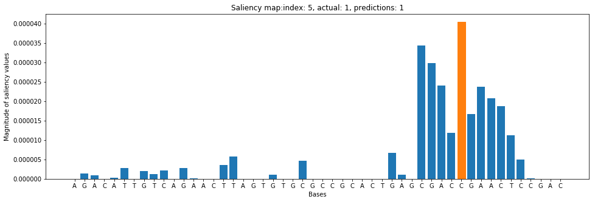
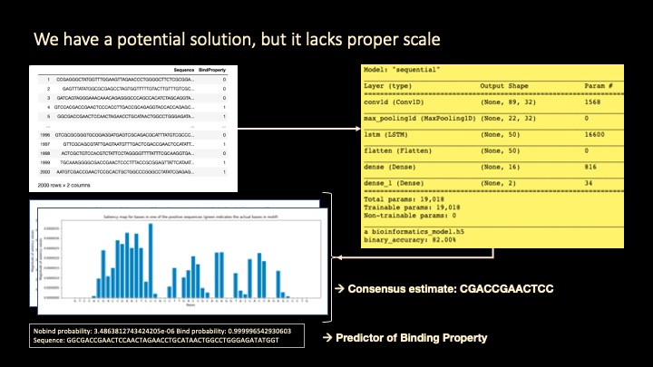
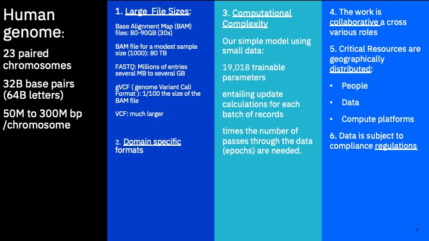

# Bioinformatics Modeling

## Neural Network Builder


Source: A Primer on Deep Learning in Genomics - Public


# The neural network topology (without LSTM layer)

    Model: "sequential_1"
    _________________________________________________________________
    Layer (type)                 Output Shape              Param #   
    =================================================================
    conv1d_1 (Conv1D)            (None, 39, 32)            1568      
    _________________________________________________________________
    max_pooling1d_1 (MaxPooling1 (None, 9, 32)             0         
    _________________________________________________________________
    flatten_1 (Flatten)          (None, 288)               0         
    _________________________________________________________________
    dense_1 (Dense)              (None, 16)                4624      
    _________________________________________________________________
    dense_2 (Dense)              (None, 2)                 34        
    =================================================================
    Total params: 6,226
    Trainable params: 6,226
    Non-trainable params: 0
    _________________________________________________________________

##  With LSTM Layer

    Layer (type)                 Output Shape              Param #   
    =================================================================
    conv1d (Conv1D)              (None, 89, 32)            1568      
    _________________________________________________________________
    max_pooling1d (MaxPooling1D) (None, 22, 32)            0         
    _________________________________________________________________
    lstm (LSTM)                  (None, 50)                16600     
    _________________________________________________________________
    flatten (Flatten)            (None, 50)                0         
    _________________________________________________________________
    dense (Dense)                (None, 16)                816       
    _________________________________________________________________
    dense_1 (Dense)              (None, 2)                 34        
    =================================================================
    Total params: 19,018
    Trainable params: 19,018
    Non-trainable params: 0
    _________________________________________________________________
    a bioinformatics_model.h5
    binary_accuracy: 82.00%


### Run the following if in CP4D
```python
from project_lib import Project
project = Project.access()
storage_credentials = project.get_storage_metadata()!ls /project_data/data_assetwith open('/project_data/data_asset/neural_network.py') as py:
    new_nnfile=py.read()%%writefile  /project_data/data_asset/new_neural_network.py
%load /project_data/data_asset/neural_network.py
## Edit the following
```

## Inline editing of code...

```python
%%writefile new_neural_network.py
#%load /project_data/data_asset/new_neural_network6.py
import argparse
#import input_data
import os
import sys
import tensorflow 
import numpy as np
from sklearn.preprocessing import LabelEncoder, OneHotEncoder
from sklearn.model_selection import train_test_split
from tensorflow.keras import layers 
from tensorflow.keras.layers import Conv1D, Dense, MaxPooling1D, Flatten,LSTM

from tensorflow.keras.models import Sequential

def main():
    
    import os
    """
    cmdstring = 'pip install matplotlib'
    os.system(cmdstring)
    import matplotlib.pyplot as plt
    """
    parser = argparse.ArgumentParser()

    # environment variable when name starts with $
    parser.add_argument('--data_dir', type=str, default='$DATA_DIR',help='Directory with data')
    parser.add_argument('--result_dir', type=str, default='$RESULT_DIR',help='Directory with results')
    parser.add_argument('--sequences_file', type=str,default='sequences.txt',help='File name for sequences')
    parser.add_argument('--labels_file', type=str,default='labels.txt',help='File name for labels')
    parser.add_argument('--model_name', type=str,default='bioinformatics_model',help='neural model name')

    FLAGS, unparsed = parser.parse_known_args()

    print (FLAGS.result_dir)

    if (FLAGS.result_dir[0] == '$'):
        RESULT_DIR = os.environ[FLAGS.result_dir[1:]]
    else:
        RESULT_DIR = FLAGS.result_dir
        os.environ['RESULT_DIR']=FLAGS.result_dir

    #model_path = os.path.join(RESULT_DIR, 'model')
    #print(model_path)

    if (FLAGS.data_dir[0] == '$'):
        DATA_DIR = os.environ[FLAGS.data_dir[1:]]
    else:
        DATA_DIR = FLAGS.data_dir
        os.environ['DATA_DIR']=FLAGS.data_dir
        
    output_model_folder = os.environ["RESULT_DIR"]

    print("output model folder: ",output_model_folder)
    
    model_name=FLAGS.model_name
    
    history_filename  = model_name+"_history.p"
    print("history_filename: ",history_filename)
    
    cm_filename  = model_name+"_cm.p"
    print("cm_filename: ",cm_filename)
    
    h5_filename  = model_name+".h5"
    print("h5_filename: ",h5_filename)
    
    tar_filename = model_name+".tgz"
    print("tar_filename: ",tar_filename)
    
    model_weights = model_name + "_weights.h5"
    print("model_weights: ", model_weights)
    
    serialized_model = model_name + ".json"
    print("serialized_model: ", serialized_model)
   
    
    scoring_log = model_name + "_scoring.txt"
    
    loss_graph_pdf= model_name + "_loss.pdf"
    loss_graph_png = model_name + "_loss.png"
    print("loss_graph:",loss_graph_png)
    
    accuracy_graph_pdf = model_name + "_accuracy.pdf"
    accuracy_graph_png = model_name + "_accuracy.png"
    print("accuracy_graph:",accuracy_graph_png)
    

    # Add data dir to file path
    sequences_file = os.path.join(DATA_DIR, FLAGS.sequences_file)
    
    labels_file = os.path.join(DATA_DIR, FLAGS.labels_file)
    
    #
    # One-hot encode feature data
    #
    
    with open(sequences_file,'r') as file: 
        raw_sequences=file.read()

    sequences=raw_sequences.split('\n')

    sequences = list(filter(None, sequences))  # Removes empty sequences.

    integer_encoder = LabelEncoder() 

    one_hot_encoder = OneHotEncoder(categories='auto')  
    
    input_features = []

    for sequence in sequences:
        integer_encoded = integer_encoder.fit_transform(list(sequence))
        integer_encoded = np.array(integer_encoded).reshape(-1, 1)
        one_hot_encoded = one_hot_encoder.fit_transform(integer_encoded)
        input_features.append(one_hot_encoded.toarray())


    np.set_printoptions(threshold=40)
    input_features = np.stack(input_features)
   
    print("Sequence 1\n-----------------------")
    print('DNA Sequence #1:\n',sequences[0][:10],'...',sequences[0][-10:])
    print('One hot encoding of Sequence #1:\n',input_features[0].T)

    #
    # One-hot encode labels
    #
    with open(labels_file,'r') as file: 
        raw_labels=file.read()

    labels=raw_labels.split('\n')

    labels = list(filter(None, labels))  # This removes empty sequences.

    one_hot_encoder = OneHotEncoder(categories='auto')
    labels = np.array(labels).reshape(-1, 1)
    input_labels = one_hot_encoder.fit_transform(labels).toarray()

    print('Labels:\n',labels.T)
    print('One-hot encoded labels:\n',input_labels.T)

    train_features, test_features, train_labels, test_labels = train_test_split(
        input_features, input_labels, test_size=0.25, random_state=42)
        
            
    #
    # Define the neural network model
    #  

    model = Sequential()
    model.add(Conv1D(filters=32, kernel_size=12, 
                 input_shape=(train_features.shape[1], 4)))
    model.add(MaxPooling1D(pool_size=4))
    model.add(LSTM(50))
    model.add(Flatten())
    model.add(Dense(16, activation='relu'))
    model.add(Dense(2, activation='softmax'))

    model.compile(loss='binary_crossentropy', optimizer='adam', 
        metrics=['binary_accuracy'])
    model.summary()
    
    #
    # Train the model
    #
    
    history = model.fit(train_features, train_labels, 
            epochs=75,  verbose=0, validation_split=0.25)
    
    import pickle
    with open(history_filename, 'wb') as file_pi:
        pickle.dump(history.history, file_pi)
    
    cmdstring0 = 'cp ' + history_filename + ' '+  output_model_folder
    os.system(cmdstring0)
    
    #
    # Save model to the results storage
    #
    
    model.save( h5_filename ) 
    cmdstring1 = 'cp ' + h5_filename + ' '+  output_model_folder
    os.system(cmdstring1)

    cmdstring2 = 'tar -zcvf ' + tar_filename + ' ' + h5_filename
    os.system(cmdstring2)
    
    cmdstring22 = 'cp ' + tar_filename + ' '+  output_model_folder
    os.system(cmdstring22)
    
    
    #
    # Save the model definition to the results storage
    #
    model_json = model.to_json()
    with open(serialized_model, "w") as json_file:
        json_file.write(model_json)     
 
    cmdstring3 = 'cp ' + serialized_model + ' '+  output_model_folder
    os.system(cmdstring3)

    #
    # Save  trained model weights to the results storage
    #
    model.save_weights(model_weights)
    cmdstring4 = 'cp ' + model_weights + ' '+  output_model_folder
    os.system(cmdstring4)
    
    
    ## Produce and save a confusion matrix
    from sklearn.metrics import confusion_matrix
    #import itertools

    predicted_labels = model.predict(np.stack(test_features))
    cm = confusion_matrix(np.argmax(test_labels, axis=1), 
                          np.argmax(predicted_labels, axis=1))

    cm = cm.astype('float') / cm.sum(axis = 1)[:, np.newaxis]
    
    with open(cm_filename, 'wb') as file_pi:
        pickle.dump(cm, file_pi)
    
    cmdstringX = 'cp ' + cm_filename + ' '+  output_model_folder
    os.system(cmdstringX)
 
    scores = model.evaluate(test_features, test_labels, verbose=0)
    print("%s: %.2f%%" % (model.metrics_names[1], scores[1]*100))
 
if __name__ == '__main__':
    
    main()
```

    Writing new_neural_network.py


## Test code locally
!ls -al !mkdir DATADIR!mkdir RESULTS!ls DATADIRcp /project_data/data_asset/DATADIR/* DATADIR

```python
import os
os.environ['RESULT_DIR']='RESULTS'
os.environ['DATA_DIR']='assay'
```


```python
!echo $DATA_DIR $RESULT_DIR
```

    assay RESULTS


```python
!python3 new_neural_network.py --sequences_file assay_data_full.seq --labels_file assay_data_full.lbl
```

    $RESULT_DIR
    output model folder:  RESULTS
    history_filename:  bioinformatics_model_history.p
    cm_filename:  bioinformatics_model_cm.p
    h5_filename:  bioinformatics_model.h5
    tar_filename:  bioinformatics_model.tgz
    model_weights:  bioinformatics_model_weights.h5
    serialized_model:  bioinformatics_model.json
    loss_graph: bioinformatics_model_loss.png
    accuracy_graph: bioinformatics_model_accuracy.png
    Sequence 1
    -----------------------
    DNA Sequence #1:
     TGGCCGTTCA ... AAGGAAACCA
    One hot encoding of Sequence #1:
     [[0. 0. 0. ... 0. 0. 1.]
     [0. 0. 0. ... 1. 1. 0.]
     [0. 1. 1. ... 0. 0. 0.]
     [1. 0. 0. ... 0. 0. 0.]]
    Labels:
     [['1' '1' '1' ... '1' '0' '1']]
    One-hot encoded labels:
     [[0. 0. 0. ... 0. 1. 0.]
     [1. 1. 1. ... 1. 0. 1.]]
    2021-06-02 22:28:11.566130: I tensorflow/compiler/xla/service/service.cc:168] XLA service 0x7fe534937ec0 initialized for platform Host (this does not guarantee that XLA will be used). Devices:
    2021-06-02 22:28:11.566213: I tensorflow/compiler/xla/service/service.cc:176]   StreamExecutor device (0): Host, Default Version
    Model: "sequential"
    _________________________________________________________________
    Layer (type)                 Output Shape              Param #   
    =================================================================
    conv1d (Conv1D)              (None, 89, 32)            1568      
    _________________________________________________________________
    max_pooling1d (MaxPooling1D) (None, 22, 32)            0         
    _________________________________________________________________
    lstm (LSTM)                  (None, 50)                16600     
    _________________________________________________________________
    flatten (Flatten)            (None, 50)                0         
    _________________________________________________________________
    dense (Dense)                (None, 16)                816       
    _________________________________________________________________
    dense_1 (Dense)              (None, 2)                 34        
    =================================================================
    Total params: 19,018
    Trainable params: 19,018
    Non-trainable params: 0
    _________________________________________________________________
    a bioinformatics_model.h5
    binary_accuracy: 82.00%


## Create payload zip file


```python
!cp new_neural_network.py neural_network_v8.py
```


```python
!mkdir tf_model_v8
```

    mkdir: tf_model_v8: File exists


```python
!cp neural_network.py tf_model_v8/.
```

    cp: neural_network.py: No such file or directory


```python
!zip -r tf_model_v8.zip tf_model_v8
```

    updating: tf_model_v8/ (stored 0%)
    updating: tf_model_v8/neural_network_v8.py (deflated 69%)
    updating: tf_model_v8/.DS_Store (deflated 97%)


```python
!ls -al
```

    total 4016
   
    -rw-r--r--   1 fjgreco  staff     8577 Jun  2 21:10 ICOS.py
    -rw-r--r--   1 fjgreco  staff        1 Aug 13  2020 README.md
    SALIENCE.y
    -rw-r--r--   1 fjgreco  staff    20437 Jun  2 19:33 WKC.py
    drwxr-xr-x   7 fjgreco  staff      224 Jun  2 22:29 bioinformatics_model.h5
    -rw-r--r--   1 fjgreco  staff     2704 Jun  2 22:28 bioinformatics_model.json
    -rw-r--r--   1 fjgreco  staff   218859 Jun  2 22:28 bioinformatics_model.tgz
    -rw-r--r--   1 fjgreco  staff    12987 Jun  2 21:14 bioinformatics_model_accuracy.pdf
    -rw-r--r--   1 fjgreco  staff    14186 Jun  2 21:14 bioinformatics_model_accuracy.png
    -rw-r--r--   1 fjgreco  staff      189 Jun  2 22:28 bioinformatics_model_cm.p
    -rw-r--r--   1 fjgreco  staff    11405 Jun  2 21:14 bioinformatics_model_confusion_matrix.png
    -rw-r--r--   1 fjgreco  staff     8229 Jun  2 22:28 bioinformatics_model_history.p
    -rw-r--r--   1 fjgreco  staff    12442 Jun  2 21:14 bioinformatics_model_loss.pdf
    -rw-r--r--   1 fjgreco  staff    14715 Jun  2 21:14 bioinformatics_model_loss.png
    -rw-r--r--   1 fjgreco  staff    95616 Jun  2 22:28 bioinformatics_model_weights.h5
    -rw-r--r--   1 fjgreco  staff    24401 Jun  2 22:34 e2eai-bioinformatics-assayV3.ipynb
    -rw-r--r--   1 fjgreco  staff    20459 Jun  2 22:30 e2eai-bioinformatics-neural_network_build(current).ipynb
    -rw-r--r--   1 fjgreco  staff  1072116 Jun  2 22:21 e2eai-bioinformatics-salience(current).ipynb
    -rw-r--r--@  1 fjgreco  staff     1116 Jun  2 19:21 e2eai_credentials.json
    -rw-r--r--   1 fjgreco  staff     4851 Aug 13  2020 icos_utilities.py
    -rw-r--r--   1 fjgreco  staff      810 Jun  2 22:33 manifest.json
    -rw-r--r--   1 fjgreco  staff     7005 Jun  2 22:28 neural_network_v8.py
    -rw-r--r--   1 fjgreco  staff     7005 Jun  2 22:25 new_neural_network.py
    -rw-r--r--@  1 fjgreco  staff     1118 Jan 20 20:08 nirvana_credentials.json
    -rw-r--r--   1 fjgreco  staff     2887 Jun  2 22:36 tf_model_v8.zip
    -rw-r--r--   1 fjgreco  staff      524 Jun  2 22:34 training-log.txt
    -rw-r--r--   1 fjgreco  staff    31061 Jun  2 22:36 wml-v4-bioinformatics-train(current).ipynb


 
# Training phase outputs obtainable from RESULTS location are subsequently used to make inferences


## Saliency Graph and binding prediction

    Known motif: CGACCGAACTCC
    Sequence: GATACCCCCCCCACCCCCCCTCCCCCCCCCCCCCCCCCCGACCGAACTCC



    No-bind probability: 2.4192843284254195e-06 Bind probability: 0.999997615814209        
    
## Thus far, everything can easily run anywhere e.g., on a laptop or a local cluster. 



### But, 
- Bioinformatic data can be very large.
- The models can be very large and computationally complex.




[](../README.md#NeuralNetwork)
[](./wml.md)


