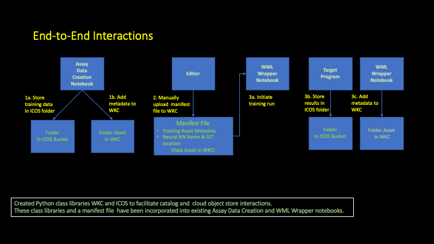

## End-to-End Analytic Computational Pipeline 

A researcher performes a biological assay which produces a data set that labels DNA sequences with protein binding properties.

The researcher seeks a model that can learn to identify whether an target DNA sequence contains similar binding properties.

A data scientist is engaged to help develop a model.

A developer is also engaged to facilitate software development and data handling.

The following project environment has been setup:

 - A Cloud Pak for Data / Watson Studio project has been created to allow collabative development.
 
 - Researcher, Data Scientist, Developer, and  Practitioner roles have been defined for the project. These are used to control access rights.

 -  An IBM Cloud Object Storage instance has been established to house the assay data and results of 
    the modeling efforts. A knowledge catalog is also in place to govern  and facilitate access to the project assets.

The researcher, data scientist and developer have been authorized to the project per their roles and are also authorized to access 
the catalog and object storage.

