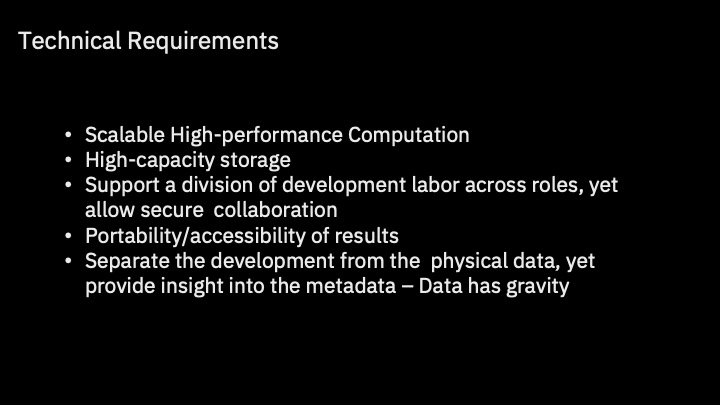
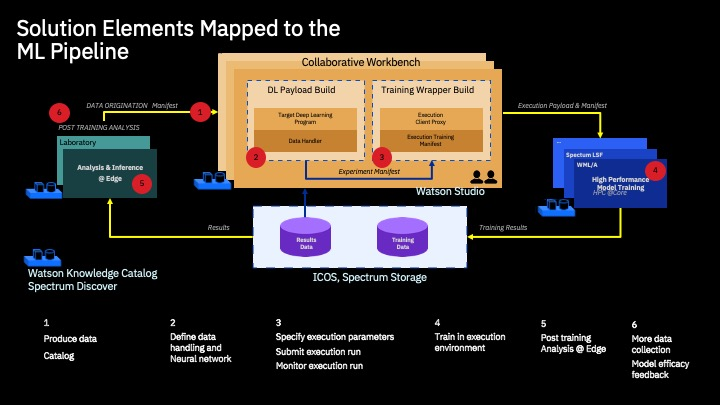

# Bioinformatics Modeling 
## Training Using Watson Machine Learning







## Run the following if in CP4D
```python
from project_lib import Project
project = Project.access()
storage_credentials = project.get_storage_metadata()
```

## Import packages


```python
import json
import os
import wget
```


```python
import WKC as WKC
from ICOS import ICOS
```


```python
from ibm_watson_machine_learning import APIClient
```


```python
with open("e2eai_credentials.json") as json_file:
    credentials = json.load(json_file)

cp4d_template=credentials['cp4d_template']

ibmcloud_template=credentials['ibmcloud_template']

wml_credentials=credentials['wml_credentials_e2eai']

icos_credentials=credentials['icos_credentials_e2eai']
```

###  Access Watson Knowledge Catalog


```python
wkc=WKC.WKC(ibmcloud_template,catalog_name='Catalog-010721')
```

    Platfom type is cloud.Calling gen_BearerToken_ibmcloud
     Desired catalog_name is set to 'Catalog-010721'.
    guid is set to 'c28ff3ef-3fa0-4c6c-a7f8-c2be92976a75'.


```python
# Use as needed to renew bearer token
wkc.reset_BearerToken()
```

### Read experiment manifest from Catalog

```python
with open("manifest.json") as json_file:
    manifest = json.load(json_file)        
```


```python
experiment_manifest=manifest['manifest']
```


## Download the model-building code into the notebook's working directory:


```python
zip_filename = experiment_manifest["zip_file"]
url= experiment_manifest["git_url"]
# NOTE: If you are re-running this code block again, having changed the model or adding your own custom model
# be careful to ensure that your new model is the one which is truly downloaded.
if not os.path.isfile( zip_filename ): 
    print("File {} not found, Download from {} ".format(zip_filename,url))
    wget.download(url)
else:
    print('File: {} is in local directory'.format(zip_filename))
```

    File: tf_model_v8.zip is in local directory


### Optional: Check the local file system to confirm the download from github
```python
!ls -alR
```
 
## Train the model using WML & WML/A

###  Instantiate a WML client object:


```python
client = APIClient(wml_credentials)  #from the credentials file
client.version
```


    '1.0.57'


```python
icos=ICOS(icos_credentials=icos_credentials)

icos.list_results_buckets()
```

    
    Bucket: expo-results-3e994cd6-19c8-4fe3-9ea6-bc3da0c19cee
    
    Bucket: expo-results-53ffa6c9-aa59-4c05-9813-9677560de118
    
    Bucket: expo-results-6c0d7c01-43b9-43da-8c06-8bd5ac95a903
    
    Bucket: expo-results-93dd31a0-c9f6-4fb3-8c35-d2fc1ff5396e
    
    Bucket: expo-results-a273dfb2-91b9-43f0-afac-3dd9043bc806
    
    Bucket: expo-results-b9466413-7bcc-4fc6-9344-18d4265ee0c7
    
    Bucket: expo-results-d73bb3f1-ead5-4cb9-8bb3-31d22174ef47
    
    Bucket: expo-results-dcd02309-b9a3-4539-8ad1-6832ddeb85a4
    
    Bucket: expo-results-dd099310-2a48-4d31-a59f-556b1a26b8dc
    
    Bucket: expo-results-ee5ccc54-08e6-433c-9e84-27d1ba9e20df
    
    Bucket: tf-keras-results-example-fjg2
    
    Bucket: tf-keras-results-example-fjgx
    
    Bucket: training-results-ee3ac3d4-2294-4e71-912c-f5ead5e7a5a4


## Set deployment space


```python
E2EAI_WS_space_id = '36125782-4474-44a9-bc9f-8e081c7d8f73'  
```


```python
space_id=E2EAI_WS_space_id
```


```python
client.set.default_space(space_id)
```


    'SUCCESS'


## Setup up WML training run


```python
command="python3 {} --sequencesFile ${{DATA_DIR}}/sequences.txt --labelsFile ${{DATA_DIR}}/labels.txt".format(experiment_manifest["neural_network_pgm"])
command
```


    'python3 tf_model_v8/neural_network_v8.py --sequencesFile ${DATA_DIR}/sequences.txt --labelsFile ${DATA_DIR}/labels.txt'


```python
metaprops = {
    client.model_definitions.ConfigurationMetaNames.NAME: experiment_manifest['training_definition_name'],
    client.model_definitions.ConfigurationMetaNames.DESCRIPTION: "BIOINFORMATICS4V6NN",
    client.model_definitions.ConfigurationMetaNames.COMMAND: command,
    client.model_definitions.ConfigurationMetaNames.PLATFORM: {"name": "python", "versions": ["3.6"]},
    client.model_definitions.ConfigurationMetaNames.VERSION: "2.0",
    client.model_definitions.ConfigurationMetaNames.SPACE_UID: space_id
}
```


```python
model_definition_details = client.model_definitions.store(experiment_manifest["zip_file"], meta_props=metaprops)
```


```python
model_definition_id = client.model_definitions.get_uid(model_definition_details)   
print(model_definition_id)
```

    c26456f4-a453-43de-962f-6c60674f719d


```python
training_metadata = {
    client.training.ConfigurationMetaNames.NAME: "BIOINFO",
    client.training.ConfigurationMetaNames.SPACE_UID: space_id,
    client.training.ConfigurationMetaNames.DESCRIPTION: "Transcription Factor Model",
    client.training.ConfigurationMetaNames.TAGS :[{
      "value": 'BIOINFO',
      "description": "predict binding property"
    }],
    client.training.ConfigurationMetaNames.TRAINING_RESULTS_REFERENCE: {
      "connection" : {
      "endpoint_url"      : "https://s3.us.cloud-object-storage.appdomain.cloud",
      "access_key_id"     : icos_credentials['cos_hmac_keys']['access_key_id'],
      "secret_access_key" : icos_credentials['cos_hmac_keys']['secret_access_key']
      },
      "location" : {
         "bucket" : experiment_manifest['results_bucket'],
      },
      "type" : "s3"
    },
    
    client.training.ConfigurationMetaNames.TRAINING_DATA_REFERENCES:
    [{
      "connection" : { 
      "endpoint_url"      : "https://s3.us.cloud-object-storage.appdomain.cloud",
      "access_key_id"     : icos_credentials['cos_hmac_keys']['access_key_id'],
      "secret_access_key" : icos_credentials['cos_hmac_keys']['secret_access_key']
      },
     "location" : { 
        "bucket" : experiment_manifest['training_bucket'],
      },
      "type" : "s3"
       } 
    ],
  client.training.ConfigurationMetaNames.MODEL_DEFINITION:{
        "id": model_definition_id,
        "command": command,
        "hardware_spec": {
          "name": "K80",
          "nodes": 1
        },
        "software_spec": {
          "name": "tensorflow_2.1-py3.7"
        },
        "parameters": {
          "name": "BIOINFO",
          "description": "Transcription Factor Model"
        }
      }
}
```


## Start run and monitor training progress


```python
training = client.training.run(training_metadata)

training_id = client.training.get_uid(training)

from time import sleep

cts=client.training.get_details(training_id)['entity']['status']['state']

# Training job runs asynchronously
while cts not in ['completed', 'failed', 'canceled', 'error']:
    print(cts,end=' ')
    sleep(10)
    cts=client.training.get_status(training_id)['state']
    
print( cts )
```

    pending pending pending pending pending running pending running running running running running running running running running running running running completed


## Review Results
### Check run details...


```python
ctd=client.training.get_details(training_id) 
print(json.dumps(ctd,indent=2))
```

    {
      "metadata": {
        "created_at": "2021-06-03T03:55:03.434Z",
        "description": "Transcription Factor Model",
        "guid": "a97faf8f-d2ce-48d8-abb1-4e8c6cedc101",
        "id": "a97faf8f-d2ce-48d8-abb1-4e8c6cedc101",
        "modified_at": "2021-06-03T03:58:29.603Z",
        "name": "BIOINFO",
        "space_id": "36125782-4474-44a9-bc9f-8e081c7d8f73",
        "tags": [
          "BIOINFO"
        ]
      },
      "entity": {
        "description": "Transcription Factor Model",
        "model_definition": {
          "command": "python3 tf_model_v8/neural_network_v8.py --sequencesFile ${DATA_DIR}/sequences.txt --labelsFile ${DATA_DIR}/labels.txt",
          "hardware_spec": {
            "name": "K80"
          },
          "id": "c26456f4-a453-43de-962f-6c60674f719d",
          "parameters": {
            "description": "Transcription Factor Model",
            "name": "BIOINFO"
          },
          "software_spec": {
            "name": "tensorflow_2.1-py3.7"
          }
        },
        "name": "BIOINFO",
        "results_reference": {
          "connection": {
            "access_key_id": "*****",
            "endpoint_url": "https://s3.us.cloud-object-storage.appdomain.cloud",
            "secret_access_key": "992b9b35b901191631b667e1232e5f772a14983d14e5632d"
          },
          "location": {
            "path": "",
            "model": "training-qDMh8O6GR/model",
            "notebooks_path": "/a97faf8f-d2ce-48d8-abb1-4e8c6cedc101/notebooks",
            "training": "/a97faf8f-d2ce-48d8-abb1-4e8c6cedc101",
            "training_status": "/a97faf8f-d2ce-48d8-abb1-4e8c6cedc101/training-status.json",
            "bucket": "e2eai-results",
            "logs": "training-qDMh8O6GR",
            "assets_path": "/a97faf8f-d2ce-48d8-abb1-4e8c6cedc101/assets"
          },
          "type": "s3"
        },
        "space_id": "36125782-4474-44a9-bc9f-8e081c7d8f73",
        "status": {
          "completed_at": "2021-06-03T03:58:29.591Z",
          "message": {
            "level": "info",
            "text": ""
          },
          "running_at": "2021-06-03T03:55:35.725Z",
          "state": "completed"
        },
        "tags": [
          "BIOINFO"
        ],
        "training_data_references": [
          {
            "connection": {
              "access_key_id": "*****",
              "endpoint_url": "https://s3.us.cloud-object-storage.appdomain.cloud",
              "secret_access_key": "992b9b35b901191631b667e1232e5f772a14983d14e5632d"
            },
            "location": {
              "bucket": "e2eai-training"
            },
            "type": "s3"
          }
        ]
      }
    }


### model.h5, model.tgz, model.json, and model_weights.h5 were placed in ICOS by the payload program

### Extract folder in results containing training output


```python
model_location= ctd['entity']['results_reference']['location']['logs']
model_location
```

    'training-qDMh8O6GR'


```python
dl2=icos.get_download_list_loc(results_bucket,model_location,results_folder='.')
```

    Retrieving relevant bucket contents from: e2eai-results Model_location: training-qDMh8O6GR
    
    training-qDMh8O6GR/bioinformatics_model.h5
    training-qDMh8O6GR/bioinformatics_model.json
    training-qDMh8O6GR/bioinformatics_model.tgz
    training-qDMh8O6GR/bioinformatics_model_cm.p
    training-qDMh8O6GR/bioinformatics_model_history.p
    training-qDMh8O6GR/bioinformatics_model_weights.h5
    training-qDMh8O6GR/training-log.txt


### Update manifest with model_location


```python
manifest
```


    {'manifest': {'zip_file': 'tf_model_v8.zip',
      'git_url': 'https://github.com/fjgreco/e2eai_assay/blob/master/tf_model_v8.zip?raw=true',
      'neural_network_pgm': 'tf_model_v8/neural_network_v8.py',
      'training_definition_name': 'mac-bioinformatics-training-definition_v4nn8',
      'training_run_name': 'mac-bioinformatics-training-run_v4nn8',
      'trained_model_name': 'mac_bioinformatics_model_v4nn8',
      'compressed_recompiled_model': 'mac_recompiled_bioinformatics_model_v4nn8.tgz',
      'recompiled_model_h5': 'mac_recompiled_bioinformatics_model.h5',
      'deployment_name': 'mac_bioinformatics_deployment_v4nn8',
      'training_bucket': 'e2eai-training',
      'results_bucket': 'e2eai-results',
      'model_location': 'training--h7wydeMg'}}


```python
manifest['manifest']['model_location']=model_location
with open('manifest.json', 'w', encoding='utf-8') as f:
    json.dump(manifest, f, ensure_ascii=False, indent=4)
```

## Review locally stored results


```python
!cat training-log.txt
```
<details>
    Training with training/test data at:
      DATA_DIR: /mnt/data/e2eai-training
      MODEL_DIR: /job/model-code
      TRAINING_JOB: 
      TRAINING_COMMAND: python3 tf_model_v8/neural_network_v8.py --sequencesFile ${DATA_DIR}/sequences.txt --labelsFile ${DATA_DIR}/labels.txt
    Storing trained model at:
      RESULT_DIR: /mnt/results/e2eai-results/training-qDMh8O6GR
    Thu Jun  3 03:55:37 UTC 2021: Running Tensorflow job
    2021-06-03 03:55:37.604813: I tensorflow/stream_executor/platform/default/dso_loader.cc:44] Successfully opened dynamic library libcudart.so.10.2
    2021-06-03 03:55:38.264155: I tensorflow/stream_executor/platform/default/dso_loader.cc:44] Successfully opened dynamic library libnvinfer.so.7
    2021-06-03 03:55:38.264883: I tensorflow/stream_executor/platform/default/dso_loader.cc:44] Successfully opened dynamic library libnvinfer_plugin.so.7
    2021-06-03 03:55:40.789352: I tensorflow/stream_executor/platform/default/dso_loader.cc:44] Successfully opened dynamic library libcuda.so.1
    2021-06-03 03:55:43.326168: I tensorflow/core/common_runtime/gpu/gpu_device.cc:1558] Found device 0 with properties: 
    pciBusID: 0000:b1:00.0 name: Tesla K80 computeCapability: 3.7
    coreClock: 0.8235GHz coreCount: 13 deviceMemorySize: 11.17GiB deviceMemoryBandwidth: 223.96GiB/s
    2021-06-03 03:55:43.326687: I tensorflow/stream_executor/platform/default/dso_loader.cc:44] Successfully opened dynamic library libcudart.so.10.2
    2021-06-03 03:55:43.326747: I tensorflow/stream_executor/platform/default/dso_loader.cc:44] Successfully opened dynamic library libcublas.so.10
    2021-06-03 03:55:43.328671: I tensorflow/stream_executor/platform/default/dso_loader.cc:44] Successfully opened dynamic library libcufft.so.10
    2021-06-03 03:55:43.329039: I tensorflow/stream_executor/platform/default/dso_loader.cc:44] Successfully opened dynamic library libcurand.so.10
    2021-06-03 03:55:43.330914: I tensorflow/stream_executor/platform/default/dso_loader.cc:44] Successfully opened dynamic library libcusolver.so.10
    2021-06-03 03:55:43.331885: I tensorflow/stream_executor/platform/default/dso_loader.cc:44] Successfully opened dynamic library libcusparse.so.10
    2021-06-03 03:55:43.331952: I tensorflow/stream_executor/platform/default/dso_loader.cc:44] Successfully opened dynamic library libcudnn.so.7
    2021-06-03 03:55:43.333283: I tensorflow/core/common_runtime/gpu/gpu_device.cc:1700] Adding visible gpu devices: 0
    2021-06-03 03:55:43.333596: I tensorflow/core/platform/cpu_feature_guard.cc:142] Your CPU supports instructions that this TensorFlow binary was not compiled to use: SSE4.1 SSE4.2 AVX AVX2 AVX512F FMA
    2021-06-03 03:55:43.370297: I tensorflow/core/platform/profile_utils/cpu_utils.cc:101] CPU Frequency: 2200000000 Hz
    2021-06-03 03:55:43.375128: I tensorflow/compiler/xla/service/service.cc:168] XLA service 0x5650ce679060 initialized for platform Host (this does not guarantee that XLA will be used). Devices:
    2021-06-03 03:55:43.375201: I tensorflow/compiler/xla/service/service.cc:176]   StreamExecutor device (0): Host, Default Version
    2021-06-03 03:55:43.376838: I tensorflow/core/common_runtime/gpu/gpu_device.cc:1558] Found device 0 with properties: 
    pciBusID: 0000:b1:00.0 name: Tesla K80 computeCapability: 3.7
    coreClock: 0.8235GHz coreCount: 13 deviceMemorySize: 11.17GiB deviceMemoryBandwidth: 223.96GiB/s
    2021-06-03 03:55:43.376909: I tensorflow/stream_executor/platform/default/dso_loader.cc:44] Successfully opened dynamic library libcudart.so.10.2
    2021-06-03 03:55:43.376943: I tensorflow/stream_executor/platform/default/dso_loader.cc:44] Successfully opened dynamic library libcublas.so.10
    2021-06-03 03:55:43.376992: I tensorflow/stream_executor/platform/default/dso_loader.cc:44] Successfully opened dynamic library libcufft.so.10
    2021-06-03 03:55:43.377024: I tensorflow/stream_executor/platform/default/dso_loader.cc:44] Successfully opened dynamic library libcurand.so.10
    2021-06-03 03:55:43.377055: I tensorflow/stream_executor/platform/default/dso_loader.cc:44] Successfully opened dynamic library libcusolver.so.10
    2021-06-03 03:55:43.377085: I tensorflow/stream_executor/platform/default/dso_loader.cc:44] Successfully opened dynamic library libcusparse.so.10
    2021-06-03 03:55:43.377133: I tensorflow/stream_executor/platform/default/dso_loader.cc:44] Successfully opened dynamic library libcudnn.so.7
    2021-06-03 03:55:43.379562: I tensorflow/core/common_runtime/gpu/gpu_device.cc:1700] Adding visible gpu devices: 0
    2021-06-03 03:55:43.379630: I tensorflow/stream_executor/platform/default/dso_loader.cc:44] Successfully opened dynamic library libcudart.so.10.2
    2021-06-03 03:55:43.982108: I tensorflow/core/common_runtime/gpu/gpu_device.cc:1099] Device interconnect StreamExecutor with strength 1 edge matrix:
    2021-06-03 03:55:43.982159: I tensorflow/core/common_runtime/gpu/gpu_device.cc:1105]      0 
    2021-06-03 03:55:43.982168: I tensorflow/core/common_runtime/gpu/gpu_device.cc:1118] 0:   N 
    2021-06-03 03:55:43.983796: I tensorflow/core/common_runtime/gpu/gpu_device.cc:1244] Created TensorFlow device (/job:localhost/replica:0/task:0/device:GPU:0 with 10712 MB memory) -> physical GPU (device: 0, name: Tesla K80, pci bus id: 0000:b1:00.0, compute capability: 3.7)
    2021-06-03 03:55:43.985977: I tensorflow/compiler/xla/service/service.cc:168] XLA service 0x5650e1b48040 initialized for platform CUDA (this does not guarantee that XLA will be used). Devices:
    2021-06-03 03:55:43.986067: I tensorflow/compiler/xla/service/service.cc:176]   StreamExecutor device (0): Tesla K80, Compute Capability 3.7
    2021-06-03 03:55:45.424773: I tensorflow/stream_executor/platform/default/dso_loader.cc:44] Successfully opened dynamic library libcublas.so.10
    2021-06-03 03:55:45.574388: I tensorflow/stream_executor/platform/default/dso_loader.cc:44] Successfully opened dynamic library libcudnn.so.7
    bioinformatics_model.h5
    $RESULT_DIR
    output model folder:  /mnt/results/e2eai-results/training-qDMh8O6GR
    history_filename:  bioinformatics_model_history.p
    cm_filename:  bioinformatics_model_cm.p
    h5_filename:  bioinformatics_model.h5
    tar_filename:  bioinformatics_model.tgz
    model_weights:  bioinformatics_model_weights.h5
    serialized_model:  bioinformatics_model.json
    loss_graph: bioinformatics_model_loss.png
    accuracy_graph: bioinformatics_model_accuracy.png
    Sequence 1
    -----------------------
    DNA Sequence #1:
     CCGAGGGCTA ... CGCGGACACC
    One hot encoding of Sequence #1:
     [[0. 0. 0. ... 1. 0. 0.]
     [1. 1. 0. ... 0. 1. 1.]
     [0. 0. 1. ... 0. 0. 0.]
     [0. 0. 0. ... 0. 0. 0.]]
    Labels:
     [['0' '0' '0' ... '0' '1' '1']]
    One-hot encoded labels:
     [[1. 1. 1. ... 1. 0. 0.]
     [0. 0. 0. ... 0. 1. 1.]]
    Model: "sequential"
    _________________________________________________________________
    Layer (type)                 Output Shape              Param #   
    =================================================================
    conv1d (Conv1D)              (None, 39, 32)            1568      
    _________________________________________________________________
    max_pooling1d (MaxPooling1D) (None, 9, 32)             0         
    _________________________________________________________________
    lstm (LSTM)                  (None, 50)                16600     
    _________________________________________________________________
    flatten (Flatten)            (None, 50)                0         
    _________________________________________________________________
    dense (Dense)                (None, 16)                816       
    _________________________________________________________________
    dense_1 (Dense)              (None, 2)                 34        
    =================================================================
    Total params: 19,018
    Trainable params: 19,018
    Non-trainable params: 0
    _________________________________________________________________
    binary_accuracy: 99.60%
</details>

## Register results in Catalog


```python
metadata_inline=  \
{
  "metadata": {
    "name": "BIOResults",
    "description": "Transcription binding site motif analysis results",
    "tags": ["RNA", "Results"],
    "asset_type": "folder_asset",
    "origin_country": "us",
    "rov": {
      "mode": 0
    }
  },
  "entity": {
    "folder_asset": {
      "connection_id": "3dc06240-b46d-452c-aebf-5821df8a11d4",
      "connection_path": ""
    }
  }
}

```


```python
connection_path="/{}/{}".format(results_bucket,model_location)
metadata_inline["entity"]['folder_asset']["connection_path"]=connection_path
metadata_inline["metadata"]['name']=connection_path
```


```python
metadata_inline
```


    {'metadata': {'name': '/e2eai-results/training-qDMh8O6GR',
      'description': 'Transcription binding site motif analysis results',
      'tags': ['RNA', 'Results'],
      'asset_type': 'folder_asset',
      'origin_country': 'us',
      'rov': {'mode': 0}},
     'entity': {'folder_asset': {'connection_id': '3dc06240-b46d-452c-aebf-5821df8a11d4',
       'connection_path': '/e2eai-results/training-qDMh8O6GR'}}}


```python
wkc.reset_BearerToken()
```


```python
wkc.add_asset_inline(metadata_inline)
```

    {
      "metadata": {
        "rov": {
          "mode": 0,
          "collaborator_ids": {}
        },
        "usage": {
          "last_updated_at": "2021-06-03T03:58:42Z",
          "last_updater_id": "IBMid-100000UUG2",
          "last_update_time": 1622692722465,
          "last_accessed_at": "2021-06-03T03:58:42Z",
          "last_access_time": 1622692722465,
          "last_accessor_id": "IBMid-100000UUG2",
          "access_count": 0
        },
        "name": "/e2eai-results/training-qDMh8O6GR",
        "description": "Transcription binding site motif analysis results",
        "tags": [
          "RNA",
          "Results"
        ],
        "asset_type": "folder_asset",
        "origin_country": "us",
        "resource_key": "/e2eai-results/training-qDMh8O6GR",
        "rating": 0.0,
        "total_ratings": 0,
        "catalog_id": "c28ff3ef-3fa0-4c6c-a7f8-c2be92976a75",
        "created": 1622692722465,
        "created_at": "2021-06-03T03:58:42Z",
        "owner_id": "IBMid-100000UUG2",
        "size": 0,
        "version": 2.0,
        "asset_state": "available",
        "asset_attributes": [
          "folder_asset"
        ],
        "asset_id": "5e94d654-b7a4-4976-b39b-97cefb34456a",
        "asset_category": "USER"
      },
      "entity": {
        "folder_asset": {
          "connection_id": "3dc06240-b46d-452c-aebf-5821df8a11d4",
          "connection_path": "/e2eai-results/training-qDMh8O6GR"
        }
      },
      "href": "https://api.dataplatform.cloud.ibm.com/v2/assets/5e94d654-b7a4-4976-b39b-97cefb34456a?catalog_id=c28ff3ef-3fa0-4c6c-a7f8-c2be92976a75",
      "asset_id": "5e94d654-b7a4-4976-b39b-97cefb34456a"
    }


[](../README.md#WML)
[](./evaluation.md)
