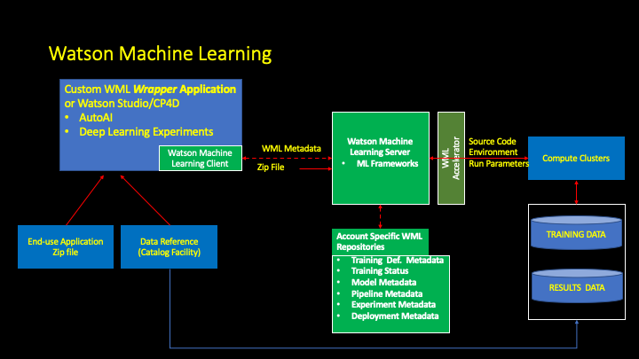

# Bioinformatics Modeling Using Watson Machine Learning





### Preliminary:  Instantiate a Watson Studio project , WML, ICOS (done outside of this notebook)

<details>

```python
from project_lib import Project
project = Project.access()
storage_credentials = project.get_storage_metadata()
```

```python
!pip uninstall  wget -y
!pip install wget

#!pip uninstall watson-machine-learning-client-V4 -y 
#!pip install watson-machine-learning-client-V4

!pip uninstall watson-machine-learning-client -y
!pip install watson-machine-learning-client==1.0.378
```

```python
import matplotlib.pyplot as plt
import matplotlib.image as mpimg
```
</details>

### WML Client Version 1.0378 setup for demo purposes

<details>
```python
import sys, os, imp
```


```python
print(sys.path)
```

    ['', '/cc-home/_global_/python-3.6', '/cc-home/_global_/python-3', '/user-home/_global_/python-3.6', '/user-home/_global_/python-3', '/opt/conda/envs/Python-3.6/lib/python36.zip', '/opt/conda/envs/Python-3.6/lib/python3.6', '/opt/conda/envs/Python-3.6/lib/python3.6/lib-dynload', '/home/wsuser/.local/lib/python3.6/site-packages', '/opt/conda/envs/Python-3.6/lib/python3.6/site-packages', '/opt/conda/envs/Python-3.6/lib/python3.6/site-packages/IPython/extensions', '/home/wsuser/.ipython']


```python
sys.path.reverse()
from watson_machine_learning_client import WatsonMachineLearningAPIClient
sys.path.reverse()
print("Done")
```

    Done

</details>

## Connect to Watson Machine Learning

Note: These credentials are unhidden for demo purposes.


```python
wml_credentials = {
  "apikey": "<replace>",
  "iam_apikey_description": "<repalce>",
  "iam_apikey_name": "replace",
  "iam_role_crn": "crn:v1:bluemix:public:iam::::serviceRole:Writer",
  "iam_serviceid_crn": "<replace>",
  "instance_id": "<repalce>",
  "url": "https://us-south.ml.cloud.ibm.com"
}

client = WatsonMachineLearningAPIClient(wml_credentials)

print('client.version:', client.version)
```

    client.version: 1.0.378


## Connect to IBM Cloud Object Storage and define search script

<details>

```python
icos_credentials={
  "apikey": "<replace>",
  "cos_hmac_keys": {
    "access_key_id": <replace>",
    "secret_access_key": "<replace>"
  },
  "endpoints": <replace>",
  "iam_apikey_description": "<reaplce>,
  "iam_apikey_name": "<reaplce>",
  "iam_role_crn": "crn:v1:bluemix:public:iam::::serviceRole:Writer",
  "iam_serviceid_crn": "<reaplce>",
  "resource_instance_id": "<rreplace>"
}

import ibm_boto3
from ibm_botocore.client import Config, ClientError
from datetime import datetime
import time


# Constants for IBM COS values
COS_ENDPOINT = "https://s3.us.cloud-object-storage.appdomain.cloud" # Current list avaiable at https://control.cloud-object-storage.cloud.ibm.com/v2/endpoints
COS_API_KEY_ID = icos_credentials["apikey"] 
COS_AUTH_ENDPOINT = 'https://iam.bluemix.net/oidc/token'
COS_RESOURCE_CRN = icos_credentials["resource_instance_id"]

training_bucket = 'hmss2020-training'
results_bucket  = 'hmss2020-results'

# Create resource
cos = ibm_boto3.resource("s3",
    ibm_api_key_id=COS_API_KEY_ID,
    ibm_service_instance_id=COS_RESOURCE_CRN,
    ibm_auth_endpoint=COS_AUTH_ENDPOINT,
    config=Config(signature_version="oauth"),
    endpoint_url=COS_ENDPOINT
)
cos_client = ibm_boto3.client("s3",
    ibm_api_key_id=COS_API_KEY_ID,
    ibm_service_instance_id=COS_RESOURCE_CRN,
    ibm_auth_endpoint=COS_AUTH_ENDPOINT,
    config=Config(signature_version="oauth"),
    endpoint_url=COS_ENDPOINT
)

def get_download_list(bucket_name,model_location,cos=cos):
    
    print("Retrieving relevant bucket contents from: {} Model_location: {}\n".format(bucket_name,model_location)) 
    download_list=[]
    try:
        files = cos.Bucket(bucket_name).objects.all()
        for file in files: 
            item=file.key.split('/')
            if 'bioinformatics' in item[1] and model_location in item[0]:
                print(file.key)
                download_list.append(file.key)
                fn=file.key.split('/')[1]
                cos_client.download_file('hmss2020-results',Key=file.key,Filename=fn)
                     
    except ClientError as be:
        print("CLIENT ERROR: {0}\n".format(be))
    except Exception as e:
        print("Unable to retrieve bucket contents: {0}".format(e))
    return download_list  
```
</details>

##  Package the model program and supporting artifacts into a zip file and pass to Watson Machine Learning for training...

### Approach 1:  Obtain zip file from project asset storage

<details>

```python
!cp /project_data/data_asset/tf_model_v5.zip .
```
</details>

### Approach 2: Obtain zip file from git hub
<details>

import os
import wget
filename = 'tf_model_v5.zip'

url= 'https://github.com/fjgreco/Bioinformatics/blob/master/tf_model_v5.zip?raw=true'

# NOTE: If you are re-running this code block again, having changed the model or adding your own custom model
# be careful to ensure that your new model is the one which is truly downloaded.

if not os.path.isfile( filename ):
    print("File {} not found, Downloading from {}".format(filename,url))
    wget.download(url)
</details>

### Approach 3: Build the zip file inline
<details>

%%bash
(if [ ! -d "tf_model_v5" ] 
 then mkdir tf_model_v5 
 fi
 cp /project_data/data_asset/neural_network_v5.py tf_model_v5
 zip -r tf_model_v5.zip tf_model_v5 )
## Define a  WML training run

</details>

### We use a timestamp to distinguish different training runs and results

<details>

```python
import datetime

print('Timestamp: {:%Y%m%d%H%M%S}'.format(datetime.datetime.now()))
ts='{:%Y%m%d%H%M%S}'.format(datetime.datetime.now())
print(ts)
```

    Timestamp: 20200302233424
    20200302233424

</details>

### The following code identifies the following WML metadata:
<ul>
<li>The runtime environment in which our code will run i.e., Tensorflow V 1.14 and Python 3.6
<li>The python command that WML will use to execute the program. 
<li>The location of the zip file that contains the machine learning model program, which will be passed to the WML server.
</ul>


```python
#V3
metadata = {
client.repository.DefinitionMetaNames.NAME              : "zen-bioinformatics-training_v3nn5_"+ts,
client.repository.DefinitionMetaNames.FRAMEWORK_NAME    : "tensorflow",
client.repository.DefinitionMetaNames.FRAMEWORK_VERSION : "1.14",
client.repository.DefinitionMetaNames.RUNTIME_NAME      : "python",
client.repository.DefinitionMetaNames.RUNTIME_VERSION   : "3.6",
client.repository.DefinitionMetaNames.EXECUTION_COMMAND : "python3 tf_model_v5/neural_network_v5.py --sequencesFile ${DATA_DIR}/sequences.txt --labelsFile ${DATA_DIR}/labels.txt" 
}
definition_details = client.repository.store_definition( "tf_model_v5.zip", meta_props=metadata )
definition_uid     = client.repository.get_definition_uid( definition_details )
print( "definition_uid: ", definition_uid )
```

    definition_uid:  f205f565-21bb-444a-a4a1-abb03f847d24


### The following code identifies the following WML metadata:
<ul>
<li>The IBM Cloud Object Storage bucket where our input training data resides 
<li>The IBM Cloud Object Storage bucket where our results will end up. 
<li>The hardware platform on which we want to run, in this case K80.
</ul>


```python
icos_metadata = {
client.training.ConfigurationMetaNames.NAME         : "zen-bioinformatics-training-run_v3nn5_"+ts,
client.training.ConfigurationMetaNames.TRAINING_DATA_REFERENCE : {
   "connection" : { 
      "endpoint_url"      : "https://s3.us.cloud-object-storage.appdomain.cloud",
      "access_key_id"     : "7d6ca104f1fb4ff88bd8ad9ec7bdd090",
      "secret_access_key" : "f89db50acd602219b4e5aa443cca7b2ca8f949ad0ca927ed"
      },
   "source" : { 
      "bucket" : "hmss2020-training",
      },
      "type" : "s3"
   },
client.training.ConfigurationMetaNames.TRAINING_RESULTS_REFERENCE: {
   "connection" : {
      "endpoint_url"      : "https://s3.us.cloud-object-storage.appdomain.cloud",
      "access_key_id"     : "7d6ca104f1fb4ff88bd8ad9ec7bdd090",
      "secret_access_key" : "f89db50acd602219b4e5aa443cca7b2ca8f949ad0ca927ed"
      },
      "target" : {
         "bucket" : "hmss2020-results",
      },
      "type" : "s3"
   }
}
print('Done')
```

    Done


## Submit the training definition to the WML server for training and monitor run progress


```python
run_details = client.training.run(definition_uid, meta_props=icos_metadata)

run_uid     = client.training.get_run_uid(run_details)
print("run_uid: ", run_uid)
```

    run_uid:  model-k34afm4o


```python
from time import sleep

cts=client.training.get_details(run_uid)['entity']['status']['state']

while cts not in ['completed', 'failed', 'canceled', 'error']:
    print(cts)
    sleep(10)
    cts=client.training.get_status(run_uid)['state']
    
print( cts)
```
<details>
    pending
    pending
    pending
    pending
    pending
    pending
    pending
    running
    running
    running
    running
    running
    running
    running
    running
    running
    running
    running
    running
    completed
</details>        


### Check  training run processing details:


```python
client.training.get_details(run_uid)
```


<details>

    {'entity': {'model_definition': {'definition_href': 'https://us-south.ml.cloud.ibm.com/v3/ml_assets/training_definitions/f205f565-21bb-444a-a4a1-abb03f847d24',
       'execution': {'command': 'python3 tf_model_v5/neural_network_v5.py --sequencesFile ${DATA_DIR}/sequences.txt --labelsFile ${DATA_DIR}/labels.txt',
        'compute_configuration': {'name': 'k80'}},
       'framework': {'name': 'tensorflow', 'version': '1.14'},
       'name': 'zen-bioinformatics-training-run_v3nn5_20200302233424'},
      'status': {'current_at': '2020-03-02T23:40:47.919Z',
       'finished_at': '2020-03-02T23:39:39.769Z',
       'message': 'training-WyAzx1lWg: ',
       'metrics': [],
       'running_at': '2020-03-02T23:37:44.450Z',
       'state': 'completed',
       'submitted_at': '2020-03-02T23:37:33.627Z'},
      'training_data_reference': {'connection': {'access_key_id': '7d6ca104f1fb4ff88bd8ad9ec7bdd090',
        'endpoint_url': 'https://s3.us.cloud-object-storage.appdomain.cloud',
        'secret_access_key': 'f89db50acd602219b4e5aa443cca7b2ca8f949ad0ca927ed'},
       'location': {'bucket': 'hmss2020-training'},
       'type': 's3'},
      'training_results_reference': {'connection': {'access_key_id': '7d6ca104f1fb4ff88bd8ad9ec7bdd090',
        'endpoint_url': 'https://s3.us.cloud-object-storage.appdomain.cloud',
        'secret_access_key': 'f89db50acd602219b4e5aa443cca7b2ca8f949ad0ca927ed'},
       'location': {'bucket': 'hmss2020-results',
        'model_location': 'training-WyAzx1lWg'},
       'type': 's3'}},
     'metadata': {'created_at': '2020-03-02T23:37:30.982Z',
      'guid': 'model-k34afm4o',
      'modified_at': '2020-03-02T23:37:30.982Z',
      'url': '/v3/models/model-k34afm4o'}}

</details>

## Review  the training results generated by the machine model program


```python
ctd=client.training.get_details(run_uid)
model_location= ctd['entity']['training_results_reference']['location']['model_location'] 
```


[](../README.md#WML)
[](./evaluation.md)
